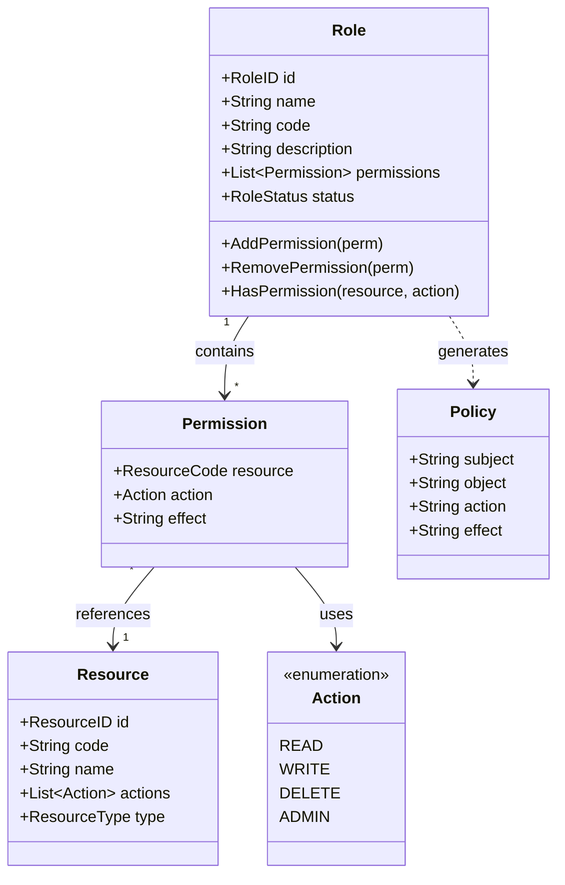
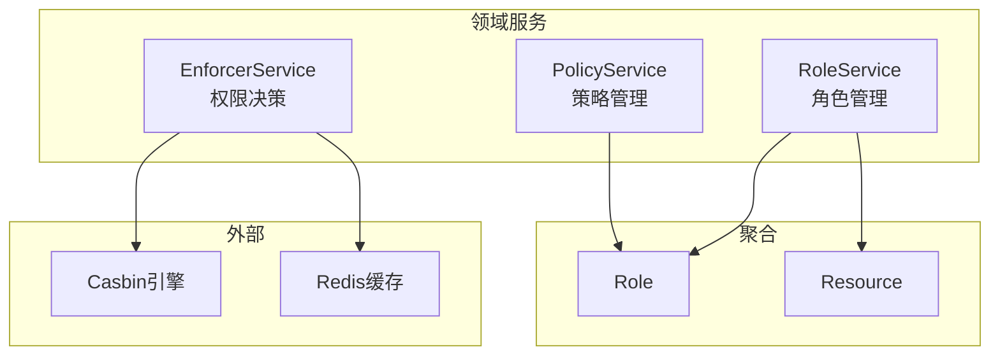

# 授权域领域模型设计

> 🎯 **核心结论**: 采用 Role 聚合根管理权限分配，Policy 作为 Casbin 策略的领域封装

---

## 1. 设计概述

### 1.1 领域边界

```text
┌─────────────────────────────────────────────────────────────┐
│                       授权域 (Authz)                         │
├─────────────────────────────────────────────────────────────┤
│  职责: 权限检查、策略管理、角色管理、资源注册                │
│  不负责: 用户管理、身份认证                                  │
└─────────────────────────────────────────────────────────────┘
```

### 1.2 聚合划分

| 聚合 | 聚合根 | 职责 |
|------|--------|------|
| 角色聚合 | Role | 管理角色定义与权限集合 |
| 资源聚合 | Resource | 管理可授权资源定义 |

---

## 2. 领域模型

### 2.1 聚合关系图



### 2.2 Role 聚合根

```go
// 伪代码: Role 聚合根
// 源码: internal/apiserver/domain/authz/entity/role.go

type Role struct {
    ID          RoleID        // 角色唯一标识
    Name        string        // 角色名称 (显示用)
    Code        string        // 角色代码 (admin, guardian)
    Description string        // 角色描述
    Permissions []Permission  // 权限列表
    Status      RoleStatus    // 角色状态
    CreatedAt   time.Time
    UpdatedAt   time.Time
}

// 添加权限
func (r *Role) AddPermission(perm Permission) error {
    // 业务规则: 同一资源+操作不能重复
    if r.hasPermission(perm.Resource, perm.Action) {
        return ErrPermissionExists
    }
    r.Permissions = append(r.Permissions, perm)
    return nil
}

// 检查权限
func (r *Role) HasPermission(resource ResourceCode, action Action) bool {
    for _, p := range r.Permissions {
        if p.Resource == resource && p.Action == action {
            return true
        }
    }
    return false
}

// 生成 Casbin 策略
func (r *Role) ToPolicies() []Policy {
    policies := make([]Policy, 0, len(r.Permissions))
    for _, p := range r.Permissions {
        policies = append(policies, Policy{
            Subject: r.Code,
            Object:  string(p.Resource),
            Action:  string(p.Action),
            Effect:  "allow",
        })
    }
    return policies
}
```

### 2.3 Permission 值对象

```go
// 伪代码: Permission 值对象
// 源码: internal/apiserver/domain/authz/valueobject/permission.go

type Permission struct {
    Resource ResourceCode  // 资源代码
    Action   Action        // 操作类型
    Effect   string        // allow/deny
}

type Action string

const (
    ActionRead   Action = "read"
    ActionWrite  Action = "write"
    ActionDelete Action = "delete"
    ActionAdmin  Action = "admin"
)

// 权限字符串表示
func (p *Permission) String() string {
    return fmt.Sprintf("%s:%s", p.Resource, p.Action)
}
```

### 2.4 Resource 实体

```go
// 伪代码: Resource 实体
// 源码: internal/apiserver/domain/authz/entity/resource.go

type Resource struct {
    ID      ResourceID     // 资源ID
    Code    ResourceCode   // 资源代码 (user, child, report)
    Name    string         // 资源名称
    Actions []Action       // 可用操作列表
    Type    ResourceType   // 资源类型
}

type ResourceType string

const (
    ResourceTypeAPI  ResourceType = "api"   // API 资源
    ResourceTypeData ResourceType = "data"  // 数据资源
    ResourceTypeMenu ResourceType = "menu"  // 菜单资源
)

// 预定义资源
var PredefinedResources = []Resource{
    {Code: "user", Name: "用户管理", Actions: []Action{ActionRead, ActionWrite, ActionDelete}},
    {Code: "child", Name: "儿童档案", Actions: []Action{ActionRead, ActionWrite, ActionDelete}},
    {Code: "report", Name: "测评报告", Actions: []Action{ActionRead}},
    {Code: "role", Name: "角色管理", Actions: []Action{ActionRead, ActionWrite, ActionDelete, ActionAdmin}},
}
```

### 2.5 Policy 值对象

```go
// 伪代码: Policy 值对象 (Casbin 策略封装)
// 源码: internal/apiserver/domain/authz/valueobject/policy.go

type Policy struct {
    Subject string  // 主体 (角色代码或用户ID)
    Object  string  // 对象 (资源代码)
    Action  string  // 操作
    Effect  string  // 效果 (allow/deny)
}

// 转换为 Casbin 格式
func (p *Policy) ToCasbinPolicy() []string {
    return []string{p.Subject, p.Object, p.Action}
}

// 从 Casbin 格式创建
func PolicyFromCasbin(rule []string) Policy {
    return Policy{
        Subject: rule[0],
        Object:  rule[1],
        Action:  rule[2],
        Effect:  "allow",
    }
}
```

---

## 3. 领域服务

### 3.1 服务划分



### 3.2 EnforcerService

```go
// 伪代码: 权限决策服务
// 源码: internal/apiserver/domain/authz/service/enforcer_service.go

type EnforcerService struct {
    enforcer *casbin.Enforcer
    cache    PolicyCache
}

// 权限检查
func (s *EnforcerService) Enforce(ctx context.Context, req EnforceRequest) (bool, error) {
    // 1. 尝试从缓存获取
    if result, found := s.cache.Get(req.CacheKey()); found {
        return result, nil
    }
    
    // 2. Casbin 决策
    allowed, err := s.enforcer.Enforce(req.Subject, req.Object, req.Action)
    if err != nil {
        return false, err
    }
    
    // 3. 缓存结果
    s.cache.Set(req.CacheKey(), allowed, 5*time.Minute)
    
    return allowed, nil
}

type EnforceRequest struct {
    Subject string  // 用户ID 或 角色代码
    Object  string  // 资源代码
    Action  string  // 操作
}
```

### 3.3 PolicyService

```go
// 伪代码: 策略管理服务
// 源码: internal/apiserver/domain/authz/service/policy_service.go

type PolicyService struct {
    roleRepo   RoleRepository
    enforcer   *casbin.Enforcer
    eventBus   EventBus
}

// 添加策略
func (s *PolicyService) AddPolicy(ctx context.Context, roleCode string, perm Permission) error {
    // 1. 获取角色
    role, err := s.roleRepo.FindByCode(ctx, roleCode)
    if err != nil {
        return err
    }
    
    // 2. 添加权限到角色
    if err := role.AddPermission(perm); err != nil {
        return err
    }
    
    // 3. 持久化
    if err := s.roleRepo.Save(ctx, role); err != nil {
        return err
    }
    
    // 4. 同步到 Casbin
    policy := Policy{Subject: roleCode, Object: string(perm.Resource), Action: string(perm.Action)}
    s.enforcer.AddPolicy(policy.ToCasbinPolicy()...)
    
    // 5. 发布事件
    s.eventBus.Publish(PolicyChangedEvent{
        Type:   PolicyAdded,
        Policy: policy,
    })
    
    return nil
}
```

---

## 4. 端口定义

### 4.1 仓储端口

```go
// 伪代码: 仓储端口
// 源码: internal/apiserver/domain/authz/port/repository.go

type RoleRepository interface {
    FindByID(ctx context.Context, id RoleID) (*Role, error)
    FindByCode(ctx context.Context, code string) (*Role, error)
    FindAll(ctx context.Context) ([]*Role, error)
    Save(ctx context.Context, role *Role) error
    Delete(ctx context.Context, id RoleID) error
}

type ResourceRepository interface {
    FindByCode(ctx context.Context, code ResourceCode) (*Resource, error)
    FindAll(ctx context.Context) ([]*Resource, error)
    Save(ctx context.Context, resource *Resource) error
}
```

### 4.2 缓存端口

```go
// 伪代码: 缓存端口
// 源码: internal/apiserver/domain/authz/port/cache.go

type PolicyCache interface {
    Get(key string) (bool, bool)  // result, found
    Set(key string, result bool, ttl time.Duration)
    Invalidate(pattern string) error
    InvalidateAll() error
}
```

---

## 5. 预定义角色

```yaml
# 种子数据
# 源码: configs/seeddata.yaml

roles:
  - code: super_admin
    name: 超级管理员
    permissions:
      - resource: "*"
        action: "*"
        
  - code: admin
    name: 管理员
    permissions:
      - resource: user
        action: [read, write]
      - resource: child
        action: [read, write]
      - resource: report
        action: read
        
  - code: guardian
    name: 监护人
    permissions:
      - resource: child
        action: read      # 只能查看自己的儿童
      - resource: report
        action: read      # 只能查看自己儿童的报告
        
  - code: staff
    name: 工作人员
    permissions:
      - resource: report
        action: read
```

---

## 6. 源码索引

| 组件 | 路径 | 说明 |
|------|------|------|
| **聚合根** | | |
| Role | `domain/authz/entity/role.go` | 角色聚合根 |
| Resource | `domain/authz/entity/resource.go` | 资源实体 |
| **值对象** | | |
| Permission | `domain/authz/valueobject/permission.go` | 权限值对象 |
| Policy | `domain/authz/valueobject/policy.go` | 策略值对象 |
| Action | `domain/authz/valueobject/action.go` | 操作枚举 |
| **领域服务** | | |
| EnforcerService | `domain/authz/service/enforcer_service.go` | 权限决策 |
| PolicyService | `domain/authz/service/policy_service.go` | 策略管理 |
| **端口** | | |
| RoleRepository | `domain/authz/port/repository.go` | 角色仓储 |
| PolicyCache | `domain/authz/port/cache.go` | 策略缓存 |
