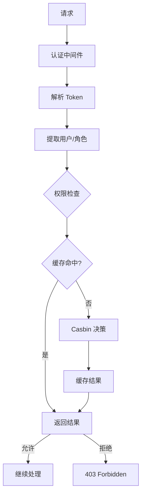
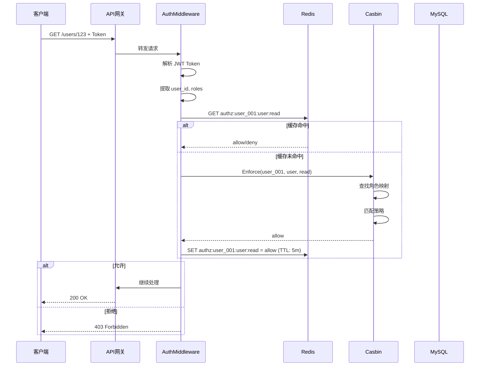

# 权限决策流程设计

> 🎯 **核心结论**: 采用 Casbin 作为策略引擎，结合 Redis 缓存实现高性能权限决策

---

## 1. 设计概述

### 1.1 决策流程总览



### 1.2 设计目标

| 目标 | 方案 |
|------|------|
| **高性能** | Redis 缓存，减少 Casbin 调用 |
| **灵活性** | RBAC 模型，支持资源级权限 |
| **可扩展** | 策略可动态更新，无需重启 |
| **一致性** | 事件驱动同步，多实例一致 |

---

## 2. Casbin 集成

### 2.1 Model 定义

```text
# Casbin Model
# 源码: configs/casbin_model.conf

[request_definition]
r = sub, obj, act

[policy_definition]
p = sub, obj, act

[role_definition]
g = _, _

[policy_effect]
e = some(where (p.eft == allow))

[matchers]
m = g(r.sub, p.sub) && keyMatch2(r.obj, p.obj) && r.act == p.act
```

**说明:**

```text
┌─────────────────────────────────────────────────────────────┐
│  [request_definition] r = sub, obj, act                      │
│  请求格式: 谁(sub) 对什么(obj) 做什么(act)                   │
│  示例: user_123, /users/456, read                            │
├─────────────────────────────────────────────────────────────┤
│  [policy_definition] p = sub, obj, act                       │
│  策略格式: 角色(sub) 可以对资源(obj) 执行操作(act)           │
│  示例: admin, /users/*, write                                │
├─────────────────────────────────────────────────────────────┤
│  [role_definition] g = _, _                                  │
│  角色继承: 用户 -> 角色 的映射                               │
│  示例: user_123, admin                                       │
├─────────────────────────────────────────────────────────────┤
│  [matchers]                                                  │
│  匹配规则: 检查用户角色 + 资源匹配 + 操作匹配                │
│  keyMatch2 支持通配符: /users/* 匹配 /users/123              │
└─────────────────────────────────────────────────────────────┘
```

### 2.2 策略示例

```csv
# 策略数据 (p = 策略, g = 角色映射)
# 源码: configs/policy.csv

# 角色策略
p, admin, user, read
p, admin, user, write
p, admin, child, read
p, admin, child, write
p, guardian, child, read
p, guardian, report, read

# 用户-角色映射
g, user_001, admin
g, user_002, guardian
g, user_003, guardian
```

---

## 3. 决策流程详解

### 3.1 时序图



### 3.2 核心实现

```go
// 伪代码: 权限中间件
// 源码: internal/apiserver/infra/middleware/authz.go

type AuthzMiddleware struct {
    enforcer EnforcerService
    extractor ResourceExtractor
}

func (m *AuthzMiddleware) Handle() gin.HandlerFunc {
    return func(c *gin.Context) {
        // 1. 获取用户信息 (由认证中间件设置)
        userID := c.GetString("user_id")
        roles := c.GetStringSlice("roles")
        
        // 2. 提取资源和操作
        resource := m.extractor.ExtractResource(c.Request)
        action := m.extractor.ExtractAction(c.Request.Method)
        
        // 3. 权限检查
        allowed, err := m.enforcer.Enforce(c.Request.Context(), EnforceRequest{
            Subject: userID,
            Object:  resource,
            Action:  action,
        })
        
        if err != nil || !allowed {
            c.AbortWithStatusJSON(403, gin.H{"error": "forbidden"})
            return
        }
        
        c.Next()
    }
}
```

### 3.3 资源提取

```go
// 伪代码: 资源提取器
// 源码: internal/apiserver/infra/middleware/resource_extractor.go

type ResourceExtractor struct {
    routes map[string]string  // 路由 -> 资源映射
}

// 从请求中提取资源
func (e *ResourceExtractor) ExtractResource(r *http.Request) string {
    // 方案1: 路由前缀映射
    // /users/* -> user
    // /children/* -> child
    
    path := r.URL.Path
    for pattern, resource := range e.routes {
        if matchPath(pattern, path) {
            return resource
        }
    }
    return "unknown"
}

// 从 HTTP 方法提取操作
func (e *ResourceExtractor) ExtractAction(method string) string {
    switch method {
    case "GET":
        return "read"
    case "POST", "PUT", "PATCH":
        return "write"
    case "DELETE":
        return "delete"
    default:
        return "unknown"
    }
}

// 路由-资源映射配置
var ResourceRoutes = map[string]string{
    "/api/v1/users/*":    "user",
    "/api/v1/children/*": "child",
    "/api/v1/reports/*":  "report",
    "/api/v1/roles/*":    "role",
}
```

---

## 4. 缓存策略

### 4.1 缓存结构

```text
Redis Key 设计:

authz:{subject}:{object}:{action}
├── 值: "1" (允许) / "0" (拒绝)
└── TTL: 5 分钟

示例:
authz:user_001:user:read = "1"
authz:user_001:child:delete = "0"
```

### 4.2 缓存实现

```go
// 伪代码: 权限缓存
// 源码: internal/apiserver/infra/authz/redis_cache.go

type RedisAuthzCache struct {
    client *redis.Client
    ttl    time.Duration
}

func (c *RedisAuthzCache) Get(subject, object, action string) (bool, bool) {
    key := fmt.Sprintf("authz:%s:%s:%s", subject, object, action)
    val, err := c.client.Get(ctx, key).Result()
    if err == redis.Nil {
        return false, false  // 未找到
    }
    return val == "1", true
}

func (c *RedisAuthzCache) Set(subject, object, action string, allowed bool) {
    key := fmt.Sprintf("authz:%s:%s:%s", subject, object, action)
    val := "0"
    if allowed {
        val = "1"
    }
    c.client.Set(ctx, key, val, c.ttl)
}

// 失效指定用户的所有缓存
func (c *RedisAuthzCache) InvalidateUser(subject string) {
    pattern := fmt.Sprintf("authz:%s:*", subject)
    keys, _ := c.client.Keys(ctx, pattern).Result()
    if len(keys) > 0 {
        c.client.Del(ctx, keys...)
    }
}
```

### 4.3 缓存失效时机

| 时机 | 失效范围 |
|------|---------|
| 角色变更 | 该角色下所有用户缓存 |
| 策略变更 | 相关资源的所有缓存 |
| 用户角色变更 | 该用户的所有缓存 |
| 定时过期 | 自动过期 (TTL: 5分钟) |

---

## 5. 多级权限检查

### 5.1 检查层次

```text
┌─────────────────────────────────────────────────────────────┐
│                    权限检查层次                              │
├─────────────────────────────────────────────────────────────┤
│  L1: 路由级权限                                              │
│      - 在中间件统一检查                                      │
│      - 基于 URL + Method                                     │
│      - 粗粒度，性能高                                        │
├─────────────────────────────────────────────────────────────┤
│  L2: 资源级权限                                              │
│      - 在业务逻辑中检查                                      │
│      - 基于具体资源 ID                                       │
│      - 如: 只能查看自己的儿童                                │
├─────────────────────────────────────────────────────────────┤
│  L3: 字段级权限                                              │
│      - 在返回数据时过滤                                      │
│      - 隐藏敏感字段                                          │
│      - 如: 普通用户看不到身份证号                            │
└─────────────────────────────────────────────────────────────┘
```

### 5.2 资源级权限示例

```go
// 伪代码: 资源级权限检查
// 源码: internal/apiserver/application/child_app_service.go

func (s *ChildAppService) GetChild(ctx context.Context, userID, childID string) (*Child, error) {
    // 1. 路由级权限已在中间件检查过
    
    // 2. 资源级权限检查: 用户是否是该儿童的监护人
    isGuardian, err := s.guardianRepo.IsGuardian(ctx, userID, childID)
    if err != nil {
        return nil, err
    }
    
    // 如果不是监护人，检查是否是管理员
    if !isGuardian {
        isAdmin, _ := s.enforcer.Enforce(ctx, EnforceRequest{
            Subject: userID,
            Object:  "child",
            Action:  "admin",
        })
        if !isAdmin {
            return nil, ErrForbidden
        }
    }
    
    // 3. 获取数据
    return s.childRepo.FindByID(ctx, childID)
}
```

---

## 6. 配置项

```yaml
# 授权相关配置
# 源码: configs/apiserver.yaml

authz:
  casbin:
    model_path: "configs/casbin_model.conf"
    auto_load_interval: 60s   # 自动加载策略间隔
    
  cache:
    enabled: true
    ttl: 5m                   # 缓存过期时间
    prefix: "authz:"
    
  routes:
    - pattern: "/api/v1/users/*"
      resource: "user"
    - pattern: "/api/v1/children/*"
      resource: "child"
    - pattern: "/api/v1/reports/*"
      resource: "report"
```

---

## 7. 源码索引

| 组件 | 路径 | 说明 |
|------|------|------|
| **中间件** | | |
| AuthzMiddleware | `infra/middleware/authz.go` | 权限中间件 |
| ResourceExtractor | `infra/middleware/resource_extractor.go` | 资源提取 |
| **Casbin** | | |
| EnforcerService | `domain/authz/service/enforcer_service.go` | 权限决策 |
| CasbinAdapter | `infra/authz/casbin_adapter.go` | Casbin 适配器 |
| **缓存** | | |
| RedisAuthzCache | `infra/authz/redis_cache.go` | Redis 缓存 |
| **配置** | | |
| casbin_model.conf | `configs/casbin_model.conf` | Casbin 模型 |
