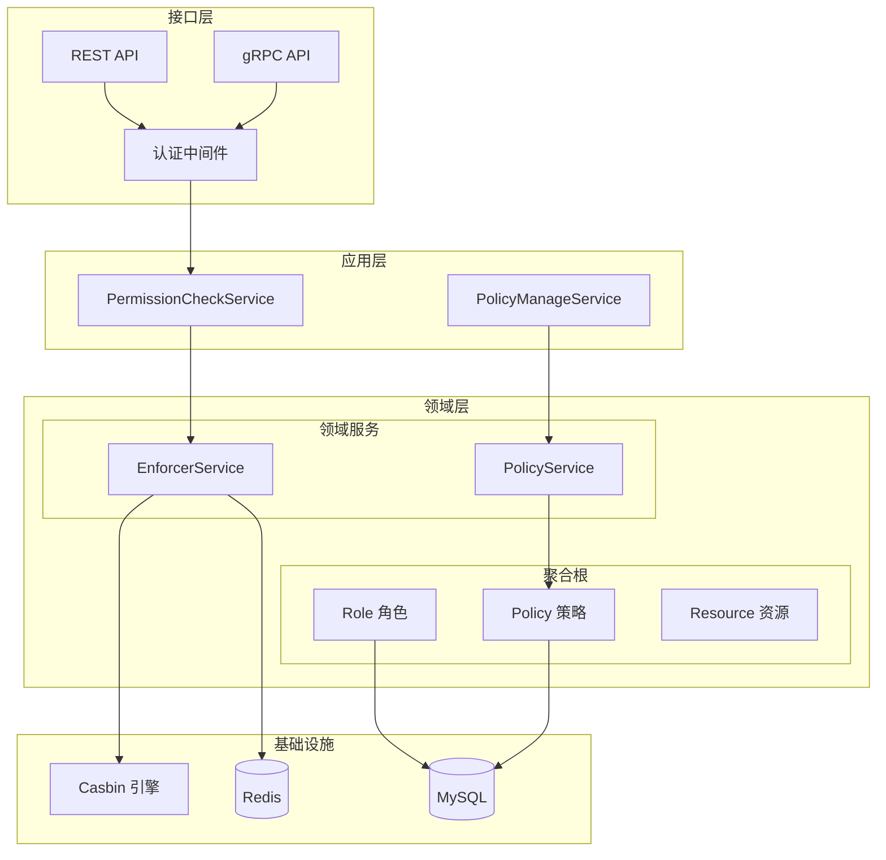
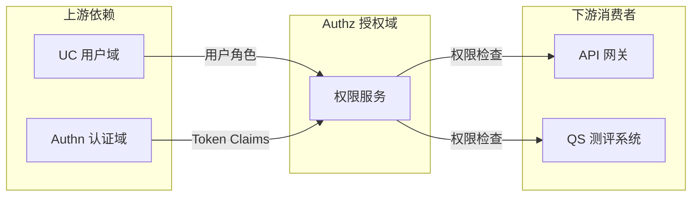

# 授权域 (Authz) 架构设计

> 🛡️ 基于 RBAC + Casbin 的细粒度权限控制系统

---

## 📊 架构全景图



---

## 🎯 核心职责

| 职责 | 说明 | 详细文档 |
|------|------|---------|
| **权限检查** | 判断用户是否有权访问资源 | [权限决策流程](./02-权限决策流程.md) |
| **策略管理** | CRUD 授权策略 | [策略同步机制](./03-策略同步机制.md) |
| **角色管理** | 角色定义与分配 | [领域模型设计](./01-领域模型设计.md) |
| **资源注册** | 定义可授权的资源 | [领域模型设计](./01-领域模型设计.md) |

---

## 🏗️ 设计思想

### RBAC 模型

```text
┌─────────────────────────────────────────────────────────────┐
│                    RBAC 授权模型                             │
├─────────────────────────────────────────────────────────────┤
│                                                              │
│   User ──────> Role ──────> Permission ──────> Resource     │
│   用户         角色          权限             资源           │
│                                                              │
│   示例:                                                      │
│   张三 ──────> admin ──────> user:write ──────> /users/*    │
│   李四 ──────> guardian ────> child:read ─────> /children/* │
│                                                              │
└─────────────────────────────────────────────────────────────┘
```

### Casbin 策略模型

```text
# Casbin Model 定义
# 源码: configs/casbin_model.conf

[request_definition]
r = sub, obj, act          # 主体, 对象, 操作

[policy_definition]
p = sub, obj, act          # 策略定义

[role_definition]
g = _, _                   # 用户-角色映射

[policy_effect]
e = some(where (p.eft == allow))  # 任一允许即可

[matchers]
m = g(r.sub, p.sub) && r.obj == p.obj && r.act == p.act
```

---

## 📁 代码结构

```text
internal/apiserver/domain/authz/
├── entity/
│   ├── role.go              # 角色聚合根
│   ├── policy.go            # 策略实体
│   └── resource.go          # 资源实体
├── valueobject/
│   ├── permission.go        # 权限值对象
│   └── action.go            # 操作枚举
├── service/
│   ├── enforcer_service.go  # 权限决策服务
│   └── policy_service.go    # 策略管理服务
├── port/
│   ├── repository.go        # 仓储端口
│   └── cache.go             # 缓存端口
└── event/
    └── policy_changed.go    # 策略变更事件
```

---

## 🔗 上下游关系



| 关系 | 服务 | 说明 |
|------|------|------|
| **依赖** | UC 域 | 获取用户角色信息 |
| **依赖** | Authn 域 | Token 中的角色声明 |
| **被依赖** | API 网关 | 路由级权限控制 |
| **被依赖** | 业务服务 | 细粒度权限检查 |

---

## 📚 详细设计文档

| 文档 | 内容 | 阅读时间 |
|------|------|---------|
| [领域模型设计](./01-领域模型设计.md) | 角色、策略、资源模型 | 10 min |
| [权限决策流程](./02-权限决策流程.md) | Casbin 集成、决策链 | 12 min |
| [策略同步机制](./03-策略同步机制.md) | Redis 缓存、事件驱动 | 8 min |

---

## 🔑 关键决策

| 决策 | 选择 | 理由 |
|------|------|------|
| 授权模型 | RBAC | 简单直观，满足当前需求 |
| 策略引擎 | Casbin | 成熟稳定，Go 原生支持 |
| 缓存策略 | Redis | 分布式环境一致性 |
| 同步机制 | 事件驱动 | 解耦，最终一致性 |
