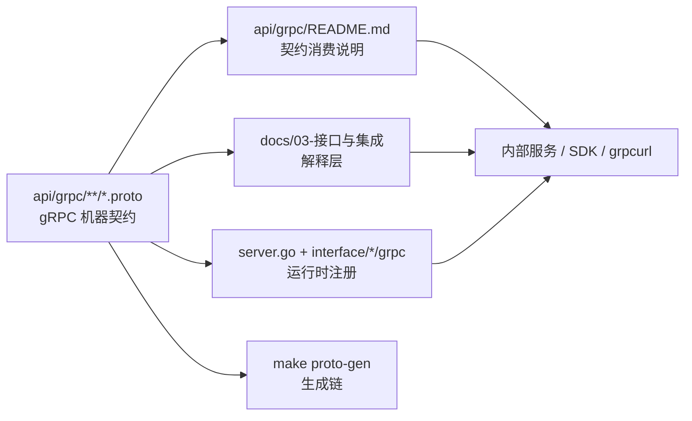

# gRPC 契约与接入

## 本文回答

本文只回答 6 件事：

1. gRPC 契约层与解释层今天怎么分工
2. 当前已暴露的 gRPC 服务到底有哪些
3. Proto 布局今天怎么读
4. metadata、超时、错误语义这些调用约定今天怎么理解
5. 生成与调试入口在哪里
6. 它和运行时文档应该怎么分工

## 30 秒结论

- gRPC 的机器契约以 [../../api/grpc/](../../api/grpc/) 下的 `proto` 为准，`docs/` 只负责解释如何接入和如何验证理解。
- 当前已注册的 gRPC 服务包括 `AuthService`、`JWKSService`、`IdentityRead`、`GuardianshipQuery`、`GuardianshipCommand`、`IdentityLifecycle`、`IDPService`、`AuthorizationService`（authz PDP）。
- `api/grpc/README.md` 当前已经提供了核心服务矩阵、metadata 约定、超时建议和调用示例，应把它视为契约消费入口，而不是把这些内容散写在概览文档里。
- 运行时安全与装配细节不在本文展开；那部分已经放到 [../01-运行时/02-gRPC与mTLS.md](../01-运行时/02-gRPC与mTLS.md)。
- 提交前如改了 Proto 或 gRPC 相关生成物，应至少检查 `make proto-gen` 和相关 README 是否同步更新。

## 重点速查

| 关注点 | 当前答案 | 真实落点 |
| ---- | ---- | ---- |
| 契约根目录 | gRPC Proto 合同 | [../../api/grpc/](../../api/grpc/) |
| 主合同说明 | gRPC 服务矩阵、请求约定、示例 | [../../api/grpc/README.md](../../api/grpc/README.md) |
| Authn Proto | `AuthService`、`JWKSService` | [../../api/grpc/iam/authn/v1/authn.proto](../../api/grpc/iam/authn/v1/authn.proto) |
| Identity Proto | `IdentityRead`、`Guardianship*`、`IdentityLifecycle` | [../../api/grpc/iam/identity/v1/identity.proto](../../api/grpc/iam/identity/v1/identity.proto) |
| IDP Proto | `IDPService` | [../../api/grpc/iam/idp/v1/idp.proto](../../api/grpc/iam/idp/v1/idp.proto) |
| Authz Proto | `AuthorizationService` | [../../api/grpc/iam/authz/v1/authz.proto](../../api/grpc/iam/authz/v1/authz.proto) |
| 代码注册点 | 真实注册了哪些服务 | [../../internal/apiserver/server.go](../../internal/apiserver/server.go) |
| 代码生成 | Proto 生成脚本 | [../../scripts/proto/generate.sh](../../scripts/proto/generate.sh) |
| 运行时安全 | mTLS / ACL / 健康检查 | [../01-运行时/02-gRPC与mTLS.md](../01-运行时/02-gRPC与mTLS.md) |

## 1. gRPC 契约层与解释层今天怎么分工



**图意**：gRPC 接入的正确读法是“先看 proto 和 `api/grpc/README` 定义了什么，再看运行时到底注册了什么”。`docs/03` 负责解释消费方式和边界，不替代 Proto 自身。

| 层 | 主要回答什么 |
| ---- | ---- |
| `api/grpc/**/*.proto` | 服务、消息、字段编号、兼容性 |
| `api/grpc/README.md` | 服务矩阵、metadata、错误语义、示例 |
| `docs/03-接口与集成/*` | 如何消费合同、与运行时文档如何分工、接入时应注意什么 |

这意味着：

- 字段、枚举、service 定义变化，应优先改 `proto`
- README 和 `docs/` 只负责解释和导航，不应成为第二真值源

## 2. 当前已暴露的 gRPC 服务到底有哪些

根据当前代码注册点，实际暴露的服务如下：

| 模块 | Service | 注册位置 |
| ---- | ---- | ---- |
| Authn | `AuthService` | [../../internal/apiserver/interface/authn/grpc/service.go](../../internal/apiserver/interface/authn/grpc/service.go) |
| Authn | `JWKSService` | [../../internal/apiserver/interface/authn/grpc/service.go](../../internal/apiserver/interface/authn/grpc/service.go) |
| UC | `IdentityRead` | [../../internal/apiserver/interface/uc/grpc/identity/service.go](../../internal/apiserver/interface/uc/grpc/identity/service.go) |
| UC | `GuardianshipQuery` | [../../internal/apiserver/interface/uc/grpc/identity/service.go](../../internal/apiserver/interface/uc/grpc/identity/service.go) |
| UC | `GuardianshipCommand` | [../../internal/apiserver/interface/uc/grpc/identity/service.go](../../internal/apiserver/interface/uc/grpc/identity/service.go) |
| UC | `IdentityLifecycle` | [../../internal/apiserver/interface/uc/grpc/identity/service.go](../../internal/apiserver/interface/uc/grpc/identity/service.go) |
| IDP | `IDPService` | [../../internal/apiserver/interface/idp/grpc/service.go](../../internal/apiserver/interface/idp/grpc/service.go) |
| Authz | `AuthorizationService` | [../../internal/apiserver/interface/authz/grpc/service.go](../../internal/apiserver/interface/authz/grpc/service.go) |

注意：

- 某个 `proto` 中存在的方法，如果当前未被 `Register...Server(...)` 注册，只能写成合同能力或未来能力，不能写成当前运行面（`AuthorizationService` 见 [server.go](../../internal/apiserver/server.go)）。

## 3. Proto 布局今天怎么读

```text
api/grpc/
└── iam/
    ├── authn/v1/authn.proto
    ├── authz/v1/authz.proto
    ├── identity/v1/identity.proto
    └── idp/v1/idp.proto
```

| Proto | 主要能力 |
| ---- | ---- |
| `authn/v1/authn.proto` | Token 验证、刷新、撤销、JWKS |
| `authz/v1/authz.proto` | 授权判定 `AuthorizationService/Check` |
| `identity/v1/identity.proto` | 用户、儿童、监护关系、身份生命周期 |
| `idp/v1/idp.proto` | 微信应用等 IDP 能力 |

## 4. metadata、超时、错误语义这些调用约定今天怎么理解

这部分以 [../../api/grpc/README.md](../../api/grpc/README.md) 为主，这里只保留最核心的接入摘要。

### 4.1 Metadata

- `authorization`
- `x-request-id`
- 写接口需要的操作者上下文，应按服务定义补齐

### 4.2 超时与分页

- 客户端应设置合理超时
- 分页与字段语义以具体 `proto` / README 为准

### 4.3 错误语义

应优先按 gRPC status code 理解，而不是按 REST 风格理解。

当前 README 中已有的重点是：

- `INVALID_ARGUMENT`
- `NOT_FOUND`
- `ALREADY_EXISTS`
- `FAILED_PRECONDITION`
- `PERMISSION_DENIED`
- `UNAUTHENTICATED`
- `INTERNAL`

## 5. 生成与调试入口在哪里

| 动作 | 入口 |
| ---- | ---- |
| 生成 protobuf 代码 | `make proto-gen` |
| Proto 生成脚本 | [../../scripts/proto/generate.sh](../../scripts/proto/generate.sh) |
| 查看 gRPC 使用说明 | [../../api/grpc/README.md](../../api/grpc/README.md) |
| grpcurl / Go 示例 | [../../api/grpc/README.md](../../api/grpc/README.md) |

## 6. 它和运行时文档应该怎么分工

本文不展开这些问题：

- gRPC 服务怎么在进程内组装
- mTLS 怎么配置
- ACL 怎么加载
- 健康检查端口怎么暴露

这些都应回到 [../01-运行时/02-gRPC与mTLS.md](../01-运行时/02-gRPC与mTLS.md)。

## 继续往下读

| 文档 | 说明 |
| ---- | ---- |
| [../../api/grpc/README.md](../../api/grpc/README.md) | gRPC 合同主说明 |
| [../01-运行时/02-gRPC与mTLS.md](../01-运行时/02-gRPC与mTLS.md) | gRPC 运行时与安全边界 |
| [05-QS接入IAM.md](./05-QS接入IAM.md) | 业务方接入说明 |
