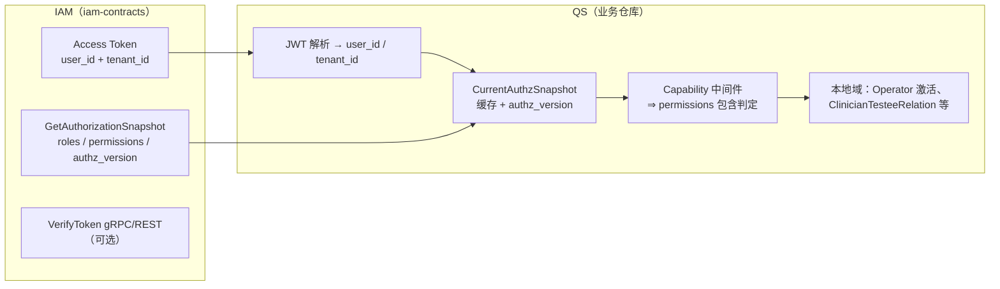

# IAM 契约 PR 与 QS 竖切边界（Token · GetAuthorizationSnapshot · authz_version）

## 本文回答

1. **IAM 这一条 PR**（token、`GetAuthorizationSnapshot`、`authz_version`）在系统里**止于何处**  
2. **QS 这一条竖切**（`CurrentAuthzSnapshot`、capability 改为基于 `permissions`）从何处开始、**不得侵入 IAM 的哪一层**  
3. 双方对接时必须共同遵守的**不变量**与**事实来源**（合同与代码路径）

---

## 30 秒结论

| 层级 | 归谁 | 一句话 |
| ---- | ---- | ---- |
| **身份真值与 access token 形态** | **IAM** | JWT 验签后可稳定得到 `user_id`、`tenant_id`（及账户等）；**不把业务角色真值写进 JWT**。 |
| **动作级授权真值（角色 / 资源·动作 / 版本）** | **IAM** | `GetAuthorizationSnapshot(subject, domain, app_name)` 返回 `roles`、`permissions`、`authz_version`；策略与 Assignment 变更通过同一套版本递增并可用于失效通知。 |
| **请求内授权投影与缓存** | **QS** | `CurrentAuthzSnapshot`：以 `(tenant_id, user_id)` 为键，按 `authz_version` 做缓存失效，**必要时**回源 IAM；**不**在 QS 内自造与 IAM 冲突的“角色真值”。 |
| **HTTP 能力开关（capability）** | **QS** | 中间件将 **QS 能力** 映射为 IAM `(resource, action)`，在 **`CurrentAuthzSnapshot.permissions`** 上判定；**不再**以 JWT `roles` 或本地 Operator 角色为唯一真值。 |
| **业务范围（如医患关系、激活态）** | **QS** | 仍在 QS 域内；IAM **不**承载动态业务数据范围的全量真值。 |

---

## 1. 边界总览（竖切切在哪一刀）

- **实线责任**：IAM 产出 token 与快照契约；QS 消费并投影。  
- **虚线语义**：QS 的 `domain` / `subject` **必须**与 IAM Casbin 约定一致（见下节不变量）。

---

## 2. IAM 契约 PR 范围（交付物与“到此为止”）

### 2.1 Token（身份）

- **Access token**（与登录签发链一致）在 JWT 中携带 **`user_id`、`tenant_id`**（及 `account_id` 等），供本地验签解析。  
- **VerifyToken**：gRPC / REST 返回的 `TokenClaims` 与本地解析字段对齐（含 `tenant_id`）。  
- **边界**：IAM **不**在 access token 中承载 QS 业务角色真值；若历史兼容出现 `roles` 类声明，仅作过渡，**不作为** QS 动作授权的最终真值。

**事实来源**：`api/grpc/iam/authn/v1/authn.proto`、`internal/apiserver/infra/jwt/generator.go`、`internal/apiserver/interface/authn/grpc/service.go`、REST `handler/auth.go`。

### 2.2 GetAuthorizationSnapshot + authz_version（授权快照）

- **gRPC**：`iam.authz.v1.AuthorizationService/GetAuthorizationSnapshot`  
- **响应**：`roles`（角色名列表）、`permissions`（`resource` + `action`）、`authz_version`（租户侧授权版本单调递增，策略与 Assignment 变更均参与）。  
- **边界**：快照描述的是 **IAM 内 Casbin 投影**；**不**包含 QS 业务数据范围（如某 testee 是否可见）。

**事实来源**：`api/grpc/iam/authz/v1/authz.proto`、`internal/apiserver/interface/authz/grpc/service.go`、`pkg/sdk/authz/client.go`。

### 2.3 IAM PR 的“止点”

IAM **不负责**：QS 路由命名、Capability 枚举、本地缓存键设计、医患关系判定、Operator 表字段策略（除“投影缓存”约定外）。  
IAM **负责**：上述契约稳定、版本语义清晰、SDK/示例与集成测试可证明 **登录 → token → tenant_id → Verify 一致**（见仓库内 `internal/apiserver/interface/authn/grpc/verify_token_integration_test.go`）。

---

## 3. QS 竖切范围（从哪开始、改什么）

### 3.1 CurrentAuthzSnapshot

- **输入**：来自 JWT 的 `tenant_id`、`user_id`（及请求上下文）。  
- **主体与域（调用 IAM 时）**：  
  - `subject = "user:" + user_id`（与 IAM / Casbin 约定一致）  
  - `domain = tenant_id`（与 JWT 中 `tenant_id` 字符串一致；本阶段 **`tenant_id` 等同 org_id**）  
  - `app_name`：与 IAM SQL bootstrap / 角色前缀中的 **应用命名空间** 约定一致（如 QS 对应前缀约定）。
- **缓存**：以 `authz_version` 为失效依据；本地版本 **落后于** IAM 返回时重新拉取快照。  
- **边界**：**不**把本地 `Operator.roles` 当作唯一真值；可与 IAM 分配对齐后作为**投影缓存**。

### 3.2 Capability → permissions（不再单独信 JWT roles）

- **QS 侧**：每个 capability 映射到 **一个或多个** `(resource, action)`（或等价 admin 判定规则）。  
- **判定**：在 **`CurrentAuthzSnapshot.permissions`** 集合上检查是否满足；**不再**以 JWT 内 `roles` 作为放行依据。  
- **边界**：Capability 名称、映射表、失败文案属 **QS**；IAM 只保证 `permissions` 与策略/Assignment 一致。

### 3.3 QS 竖切的“起点”

QS 竖切 **从** JWT 已通过验签、`user_id`/`tenant_id` 已进入上下文 **开始**，**到** capability 与本地业务范围判定 **结束**；**不**修改 IAM 的 Casbin 模型语义（若需新资源/动作，走 IAM 配置与发版，而非在 QS 写死旁路）。

---

## 4. 双方必须对齐的不变量（接口级）

| 不变量 | 说明 |
| ---- | ---- |
| `tenant_id` 字符串相等 | JWT、`GetAuthorizationSnapshot` 的 `domain`、QS 缓存键中的租户维度一致。 |
| `subject` 格式 | 用户主体为 `user:<id>`，与 IAM Assignment、gRPC 请求一致。 |
| `authz_version` 单调 | IAM 侧同一租户版本只增不减；QS 仅用于比较与失效，不自行改写。 |
| 动作授权真值 | **以 IAM 快照为准**；JWT 内业务角色（若有）不得覆盖快照拒绝结果。 |
| 数据范围 | **IAM** 管动作是否允许；**QS** 管业务关系与资源行级范围。 |

---

## 5. 与现有文档的关系

| 文档 | 作用 |
| ---- | ---- |
| [05-QS接入IAM.md](./05-QS接入IAM.md) | QS 接入路径总览（SDK、JWKS、gRPC）。 |
| [03-授权接入与边界.md](./03-授权接入与边界.md) | IAM 授权管理面与单次 PDP；**快照与竖切边界以本文为准**。 |
| [../05-专题分析/03-授权判定链路--角色&策略&资源&Assignment&Casbin.md](../05-专题分析/03-授权判定链路--角色&策略&资源&Assignment&Casbin.md) | IAM 内部 Casbin 与版本传播细节。 |

---

## 6. 修订与漂移

- **机器契约**以 `api/grpc/**/*.proto`、`api/rest/*.yaml` 为准。  
- 若本文与合同或 router 行为不一致，**优先修正实现或合同**，再同步本文。
