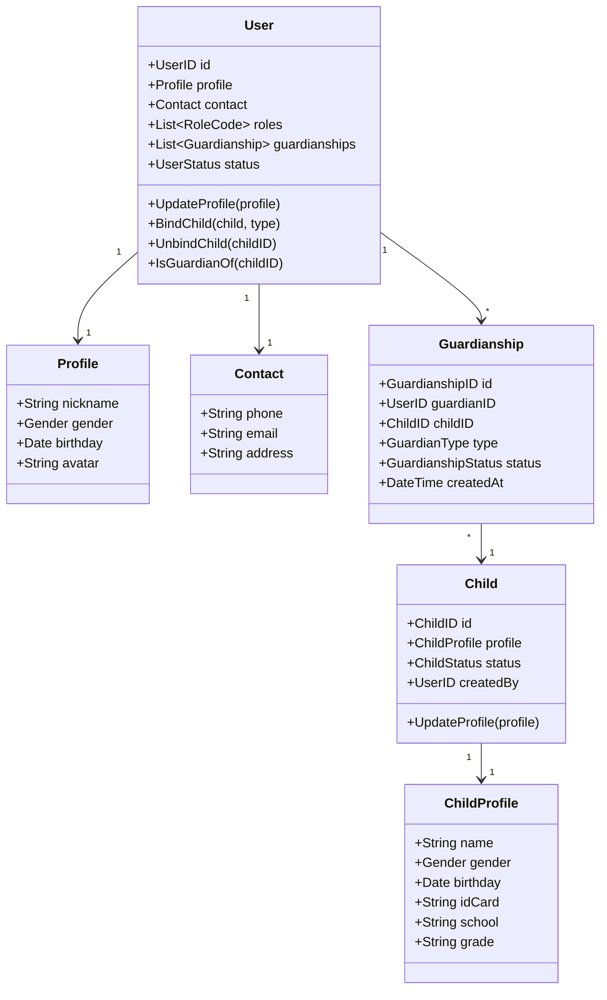
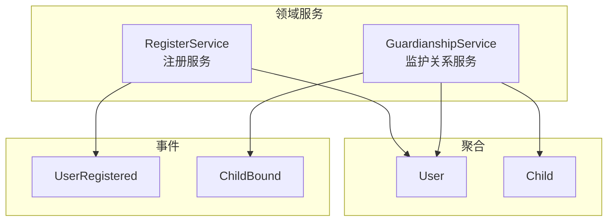

# 用户域领域模型设计

> 🎯 **核心结论**: User 和 Child 作为独立聚合根，Guardianship 作为关联实体管理监护关系

---

## 1. 设计概述

### 1.1 领域边界

```text
┌─────────────────────────────────────────────────────────────┐
│                       用户域 (UC)                            │
├─────────────────────────────────────────────────────────────┤
│  职责: 用户管理、儿童档案、监护关系                          │
│  不负责: 认证凭证管理、权限策略管理                          │
└─────────────────────────────────────────────────────────────┘
```

### 1.2 聚合划分

| 聚合 | 聚合根 | 职责 |
|------|--------|------|
| 用户聚合 | User | 用户档案、监护关系管理 |
| 儿童聚合 | Child | 儿童档案管理 |

---

## 2. 领域模型

### 2.1 聚合关系图



### 2.2 User 聚合根

```go
// 伪代码: User 聚合根
// 源码: internal/apiserver/domain/uc/entity/user.go

type User struct {
    ID            UserID          // 用户ID
    Profile       Profile         // 用户档案
    Contact       Contact         // 联系方式
    Roles         []RoleCode      // 角色列表
    Guardianships []Guardianship  // 监护关系
    Status        UserStatus      // 用户状态
    CreatedAt     time.Time
    UpdatedAt     time.Time
}

// 绑定儿童
func (u *User) BindChild(childID ChildID, guardianType GuardianType) (*Guardianship, error) {
    // 业务规则: 检查是否已绑定
    if u.IsGuardianOf(childID) {
        return nil, ErrAlreadyGuardian
    }
    
    // 业务规则: 每个儿童最多 2 个监护人
    // (此规则需要跨聚合查询，放在领域服务中)
    
    guardianship := &Guardianship{
        ID:         NewGuardianshipID(),
        GuardianID: u.ID,
        ChildID:    childID,
        Type:       guardianType,
        Status:     GuardianshipStatusActive,
        CreatedAt:  time.Now(),
    }
    
    u.Guardianships = append(u.Guardianships, *guardianship)
    return guardianship, nil
}

// 解除绑定
func (u *User) UnbindChild(childID ChildID) error {
    for i, g := range u.Guardianships {
        if g.ChildID == childID {
            u.Guardianships[i].Status = GuardianshipStatusInactive
            return nil
        }
    }
    return ErrGuardianshipNotFound
}

// 检查是否是某儿童的监护人
func (u *User) IsGuardianOf(childID ChildID) bool {
    for _, g := range u.Guardianships {
        if g.ChildID == childID && g.Status == GuardianshipStatusActive {
            return true
        }
    }
    return false
}
```

### 2.3 Profile 值对象

```go
// 伪代码: Profile 值对象
// 源码: internal/apiserver/domain/uc/valueobject/profile.go

type Profile struct {
    Nickname string    // 昵称
    Gender   Gender    // 性别
    Birthday *Date     // 生日 (可选)
    Avatar   string    // 头像 URL
}

type Gender string

const (
    GenderMale    Gender = "male"
    GenderFemale  Gender = "female"
    GenderUnknown Gender = "unknown"
)

// 验证
func (p *Profile) Validate() error {
    if len(p.Nickname) < 2 || len(p.Nickname) > 20 {
        return ErrInvalidNickname
    }
    return nil
}
```

### 2.4 Child 聚合根

```go
// 伪代码: Child 聚合根
// 源码: internal/apiserver/domain/uc/entity/child.go

type Child struct {
    ID        ChildID       // 儿童ID
    Profile   ChildProfile  // 儿童档案
    Status    ChildStatus   // 状态
    CreatedBy UserID        // 创建者 (首个监护人)
    CreatedAt time.Time
    UpdatedAt time.Time
}

type ChildProfile struct {
    Name     string   // 姓名
    Gender   Gender   // 性别
    Birthday Date     // 生日
    IDCard   *string  // 身份证号 (可选，加密存储)
    School   *string  // 学校
    Grade    *string  // 年级
}

// 更新档案
func (c *Child) UpdateProfile(profile ChildProfile) error {
    if err := profile.Validate(); err != nil {
        return err
    }
    c.Profile = profile
    c.UpdatedAt = time.Now()
    return nil
}

// 验证儿童档案
func (p *ChildProfile) Validate() error {
    if len(p.Name) < 2 {
        return ErrInvalidChildName
    }
    // 业务规则: 必须是未成年人
    if p.Birthday.AddDate(18, 0, 0).Before(time.Now()) {
        return ErrNotMinor
    }
    return nil
}
```

### 2.5 Guardianship 实体

```go
// 伪代码: Guardianship 实体
// 源码: internal/apiserver/domain/uc/entity/guardianship.go

type Guardianship struct {
    ID         GuardianshipID     // 关系ID
    GuardianID UserID             // 监护人ID
    ChildID    ChildID            // 儿童ID
    Type       GuardianType       // 监护人类型
    Status     GuardianshipStatus // 关系状态
    CreatedAt  time.Time
}

type GuardianType string

const (
    GuardianTypePrimary   GuardianType = "primary"   // 主监护人
    GuardianTypeSecondary GuardianType = "secondary" // 次监护人
)

type GuardianshipStatus string

const (
    GuardianshipStatusActive   GuardianshipStatus = "active"
    GuardianshipStatusInactive GuardianshipStatus = "inactive"
)
```

---

## 3. 领域服务

### 3.1 服务划分



### 3.2 RegisterService

```go
// 伪代码: 注册领域服务
// 源码: internal/apiserver/domain/uc/service/register_service.go

type RegisterService struct {
    userRepo     UserRepository
    eventBus     EventBus
}

// 注册用户
func (s *RegisterService) Register(ctx context.Context, req RegisterRequest) (*User, error) {
    // 1. 创建用户
    user := &User{
        ID:      NewUserID(),
        Profile: req.Profile,
        Contact: req.Contact,
        Roles:   []RoleCode{RoleGuardian}, // 默认角色
        Status:  UserStatusActive,
    }
    
    // 2. 验证
    if err := user.Validate(); err != nil {
        return nil, err
    }
    
    // 3. 持久化
    if err := s.userRepo.Save(ctx, user); err != nil {
        return nil, err
    }
    
    // 4. 发布事件
    s.eventBus.Publish(UserRegisteredEvent{
        UserID:    user.ID,
        Timestamp: time.Now(),
    })
    
    return user, nil
}
```

### 3.3 GuardianshipService

```go
// 伪代码: 监护关系领域服务
// 源码: internal/apiserver/domain/uc/service/guardianship_service.go

type GuardianshipService struct {
    userRepo  UserRepository
    childRepo ChildRepository
    eventBus  EventBus
}

// 绑定儿童 (跨聚合操作)
func (s *GuardianshipService) BindChild(ctx context.Context, guardianID UserID, childID ChildID, guardianType GuardianType) error {
    // 1. 获取监护人
    guardian, err := s.userRepo.FindByID(ctx, guardianID)
    if err != nil {
        return err
    }
    
    // 2. 获取儿童
    child, err := s.childRepo.FindByID(ctx, childID)
    if err != nil {
        return err
    }
    
    // 3. 业务规则: 每个儿童最多 2 个监护人
    guardians, _ := s.userRepo.FindGuardiansOfChild(ctx, childID)
    if len(guardians) >= 2 {
        return ErrMaxGuardiansReached
    }
    
    // 4. 绑定
    guardianship, err := guardian.BindChild(childID, guardianType)
    if err != nil {
        return err
    }
    
    // 5. 持久化
    if err := s.userRepo.Save(ctx, guardian); err != nil {
        return err
    }
    
    // 6. 发布事件
    s.eventBus.Publish(ChildBoundEvent{
        GuardianID:     guardianID,
        ChildID:        childID,
        GuardianshipID: guardianship.ID,
        Timestamp:      time.Now(),
    })
    
    return nil
}
```

---

## 4. 端口定义

### 4.1 仓储端口

```go
// 伪代码: 仓储端口
// 源码: internal/apiserver/domain/uc/port/repository.go

type UserRepository interface {
    FindByID(ctx context.Context, id UserID) (*User, error)
    FindByPhone(ctx context.Context, phone string) (*User, error)
    FindGuardiansOfChild(ctx context.Context, childID ChildID) ([]*User, error)
    Save(ctx context.Context, user *User) error
    Delete(ctx context.Context, id UserID) error
}

type ChildRepository interface {
    FindByID(ctx context.Context, id ChildID) (*Child, error)
    FindByGuardian(ctx context.Context, guardianID UserID) ([]*Child, error)
    Save(ctx context.Context, child *Child) error
    Delete(ctx context.Context, id ChildID) error
}
```

### 4.2 事件发布端口

```go
// 伪代码: 事件发布端口
// 源码: internal/apiserver/domain/uc/port/event_publisher.go

type EventBus interface {
    Publish(event DomainEvent) error
}

type DomainEvent interface {
    EventType() string
    Timestamp() time.Time
}
```

---

## 5. 源码索引

| 组件 | 路径 | 说明 |
|------|------|------|
| **聚合根** | | |
| User | `domain/uc/entity/user.go` | 用户聚合根 |
| Child | `domain/uc/entity/child.go` | 儿童聚合根 |
| **实体** | | |
| Guardianship | `domain/uc/entity/guardianship.go` | 监护关系 |
| **值对象** | | |
| Profile | `domain/uc/valueobject/profile.go` | 用户档案 |
| ChildProfile | `domain/uc/valueobject/child_profile.go` | 儿童档案 |
| Contact | `domain/uc/valueobject/contact.go` | 联系方式 |
| **领域服务** | | |
| RegisterService | `domain/uc/service/register_service.go` | 注册服务 |
| GuardianshipService | `domain/uc/service/guardianship_service.go` | 监护关系服务 |
| **端口** | | |
| UserRepository | `domain/uc/port/repository.go` | 用户仓储 |
| ChildRepository | `domain/uc/port/repository.go` | 儿童仓储 |
