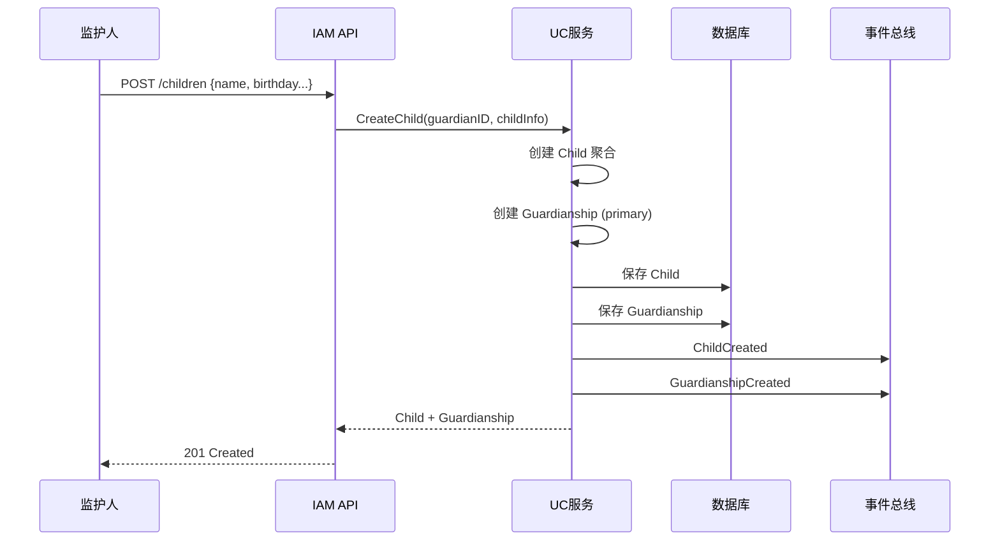
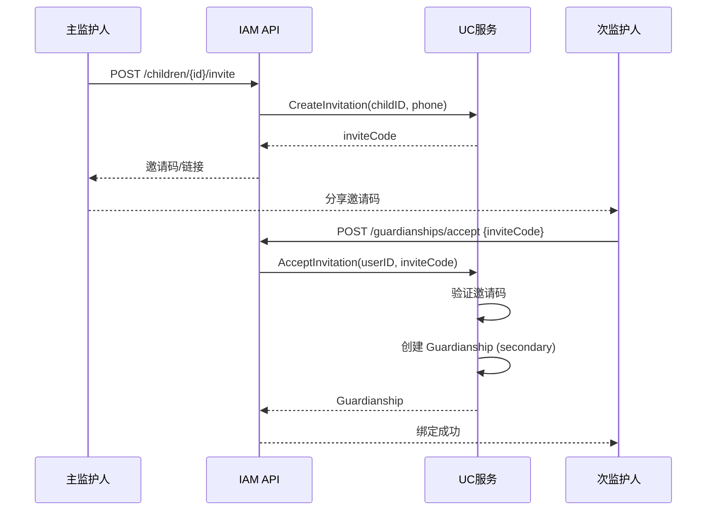
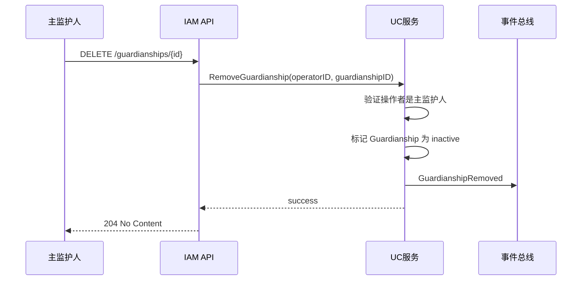
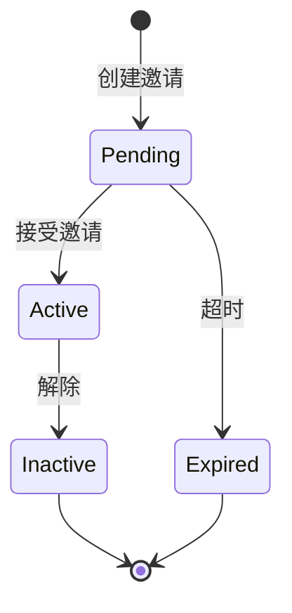

# 监护关系设计

> 🎯 **核心结论**: 监护关系是连接用户与儿童的核心业务，支持多监护人场景

---

## 1. 业务场景

### 1.1 场景描述

```text
┌─────────────────────────────────────────────────────────────┐
│                    监护关系业务场景                          │
├─────────────────────────────────────────────────────────────┤
│                                                              │
│  场景1: 家长带孩子做心理测评                                 │
│  - 家长(监护人)登录小程序                                    │
│  - 创建儿童档案                                              │
│  - 代替孩子完成测评                                          │
│  - 查看测评报告                                              │
│                                                              │
│  场景2: 父母双方都需要查看报告                               │
│  - 主监护人(爸爸)创建儿童档案                                │
│  - 邀请次监护人(妈妈)加入                                    │
│  - 双方都可查看孩子的测评报告                                │
│                                                              │
│  场景3: 离异家庭                                             │
│  - 解除一方监护权                                            │
│  - 保留另一方的访问权限                                      │
│                                                              │
└─────────────────────────────────────────────────────────────┘
```

### 1.2 业务规则

| 规则 | 说明 |
|------|------|
| 每个儿童最多 2 个监护人 | 通常是父母双方 |
| 必须有 1 个主监护人 | 创建儿童时自动成为主监护人 |
| 主监护人可邀请次监护人 | 通过邀请码或手机号 |
| 只有主监护人可解除他人监护权 | 防止权限滥用 |
| 解除后仍保留历史记录 | 审计需要 |

---

## 2. 流程设计

### 2.1 创建儿童并绑定



### 2.2 邀请次监护人



### 2.3 解除监护关系



---

## 3. 详细设计

### 3.1 邀请机制

```go
// 伪代码: 邀请码生成与验证
// 源码: internal/apiserver/domain/uc/service/invitation_service.go

type Invitation struct {
    Code      string    // 邀请码
    ChildID   ChildID   // 儿童ID
    InviterID UserID    // 邀请人ID
    ExpiresAt time.Time // 过期时间
}

type InvitationService struct {
    cache InvitationCache
}

// 创建邀请
func (s *InvitationService) Create(ctx context.Context, childID ChildID, inviterID UserID) (*Invitation, error) {
    invitation := &Invitation{
        Code:      generateCode(6),         // 6位随机码
        ChildID:   childID,
        InviterID: inviterID,
        ExpiresAt: time.Now().Add(24*time.Hour),
    }
    
    // 存储到 Redis，24小时过期
    s.cache.Set(invitation.Code, invitation)
    
    return invitation, nil
}

// 验证并消费邀请
func (s *InvitationService) Accept(ctx context.Context, code string, userID UserID) (*Invitation, error) {
    invitation, err := s.cache.Get(code)
    if err != nil {
        return nil, ErrInvitationNotFound
    }
    
    if invitation.ExpiresAt.Before(time.Now()) {
        return nil, ErrInvitationExpired
    }
    
    // 消费邀请码
    s.cache.Delete(code)
    
    return invitation, nil
}
```

### 3.2 权限验证

```go
// 伪代码: 监护关系权限验证
// 源码: internal/apiserver/domain/uc/service/guardianship_service.go

// 验证是否可以操作儿童数据
func (s *GuardianshipService) CanAccessChild(ctx context.Context, userID UserID, childID ChildID) (bool, error) {
    user, err := s.userRepo.FindByID(ctx, userID)
    if err != nil {
        return false, err
    }
    
    return user.IsGuardianOf(childID), nil
}

// 验证是否可以管理监护关系
func (s *GuardianshipService) CanManageGuardianship(ctx context.Context, userID UserID, childID ChildID) (bool, error) {
    user, err := s.userRepo.FindByID(ctx, userID)
    if err != nil {
        return false, err
    }
    
    for _, g := range user.Guardianships {
        if g.ChildID == childID && g.Type == GuardianTypePrimary && g.Status == GuardianshipStatusActive {
            return true, nil
        }
    }
    return false, nil
}
```

### 3.3 数据隔离

```go
// 伪代码: 儿童数据查询 (带权限过滤)
// 源码: internal/apiserver/application/child_query_service.go

type ChildQueryService struct {
    childRepo  ChildRepository
    guardianSvc *GuardianshipService
}

// 查询用户可访问的所有儿童
func (s *ChildQueryService) ListChildrenForUser(ctx context.Context, userID UserID) ([]*Child, error) {
    // 只返回该用户作为监护人的儿童
    return s.childRepo.FindByGuardian(ctx, userID)
}

// 查询单个儿童 (带权限检查)
func (s *ChildQueryService) GetChild(ctx context.Context, userID UserID, childID ChildID) (*Child, error) {
    // 权限检查
    canAccess, err := s.guardianSvc.CanAccessChild(ctx, userID, childID)
    if err != nil || !canAccess {
        return nil, ErrForbidden
    }
    
    return s.childRepo.FindByID(ctx, childID)
}
```

---

## 4. 状态机

### 4.1 监护关系状态



### 4.2 状态定义

```go
// 伪代码: 监护关系状态
// 源码: internal/apiserver/domain/uc/valueobject/guardianship_status.go

type GuardianshipStatus string

const (
    GuardianshipStatusPending  GuardianshipStatus = "pending"   // 待接受
    GuardianshipStatusActive   GuardianshipStatus = "active"    // 生效中
    GuardianshipStatusInactive GuardianshipStatus = "inactive"  // 已解除
    GuardianshipStatusExpired  GuardianshipStatus = "expired"   // 已过期
)

// 状态转换验证
func (s GuardianshipStatus) CanTransitionTo(target GuardianshipStatus) bool {
    transitions := map[GuardianshipStatus][]GuardianshipStatus{
        GuardianshipStatusPending: {GuardianshipStatusActive, GuardianshipStatusExpired},
        GuardianshipStatusActive:  {GuardianshipStatusInactive},
    }
    
    allowed, ok := transitions[s]
    if !ok {
        return false
    }
    
    for _, t := range allowed {
        if t == target {
            return true
        }
    }
    return false
}
```

---

## 5. API 设计

### 5.1 接口列表

| 方法 | 路径 | 说明 |
|------|------|------|
| POST | `/children` | 创建儿童 (自动绑定) |
| GET | `/children` | 查询我的儿童列表 |
| GET | `/children/:id` | 查询儿童详情 |
| PUT | `/children/:id` | 更新儿童信息 |
| POST | `/children/:id/invite` | 邀请次监护人 |
| POST | `/guardianships/accept` | 接受邀请 |
| DELETE | `/guardianships/:id` | 解除监护关系 |

### 5.2 接口示例

```yaml
# 创建儿童
POST /api/v1/children
Authorization: Bearer {token}

Request:
{
  "name": "小明",
  "gender": "male",
  "birthday": "2015-06-01"
}

Response: 201
{
  "id": "child_123",
  "name": "小明",
  "guardianship": {
    "id": "gs_456",
    "type": "primary",
    "status": "active"
  }
}
```

```yaml
# 邀请次监护人
POST /api/v1/children/child_123/invite
Authorization: Bearer {token}

Response: 200
{
  "invite_code": "ABC123",
  "expires_at": "2024-01-02T00:00:00Z"
}
```

---

## 6. 源码索引

| 组件 | 路径 | 说明 |
|------|------|------|
| **领域服务** | | |
| GuardianshipService | `domain/uc/service/guardianship_service.go` | 监护关系服务 |
| InvitationService | `domain/uc/service/invitation_service.go` | 邀请服务 |
| **应用服务** | | |
| ChildAppService | `application/uc/child_app_service.go` | 儿童应用服务 |
| GuardianAppService | `application/uc/guardian_app_service.go` | 监护应用服务 |
| **Handler** | | |
| ChildHandler | `interface/rest/child_handler.go` | 儿童API |
| GuardianHandler | `interface/rest/guardian_handler.go` | 监护API |
