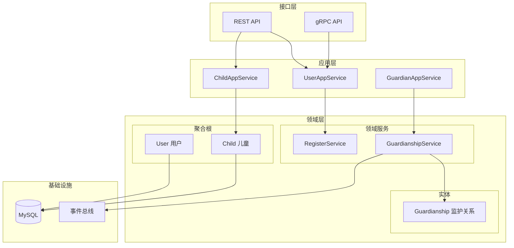
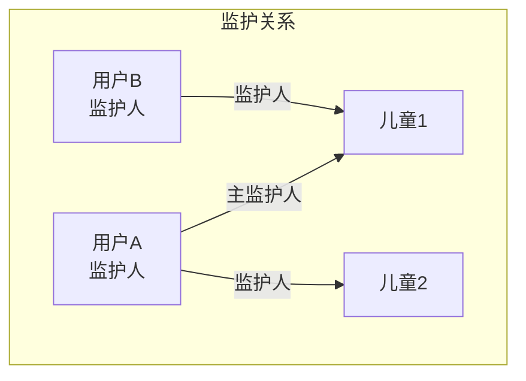
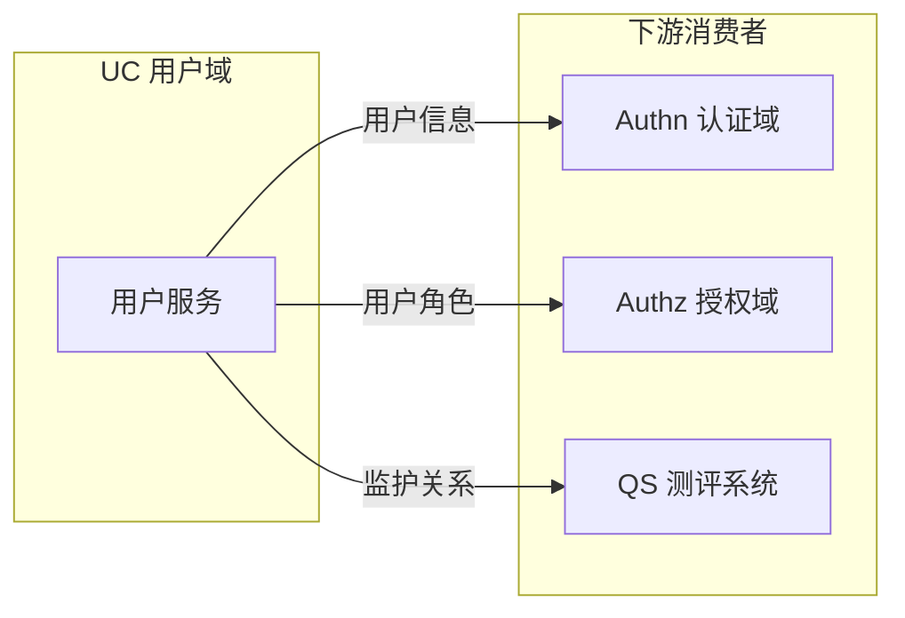

# 用户域 (UC) 架构设计

> 👥 管理用户、儿童档案、监护关系的核心业务域

---

## 📊 架构全景图



---

## 🎯 核心职责

| 职责 | 说明 | 详细文档 |
|------|------|---------|
| **用户管理** | 用户注册、档案管理 | [领域模型设计](./01-领域模型设计.md) |
| **儿童档案** | 儿童信息管理 | [领域模型设计](./01-领域模型设计.md) |
| **监护关系** | 监护人-儿童绑定 | [监护关系设计](./02-监护关系设计.md) |
| **领域事件** | 跨域协作事件 | [领域事件设计](./03-领域事件设计.md) |

---

## 🏗️ 设计思想

### 聚合边界设计

```text
┌─────────────────────────────────────────────────────────────┐
│                    聚合边界设计原则                          │
├─────────────────────────────────────────────────────────────┤
│                                                              │
│  User 聚合          Child 聚合           Guardianship       │
│  ┌─────────┐        ┌─────────┐         ┌─────────────┐    │
│  │  User   │        │  Child  │         │ Guardianship│    │
│  │ (聚合根)│        │ (聚合根)│         │   (实体)    │    │
│  │         │        │         │         └──────┬──────┘    │
│  │ Profile │        │ Profile │                │           │
│  │ Contact │        │ Health  │         属于 User 聚合?     │
│  └─────────┘        └─────────┘         还是独立聚合?       │
│                                                              │
│  设计决策:                                                   │
│  - User 和 Child 是独立聚合 (有独立生命周期)                │
│  - Guardianship 属于 User 聚合 (监护人视角管理)             │
│                                                              │
└─────────────────────────────────────────────────────────────┘
```

### 监护关系建模



---

## 📁 代码结构

```text
internal/apiserver/domain/uc/
├── entity/
│   ├── user.go              # 用户聚合根
│   ├── child.go             # 儿童聚合根
│   └── guardianship.go      # 监护关系实体
├── valueobject/
│   ├── profile.go           # 用户档案
│   ├── contact.go           # 联系方式
│   ├── child_profile.go     # 儿童档案
│   └── guardian_type.go     # 监护人类型
├── service/
│   ├── register_service.go  # 注册服务
│   └── guardianship_service.go  # 监护关系服务
├── port/
│   ├── repository.go        # 仓储端口
│   └── event_publisher.go   # 事件发布端口
└── event/
    ├── user_registered.go   # 用户注册事件
    └── child_bound.go       # 儿童绑定事件
```

---

## 🔗 上下游关系



| 关系 | 服务 | 说明 |
|------|------|------|
| **被依赖** | Authn 域 | 提供用户信息用于 Token Claims |
| **被依赖** | Authz 域 | 提供用户角色信息 |
| **被依赖** | QS 系统 | 提供监护关系验证 |

---

## 📚 详细设计文档

| 文档 | 内容 | 阅读时间 |
|------|------|---------|
| [领域模型设计](./01-领域模型设计.md) | User、Child 聚合设计 | 10 min |
| [监护关系设计](./02-监护关系设计.md) | 监护人-儿童业务流程 | 12 min |
| [领域事件设计](./03-领域事件设计.md) | 事件发布、跨域协作 | 8 min |

---

## 🔑 关键决策

| 决策 | 选择 | 理由 |
|------|------|------|
| User/Child 关系 | 独立聚合 | 各有独立生命周期 |
| 监护关系归属 | 属于 User | 从监护人视角管理 |
| 儿童创建 | 由监护人创建 | 业务场景需要 |
| 跨域通信 | 领域事件 | 解耦，最终一致性 |
