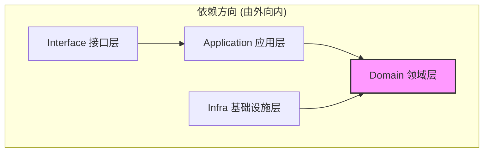

# 六边形架构实践

> 🎯 **核心结论**: 通过端口与适配器模式实现业务逻辑与技术细节的解耦

---

## 1. 架构概述

### 1.1 六边形架构图

```text
┌─────────────────────────────────────────────────────────────────┐
│                                                                  │
│    ┌──────────────────────────────────────────────────────┐    │
│    │              Driving Adapters (主动适配器)            │    │
│    │  ┌─────────┐  ┌─────────┐  ┌─────────┐  ┌─────────┐ │    │
│    │  │  REST   │  │  gRPC   │  │  Event  │  │   CLI   │ │    │
│    │  │ Handler │  │ Handler │  │ Handler │  │ Command │ │    │
│    │  └────┬────┘  └────┬────┘  └────┬────┘  └────┬────┘ │    │
│    └───────┼────────────┼────────────┼────────────┼───────┘    │
│            │            │            │            │             │
│            └────────────┴─────┬──────┴────────────┘             │
│                               │                                  │
│                               ▼                                  │
│    ┌──────────────────────────────────────────────────────┐    │
│    │                   Input Ports (输入端口)              │    │
│    │            ApplicationService interfaces             │    │
│    └──────────────────────────┬───────────────────────────┘    │
│                               │                                  │
│                               ▼                                  │
│    ╔══════════════════════════════════════════════════════╗    │
│    ║                    Domain Core                        ║    │
│    ║  ┌─────────────────────────────────────────────────┐ ║    │
│    ║  │  Entities    │  Value Objects  │  Domain Services│ ║    │
│    ║  └─────────────────────────────────────────────────┘ ║    │
│    ╚══════════════════════════════════════════════════════╝    │
│                               │                                  │
│                               ▼                                  │
│    ┌──────────────────────────────────────────────────────┐    │
│    │                  Output Ports (输出端口)              │    │
│    │              Repository / Client interfaces           │    │
│    └──────────────────────────┬───────────────────────────┘    │
│                               │                                  │
│            ┌──────────────────┼──────────────────┐              │
│            │                  │                  │              │
│            ▼                  ▼                  ▼              │
│    ┌──────────────────────────────────────────────────────┐    │
│    │             Driven Adapters (被动适配器)              │    │
│    │  ┌─────────┐  ┌─────────┐  ┌─────────┐  ┌─────────┐ │    │
│    │  │  MySQL  │  │  Redis  │  │  WeChat │  │  Email  │ │    │
│    │  │  Repo   │  │  Cache  │  │   SDK   │  │  Client │ │    │
│    │  └─────────┘  └─────────┘  └─────────┘  └─────────┘ │    │
│    └──────────────────────────────────────────────────────┘    │
│                                                                  │
└─────────────────────────────────────────────────────────────────┘
```

### 1.2 核心原则

| 原则 | 说明 |
|------|------|
| **依赖倒置** | 领域层不依赖基础设施，通过端口抽象 |
| **端口隔离** | 输入输出通过端口解耦 |
| **适配器可替换** | 切换技术栈只需更换适配器 |
| **领域纯净** | 领域层只包含业务逻辑 |

---

## 2. 分层设计

### 2.1 目录结构

```text
internal/apiserver/
├── domain/                    # 领域层 (核心)
│   └── authn/
│       ├── entity/            # 聚合根、实体
│       ├── valueobject/       # 值对象
│       ├── service/           # 领域服务
│       ├── port/              # 端口定义
│       └── event/             # 领域事件
│
├── application/               # 应用层
│   └── authn/
│       ├── login_app_service.go
│       ├── dto/               # 数据传输对象
│       └── assembler/         # DTO <-> Domain 转换
│
├── infra/                     # 基础设施层
│   └── authn/
│       ├── repository/        # 仓储实现
│       ├── wechat/            # 微信SDK适配器
│       └── redis/             # Redis适配器
│
└── interface/                 # 接口层
    ├── rest/                  # REST Handler
    └── grpc/                  # gRPC Handler
```

### 2.2 层次依赖



---

## 3. 端口设计

### 3.1 输入端口 (Driving Ports)

```go
// 伪代码: 应用服务接口作为输入端口
// 源码: internal/apiserver/application/authn/login_app_service.go

// 输入端口: 定义应用可以做什么
type LoginAppService interface {
    // 微信登录
    WeChatLogin(ctx context.Context, req WeChatLoginRequest) (*TokenPair, error)
    
    // 密码登录
    PasswordLogin(ctx context.Context, req PasswordLoginRequest) (*TokenPair, error)
    
    // Token 刷新
    RefreshToken(ctx context.Context, refreshToken string) (*TokenPair, error)
    
    // 登出
    Logout(ctx context.Context, accessToken string) error
}

// DTO: 请求数据
type WeChatLoginRequest struct {
    Code     string `json:"code"`
    DeviceID string `json:"device_id"`
}
```

### 3.2 输出端口 (Driven Ports)

```go
// 伪代码: 仓储端口 (由领域层定义)
// 源码: internal/apiserver/domain/authn/port/repository.go

// 输出端口: 定义领域需要什么
type AccountRepository interface {
    FindByID(ctx context.Context, id AccountID) (*Account, error)
    FindByCredential(ctx context.Context, credType CredentialType, identifier string) (*Account, error)
    Save(ctx context.Context, account *Account) error
}

// 输出端口: 外部服务
type WeChatClient interface {
    Code2Session(ctx context.Context, code string) (*WeChatSession, error)
}

// 输出端口: 缓存
type SessionCache interface {
    Get(ctx context.Context, sessionID string) (*Session, error)
    Set(ctx context.Context, session *Session, ttl time.Duration) error
    Delete(ctx context.Context, sessionID string) error
}
```

---

## 4. 适配器实现

### 4.1 驱动适配器 (REST Handler)

```go
// 伪代码: REST 适配器
// 源码: internal/apiserver/interface/rest/auth_handler.go

type AuthHandler struct {
    loginService LoginAppService  // 依赖输入端口
}

func NewAuthHandler(loginService LoginAppService) *AuthHandler {
    return &AuthHandler{loginService: loginService}
}

// 适配 HTTP 请求到应用服务
func (h *AuthHandler) WeChatLogin(c *gin.Context) {
    // 1. 解析 HTTP 请求
    var req WeChatLoginRequest
    if err := c.ShouldBindJSON(&req); err != nil {
        c.JSON(400, gin.H{"error": "invalid request"})
        return
    }
    
    // 2. 调用应用服务 (输入端口)
    result, err := h.loginService.WeChatLogin(c.Request.Context(), req)
    if err != nil {
        c.JSON(500, gin.H{"error": err.Error()})
        return
    }
    
    // 3. 返回 HTTP 响应
    c.JSON(200, result)
}

// 路由注册
func (h *AuthHandler) RegisterRoutes(r *gin.RouterGroup) {
    auth := r.Group("/auth")
    auth.POST("/wechat/login", h.WeChatLogin)
    auth.POST("/password/login", h.PasswordLogin)
    auth.POST("/token/refresh", h.RefreshToken)
    auth.POST("/logout", h.Logout)
}
```

### 4.2 被驱动适配器 (MySQL Repository)

```go
// 伪代码: MySQL 仓储适配器
// 源码: internal/apiserver/infra/authn/repository/account_repository.go

type MySQLAccountRepository struct {
    db *gorm.DB
}

// 实现输出端口
func NewMySQLAccountRepository(db *gorm.DB) *MySQLAccountRepository {
    return &MySQLAccountRepository{db: db}
}

func (r *MySQLAccountRepository) FindByID(ctx context.Context, id AccountID) (*Account, error) {
    var po AccountPO
    if err := r.db.WithContext(ctx).Where("id = ?", id).First(&po).Error; err != nil {
        if errors.Is(err, gorm.ErrRecordNotFound) {
            return nil, ErrAccountNotFound
        }
        return nil, err
    }
    return po.ToDomain(), nil
}

func (r *MySQLAccountRepository) Save(ctx context.Context, account *Account) error {
    po := NewAccountPO(account)
    return r.db.WithContext(ctx).Save(po).Error
}

// PO: 持久化对象 (数据库模型)
type AccountPO struct {
    ID        string    `gorm:"primaryKey"`
    UserID    string    `gorm:"index"`
    Status    string
    CreatedAt time.Time
    UpdatedAt time.Time
}

// PO <-> Domain 转换
func (po *AccountPO) ToDomain() *Account {
    return &Account{
        ID:        AccountID(po.ID),
        UserID:    UserID(po.UserID),
        Status:    AccountStatus(po.Status),
        CreatedAt: po.CreatedAt,
        UpdatedAt: po.UpdatedAt,
    }
}
```

### 4.3 被驱动适配器 (微信 SDK)

```go
// 伪代码: 微信 SDK 适配器
// 源码: internal/apiserver/infra/authn/wechat/client.go

type WeChatClientImpl struct {
    appID     string
    appSecret string
    httpClient *http.Client
}

// 实现输出端口
func NewWeChatClient(appID, appSecret string) *WeChatClientImpl {
    return &WeChatClientImpl{
        appID:     appID,
        appSecret: appSecret,
        httpClient: &http.Client{Timeout: 10 * time.Second},
    }
}

func (c *WeChatClientImpl) Code2Session(ctx context.Context, code string) (*WeChatSession, error) {
    url := fmt.Sprintf(
        "https://api.weixin.qq.com/sns/jscode2session?appid=%s&secret=%s&js_code=%s&grant_type=authorization_code",
        c.appID, c.appSecret, code,
    )
    
    resp, err := c.httpClient.Get(url)
    if err != nil {
        return nil, err
    }
    defer resp.Body.Close()
    
    var result struct {
        OpenID     string `json:"openid"`
        UnionID    string `json:"unionid"`
        SessionKey string `json:"session_key"`
        ErrCode    int    `json:"errcode"`
        ErrMsg     string `json:"errmsg"`
    }
    
    if err := json.NewDecoder(resp.Body).Decode(&result); err != nil {
        return nil, err
    }
    
    if result.ErrCode != 0 {
        return nil, fmt.Errorf("wechat error: %s", result.ErrMsg)
    }
    
    return &WeChatSession{
        OpenID:     result.OpenID,
        UnionID:    result.UnionID,
        SessionKey: result.SessionKey,
    }, nil
}
```

---

## 5. 依赖注入

### 5.1 容器配置

```go
// 伪代码: 依赖注入容器
// 源码: internal/apiserver/container/container.go

type Container struct {
    // 基础设施
    DB    *gorm.DB
    Redis *redis.Client
    
    // 仓储
    AccountRepo  port.AccountRepository
    SessionRepo  port.SessionRepository
    
    // 外部服务
    WeChatClient port.WeChatClient
    
    // 领域服务
    AuthService *service.AuthenticationService
    TokenService *service.TokenService
    
    // 应用服务
    LoginAppService application.LoginAppService
}

func NewContainer(cfg *config.Config) *Container {
    c := &Container{}
    
    // 初始化基础设施
    c.DB = database.NewGorm(cfg.Database)
    c.Redis = cache.NewRedis(cfg.Redis)
    
    // 初始化适配器 (实现端口)
    c.AccountRepo = repository.NewMySQLAccountRepository(c.DB)
    c.SessionRepo = repository.NewRedisSessionRepository(c.Redis)
    c.WeChatClient = wechat.NewWeChatClient(cfg.WeChat.AppID, cfg.WeChat.Secret)
    
    // 初始化领域服务
    c.AuthService = service.NewAuthenticationService(c.AccountRepo, c.WeChatClient)
    c.TokenService = service.NewTokenService(cfg.JWT)
    
    // 初始化应用服务
    c.LoginAppService = application.NewLoginAppService(c.AuthService, c.TokenService, c.SessionRepo)
    
    return c
}
```

### 5.2 Handler 注册

```go
// 伪代码: 路由注册
// 源码: internal/apiserver/routers.go

func SetupRouters(container *Container) *gin.Engine {
    r := gin.Default()
    
    // 创建 Handler (注入应用服务)
    authHandler := rest.NewAuthHandler(container.LoginAppService)
    userHandler := rest.NewUserHandler(container.UserAppService)
    
    // 注册路由
    api := r.Group("/api/v1")
    authHandler.RegisterRoutes(api)
    userHandler.RegisterRoutes(api)
    
    return r
}
```

---

## 6. 测试策略

### 6.1 分层测试

```text
┌─────────────────────────────────────────────────────────────┐
│                       测试金字塔                             │
├─────────────────────────────────────────────────────────────┤
│                                                              │
│                    ┌─────────────┐                          │
│                    │   E2E Test   │  少量                   │
│                    └─────────────┘                          │
│               ┌─────────────────────┐                       │
│               │  Integration Test   │  适量                 │
│               └─────────────────────┘                       │
│         ┌─────────────────────────────────┐                 │
│         │         Unit Test               │  大量           │
│         └─────────────────────────────────┘                 │
│                                                              │
│  Unit Test:        领域逻辑、值对象验证                      │
│  Integration Test: 应用服务 + Mock 适配器                   │
│  E2E Test:         完整 HTTP 请求                           │
│                                                              │
└─────────────────────────────────────────────────────────────┘
```

### 6.2 Mock 端口

```go
// 伪代码: Mock 仓储
// 源码: internal/apiserver/domain/authn/port/repository_mock.go

type MockAccountRepository struct {
    accounts map[string]*Account
}

func NewMockAccountRepository() *MockAccountRepository {
    return &MockAccountRepository{
        accounts: make(map[string]*Account),
    }
}

func (r *MockAccountRepository) FindByID(ctx context.Context, id AccountID) (*Account, error) {
    if account, ok := r.accounts[string(id)]; ok {
        return account, nil
    }
    return nil, ErrAccountNotFound
}

func (r *MockAccountRepository) Save(ctx context.Context, account *Account) error {
    r.accounts[string(account.ID)] = account
    return nil
}
```

---

## 7. 源码索引

| 组件 | 路径 | 说明 |
|------|------|------|
| **端口定义** | | |
| Repository Port | `domain/*/port/repository.go` | 仓储端口 |
| Client Port | `domain/*/port/*_client.go` | 外部服务端口 |
| **驱动适配器** | | |
| REST Handler | `interface/rest/*.go` | HTTP 适配器 |
| gRPC Handler | `interface/grpc/*.go` | gRPC 适配器 |
| **被驱动适配器** | | |
| MySQL Repository | `infra/*/repository/*.go` | MySQL 实现 |
| Redis | `infra/*/redis/*.go` | Redis 适配器（缓存、令牌等） |
| WeChat Client | `infra/authn/wechat/*.go` | 微信 SDK |
| **依赖注入** | | |
| Container | `container/container.go` | DI 容器 |
