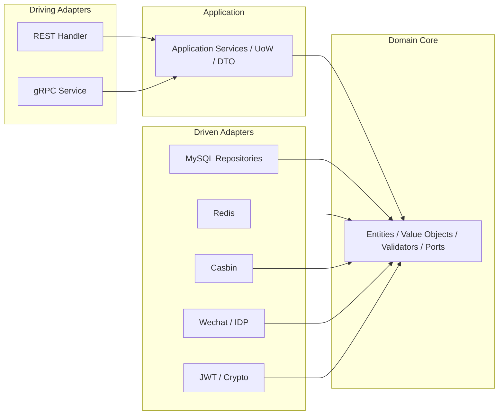

# 六边形架构实践

本文回答：`iam-contracts` 当前是如何把接口、应用、领域、基础设施四层组织成一套“近似六边形架构”的，以及这种组织在代码里真实落在哪里、哪里还带有工程化折中。

## 30 秒结论

- `internal/apiserver` 当前已经形成比较清晰的 `interface / application / domain / infra` 四层分工，这是仓库里六边形架构的真实落点。
- Driving Adapters 当前以 REST 和 gRPC 为主，主要落在 `internal/apiserver/interface/*`；Driven Adapters 主要是 MySQL、Redis、Casbin、Wechat 等，落在 `internal/apiserver/infra/*`。
- 领域层已经显式定义了一批 Driven Ports，例如 [../../internal/apiserver/domain/authn/authentication/repository.go](../../internal/apiserver/domain/authn/authentication/repository.go) 和 [../../internal/apiserver/domain/authz/role/repository.go](../../internal/apiserver/domain/authz/role/repository.go)。
- 依赖注入和模块装配集中在 `internal/apiserver/container/assembler/*.go`，这里是当前“端口接适配器”的主入口。
- 当前实现更接近“务实的六边形架构”而不是教科书纯形态；例如部分 gRPC 接口会同时拿仓储和应用服务，不应把现状写成“所有接口层都只依赖输入端口”。

## 重点速查

| 关注点 | 当前答案 | 真实落点 |
| ---- | ---- | ---- |
| 总体分层 | `interface -> application -> domain <- infra` | [../../internal/apiserver/](../../internal/apiserver/) |
| Driving Adapters | REST / gRPC 暴露面 | [../../internal/apiserver/interface/](../../internal/apiserver/interface/) |
| 应用层编排 | 用例、事务边界、命令/查询服务 | [../../internal/apiserver/application/](../../internal/apiserver/application/) |
| Driven Ports | 领域仓储/外部能力接口 | [../../internal/apiserver/domain/authn/authentication/repository.go](../../internal/apiserver/domain/authn/authentication/repository.go)、[../../internal/apiserver/domain/authz/role/repository.go](../../internal/apiserver/domain/authz/role/repository.go) |
| Driven Adapters | MySQL / Redis / Casbin / Wechat / JWT 等实现 | [../../internal/apiserver/infra/](../../internal/apiserver/infra/) |
| 模块装配 | 把仓储、服务、处理器接起来 | [../../internal/apiserver/container/assembler/](../../internal/apiserver/container/assembler/) |
| 当前边界 | 已有清晰分层，但存在务实折中 | [../../internal/apiserver/interface/uc/grpc/identity/service.go](../../internal/apiserver/interface/uc/grpc/identity/service.go) |

## 1. 当前想解决什么问题

六边形架构在这个仓库里的作用，不是为了“套模式”，而是为了解决三类实际问题：

1. 同一套业务能力既要暴露 REST，又要暴露 gRPC。
2. 领域规则不能被 MySQL、Redis、Casbin、Wechat SDK 这些技术细节反向污染。
3. 不同模块需要单独装配、单独测试、单独替换基础设施实现。

所以这篇文档更关心“当前代码怎么落”，而不是抽象定义。

## 2. 当前落地形态



这张图对应当前仓库的主事实是：

- `interface/*` 承接外部协议
- `application/*` 编排用例和事务
- `domain/*` 保留核心概念、校验器、仓储接口和领域逻辑
- `infra/*` 提供具体技术实现

## 3. 当前代码结构

### 3.1 顶层目录

```text
internal/apiserver/
├── interface/
│   ├── authn/
│   ├── authz/
│   ├── idp/
│   ├── suggest/
│   └── uc/
├── application/
│   ├── authn/
│   ├── authz/
│   ├── idp/
│   ├── suggest/
│   └── uc/
├── domain/
│   ├── authn/
│   ├── authz/
│   ├── idp/
│   ├── suggest/
│   └── uc/
├── infra/
│   ├── mysql/
│   ├── redis/
│   ├── casbin/
│   ├── wechat/
│   ├── wechatapi/
│   ├── jwt/
│   ├── crypto/
│   ├── messaging/
│   └── scheduler/
└── container/assembler/
```

### 3.2 四层分工

| 层 | 当前职责 | 代表路径 |
| ---- | ---- | ---- |
| interface | 接协议、参数绑定、响应转换、路由注册 | `interface/authn/restful/handler/`、`interface/uc/grpc/identity/` |
| application | 用例编排、事务边界、命令/查询服务、DTO | `application/authn/`、`application/authz/`、`application/uc/` |
| domain | 聚合、值对象、校验器、仓储接口、领域逻辑 | `domain/authn/`、`domain/authz/`、`domain/uc/` |
| infra | 仓储实现、缓存、第三方客户端、策略引擎 | `infra/mysql/`、`infra/redis/`、`infra/casbin/`、`infra/wechatapi/` |

## 4. Driving Ports 与 Driving Adapters

当前仓库里主要有两种输入面：REST 和 gRPC。

### 4.1 REST 适配器

例如 [../../internal/apiserver/interface/authn/restful/handler/auth.go](../../internal/apiserver/interface/authn/restful/handler/auth.go)：

- 负责绑定 HTTP 请求
- 根据 `method` 路由到不同登录分支
- 调用 `login.LoginApplicationService` 和 `token.TokenApplicationService`
- 把结果转换成 HTTP 响应

这说明 REST handler 的定位是**驱动适配器**，不是业务逻辑本体。

### 4.2 gRPC 适配器

例如 [../../internal/apiserver/interface/uc/grpc/identity/service.go](../../internal/apiserver/interface/uc/grpc/identity/service.go)：

- 聚合 `IdentityRead`、`GuardianshipQuery`、`GuardianshipCommand`、`IdentityLifecycle`
- 通过 `Register...Server(...)` 注册到 gRPC Server
- 内部组合查询应用服务、命令应用服务和部分仓储

这说明 gRPC 也是 Driving Adapter，但当前实现是**务实组合**，并不是所有 gRPC 服务都只依赖 application 接口。

### 4.3 输入端口当前有哪些形态

| 形态 | 例子 | 说明 |
| ---- | ---- | ---- |
| Application Service 接口 | [../../internal/apiserver/application/uc/user/services.go](../../internal/apiserver/application/uc/user/services.go) | `UserApplicationService`、`UserQueryApplicationService` 等直接作为接口层依赖 |
| Domain 层读写接口 | [../../internal/apiserver/interface/authz/restful/handler/role.go](../../internal/apiserver/interface/authz/restful/handler/role.go) | `RoleHandler` 直接依赖 `roleDomain.Commander / Queryer` |
| 组合式输入面 | [../../internal/apiserver/interface/uc/grpc/identity/service.go](../../internal/apiserver/interface/uc/grpc/identity/service.go) | 同时接应用服务和仓储，体现当前工程折中 |

## 5. Driven Ports 与 Driven Adapters

### 5.1 领域层显式端口

当前仓库不是只靠“约定俗成”分层，领域层已经显式定义了一批输出端口：

| 端口 | 作用 | 位置 |
| ---- | ---- | ---- |
| `CredentialRepository` / `AccountRepository` | 认证凭据与账户查询 | [../../internal/apiserver/domain/authn/authentication/repository.go](../../internal/apiserver/domain/authn/authentication/repository.go) |
| `role.Repository` | 角色聚合的仓储端口 | [../../internal/apiserver/domain/authz/role/repository.go](../../internal/apiserver/domain/authz/role/repository.go) |
| `uc` 各聚合仓储 | 用户、儿童、监护关系仓储端口 | `domain/uc/{user,child,guardianship}` |

### 5.2 基础设施实现

这些端口的实现主要集中在 `infra/*`：

| 适配器 | 代表实现 | 说明 |
| ---- | ---- | ---- |
| MySQL Repository | [../../internal/apiserver/infra/mysql/user/repo.go](../../internal/apiserver/infra/mysql/user/repo.go)、[../../internal/apiserver/infra/mysql/role/repo.go](../../internal/apiserver/infra/mysql/role/repo.go) | 仓储接口的主要实现 |
| Redis | `infra/redis/*` | Token、OTP、缓存相关 |
| Casbin Adapter | [../../internal/apiserver/infra/casbin/adapter.go](../../internal/apiserver/infra/casbin/adapter.go) | 授权规则执行与加载 |
| Wechat / IDP | `infra/wechat/`、`infra/wechatapi/` | 第三方身份能力 |
| JWT / Crypto | `infra/jwt/`、`infra/crypto/` | Token 与密钥相关能力 |

## 6. 依赖注入与模块装配

当前六边形架构是否成立，最直观的证据不在概念图，而在 `container/assembler/*.go`。

### 6.1 Authn 模块

[../../internal/apiserver/container/assembler/authn.go](../../internal/apiserver/container/assembler/authn.go) 当前按如下顺序装配：

1. 初始化基础设施层
2. 初始化领域层
3. 初始化应用层
4. 初始化接口层
5. 初始化调度器

这是当前最接近“从适配器往端口回填”的完整示例。

### 6.2 Authz 模块

[../../internal/apiserver/container/assembler/authz.go](../../internal/apiserver/container/assembler/authz.go) 更能体现分层的清晰性：

- 先建 `role / resource / policy / assignment` 的仓储和领域校验器
- 再建 command/query 应用服务
- 最后把它们注入 REST handler

### 6.3 User 模块

[../../internal/apiserver/container/assembler/user.go](../../internal/apiserver/container/assembler/user.go) 则展示了另一种典型形态：

- 先建 UoW
- 再建 user / child / guardianship 的命令与查询服务
- 最后同时装配 REST handler 和 gRPC identity service

## 7. 当前边界

### 已实现

- `interface / application / domain / infra` 的清晰包级分层
- 领域层显式定义多个仓储/外部能力端口
- MySQL / Redis / Casbin / Wechat 等适配器实现
- `container/assembler` 作为主要依赖注入入口

### 待补证据

- 当前没有足够证据表明 CLI、事件消费器属于一等 Driving Adapter；文档不应把它们写成既成事实

### 当前折中

- `uc` 的 gRPC identity 服务会同时接仓储和应用服务，见 [../../internal/apiserver/interface/uc/grpc/identity/service.go](../../internal/apiserver/interface/uc/grpc/identity/service.go)
- 因此当前更适合表述为“以六边形架构为主的务实落地”，而不是“所有入口都严格只依赖输入端口”

## 8. 验证与测试入口

| 想验证什么 | 去哪里看 |
| ---- | ---- |
| 领域规则是否独立可测 | `internal/apiserver/domain/**/*_test.go` |
| 应用服务是否按用例编排 | `internal/apiserver/application/uc/*/service_test.go`、`application/authn/jwks/key_management_test.go` |
| MySQL 仓储是否独立可测 | `internal/apiserver/infra/mysql/**/*_test.go` |
| 接口合同是否仍与实现一致 | `make docs-swagger`、`make api-validate` |

## 9. 继续往下读

| 文档 | 说明 |
| ---- | ---- |
| [02-CQRS模式实践.md](./02-CQRS模式实践.md) | 当前 CQRS 的真实形态与读写边界 |
| [03-命令&契约校验与开发流程.md](./03-命令&契约校验与开发流程.md) | `Makefile`、swagger / OpenAPI / proto 校验链 |
| [../00-概览/01-系统架构总览.md](../00-概览/01-系统架构总览.md) | 系统级总览 |
