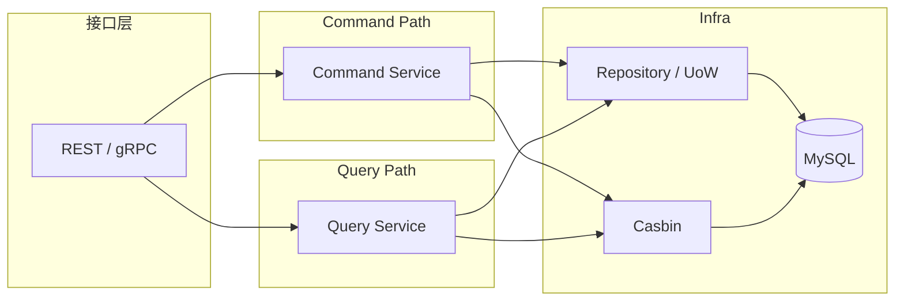

# CQRS 模式实践

本文回答：`iam-contracts` 当前到底采用了哪一种 CQRS 形态、哪些模块已经显式拆出 command/query、哪些地方仍共享同一套仓储和数据库，以及这件事应该如何被准确表述。

## 30 秒结论

- 当前仓库采用的是**服务层面的 CQRS**，不是“独立读库 + 独立写库”的重型 CQRS。
- CQRS 落地最明确的是授权域：`role / resource / policy / assignment` 都显式拆成了 `CommandService` 和 `QueryService`。
- 用户域也显式区分了命令应用服务和查询应用服务，但查询侧仍通过 `UnitOfWork + Repository` 访问同一套 MySQL 仓储。
- 因此当前最准确的说法是：`iam-contracts` 用 CQRS 来分离读写职责和接口依赖，而不是用它来构建独立读模型系统。
- 如果把现状讲成“有单独查询库、异步投影、读写物理分离”，就是夸大。

## 重点速查

| 关注点 | 当前答案 | 真实落点 |
| ---- | ---- | ---- |
| 当前 CQRS 形态 | 服务层面读写分离 | [../../internal/apiserver/application/](../../internal/apiserver/application/) |
| 最明确的模块 | Authz | [../../internal/apiserver/container/assembler/authz.go](../../internal/apiserver/container/assembler/authz.go) |
| 用户域 CQRS | 命令/查询接口分开，但共享 UoW 与仓储 | [../../internal/apiserver/application/uc/user/services.go](../../internal/apiserver/application/uc/user/services.go)、[../../internal/apiserver/application/uc/uow/uow.go](../../internal/apiserver/application/uc/uow/uow.go) |
| Handler 边界 | REST handler 可分别注入 commander / queryer | [../../internal/apiserver/interface/authz/restful/handler/role.go](../../internal/apiserver/interface/authz/restful/handler/role.go) |
| 当前不是 | 独立读模型、独立读库、事件投影式 CQRS | 当前代码未见对应落地 |
| 相关基础设施 | MySQL Repository、Casbin、UoW | [../../internal/apiserver/infra/mysql/](../../internal/apiserver/infra/mysql/)、[../../internal/apiserver/infra/casbin/adapter.go](../../internal/apiserver/infra/casbin/adapter.go) |

## 1. 当前 CQRS 的真实形态

这张图表达的不是“读写物理隔离”，而是：

- 命令和查询在应用服务层分开组织
- 接口层可以分别依赖 command / query
- 底层大多仍复用同一套仓储和 MySQL

## 2. Authz：当前最清晰的 CQRS 落地

授权域是当前仓库里 CQRS 最“显式”的部分。

### 2.1 装配层已经按 command/query 分开

[../../internal/apiserver/container/assembler/authz.go](../../internal/apiserver/container/assembler/authz.go) 当前明确做了这件事：

- `resourceCommander` / `resourceQueryer`
- `roleCommander` / `roleQueryer`
- `policyCommander` / `policyQueryer`
- `assignmentCommander` / `assignmentQueryer`

也就是说，CQRS 不是只体现在文档里，而是体现在真实装配代码里。

### 2.2 Handler 依赖也按读写分开

例如 [../../internal/apiserver/interface/authz/restful/handler/role.go](../../internal/apiserver/interface/authz/restful/handler/role.go)：

- `CreateRole` / `UpdateRole` / `DeleteRole` 调用 `commander`
- `GetRole` / `ListRoles` 调用 `queryer`

这说明 CQRS 已经进入接口层依赖边界，而不是只停留在应用层命名。

### 2.3 命令侧与查询侧职责不同

| 路径 | 当前职责 | 代表实现 |
| ---- | ---- | ---- |
| Command | 校验命令、构造/修改领域对象、写仓储、更新策略版本 | [../../internal/apiserver/application/authz/role/command_service.go](../../internal/apiserver/application/authz/role/command_service.go)、[../../internal/apiserver/application/authz/policy/command_service.go](../../internal/apiserver/application/authz/policy/command_service.go) |
| Query | 直接做读操作、分页、版本查询、策略读取 | [../../internal/apiserver/application/authz/role/query_service.go](../../internal/apiserver/application/authz/role/query_service.go)、[../../internal/apiserver/application/authz/policy/query_service.go](../../internal/apiserver/application/authz/policy/query_service.go) |

特别是 `policy` 模块当前是双轨的：

- command 会同时改 Casbin 规则和策略版本
- query 会从 `policyRepo` 与 `casbinAdapter` 读取当前状态

## 3. UC：命令/查询接口分离，但仍共享 UoW

用户域也采用了 CQRS，但形态和 Authz 不完全一样。

### 3.1 接口层面已经分开

例如 [../../internal/apiserver/application/uc/user/services.go](../../internal/apiserver/application/uc/user/services.go)：

- `UserApplicationService` 负责写操作
- `UserProfileApplicationService` / `UserStatusApplicationService` 负责不同写职责
- `UserQueryApplicationService` 负责只读查询

`child` 和 `guardianship` 也采用同样模式。

### 3.2 Query 侧仍走 UoW 与 Repository

例如：

- [../../internal/apiserver/application/uc/user/services_impl.go](../../internal/apiserver/application/uc/user/services_impl.go)
- [../../internal/apiserver/application/uc/child/services_impl.go](../../internal/apiserver/application/uc/child/services_impl.go)
- [../../internal/apiserver/application/uc/guardianship/services_impl.go](../../internal/apiserver/application/uc/guardianship/services_impl.go)

这些查询实现都有共同特征：

1. 通过 `uow.WithinTx(...)` 进入事务边界
2. 从 `TxRepositories` 里拿 `Users / Children / Guardianships`
3. 继续调用同一套仓储接口做读操作

所以当前 UC 的 CQRS 是：

- **接口和应用服务职责分离**
- **不是单独读库或单独查询模型**

### 3.3 UoW 是当前读写共用的边界

[../../internal/apiserver/application/uc/uow/uow.go](../../internal/apiserver/application/uc/uow/uow.go) 明确说明：

- `WithinTx` 会创建 `Users / Children / Guardianships` 三组仓储
- 查询和命令都通过这套事务边界进入

这也是为什么当前不能把 UC 讲成“查询完全绕开领域和事务”。

## 4. 当前 CQRS 不是什么

这部分必须说清，否则很容易把模式讲过头。

### 当前不是

- 不是独立读库 + 独立写库
- 不是事件投影式读模型
- 不是 Event Sourcing
- 不是所有模块都统一按 `CommandService / QueryService` 命名

### 当前更接近

- 把读写职责在应用层和接口层明确拆开
- 让 handler / service 依赖边界更清晰
- 在 Authz 里显式使用 command/query 双服务
- 在 UC 里用 query application service 区分只读路径

## 5. 为什么现在这样做

| 目的 | 当前收益 | 代价 |
| ---- | ---- | ---- |
| 读写职责分离 | handler 和服务职责更清晰 | 包和接口数量变多 |
| 授权判定独立建模 | `role / resource / policy / assignment` 更容易维护 | 需要更多装配代码 |
| 用户域查询单独暴露 | 查询语义更清楚 | 读路径仍共享事务/UoW，不能当成独立读模型 |

## 6. 当前边界

### 已实现

- Authz 的 command/query 双服务与双依赖边界
- UC 的命令应用服务 / 查询应用服务拆分
- 装配层显式区分 command 与 query 注入

### 待补证据

- 如果未来要宣称“独立查询模型”或“读库专门优化”，需要先看到独立 projection/read model 代码，而当前仓库里还没有这类硬证据

### 风险边界

- 讲解当前 CQRS 时，应强调“职责分离”，不要延伸成“物理读写分离”

## 7. 验证入口

| 想验证什么 | 去哪里看 |
| ---- | ---- |
| Authz 是否真的按 command/query 装配 | [../../internal/apiserver/container/assembler/authz.go](../../internal/apiserver/container/assembler/authz.go) |
| UC 查询是否仍走 UoW | [../../internal/apiserver/application/uc/uow/uow.go](../../internal/apiserver/application/uc/uow/uow.go)、`services_impl.go` |
| Handler 是否真的区分读写依赖 | [../../internal/apiserver/interface/authz/restful/handler/role.go](../../internal/apiserver/interface/authz/restful/handler/role.go) |
| 读写路径是否仍共享 MySQL 仓储 | [../../internal/apiserver/infra/mysql/](../../internal/apiserver/infra/mysql/) |

## 8. 继续往下读

| 文档 | 说明 |
| ---- | ---- |
| [01-六边形架构实践.md](./01-六边形架构实践.md) | 当前分层与端口/适配器结构 |
| [03-命令、契约校验与开发流程.md](./03-命令、契约校验与开发流程.md) | `Makefile`、swagger / OpenAPI / proto 校验链 |
| [../02-业务域/02-authz-角色、策略、资源、Assignment.md](../02-业务域/02-authz-角色、策略、资源、Assignment.md) | 授权域入口 |
