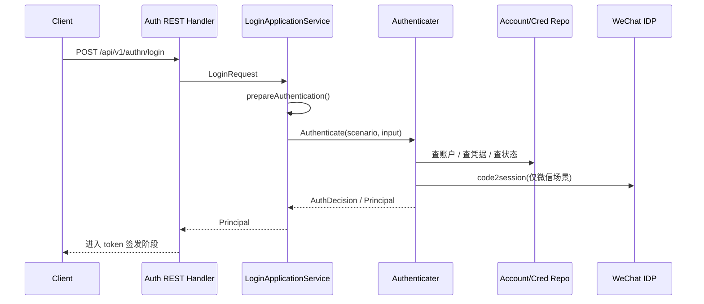
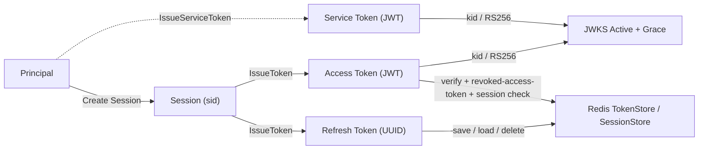
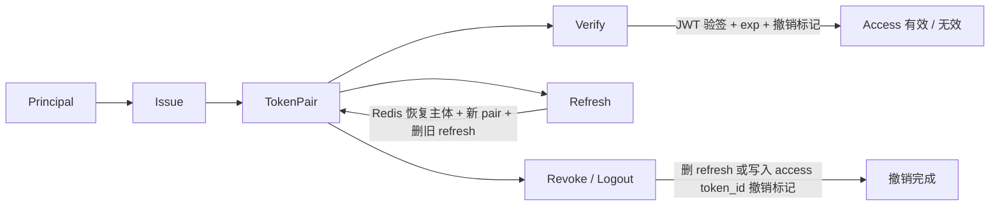
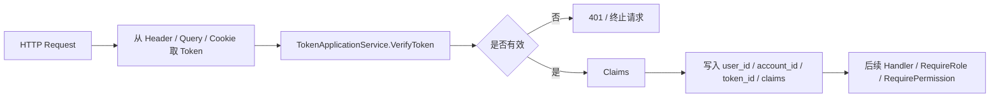
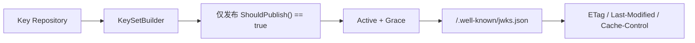

# 认证链路：从登录请求到 Token 与 JWKS

## 本文回答

本文只回答 4 件事：

1. 认证：登录请求如何变成 `Principal`
2. Token 设计与生命周期：`Principal` 如何变成可消费凭证
3. JWT 中间件：Token 如何进入运行时请求链
4. JWKS 与启动：公钥如何发布、初始化和轮换

**与业务域正文的分工**：相对 [../02-业务域/01-authn-认证&Token&JWKS.md](../02-业务域/01-authn-认证&Token&JWKS.md)，业务域文档讲 **模块边界、静态对象、配置键、主要锚点**；本篇讲 **端到端时序、Token 生命周期、JWT 运行时消费、JWKS 发布与轮换**。

## 30 秒结论

> **一句话**：`iam-contracts` 用统一登录 REST 把请求经 **应用编排 → `Authenticater`（多证认证策略）→ `Principal`**，再由 **`SessionManager + TokenIssuer`** 产出带 `sid` 的 **Access JWT / Refresh Token / Service Token**；资源方可以用 **`/.well-known/jwks.json`** 做本地验签，但只有 **在线 `VerifyToken`** 才能同时看到 `revoked_access_token`、`session` 和 `user/account` 当前状态，JWKS 则在启动时初始化并由轮换调度器维持长期可用。

| 主题 | 当前答案 |
| ---- | ---- |
| 认证 | `POST /api/v1/authn/login` 统一入口，应用层做输入准备，领域层做认证判决 |
| Token | Access：JWT + `kid` + `RS256` + `sid`；Refresh：UUID + Redis + `sid` + 轮换删旧；Service：JWT，用于服务间调用 |
| Session | 登录后先创建 `Session(sid)`，session revoke 与 subject access state 会进入 Verify / Refresh 主链 |
| JWT 中间件 | 从 header/query/cookie 取 token，调用权威 `VerifyToken`，成功后写入 `user_id` / `account_id` / `token_id` |
| JWKS | 发布 `Active + Grace` 公钥，带缓存头；启动时可自动初始化 active key，并每日轮换检查 |

## 重点速查

| 关注点 | 当前答案 | 真实落点 |
| ---- | ---- | ---- |
| 登录 REST 入口 | `POST /api/v1/authn/login`，统一 `method + credentials` | [../../api/rest/authn.v1.yaml](../../api/rest/authn.v1.yaml)、[../../internal/apiserver/interface/authn/restful/handler/auth.go](../../internal/apiserver/interface/authn/restful/handler/auth.go) |
| 认证编排入口 | `LoginApplicationService.Login` | [../../internal/apiserver/application/authn/login/services_impl.go](../../internal/apiserver/application/authn/login/services_impl.go) |
| 认证判决中心 | `Authenticater.Authenticate` + 多证认证策略 | [../../internal/apiserver/domain/authn/authentication/authenticater.go](../../internal/apiserver/domain/authn/authentication/authenticater.go) |
| Access / Refresh 签发 | `TokenIssuer` + JWT Generator + Redis TokenStore | [../../internal/apiserver/domain/authn/token/issuer.go](../../internal/apiserver/domain/authn/token/issuer.go)、[../../internal/apiserver/infra/jwt/generator.go](../../internal/apiserver/infra/jwt/generator.go)、[../../internal/apiserver/infra/redis/token-store.go](../../internal/apiserver/infra/redis/token-store.go) |
| Service Token | gRPC `IssueServiceToken` 已接应用层，标准 assembler 路径下可用 | [../../api/grpc/iam/authn/v1/authn.proto](../../api/grpc/iam/authn/v1/authn.proto)、[../../internal/apiserver/interface/authn/grpc/service.go](../../internal/apiserver/interface/authn/grpc/service.go)、[../../internal/apiserver/container/assembler/authn.go](../../internal/apiserver/container/assembler/authn.go) |
| Verify / Refresh / Revoke | Verify：验签 + 过期 + access revoke + session + subject access；Refresh：Redis 恢复主体 + 校验 session/subject + 新 pair + 删旧 refresh；Revoke：refresh 删除或 access 写入撤销标记，并联动 session revoke | [../../internal/apiserver/domain/authn/token/verifyer.go](../../internal/apiserver/domain/authn/token/verifyer.go)、[../../internal/apiserver/domain/authn/token/refresher.go](../../internal/apiserver/domain/authn/token/refresher.go)、[../../internal/apiserver/domain/authn/token/issuer.go](../../internal/apiserver/domain/authn/token/issuer.go) |
| JWT 中间件 | 消费 `VerifyToken`，写入身份上下文，可选再叠加 authz 判定 | [../../internal/pkg/middleware/authn/jwt_middleware.go](../../internal/pkg/middleware/authn/jwt_middleware.go) |
| JWKS 发布与轮换 | 发布 `/.well-known/jwks.json`；启动时可自动建初始 key；每日凌晨 2 点轮换检查 | [../../internal/apiserver/application/authn/jwks/key_publish.go](../../internal/apiserver/application/authn/jwks/key_publish.go)、[../../internal/apiserver/domain/authn/jwks/keyset_builder.go](../../internal/apiserver/domain/authn/jwks/keyset_builder.go)、[../../internal/apiserver/container/assembler/authn.go](../../internal/apiserver/container/assembler/authn.go)、[../../internal/apiserver/server.go](../../internal/apiserver/server.go) |

## 1. 认证：登录请求如何变成 `Principal`

这一部分只回答“认证”本身，不提前展开 token 生命周期。

### 1.1 入口与契约：登录

| 项 | 内容 |
| ---- | ---- |
| 路径 | `POST /api/v1/authn/login` |
| 请求形状 | `method + credentials` |
| 当前公开方法 | `password`、`phone_otp`、`wechat`、`wecom` |
| 主要职责 | handler 解析请求，application 编排，domain 判决 |

示例：

```json
{
  "method": "password",
  "credentials": {
    "username": "alice",
    "password": "secret"
  }
}
```

**边界**：`application/authn/login` 虽保留 `jwt_token` 类型，但 REST `LoginRequest.Validate()` 不接受该方法；它更像内部验证链预留，不是当前公开登录入口。

### 1.2 登录工程流程图

这张图先回答“登录请求如何走到认证结论”，不讨论 Verify/Refresh/JWKS。



**图意**：认证链的产物不是 token，而是 `AuthDecision + Principal`。token 生命周期是认证之后的下一段链路。

### 1.3 应用编排：`LoginApplicationService`

| 层 | 职责 |
| ---- | ---- |
| [handler/auth.go](../../internal/apiserver/interface/authn/restful/handler/auth.go) | 解析 `method` / `credentials`，映射为应用层 `LoginRequest` |
| [services_impl.go](../../internal/apiserver/application/authn/login/services_impl.go) | `prepareAuthentication()` → `AuthInput` → `Authenticater.Authenticate()` → 成功后交给 `tokenIssuer.IssueToken()` |

`prepareAuthentication()` 当前主要做两类事：

| 工作 | 当前实现 |
| ---- | ---- |
| 识别认证场景 | 根据请求字段推断 `password / phone_otp / oauth_wx_minip / oauth_wecom / jwt_token` |
| 做场景前置准备 | 例如微信登录时查 `WechatApp`、校验启用状态、从 `SecretVault` 解密 `AppSecret` |

**结论**：application 层负责输入准备和编排，不直接做“密码对不对”“微信 code 是否能换 session”这类认证判决。

### 1.4 领域设计：认证中心 + 多证认证策略

#### 认证判决中心：`Authenticater`

文件：[authenticater.go](../../internal/apiserver/domain/authn/authentication/authenticater.go)

| 步骤 | 内容 |
| ---- | ---- |
| 1 | 按场景构造领域凭据 |
| 2 | 创建对应认证策略 |
| 3 | 执行策略，产出 `AuthDecision` |

领域层输出：

| 输出 | 含义 |
| ---- | ---- |
| `OK / ErrCode` | 认证是否通过 |
| `Principal` | 认证成功后的主体 |
| `CredentialID` | 凭据标识 |
| `ShouldRotate / NewMaterial` | 是否需要轮换凭据 |

**结论**：认证中心负责把“输入凭据”判成“主体”，不负责给主体发 token。

#### 多证认证策略

| 策略 | 当前实现 | 主要锚点 |
| ---- | ---- | ---- |
| 密码认证 | 用户名查账户 → 查密码凭据 → `PasswordHasher + pepper` 校验 → 可选 rehash | [auth-password.go](../../internal/apiserver/domain/authn/authentication/auth-password.go) |
| 微信小程序认证 | `js_code` → IDP → `openid/unionid` → 查 OAuth 绑定 → 校验账户状态 | [auth-wechat-mini.go](../../internal/apiserver/domain/authn/authentication/auth-wechat-mini.go) |

密码认证重点：

| 步骤 | 内容 |
| ---- | ---- |
| 1–2 | 按用户名查账户；查禁用 / 锁定 |
| 3–4 | 查密码凭据；校验密码 |
| 5–6 | 需算法升级则标记 `ShouldRotate`；构造 `Principal` |

微信小程序认证重点：

| 步骤 | 内容 |
| ---- | ---- |
| 1 | `AppID + AppSecret + JSCode` 调 IDP |
| 2 | 优先 `unionID`，否则 `openID`，查 OAuth 绑定 |
| 3–4 | 校验账户状态；构造 `Principal` |

**边界**：微信登录依赖已有 OAuth 绑定；无绑定时是 `ErrNoBinding`，不能讲成“自动注册后登录”。

## 2. Token 设计与生命周期：`Principal` 如何变成可消费凭证

这一部分回答认证成功之后，系统如何把 `Principal` 变成可验证、可轮换、可撤销的凭证集。

### 2.1 Token 设计：Access / Refresh / Service

这张图不讲时序，只讲三类 token 和 `Principal`、JWKS、Redis 的关系。



| 类型 | 形态 | 作用 | 校验 / 存储 |
| ---- | ---- | ---- | ---- |
| Access Token | JWT | 面向资源访问 | `kid` 找公钥验签 + 过期 + 撤销标记 |
| Session | Redis JSON + `sid` | 这次登录的运行时锚点 | 请求校验、刷新、管理员踢会话 |
| Refresh Token | UUID | 换新 token pair | Redis 持久化，刷新时恢复主体并删旧，并绑定 `sid` |
| Service Token | JWT | 服务间调用 | 与 Access 同样由 JWT + JWKS 体系承载 |

### 2.2 Issue：签发

#### 登录签发：`SessionManager.Create + TokenIssuer.IssueToken`

文件：[issuer.go](../../internal/apiserver/domain/authn/token/issuer.go)

| 步骤 | 内容 |
| ---- | ---- |
| 1 | 先创建 `Session(sid)` |
| 2 | `GenerateAccessToken(principal, accessTTL)`，claims 带 `sid` |
| 3 | 生成 refresh UUID，记录里也带 `sid` |
| 4 | `SaveRefreshToken` 到 Redis |
| 5 | 返回 `TokenPair` |

`GenerateAccessToken` 的关键点：

| 项 | 内容 |
| ---- | ---- |
| 密钥来源 | `jwks.Manager` 的当前 `Active key` |
| 算法 | `RS256` |
| Header | 含 `kid` |
| Claims 最少包含 | `sub`、`iss`、`iat`、`exp`、`nbf`、`user_id`、`account_id`、`token_id/jti`、`sid` |

#### 服务间签发：`IssueServiceToken`

文件：[services_impl.go](../../internal/apiserver/application/authn/token/services_impl.go)、[service.go](../../internal/apiserver/interface/authn/grpc/service.go)

| 项 | 内容 |
| ---- | ---- |
| 入口 | gRPC `IssueServiceToken` |
| 当前实现 | 标准 assembler 路径下 `TokenService` 已注入，可调用应用层签发 |
| 签发结果 | `TokenPair` 中主要消费 Access 侧 JWT；Refresh 为空 |

**边界**：gRPC 服务里仍保留“`token service not configured` → `Unimplemented`”的防御分支，但那不是标准运行路径。

### 2.3 Token 生命周期流程图



### 2.4 Verify：验签 + 过期 + access revoke + session + subject access

文件：[verifyer.go](../../internal/apiserver/domain/authn/token/verifyer.go)

| 步骤 | 内容 |
| ---- | ---- |
| 1 | 解析 JWT，按 `kid` 从 `jwks.Manager` 找公钥验签 |
| 2 | 检查 `exp` |
| 3 | 检查 Redis `revoked_access_token(jti)` |
| 4 | 检查 Redis `session(sid)` 是否仍为 `active` |
| 5 | 检查 `user/account` 当前访问状态 |

全部通过，才得到有效 `TokenClaims`。

### 2.5 Refresh：Redis 恢复主体 + session/subject 校验 + 新 pair + 删旧 refresh

文件：[refresher.go](../../internal/apiserver/domain/authn/token/refresher.go)

| 步骤 | 内容 |
| ---- | ---- |
| 1 | 以 refresh 值从 Redis 加载记录 |
| 2 | 检查是否过期 |
| 3 | 检查 `session(sid)` 是否仍为 `active` |
| 4 | 检查 `user/account` 当前访问状态 |
| 5 | 签发新 token pair |
| 6 | 删除旧 refresh |
| 7 | 延长同一 `session` 的 `expires_at` |

**结论**：refresh 是**轮换式**，不是无限复用同一个 refresh token。

### 2.6 Revoke / Logout：撤销与会话失效

| 条件 | 行为 |
| ---- | ---- |
| 提供 refresh | 删除 refresh 记录，并联动 revoke `sid` |
| 提供 access | 解析 access，按 `token_id` 写入 Redis 撤销标记直到过期，并联动 revoke `sid` |

**结论**：当前支持按 refresh 撤销，也支持按 access token 精准撤销，而且二者都会把“这次登录”的 session 一起拉掉。

## 3. JWT 中间件：Token 如何进入运行时请求链

这一部分不再重讲 Verify 的算法细节，而只讲“Verify 能力如何在 HTTP 运行时里被消费”。

### 3.1 中间件运行图



### 3.2 中间件位置与输入

文件：[jwt_middleware.go](../../internal/pkg/middleware/authn/jwt_middleware.go)

| 项 | 内容 |
| ---- | ---- |
| 入口方法 | `AuthRequired()`、`AuthOptional()` |
| Token 来源 | `Authorization` header、query、cookie |
| 核心依赖 | `TokenApplicationService.VerifyToken()` |

### 3.3 成功后写入什么

认证成功后，中间件会把这些信息写入请求上下文：

| 上下文项 | 含义 |
| ---- | ---- |
| `user_id` | 当前用户 ID |
| `account_id` | 当前账户 ID |
| `token_id` | 当前 token 的唯一标识 |
| `claims` | 完整 token claims 对象 |
| `session_id` | 当前没有写入 `gin.Context`；session 语义由在线 verify 链内部消费 |

### 3.4 与授权中间件的关系

| 能力 | 当前关系 |
| ---- | ---- |
| `AuthRequired` | 只做 JWT 校验与身份注入 |
| `RequireRole / RequirePermission` | 依赖可选注入的 authz Casbin 端口 |
| casbin 未注入时 | 返回“Authorization engine not configured” |

**结论**：JWT 中间件不是认证中心，它是 `VerifyToken` 在 HTTP 运行时里的消费面；角色 / 权限判定是在它之后可选叠加的能力。

## 4. JWKS 与启动：公钥如何发布、初始化和轮换

这一部分回答“资源方凭什么能验签”和“这套公钥机制如何持续可运行”。

### 4.1 JWKS 发布

文件：[key_publish.go](../../internal/apiserver/application/authn/jwks/key_publish.go)、[keyset_builder.go](../../internal/apiserver/domain/authn/jwks/keyset_builder.go)

#### 发布设计图



| 步骤 | 内容 |
| ---- | ---- |
| 1 | 查出可发布 key |
| 2 | 过滤 `ShouldPublish() == true` |
| 3 | 按 `kid` 排序 |
| 4 | 返回 JWKS JSON |
| 5 | 生成 `ETag`、`Last-Modified`、`Cache-Control` |

发布语义：

| 状态 | 含义 |
| ---- | ---- |
| `Active` | 发布；可签名、可验签 |
| `Grace` | 发布；不再签名，仍可验签 |
| `Retired` | 不发布 |

### 4.2 JWKS 启动与轮换

文件：[assembler/authn.go](../../internal/apiserver/container/assembler/authn.go)、[server.go](../../internal/apiserver/server.go)、[key_rotation_cron_scheduler.go](../../internal/apiserver/infra/scheduler/key_rotation_cron_scheduler.go)

| 项 | 内容 |
| ---- | ---- |
| 组装内容 | `KeyManager`、`KeySetBuilder`、`KeyRotation`、JWT Generator、JWKS 应用服务、`RotationScheduler` |
| 自动初始化 | 开发模式或显式开启 `jwks.auto_init` 时，无 active key 可自动创建 `RS256` active key |
| 默认轮换参数 | `RotationInterval=30d`、`GracePeriod=7d`、`MaxKeysInJWKS=3` |
| 调度 | assembler 内 cron 默认 `0 2 * * *`，即每日凌晨 2 点检查 |

**结论**：JWKS 解决的是“签发端与验签端如何解耦”，轮换调度器解决的是“这套公钥机制如何长期可运行”。

## 5. 在线权威校验 vs 离线 JWKS 本地验签

### 5.1 当前必须明确的边界

如果调用方只做：

- JWKS 拉公钥
- 本地 JWT 验签
- `exp / nbf` 时间检查

那它**看不到**：

- `revoked_access_token`
- `session revoke`
- `user blocked`
- `account disabled`

这不是实现缺陷，而是离线验签模型的边界。

### 5.2 当前推荐口径

| 场景 | 当前建议 |
| ---- | ---- |
| 高频、低一致性成本的请求校验 | 可以优先本地 JWKS 验签 |
| 要求踢会话、封禁账号/用户即时生效 | 必须走 IAM 在线 `VerifyToken` |

## 6. 保证与风险边界

这一节只回答两件事：哪些可以对外断言，哪些仍是当前边界。

| 主题 | 状态 | 当前可断言 / 当前边界 | 证据 |
| ---- | ---- | ---- | ---- |
| 登录主入口 | 已实现 | 统一 REST 入口同步完成认证与签 token | [handler/auth.go](../../internal/apiserver/interface/authn/restful/handler/auth.go) |
| 多证认证策略 | 已实现 | `password / phone_otp / wechat / wecom / jwt_token（内部等）` 通过 `Authenticater` 统一判决 | [authenticater.go](../../internal/apiserver/domain/authn/authentication/authenticater.go) |
| Access Token | 已实现 | 使用当前 `Active` JWKS key + `RS256` | [generator.go](../../internal/apiserver/infra/jwt/generator.go) |
| Access 精准撤销 | 已实现 | `token_id/jti` 为 UUID，撤销标记按单 token 记录 | [generator.go](../../internal/apiserver/infra/jwt/generator.go)、[token-store.go](../../internal/apiserver/infra/redis/token-store.go) |
| Refresh Token | 已实现 | UUID + Redis + 轮换删旧 | [refresher.go](../../internal/apiserver/domain/authn/token/refresher.go) |
| Service Token | 已实现 | gRPC 已接应用层，标准 assembler 路径下可签发 | [service.go](../../internal/apiserver/interface/authn/grpc/service.go)、[authn.go](../../internal/apiserver/container/assembler/authn.go) |
| Token Verify | 已实现 | 验签 + 过期 + 撤销标记 | [verifyer.go](../../internal/apiserver/domain/authn/token/verifyer.go) |
| Session 语义 | 已实现 | 登录先创建 session；Verify / Refresh 会检查 `sid` | [../../internal/apiserver/domain/authn/session](../../internal/apiserver/domain/authn/session)、[verifyer.go](../../internal/apiserver/domain/authn/token/verifyer.go)、[refresher.go](../../internal/apiserver/domain/authn/token/refresher.go) |
| JWT 中间件 | 已实现 | 能消费 `VerifyToken` 并写入身份上下文 | [jwt_middleware.go](../../internal/pkg/middleware/authn/jwt_middleware.go) |
| JWKS 发布 | 已实现 | 发布 `Active + Grace`；返回缓存标签 | [keyset_builder.go](../../internal/apiserver/domain/authn/jwks/keyset_builder.go)、[handler/jwks.go](../../internal/apiserver/interface/authn/restful/handler/jwks.go) |
| 轮换调度器 | 已实现 | 启动后每日一次轮换检查 | [server.go](../../internal/apiserver/server.go)、[key_rotation_cron_scheduler.go](../../internal/apiserver/infra/scheduler/key_rotation_cron_scheduler.go) |
| `issuer` / TTL | 待补证据 | assembler 会读 `auth.jwt_issuer`、`auth.access_token_ttl`、`auth.refresh_token_ttl`，但示例 `apiserver.*.yaml` 未配这些键，因此常回落为空 issuer + `15m/7d` 默认 | [authn.go](../../internal/apiserver/container/assembler/authn.go)、[apiserver.dev.yaml](../../configs/apiserver.dev.yaml)、[apiserver.prod.yaml](../../configs/apiserver.prod.yaml) |
| Verify 返回 claims | 待补证据 | REST / gRPC 合同字段较全，但当前实现仅回填部分 claims | [response/auth.go](../../internal/apiserver/interface/authn/restful/response/auth.go)、[service.go](../../internal/apiserver/interface/authn/grpc/service.go)、[authn.proto](../../api/grpc/iam/authn/v1/authn.proto) |
| JWKS 管理端保护 | 已实现 | `/api/v1/authn/admin/jwks/*` 需要 `JWT + admin role`；管理员鉴权不可用时 fail-closed 不注册 | [router.go](../../internal/apiserver/interface/authn/restful/router.go)、[routers.go](../../internal/apiserver/routers.go) |
| 在线权威校验 | 已实现 | 在线 `VerifyToken` 现在能同时拒绝单 token revoke、session revoke、user/account 状态失效 | [verifyer.go](../../internal/apiserver/domain/authn/token/verifyer.go) |
| 离线 JWKS 最终一致边界 | 已实现但需明确口径 | 离线 JWKS 只能保证签名与过期，不保证 revoke/session/subject 状态即时生效 | [../../pkg/sdk/docs/04-jwt-verification.md](../../pkg/sdk/docs/04-jwt-verification.md)、[verifyer.go](../../internal/apiserver/domain/authn/token/verifyer.go) |
| 轮换策略配置化 | 规划改造 | 轮换参数与 cron 仍主要来自代码默认值，而非完整 YAML 配置化 | [vo.go](../../internal/apiserver/domain/authn/jwks/vo.go)、[authn.go](../../internal/apiserver/container/assembler/authn.go) |

## 继续往下读

| 文档 | 说明 |
| ---- | ---- |
| [README.md](./README.md) | 专题分析入口 |
| [../02-业务域/01-authn-认证&Token&JWKS.md](../02-业务域/01-authn-认证&Token&JWKS.md) | 认证域静态结构、边界与配置 |
| [./02-IAM认证语义拆层--用户状态、会话与Token边界.md](./02-IAM认证语义拆层--用户状态、会话与Token边界.md) | 为什么现在必须区分 subject、session、access token revoke、refresh token |
| [../03-接口与集成/01-REST契约与接入.md](../03-接口与集成/01-REST契约与接入.md) | REST 契约、路由与验证链 |
| [../03-接口与集成/02-gRPC契约与接入.md](../03-接口与集成/02-gRPC契约与接入.md) | gRPC 合同、Verify / Refresh / JWKS Service |
| [../01-运行时/03-HTTP认证中间件与身份上下文.md](../01-运行时/03-HTTP认证中间件与身份上下文.md) | JWT 中间件、上下文与路由保护 |
| [../01-运行时/02-gRPC与mTLS.md](../01-运行时/02-gRPC与mTLS.md) | gRPC / mTLS 运行时边界 |

## 如何验证本文结论（本地）

在仓库根目录执行。需要 `rg`；若无可用 `grep -R -n` 替代。

| 目的 | 命令 |
| ---- | ---- |
| 登录路由 | `rg -n 'POST\\(\"/login\"' internal/apiserver/interface/authn/restful/router.go` |
| 登录编排 | `rg -n 'prepareAuthentication|Authenticate' internal/apiserver/application/authn/login/services_impl.go` |
| Service Token | `rg -n 'IssueServiceToken|token service not configured' internal/apiserver/interface/authn/grpc/service.go` |
| JWT 与 token_id | `rg -n 'GenerateAccessToken|GenerateServiceToken|tokenID|jti' internal/apiserver/infra/jwt/generator.go` |
| Refresh 存储与删除 | `rg -n 'SaveRefreshToken|DeleteRefreshToken' internal/apiserver/domain/authn/token internal/apiserver/infra/redis/token-store.go` |
| 撤销标记 | `rg -n 'MarkAccessTokenRevoked|IsAccessTokenRevoked' internal/apiserver/domain/authn/token internal/apiserver/infra/redis/token-store.go` |
| JWKS 发布 | `rg -n '/\\.well-known/jwks.json|ETag|Last-Modified|Cache-Control' internal/apiserver/interface/authn/restful/handler/jwks.go internal/apiserver/application/authn/jwks` |
| 轮换调度 | `rg -n 'RotationScheduler|0 2 \\* \\* \\*|key_rotation' internal/apiserver/server.go internal/apiserver/container/assembler/authn.go internal/apiserver/infra/scheduler` |

**读结果提示**：
- `IssueServiceToken` 应能下钻到应用层，而不只是固定 `Unimplemented`
- `generator.go` 中 `tokenID/jti` 应为 UUID
- `authn.go` 中 access / refresh TTL 默认值应仍与文中 `15m / 7d` 描述一致
