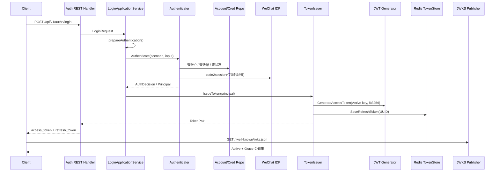

# 认证链路：从登录请求到 Token 与 JWKS

本文回答：`iam-contracts` 当前是如何把一次登录请求走到认证判决、再走到 Access Token / Refresh Token / JWKS 的，以及这条链路今天已经保证了什么、还不能讲成什么。

**与业务域正文的分工**：相对 [../02-业务域/01-authn-认证、Token、JWKS.md](../02-业务域/01-authn-认证、Token、JWKS.md)——业务域给**模块边界、配置键、静态锚点**；本篇补**端到端时序**、Verify/Refresh/Logout/JWKS **后半段**，以及 **「已证明 / 不能讲过头」** 风险表（合同与实现对齐以代码为准）。

## 30 秒结论

- 当前登录主入口是 `POST /api/v1/authn/login`，它先把 REST 请求映射成统一的 `LoginRequest`，再进入 `LoginApplicationService -> Authenticater -> 策略认证 -> TokenIssuer` 这条同步链路。
- 认证成功后，访问令牌由当前 `JWKS Active key` 以 `RS256` 签名生成，刷新令牌则是 UUID 并落在 Redis；两者一起返回给调用方。
- 令牌验证链当前是“JWT 解析与验签 + 过期检查 + Redis 黑名单检查”；刷新链则是“按 refresh token 从 Redis 恢复主体，再签发新 token pair，并删除旧 refresh token”。
- `/.well-known/jwks.json` 当前会发布 `Active + Grace` 且未过期的公钥，并带 `ETag / Last-Modified / Cache-Control`；服务启动时还会尝试自动初始化活跃 key，并启动每日一次的轮换检查。
- 当前不能讲过头的地方有 4 个：`auth.jwt_issuer` / TTL 配置键在现有 YAML 中缺失、access token 的 `jti` 目前固定为 `"0"`、REST / gRPC 的 `VerifyToken` 返回的 claims 不完整、JWKS 管理端路由在 router 层没有统一挂认证中间件。

## 重点速查

| 关注点 | 当前答案 | 真实落点 |
| ---- | ---- | ---- |
| 登录 REST 入口 | `POST /api/v1/authn/login`，`method + credentials` 统一入参 | [../../api/rest/authn.v1.yaml](../../api/rest/authn.v1.yaml)、[../../internal/apiserver/interface/authn/restful/handler/auth.go](../../internal/apiserver/interface/authn/restful/handler/auth.go) |
| 登录编排入口 | `LoginApplicationService.Login` | [../../internal/apiserver/application/authn/login/services_impl.go](../../internal/apiserver/application/authn/login/services_impl.go) |
| 认证判决中心 | `Authenticater.Authenticate` + 场景策略 | [../../internal/apiserver/domain/authn/authentication/authenticater.go](../../internal/apiserver/domain/authn/authentication/authenticater.go) |
| 密码认证 | 用户名查账户、查凭据、校验密码、可选 rehash | [../../internal/apiserver/domain/authn/authentication/auth-password.go](../../internal/apiserver/domain/authn/authentication/auth-password.go) |
| 微信小程序认证 | `js_code` 换 `openid/unionid`，按 OAuth 凭据绑定查账户 | [../../internal/apiserver/domain/authn/authentication/auth-wechat-mini.go](../../internal/apiserver/domain/authn/authentication/auth-wechat-mini.go) |
| Access Token 签发 | 当前 `Active key` + `RS256` + JWT | [../../internal/apiserver/domain/authn/token/issuer.go](../../internal/apiserver/domain/authn/token/issuer.go)、[../../internal/apiserver/infra/jwt/generator.go](../../internal/apiserver/infra/jwt/generator.go) |
| Refresh Token | UUID，保存在 Redis | [../../internal/apiserver/domain/authn/token/issuer.go](../../internal/apiserver/domain/authn/token/issuer.go)、[../../internal/apiserver/infra/redis/token-store.go](../../internal/apiserver/infra/redis/token-store.go) |
| Verify / Refresh | Verify 走验签+过期+黑名单；Refresh 走 Redis + 轮换 | [../../internal/apiserver/domain/authn/token/verifyer.go](../../internal/apiserver/domain/authn/token/verifyer.go)、[../../internal/apiserver/domain/authn/token/refresher.go](../../internal/apiserver/domain/authn/token/refresher.go) |
| JWT 中间件 | 消费 `VerifyToken` 并把 `user_id/account_id/token_id` 放进上下文 | [../../internal/pkg/middleware/authn/jwt_middleware.go](../../internal/pkg/middleware/authn/jwt_middleware.go) |
| JWKS 发布 | 发布 `Active + Grace` 的公钥，带缓存标签 | [../../internal/apiserver/application/authn/jwks/key_publish.go](../../internal/apiserver/application/authn/jwks/key_publish.go)、[../../internal/apiserver/domain/authn/jwks/keyset_builder.go](../../internal/apiserver/domain/authn/jwks/keyset_builder.go) |
| 启动与轮换 | 自动建初始 key，启动每日 2 点轮换检查 | [../../internal/apiserver/container/assembler/authn.go](../../internal/apiserver/container/assembler/authn.go)、[../../internal/apiserver/server.go](../../internal/apiserver/server.go) |

## 1. 主链路总览



这张图只回答一件事：认证链不是“登录成功返回 JWT”这么简单，而是 `REST -> 应用编排 -> 领域认证 -> Token 生命周期 -> JWKS 发布` 这一条跨层同步链。

## 2. 从登录请求到认证判决

### 2.1 当前 REST 登录形状

当前 REST 登录请求不是多条分裂接口，而是统一入口：

- 路径：`POST /api/v1/authn/login`
- 请求体：`method + credentials`

示例：

```json
{
  "method": "password",
  "credentials": {
    "username": "alice",
    "password": "secret"
  }
}
```

对应请求 DTO 在 [../../internal/apiserver/interface/authn/restful/request/auth.go](../../internal/apiserver/interface/authn/restful/request/auth.go)。

当前 `method` 允许值：

- `password`
- `phone_otp`
- `wechat`
- `wecom`

注意：

- `application/authn/login` 里虽然保留了 `jwt_token` 认证类型，但当前 REST `LoginRequest.Validate()` 并不接受这个方法；它更多是给内部验证链适配预留的场景，而不是当前公开登录入口。

### 2.2 Handler 和应用层的分工

[../../internal/apiserver/interface/authn/restful/handler/auth.go](../../internal/apiserver/interface/authn/restful/handler/auth.go) 负责两件事：

1. 解析 `method` 与 `credentials`
2. 按 method 映射成统一的 `application/authn/login.LoginRequest`

真正的编排入口是 [../../internal/apiserver/application/authn/login/services_impl.go](../../internal/apiserver/application/authn/login/services_impl.go)：

- `prepareAuthentication()` 负责把 REST DTO 映射成统一 `AuthInput`
- 然后调用 `Authenticater.Authenticate(...)`
- 认证成功后再调用 `tokenIssuer.IssueToken(...)`

这里的关键边界是：

- handler 不负责真正的认证判定
- 应用层不自己比密码、不自己调微信，它只做“准备输入 + 协调调用”

### 2.3 `prepareAuthentication()` 先做什么

`prepareAuthentication()` 当前已经做了两类重要工作：

| 工作 | 当前实现 |
| ---- | ---- |
| 认证场景识别 | 通过请求里出现的字段推断 `password / phone_otp / oauth_wx_minip / oauth_wecom / jwt_token` |
| 微信前置准备 | 查询 `WechatApp` 配置，校验是否启用，并从 `SecretVault` 解密 `AppSecret` 后再下发给领域层 |

这意味着：

- 微信登录不是在领域层里再去查 `AppSecret`
- 领域层拿到的是已经准备好的 `WxAppID / WxAppSecret / WxJsCode`

## 3. 领域层如何做认证

### 3.1 `Authenticater` 是主判决入口

[../../internal/apiserver/domain/authn/authentication/authenticater.go](../../internal/apiserver/domain/authn/authentication/authenticater.go) 当前统一了领域认证流程：

1. 按场景构造领域凭据
2. 创建对应认证策略
3. 执行策略并返回 `AuthDecision`

领域输出不是直接返回 token，而是返回：

- `OK / ErrCode`
- `Principal`
- `CredentialID`
- `ShouldRotate / NewMaterial`

所以真正“是否通过认证”的核心判决在领域层，不在 interface，也不在 token 层。

### 3.2 密码认证当前怎么走

[../../internal/apiserver/domain/authn/authentication/auth-password.go](../../internal/apiserver/domain/authn/authentication/auth-password.go) 当前的密码链路是：

1. 按用户名查账户
2. 查账户状态：是否禁用 / 锁定
3. 查密码凭据
4. 用 `PasswordHasher + pepper` 验证密码
5. 如果参数需要升级，则标记 `ShouldRotate`
6. 构造 `Principal`

这里已经明确区分了两类失败：

- 业务失败：`ErrInvalidCredential / ErrDisabled / ErrLocked`
- 系统异常：仓储或依赖错误，直接返回 `error`

### 3.3 微信小程序认证当前怎么走

[../../internal/apiserver/domain/authn/authentication/auth-wechat-mini.go](../../internal/apiserver/domain/authn/authentication/auth-wechat-mini.go) 当前微信链路是：

1. 用 `AppID + AppSecret + JSCode` 调用 IDP 换取 `openID / unionID`
2. 优先用 `unionID`，否则回退 `openID`，查 OAuth 凭据绑定
3. 查到账户后再校验账户状态
4. 构造 `Principal`

这意味着：

- 当前微信登录仍依赖“已有 OAuth 绑定”
- 如果没有绑定，会返回 `ErrNoBinding`
- 文档不能把它讲成“自动建账户并登录”，那是注册链或别的业务链，不是当前认证链本身

## 4. 从 `Principal` 到 TokenPair

### 4.1 访问令牌当前怎么签发

[../../internal/apiserver/domain/authn/token/issuer.go](../../internal/apiserver/domain/authn/token/issuer.go) 在收到 `Principal` 后会：

1. 调 `tokenGenerator.GenerateAccessToken(...)`
2. 生成一个 refresh token UUID
3. 把 refresh token 保存到 Redis
4. 返回 `TokenPair`

[../../internal/apiserver/infra/jwt/generator.go](../../internal/apiserver/infra/jwt/generator.go) 当前会：

- 向 `jwks.Manager` 获取 `Active key`
- 解析对应私钥
- 使用 `RS256` 对 JWT 签名
- 在 header 中写入 `kid`

当前 access token claims 至少包含：

- `sub`
- `iss`
- `iat`
- `exp`
- `nbf`
- `user_id`
- `account_id`

### 4.2 Refresh Token 当前怎么落库

refresh token 当前不是 JWT，而是 UUID 值对象：

- 由 `uuid.New().String()` 生成
- 带 `user_id / account_id / expires_at`
- 通过 `TokenStore.SaveRefreshToken(...)` 落到 Redis

这条设计使得：

- access token 更适合被业务服务本地验签
- refresh token 更适合被 IAM 中心控制生命周期

### 4.3 当前响应面

REST 登录响应当前主要返回：

- `access_token`
- `token_type`
- `expires_in`
- `refresh_token`

对应转换在 [../../internal/apiserver/interface/authn/restful/handler/auth.go](../../internal/apiserver/interface/authn/restful/handler/auth.go)。

## 5. Verify / Refresh / Logout 的后半段

### 5.1 Verify 当前怎么做

[../../internal/apiserver/domain/authn/token/verifyer.go](../../internal/apiserver/domain/authn/token/verifyer.go) 当前的验证链是：

1. 解析 JWT，并根据 `kid` 从 `jwks.Manager` 找公钥验签
2. 检查 `exp`
3. 检查 Redis 黑名单

只有这三步都通过，才会返回有效 `TokenClaims`。

### 5.2 JWT 中间件当前如何消费验证结果

[../../internal/pkg/middleware/authn/jwt_middleware.go](../../internal/pkg/middleware/authn/jwt_middleware.go) 当前会：

- 从 `Authorization` header、query、cookie 提 token
- 调 `TokenApplicationService.VerifyToken`
- 把 `user_id / account_id / token_id` 放进 `gin.Context`

这也是为什么 `identity` 和 `suggest` 这些路由组可以基于统一 JWT 中间件做保护。

### 5.3 Refresh 当前怎么做

[../../internal/apiserver/domain/authn/token/refresher.go](../../internal/apiserver/domain/authn/token/refresher.go) 当前 refresh 链路是：

1. 用 refresh token 值从 Redis 加载记录
2. 检查是否过期
3. 从 refresh token 恢复出 `Principal`
4. 重新签发新的 token pair
5. 删除旧 refresh token

这意味着当前 refresh token 是“轮换式”的，而不是无限复用。

### 5.4 Logout 当前怎么做

`Logout` 当前的行为是：

- 如果提供 refresh token，优先删 refresh token
- 否则解析 access token，并把 `token_id` 写入 Redis 黑名单直到过期

这条链路当前是有实现的，但撤销粒度存在下面会提到的关键风险。

## 6. JWKS 发布与轮换

### 6.1 当前如何发布 `/.well-known/jwks.json`

[../../internal/apiserver/application/authn/jwks/key_publish.go](../../internal/apiserver/application/authn/jwks/key_publish.go) 和 [../../internal/apiserver/domain/authn/jwks/keyset_builder.go](../../internal/apiserver/domain/authn/jwks/keyset_builder.go) 当前会：

1. 查出所有可发布 key
2. 过滤出 `ShouldPublish() == true` 的 key
3. 按 `kid` 排序
4. 返回 JWKS JSON
5. 生成 `ETag / Last-Modified`

发布条件以 [../../internal/apiserver/domain/authn/jwks/key.go](../../internal/apiserver/domain/authn/jwks/key.go) 为准：

- `Active`：发布，可签名，可验签
- `Grace`：发布，不再签名，但继续验签
- `Retired`：不发布

### 6.2 当前缓存头

`JWKSHandler.GetJWKS()` 当前会返回：

- `ETag`
- `Last-Modified`
- `Cache-Control: public, max-age=3600`

这意味着下游服务可以用缓存减少重复拉取。

### 6.3 当前如何初始化和轮换 key

[../../internal/apiserver/container/assembler/authn.go](../../internal/apiserver/container/assembler/authn.go) 当前会：

- 初始化 `KeyManager / KeySetBuilder / KeyRotation`
- 若配置允许，启动时没有 active key 就自动创建一个 `RS256` active key
- 创建 JWT 生成器与 JWKS 应用服务
- 构造 `RotationScheduler`

[../../internal/apiserver/server.go](../../internal/apiserver/server.go) 当前会在进程启动后启动轮换调度器，在优雅关闭时停止它。

默认轮换策略来自 [../../internal/apiserver/domain/authn/jwks/vo.go](../../internal/apiserver/domain/authn/jwks/vo.go)：

- `RotationInterval = 30d`
- `GracePeriod = 7d`
- `MaxKeysInJWKS = 3`

当前调度器实现是 [../../internal/apiserver/infra/scheduler/key_rotation_cron_scheduler.go](../../internal/apiserver/infra/scheduler/key_rotation_cron_scheduler.go)，而 assembler 里写死的 cron 是每天凌晨 2 点检查一次。

## 7. 当前保证与风险边界

### 7.1 当前已经能讲硬的部分

| 项目 | 当前状态 | 证据 |
| ---- | ---- | ---- |
| 登录主入口 | `已实现`：统一 REST 入口同步完成认证与签 token | [../../internal/apiserver/interface/authn/restful/handler/auth.go](../../internal/apiserver/interface/authn/restful/handler/auth.go) |
| 策略化认证 | `已实现`：按场景切到 password / phone_otp / wechat / wecom / jwt_token | [../../internal/apiserver/domain/authn/authentication/authenticater.go](../../internal/apiserver/domain/authn/authentication/authenticater.go) |
| Access Token | `已实现`：当前用 Active JWKS key + RS256 签名 | [../../internal/apiserver/infra/jwt/generator.go](../../internal/apiserver/infra/jwt/generator.go) |
| Refresh Token | `已实现`：UUID + Redis 存储 + 轮换删除旧 token | [../../internal/apiserver/domain/authn/token/refresher.go](../../internal/apiserver/domain/authn/token/refresher.go) |
| Token Verify | `已实现`：验签 + 过期 + 黑名单 | [../../internal/apiserver/domain/authn/token/verifyer.go](../../internal/apiserver/domain/authn/token/verifyer.go) |
| JWKS 发布 | `已实现`：发布 Active + Grace key，并带缓存标签 | [../../internal/apiserver/domain/authn/jwks/keyset_builder.go](../../internal/apiserver/domain/authn/jwks/keyset_builder.go) |
| 轮换调度器 | `已实现`：进程启动后会启动每日一次的轮换检查 | [../../internal/apiserver/server.go](../../internal/apiserver/server.go)、[../../internal/apiserver/infra/scheduler/key_rotation_cron_scheduler.go](../../internal/apiserver/infra/scheduler/key_rotation_cron_scheduler.go) |

### 7.2 当前不能讲过头的部分

| 项目 | 当前边界 | 证据 |
| ---- | ---- | ---- |
| Access Token 精准撤销 | `待补证据`：`tokenID` 当前固定为 `"0"`，不能把“按单 token 精准黑名单”讲成可靠现状 | [../../internal/apiserver/infra/jwt/generator.go](../../internal/apiserver/infra/jwt/generator.go)、[../../internal/apiserver/domain/authn/token/issuer.go](../../internal/apiserver/domain/authn/token/issuer.go) |
| `issuer` / TTL 配置 | `待补证据`：assembler 会读取 `auth.jwt_issuer`、`auth.access_token_ttl`、`auth.refresh_token_ttl`，但当前 `apiserver.*.yaml` 没有这些键，实际走的是空 issuer + `15m/7d` 默认值 | [../../internal/apiserver/container/assembler/authn.go](../../internal/apiserver/container/assembler/authn.go)、[../../configs/apiserver.dev.yaml](../../configs/apiserver.dev.yaml)、[../../configs/apiserver.prod.yaml](../../configs/apiserver.prod.yaml) |
| Verify 返回的 claims 完整度 | `待补证据`：REST `TokenVerifyResponse` 定义了 `issuer / tenant_id / kid`，gRPC proto 也定义了更丰富字段，但当前实现只回填了部分字段 | [../../internal/apiserver/interface/authn/restful/response/auth.go](../../internal/apiserver/interface/authn/restful/response/auth.go)、[../../internal/apiserver/interface/authn/restful/handler/auth.go](../../internal/apiserver/interface/authn/restful/handler/auth.go)、[../../api/grpc/iam/authn/v1/authn.proto](../../api/grpc/iam/authn/v1/authn.proto)、[../../internal/apiserver/interface/authn/grpc/service.go](../../internal/apiserver/interface/authn/grpc/service.go) |
| JWKS 管理端保护 | `待补证据`：Swagger 把 `/admin/jwks/*` 标成 `BearerAuth`，但当前 `authn` router 没有在这组路由上统一挂 JWT 中间件 | [../../internal/apiserver/interface/authn/restful/router.go](../../internal/apiserver/interface/authn/restful/router.go)、[../../api/rest/authn.v1.yaml](../../api/rest/authn.v1.yaml) |
| 轮换策略配置化 | `规划改造`：当前轮换策略是默认 `30d + 7d + max 3`，轮换检查 cron 也在 assembler 里写死为 `0 2 * * *`，不是从 YAML 读取 | [../../internal/apiserver/domain/authn/jwks/vo.go](../../internal/apiserver/domain/authn/jwks/vo.go)、[../../internal/apiserver/container/assembler/authn.go](../../internal/apiserver/container/assembler/authn.go) |
| `IssueServiceToken` | `规划改造`：proto 已声明，但 gRPC service 当前返回 `Unimplemented` | [../../api/grpc/iam/authn/v1/authn.proto](../../api/grpc/iam/authn/v1/authn.proto)、[../../internal/apiserver/interface/authn/grpc/service.go](../../internal/apiserver/interface/authn/grpc/service.go) |

## 8. 继续往下读

| 文档 | 说明 |
| ---- | ---- |
| [README.md](./README.md) | 专题分析入口 |
| [../02-业务域/01-authn-认证、Token、JWKS.md](../02-业务域/01-authn-认证、Token、JWKS.md) | 认证域静态结构与边界 |
| [../03-接口与集成/01-REST契约与接入.md](../03-接口与集成/01-REST契约与接入.md) | REST 契约、路由与验证链 |
| [../03-接口与集成/02-gRPC契约与接入.md](../03-接口与集成/02-gRPC契约与接入.md) | gRPC 合同、Verify / Refresh / JWKS Service |
| [../01-运行时/02-gRPC与mTLS.md](../01-运行时/02-gRPC与mTLS.md) | gRPC / mTLS 运行时边界 |

## 9. 如何验证本文结论（本地）

在**仓库根目录**执行，用于回归时确认「专题中的锚点是否仍在、关键断言是否未改」。需已安装 [ripgrep](https://github.com/BurntSushi/ripgrep)（`rg`）；若无，可用 `grep -R -n` 按相同路径与关键字替代。

```bash
rg -n 'POST\("/login"' internal/apiserver/interface/authn/restful/router.go
rg -n "prepareAuthentication|Authenticate" internal/apiserver/application/authn/login/services_impl.go
rg -n "IssueServiceToken" internal/apiserver/interface/authn/grpc/service.go
rg -n "tokenID|StandardClaims|GenerateAccessToken" internal/apiserver/infra/jwt/generator.go
rg -n "access_token_ttl|refresh_token_ttl|jwt_issuer" internal/apiserver/container/assembler/authn.go
rg -n "RotationScheduler|key_rotation" internal/apiserver/server.go
```

**读结果提示**：`IssueServiceToken` 应仍含 `Unimplemented`；`generator` 中若 `tokenID`/`Id` 仍为占位，则 §7.2「精准撤销」边界继续成立；`assembler` 中 TTL 默认值应与本文「15m / 7d」叙述一致（以代码为准）。
