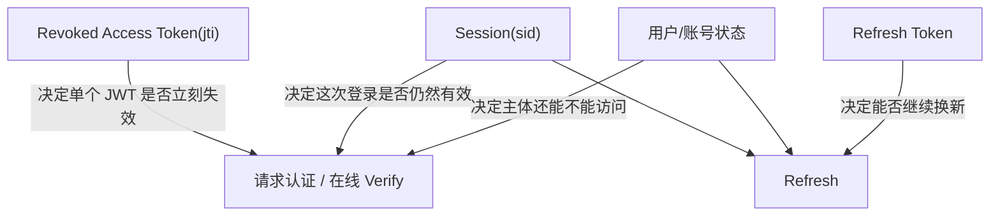
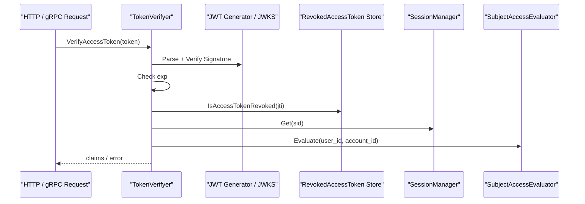
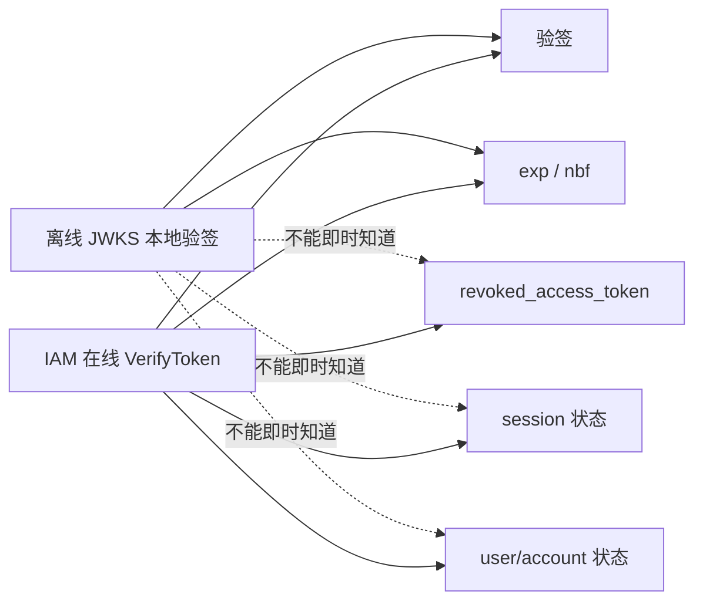

# IAM 认证语义拆层：用户状态、会话与 Token 边界

## 本文回答

本文只回答 5 件事：

1. 为什么 `revoked_access_token` 不能单独承载“踢人 / 封禁 / 登出”全部语义
2. 当前 IAM 已经拆成了哪 4 层认证语义
3. 这 4 层在请求认证、刷新、登出和管理员动作里分别扮演什么角色
4. 在线权威校验和离线 JWKS 本地验签各自能保证什么
5. Redis 为什么在这一轮开始引入 `Session + ZSet Index`

## 30 秒结论

> **一句话**：当前 `iam-contracts` 已不再把“用户封禁 / 账号禁用 / 会话失效 / access token 撤销 / refresh token 删除”混成一件事，而是拆成了四层：**subject access state、session、revoked access token、refresh token credential**；请求认证和在线 `VerifyToken` 会按这四层依次校验，而离线 JWKS 本地验签只能保证签名和过期，不能保证 session revoke 或 subject disable 的即时生效。

| 语义层 | 作用 | 当前承载 |
| ---- | ---- | ---- |
| `subject access state` | 决定用户/账号现在是否还能继续访问或刷新 | 现有 `user` 与 `account` 状态 |
| `session` | 决定这次登录是否仍然有效 | Redis `session:{sid}` + `user/account session index` |
| `revoked access token` | 让某个已签发 JWT 立即失效 | Redis `revoked_access_token:{jti}` |
| `refresh token credential` | 决定某个 refresh token 是否仍可换新 | Redis `refresh_token:{value}` |

## 1. 为什么必须拆层

过去最容易把下面几件事混在一起：

- 用户被封禁
- 账号被禁用
- 管理员踢掉某个会话
- 当前 access token 立刻失效
- refresh token 不再可用

它们看起来都像“让 token 失效”，但实际上粒度完全不同。

### 1.1 `revoked_access_token` 的边界

`revoked_access_token` 只解决一件事：

- **某个已经签发出去的 access token，要不要立刻失效**

它不能单独解决：

- 该用户以后还能不能重新登录
- 该账号下其他会话要不要一起失效
- refresh token 还能不能继续换新

所以它必须退回到自己的准确语义：**单 `jti` 级撤销**。

### 1.2 真正需要的 4 层

这一轮之后，IAM 的认证语义固定为：

1. `subject access state`
2. `session`
3. `revoked access token`
4. `refresh token credential`

这四层不是实现细节，而是业务语义边界。

## 2. 四层语义模型

### 2.1 Subject Access State

这层回答：

- 这个用户是否被封禁
- 这个账号是否被禁用或锁定

当前没有单独再造一个 Redis 聚合，而是直接以现有 `user` 与 `account` 领域状态作为 source of truth。

统一判定结果收口为：

- `active`
- `blocked`
- `disabled`
- `locked`

### 2.2 Session

这层回答：

- 这次登录是否还有效
- 管理员要踢掉的是哪一次登录
- 某个账号或某个用户名下的全部活跃会话有哪些

当前新增了 `domain/authn/session` 子域，Session 主对象包含：

- `sid`
- `user_id`
- `account_id`
- `tenant_id`
- `status`
- `created_at`
- `expires_at`
- `revoked_at`
- `revoke_reason`
- `revoked_by`
- `amr`
- `session_claims`

### 2.3 Revoked Access Token

这层回答：

- 某个 access token 是否应被立即拒绝

粒度是：

- 单 `jti`

当前承载仍是：

- Redis `revoked_access_token:{jti}` -> `"1"`，TTL = token 剩余有效期

### 2.4 Refresh Token Credential

这层回答：

- 某个 refresh token 是否还存在、是否还能继续换新

粒度是：

- 单 refresh token value

当前承载仍是：

- Redis `refresh_token:{value}` -> JSON

但它现在不再是“孤立 token 记录”，而是显式绑定到 `sid`。

## 3. JWT claims 与运行时校验

### 3.1 当前最重要的 claim 变化

这轮之后，JWT claims 新增了：

- `sid`

因此现在：

- `jti` 负责单 token 撤销
- `sid` 负责会话级失效

### 3.2 当前请求认证顺序

当前在线认证链已经固定为：

1. 解析并验签 JWT
2. 检查 `exp`
3. 检查 `revoked_access_token(jti)`
4. 检查 `session(sid)` 是否仍为 `active`
5. 检查 `user/account` 当前访问状态
6. 通过后返回 `claims`

### 3.3 当前 refresh 顺序

当前 refresh 链也已经重写为：

1. 读取 refresh token
2. 检查 refresh token 是否过期/缺失
3. 检查 `session(sid)` 是否仍为 `active`
4. 检查 `user/account` 当前访问状态
5. 重新签发新 access + 新 refresh
6. 删除旧 refresh token
7. 延长同一 session 的 `expires_at`

这意味着 refresh 不再绕过账号/用户状态，也不再绕过 session revoke。

## 4. 动作语义矩阵

### 4.1 用户操作

| 动作 | 当前语义 |
| ---- | ---- |
| 退出当前登录 | revoke 当前 session；若带 refresh token 则删 refresh；若带 access token 则写单 token revoke |
| access token 紧急失效 | 写 `revoked_access_token:{jti}`，并联动 revoke 对应 `sid` |
| refresh token 失效 | 删除 refresh token，并联动 revoke 对应 `sid` |

### 4.2 管理员操作

| 动作 | 当前语义 |
| ---- | ---- |
| 踢掉单个会话 | revoke 指定 `sid` |
| 踢掉某账号全部会话 | revoke 该账号下全部 active session |
| 封禁用户 | 修改 user 状态为 `blocked`，并 revoke 该用户下全部 active session |
| 禁用账号 | 修改 account 状态为 `disabled`，并 revoke 该账号下全部 active session |

关键点在于：

- **踢会话** 不等于 **封禁用户**
- **撤销 access token** 不等于 **删除 refresh token**

## 5. Redis 承载：为什么这一轮开始引入 `ZSet`

### 5.1 新的 session family

这一轮开始，IAM 的 Redis family 不再全是 `String`。

新增：

| Family | Redis 结构 | 作用 |
| ---- | ---- | ---- |
| `authn.session` | `String(JSON)` | Session 主对象 |
| `authn.user_session_index` | `ZSet` | 某用户下的活跃 session 索引 |
| `authn.account_session_index` | `ZSet` | 某账号下的活跃 session 索引 |

### 5.2 为什么这里用 `ZSet`

因为这批索引的访问模式已经不是“单 key 单对象 + 独立 TTL”了，而是：

- 需要按 user/account 聚合多个 `sid`
- 需要批量 revoke
- 需要按 `expires_at` 做懒清理

`ZSet(member=sid, score=expires_at_unix)` 正好满足：

- `ZADD`
- `ZRANGE`
- `ZREM`
- `ZREMRANGEBYSCORE -inf now`

所以：

- 不是 IAM 永远只能用 `String`
- 而是 **当前大多数 family 仍适合 `String`，session 索引首次明确适合 `ZSet`**

## 6. 在线权威校验 vs 离线 JWKS 本地验签

### 6.1 在线权威校验

当前 `VerifyToken` 已经是**权威在线校验入口**。

它能保证即时生效的前提是：

- 调用方真的把 token 送回 IAM 在线验证

在线校验今天能拒绝：

- 已撤销 access token
- 已撤销 session
- 被禁用账号
- 被封禁用户

### 6.2 离线 JWKS 本地验签

离线 JWKS 本地验签只能保证：

- 签名合法
- `exp / nbf` 时间合法

它**不能保证**即时生效：

- `revoked_access_token`
- `session revoke`
- `user blocked`
- `account disabled`

这不是实现缺陷，而是模型边界。

### 6.3 对接入方的当前建议

因此对接入方的建议必须分场景：

| 场景 | 当前建议 |
| ---- | ---- |
| 高频、低一致性成本的网关/BFF 校验 | 可以优先本地 JWKS 验签 |
| 要求“踢人 / 封禁 / session revoke”即时生效 | 必须走 IAM 在线权威校验 |

## 7. 当前已经落地的管理员控制面

第四轮已经落到内部 admin 路由：

- `POST /api/v1/admin/sessions/:sessionId/revoke`
- `POST /api/v1/admin/accounts/:accountId/sessions/revoke`
- `POST /api/v1/admin/users/:userId/sessions/revoke`

这组接口当前特征：

- `JWT + admin role`
- 如果管理员鉴权能力不可用，则按 fail-closed 直接不注册

同样，`/api/v1/authn/admin/jwks/*` 也已收紧到管理员中间件保护下。

## 8. 与其它文档的关系

| 文档 | 负责什么 |
| ---- | ---- |
| [../02-业务域/01-authn-认证&Token&JWKS.md](../02-业务域/01-authn-认证&Token&JWKS.md) | 认证域静态结构、核心对象与对外暴露面 |
| [./01-认证链路--从登录请求到 Token 与 JWKS.md](./01-认证链路--从登录请求到 Token 与 JWKS.md) | 认证到 token 的端到端链路 |
| [./05-IAM缓存层--缓存层的设计与治理.md](./05-IAM缓存层--缓存层的设计与治理.md) | cache family、只读治理面与当前运行边界 |
| [../03-接口与集成/05-QS接入IAM.md](../03-接口与集成/05-QS接入IAM.md) | 接入方应该何时走在线 verify，何时可接受本地验签 |

## 9. 最终判断

这次重构后，IAM 不再把“认证失效”讲成一个动作，而是明确区分为：

1. 主体还能不能继续访问
2. 这次登录是否还活着
3. 某个 access token 是否已被撤销
4. 某个 refresh token 是否还可换新

这四层里：

- **封禁用户 / 禁用账号** 是主体层
- **踢某次登录** 是会话层
- **让某个 JWT 立刻失效** 是 access token revoke 层
- **不再允许续期** 是 refresh token 层

只有把这四层拆开，后续认证、缓存、管理员控制面和外部接入策略才不会再互相污染。
