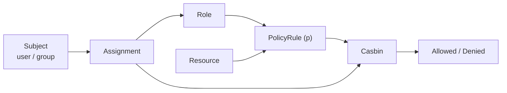
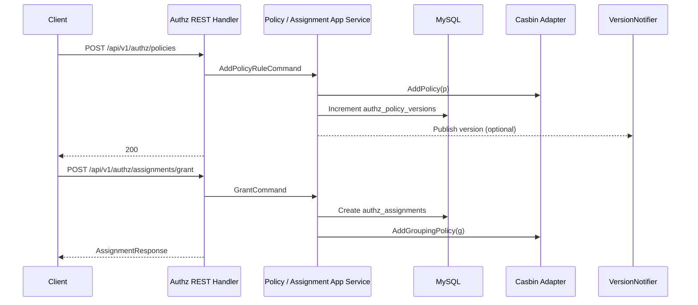
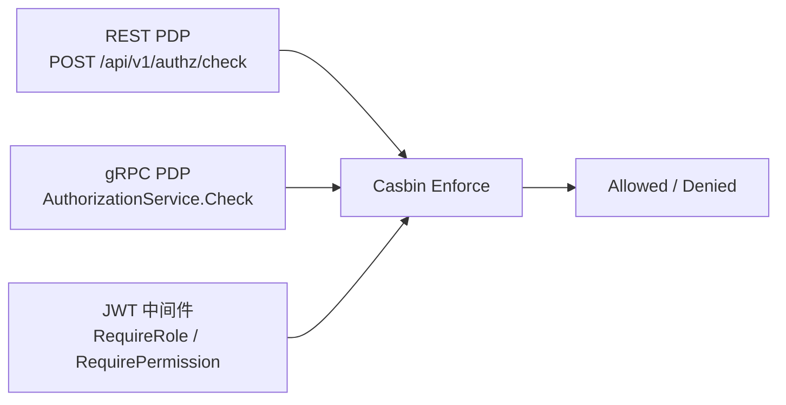

# 授权判定链路：角色、策略、资源、Assignment、Casbin

## 本文回答

本文只回答 4 件事：

1. 授权对象：角色、资源、策略、Assignment、Casbin 各自负责什么
2. 管理链：策略和 Assignment 如何进入 Casbin
3. 判定链：单次 Check 与中间件如何消费 Casbin
4. 查询、版本与通知：管理侧如何看到当前授权状态

**与业务域正文的分工**：相对 [../02-业务域/02-authz-角色、策略、资源、Assignment.md](../02-业务域/02-authz-角色、策略、资源、Assignment.md)，业务域文档讲 **模型、表结构、Casbin 装配、模块边界**；本篇讲 **管理链与判定链如何连接**、**Casbin 与 MySQL 的双读面**、**版本通知与当前边界**。

## 30 秒结论

> **一句话**：`iam-contracts` 当前的授权模块由 **角色 / 资源 / 策略 / Assignment** 这 4 类业务对象组织出一条“先管理、后判定”的链路：管理面通过应用服务把规则写进 **Casbin `p/g`** 与 **MySQL 版本/分配表**，判定面再通过 **REST `POST /authz/check`、gRPC `AuthorizationService.Check`、JWT 中间件里的 `RequireRole / RequirePermission`** 调用 Casbin 做单次 PDP。

| 主题 | 当前答案 |
| ---- | ---- |
| 授权对象 | Role 决定谁可被授权，Resource 决定资源键，Policy 决定角色能做什么，Assignment 决定谁拥有哪些角色 |
| 管理链 | Policy 写入主链是 “Casbin `p` 规则 + 策略版本表”；Assignment 写入主链是 “MySQL assignment + Casbin `g` 规则” |
| 判定链 | REST `check`、gRPC `Check`、`RequireRole / RequirePermission` 最终都落到 Casbin `Enforce` |
| 读面与版本 | 策略列表主要读 Casbin，Assignment 列表主要读 MySQL，版本号来自 `authz_policy_versions`，版本消息发布是可选的 |

## 重点速查

| 关注点 | 当前答案 | 真实落点 |
| ---- | ---- | ---- |
| REST 暴露面 | 管理面 + `POST /api/v1/authz/check` | [../../api/rest/authz.v1.yaml](../../api/rest/authz.v1.yaml)、[../../internal/apiserver/interface/authz/restful/router.go](../../internal/apiserver/interface/authz/restful/router.go) |
| gRPC 暴露面 | `iam.authz.v1.AuthorizationService/Check` | [../../api/grpc/iam/authz/v1/authz.proto](../../api/grpc/iam/authz/v1/authz.proto)、[../../internal/apiserver/interface/authz/grpc/service.go](../../internal/apiserver/interface/authz/grpc/service.go) |
| 模块装配 | `AuthzModule.Initialize` 统一装配 Repo / Validator / App Service / Casbin Adapter / HTTP / gRPC | [../../internal/apiserver/container/assembler/authz.go](../../internal/apiserver/container/assembler/authz.go) |
| Policy 写入 | 先写 Casbin `p`，再递增版本，可选发布版本消息 | [../../internal/apiserver/application/authz/policy/command_service.go](../../internal/apiserver/application/authz/policy/command_service.go) |
| Assignment 写入 | 先写 MySQL assignment，再写 Casbin `g`；失败时 best-effort 回滚 | [../../internal/apiserver/application/authz/assignment/command_service.go](../../internal/apiserver/application/authz/assignment/command_service.go) |
| 判定模型 | `r = sub, dom, obj, act`，靠 `g + dom + keyMatch + regexMatch` 进行 RBAC | [../../configs/casbin_model.conf](../../configs/casbin_model.conf) |
| REST PDP 的主体解析 | 可显式传 `subject_type + subject_id`，否则回退当前用户 | [../../internal/apiserver/interface/authz/restful/handler/check.go](../../internal/apiserver/interface/authz/restful/handler/check.go) |
| 默认上下文 | `tenant_id` 缺失退到 `default`，`user_id` 缺失退到 `system` | [../../internal/apiserver/interface/authz/restful/handler/base.go](../../internal/apiserver/interface/authz/restful/handler/base.go)、[../../pkg/core/handler.go](../../pkg/core/handler.go) |
| 运行时消费 | `JWTAuthMiddleware.RequireRole / RequirePermission` 依赖注入 CasbinEnforcer | [../../internal/pkg/middleware/authn/jwt_middleware.go](../../internal/pkg/middleware/authn/jwt_middleware.go) |
| 版本通知 | 主题为 `iam.authz.policy_version`，只有 EventBus 存在时才发布 | [../../internal/apiserver/infra/messaging/version_notifier.go](../../internal/apiserver/infra/messaging/version_notifier.go)、[../../internal/apiserver/container/container.go](../../internal/apiserver/container/container.go) |

## 1. 授权对象：角色、资源、策略、Assignment、Casbin 各自负责什么

这一部分先建立心智模型，不先讲写入顺序。

### 1.1 授权对象关系图



**图意**：Role / Resource / Policy / Assignment 这四类业务对象并不是各自孤立存在，它们最终都要汇总成 Casbin 可执行的 `p/g` 规则，判定面再从 Casbin 输出 `Allowed / Denied`。

### 1.2 这 4 类对象各自解决什么问题

| 对象 | 解决的问题 | 在判定里的角色 |
| ---- | ---- | ---- |
| Role | “哪些能力应该打包授给谁” | 作为 `p` 规则里的主体、`g` 规则里的目标角色 |
| Resource | “被保护的资源是什么、资源键长什么样” | 作为 `obj` 参与匹配 |
| Policy | “某个角色对某类资源能执行什么动作” | 变成 Casbin `p` 规则 |
| Assignment | “哪个 user/group 拥有哪些角色” | 变成 Casbin `g` 规则 |

### 1.3 Casbin 当前承担什么职责

Casbin 在这里不是“业务事实真源”，而是**授权执行引擎**。它负责：

- 承载 `p` 与 `g` 规则
- 对 `(subject, domain, object, action)` 做 `Enforce`
- 被 REST PDP、gRPC PDP、运行时中间件复用

### 1.4 Casbin 判定模型到底是什么

配置真源是 [../../configs/casbin_model.conf](../../configs/casbin_model.conf)。

```text
[request_definition]
r = sub, dom, obj, act

[policy_definition]
p = sub, dom, obj, act

[role_definition]
g = _, _, _

[policy_effect]
e = some(where (p.eft == allow))

[matchers]
m = g(r.sub, p.sub, r.dom) && r.dom == p.dom && keyMatch(r.obj, p.obj) && regexMatch(r.act, p.act)
```

这意味着当前真实判定语义是：

1. `sub` 先通过 `g` 找到角色
2. `dom` 做租户隔离
3. `obj` 通过 `keyMatch` 匹配资源键
4. `act` 通过 `regexMatch` 匹配动作

### 1.5 关键编码方式

| 对象 | 当前编码 |
| ---- | ---- |
| Role | `role:<role_name>` |
| Subject | `user:<subject_id>` 或 `group:<subject_id>` |
| Resource | 资源自身的 `Key` |
| Domain | 租户 ID |

对应主要锚点：

- [../../internal/apiserver/domain/authz/role/role.go](../../internal/apiserver/domain/authz/role/role.go)
- [../../internal/apiserver/domain/authz/assignment/assignment.go](../../internal/apiserver/domain/authz/assignment/assignment.go)
- [../../internal/apiserver/domain/authz/resource/resource.go](../../internal/apiserver/domain/authz/resource/resource.go)

## 2. 管理链：策略和 Assignment 如何进入 Casbin

这一部分回答“业务对象如何变成可执行规则”。

### 2.1 管理链工程流程图



**图意**：当前管理链不是“只写 Casbin”，也不是“只写 MySQL”，而是策略与 Assignment 分别采用不同的双写组合。

### 2.2 Policy：策略规则如何进入 Casbin `p`

#### Handler 先把请求压成命令

文件：[../../internal/apiserver/interface/authz/restful/handler/policy.go](../../internal/apiserver/interface/authz/restful/handler/policy.go)

当前 handler 主要做三件事：

1. 绑定 `AddPolicyRequest / RemovePolicyRequest`
2. 从上下文读取 `tenant_id` 与 `user_id`
3. 组装 `AddPolicyRuleCommand / RemovePolicyRuleCommand`

这里要明确一个边界：

- DTO 里 `changed_by` 仍是必填
- 但 handler 实际使用的是上下文里的 `user_id`

所以今天不能讲成“`changed_by` 一定来自请求体”。

#### 应用层真实顺序：先 Casbin，再版本

文件：[../../internal/apiserver/application/authz/policy/command_service.go](../../internal/apiserver/application/authz/policy/command_service.go)

加策略路径当前顺序：

| 步骤 | 内容 |
| ---- | ---- |
| 1 | 查角色与资源，构建 `PolicyRule{sub, dom, obj, act}` |
| 2 | `casbinAdapter.AddPolicy(rule)` |
| 3 | `policyRepo.Increment(tenant, changedBy, reason)` |
| 4 | `versionNotifier.Publish(...)`（可选） |

删除策略同理，只是把 `AddPolicy` 换成 `RemovePolicy`。

**结论**：策略真正在运行时生效的第一步，是先把 `p` 规则写进 Casbin；版本表是管理侧的同步信号，不是 Casbin 自带版本。

### 2.3 Assignment：如何变成 Casbin `g`

文件：[../../internal/apiserver/application/authz/assignment/command_service.go](../../internal/apiserver/application/authz/assignment/command_service.go)

`Grant` 当前顺序：

| 步骤 | 内容 |
| ---- | ---- |
| 1 | 校验命令 |
| 2 | 校验角色存在且属于当前租户 |
| 3 | 创建 Assignment 领域对象 |
| 4 | 写 `authz_assignments` |
| 5 | 写 Casbin `g` 规则：`(subjectKey, role.Key(), tenantID)` |

如果第 5 步失败，会回滚第 4 步数据库记录。

### 2.4 双写一致性边界

Assignment 撤销当前有两条路径：

| 路径 | 顺序 |
| ---- | ---- |
| `Revoke(subject + role)` | 先删数据库，再删 Casbin `g` |
| `RevokeByID` | 先删 Casbin `g`，再删数据库；数据库失败时尝试补回 Casbin |

**结论**：当前是“带 best-effort 回滚的双写”，还不能讲成“Casbin 与 MySQL 之间具备强事务一致性”。

## 3. 判定链：单次 Check 与中间件如何消费 Casbin

这一部分只回答“规则写进去之后，谁来用、怎么用”。

### 3.1 判定暴露面图



### 3.2 REST PDP：`POST /authz/check`

文件：[../../internal/apiserver/interface/authz/restful/handler/check.go](../../internal/apiserver/interface/authz/restful/handler/check.go)

REST `check` 的主体解析规则是：

| 情况 | 主体来源 |
| ---- | ---- |
| 显式传 `subject_type + subject_id` | 直接组装成 `user:<id>` / `group:<id>` |
| 未显式传主体 | 回退到当前用户 `user:<current_user_id>` |

然后再结合：

| 维度 | 来源 |
| ---- | ---- |
| `domain` | `getTenantID(c)` |
| `object` | 请求体 |
| `action` | 请求体 |

**边界**：如果 `user_id` 取不到且仍是默认 `"system"`，REST `check` 会认为主体缺失并返回错误。

### 3.3 gRPC PDP：`AuthorizationService.Check`

文件：[../../internal/apiserver/interface/authz/grpc/service.go](../../internal/apiserver/interface/authz/grpc/service.go)

gRPC `Check` 更直接：

| 要求 | 当前行为 |
| ---- | ---- |
| `subject / domain / object / action` 都要传 | 缺任何一个都返回 `InvalidArgument` |
| Casbin 未注入 | 返回 `Unavailable` |
| Casbin 正常 | 直接 `Enforce` 后返回 `allowed` |

**结论**：gRPC PDP 不依赖 HTTP 上下文，也不做主体推断，它要求调用方显式给出四元组。

### 3.4 JWT 中间件如何消费授权能力

文件：[../../internal/pkg/middleware/authn/jwt_middleware.go](../../internal/pkg/middleware/authn/jwt_middleware.go)

运行时授权入口有两类：

| 方法 | 行为 |
| ---- | ---- |
| `RequireRole(roleNames...)` | 先从上下文取用户，再通过 Casbin 取角色列表比对 |
| `RequirePermission(resourceObj, action)` | 直接用当前用户和租户拼出 `(sub, dom, obj, act)` 执行 `Enforce` |

它们都依赖可选注入的 `CasbinEnforcer`。未注入时会返回 “Authorization engine not configured”。

### 3.5 路由保护的真实边界

文件：[../../internal/apiserver/routers.go](../../internal/apiserver/routers.go)、[../../internal/apiserver/interface/authz/restful/router.go](../../internal/apiserver/interface/authz/restful/router.go)

当前 authz 路由保护的真实情况是：

| 场景 | 当前行为 |
| ---- | ---- |
| `AuthnModule.TokenService` 已注入 | authz 路由组会挂 `AuthRequired()` |
| `AuthnModule.TokenService` 未注入 | 使用放行占位中间件 |
| `/api/v1/authz/health` | 独立公开，不挂 auth middleware |

**结论**：标准运行路径下，authz 管理面与 PDP 会挂 JWT 认证；但不能讲成“在任何初始化失败场景下都一定受保护”。

## 4. 查询、版本与通知：管理侧如何看到当前授权状态

这一部分解释“管理面看到的状态从哪里读、如何传播”。

### 4.1 读面并不统一：策略读 Casbin，Assignment 读 MySQL

| 能力 | 当前读面 |
| ---- | ---- |
| `GetPoliciesByRole` | Casbin `p` 规则 |
| `ListBySubject / ListByRole` | MySQL `authz_assignments` |

主要锚点：

- [../../internal/apiserver/application/authz/policy/query_service.go](../../internal/apiserver/application/authz/policy/query_service.go)
- [../../internal/apiserver/application/authz/assignment/query_service.go](../../internal/apiserver/application/authz/assignment/query_service.go)

**结论**：今天的管理读面是“Casbin + MySQL”双读面，不是单一授权读库。

### 4.2 策略版本来自 `authz_policy_versions`

文件：[../../internal/apiserver/infra/mysql/policy/repo.go](../../internal/apiserver/infra/mysql/policy/repo.go)

| 行为 | 当前实现 |
| ---- | ---- |
| 初始版本 | `GetOrCreate()` 中为 `1` |
| 策略变更 | 每次 `Increment()` 递增 |
| 管理端查询 | `GET /authz/policies/version` |

当前 handler 在仓储返回 `nil` 时，会映射为 HTTP 200、`version: 0`。所以接入方需要把 `0` 理解为“尚未形成可读版本状态”或“当前无版本记录”，而不是直接等同于错误。

### 4.3 版本通知是“可选发布”，不是仓库内已证明的闭环消费

文件：[../../internal/apiserver/infra/messaging/version_notifier.go](../../internal/apiserver/infra/messaging/version_notifier.go)、[../../internal/apiserver/container/container.go](../../internal/apiserver/container/container.go)

当前可证明的事实：

| 项 | 当前答案 |
| ---- | ---- |
| 发布主题 | `iam.authz.policy_version` |
| 发布前提 | 只有 `eventBus != nil` 才会创建 `VersionNotifier` |
| 消息内容 | `tenant_id + version` |
| Subscribe 能力 | 实现存在 |

但当前仓库内没有查到启动阶段对 `VersionNotifier.Subscribe(...)` 的实际接线。

**结论**：今天可以讲成“版本消息可发布”，不能讲成“仓库内已形成版本订阅与策略缓存刷新闭环”。

## 5. 保证与风险边界

这一节只回答两件事：哪些已能明确证明，哪些仍然不能讲过头。

| 主题 | 状态 | 当前可断言 / 当前边界 | 证据 |
| ---- | ---- | ---- | ---- |
| 角色、资源、策略、Assignment 管理 REST | 已实现 | 管理面已落地 | [../../internal/apiserver/interface/authz/restful/router.go](../../internal/apiserver/interface/authz/restful/router.go) |
| REST / gRPC 单次 PDP | 已实现 | `POST /authz/check` 与 gRPC `Check` 都已落地 | [../../internal/apiserver/interface/authz/restful/handler/check.go](../../internal/apiserver/interface/authz/restful/handler/check.go)、[../../internal/apiserver/interface/authz/grpc/service.go](../../internal/apiserver/interface/authz/grpc/service.go) |
| Casbin `p/g` 规则持久化 | 已实现 | 管理链会把规则写入 Casbin 持久层 | [../../internal/apiserver/application/authz/policy/command_service.go](../../internal/apiserver/application/authz/policy/command_service.go)、[../../internal/apiserver/application/authz/assignment/command_service.go](../../internal/apiserver/application/authz/assignment/command_service.go) |
| 策略版本号 | 已实现 | 按租户递增维护 | [../../internal/apiserver/infra/mysql/policy/repo.go](../../internal/apiserver/infra/mysql/policy/repo.go) |
| 版本消息发布 | 已实现 | EventBus 存在时可发布 | [../../internal/apiserver/infra/messaging/version_notifier.go](../../internal/apiserver/infra/messaging/version_notifier.go) |
| 运行时 `RequireRole / RequirePermission` | 已实现 | 注入 Casbin 时会真实判定 | [../../internal/pkg/middleware/authn/jwt_middleware.go](../../internal/pkg/middleware/authn/jwt_middleware.go) |
| 上下文默认值 | 待补证据 | `tenant_id` 缺失回退 `default`，`user_id` 缺失回退 `system`，因此不能讲成“租户和操作者一定来自 JWT” | [../../internal/apiserver/interface/authz/restful/handler/base.go](../../internal/apiserver/interface/authz/restful/handler/base.go) |
| 路由保护 | 待补证据 | Authn 未初始化时 authz 路由会降级为放行占位 | [../../internal/apiserver/routers.go](../../internal/apiserver/routers.go) |
| `changed_by / granted_by` 来源 | 待补证据 | DTO 字段与 handler 真实取值不完全一致 | [../../internal/apiserver/interface/authz/restful/handler/policy.go](../../internal/apiserver/interface/authz/restful/handler/policy.go)、[../../internal/apiserver/interface/authz/restful/handler/assignment.go](../../internal/apiserver/interface/authz/restful/handler/assignment.go) |
| 版本订阅闭环 | 待补证据 | 只看到发布能力，没看到仓库内启动期订阅接线 | [../../internal/apiserver/infra/messaging/version_notifier.go](../../internal/apiserver/infra/messaging/version_notifier.go) |
| 批量判定 / Explain | 规划改造 | 当前默认合同未暴露 | [../../api/rest/authz.v1.yaml](../../api/rest/authz.v1.yaml)、[../../api/grpc/iam/authz/v1/authz.proto](../../api/grpc/iam/authz/v1/authz.proto) |

## 继续往下读

| 文档 | 说明 |
| ---- | ---- |
| [../02-业务域/02-authz-角色、策略、资源、Assignment.md](../02-业务域/02-authz-角色、策略、资源、Assignment.md) | 授权域静态模型与模块边界 |
| [../03-接口与集成/03-授权接入与边界.md](../03-接口与集成/03-授权接入与边界.md) | 调用方如何接 REST / gRPC PDP |
| [./04-SDK封装与接入价值.md](./04-SDK封装与接入价值.md) | SDK 在接入层如何承载 IAM 能力 |
| [../01-运行时/03-HTTP认证中间件与身份上下文.md](../01-运行时/03-HTTP认证中间件与身份上下文.md) | JWT 中间件与运行时上下文 |
| [./README.md](./README.md) | 专题分析入口 |

## 如何验证本文结论（本地）

在仓库根目录执行。需要 `rg`；若无可用 `grep -R -n` 替代。

| 目的 | 命令 |
| ---- | ---- |
| Casbin 模型与装配 | `rg -n 'casbin_model.conf|NewCasbinAdapter' internal/apiserver/container/assembler/authz.go configs/casbin_model.conf` |
| Policy 写入顺序 | `rg -n 'AddPolicy|Increment|Publish' internal/apiserver/application/authz/policy/command_service.go` |
| Assignment 双写 | `rg -n 'Create\\(|AddGroupingPolicy|RemoveGroupingPolicy|Delete\\(' internal/apiserver/application/authz/assignment/command_service.go` |
| REST PDP | `rg -n 'func \\(h \\*CheckHandler\\) Check|resolveSubject|getTenantID' internal/apiserver/interface/authz/restful/handler/check.go internal/apiserver/interface/authz/restful/handler/base.go` |
| gRPC PDP | `rg -n 'func \\(s \\*authorizationServer\\) Check|authorization engine not available' internal/apiserver/interface/authz/grpc/service.go` |
| 路由保护边界 | `rg -n 'Authn module unavailable|AuthRequired|authzGroup.GET\\(\"/health\"' internal/apiserver/routers.go internal/apiserver/interface/authz/restful/router.go` |
| 版本通知 | `rg -n 'iam.authz.policy_version|Publish|Subscribe' internal/apiserver/infra/messaging/version_notifier.go internal/apiserver/container/container.go` |

**读结果提示**：

- `policy/command_service` 中应先看到 Casbin `AddPolicy/RemovePolicy`，再看到 `Increment`
- `assignment/command_service` 中 `Grant` 应先写数据库，再写 `AddGroupingPolicy`
- `check.go` 里 `subject_type + subject_id` 和“回退当前用户”两条路径都应存在
- `routers.go` 里应能看到 authn 缺失时的放行降级逻辑
