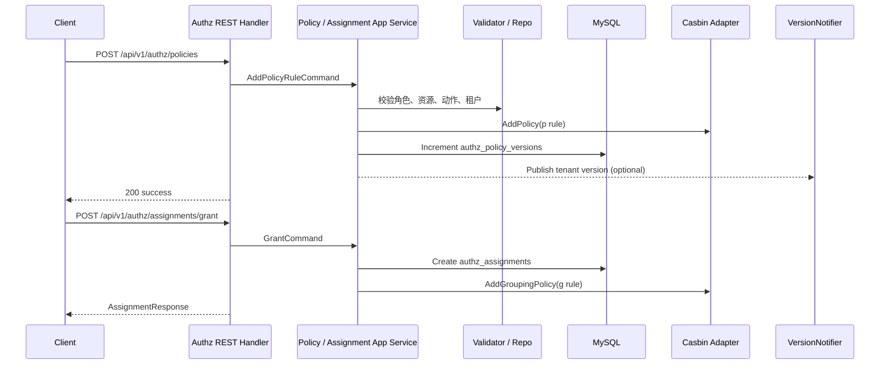

# 授权判定链路：角色、策略、资源、Assignment、Casbin

本文回答：`iam-contracts` 当前是如何把角色、资源、策略规则和 Assignment 组织成一条授权管理链的，Casbin 在这条链里承担什么角色，今天已经能证明什么、还不能讲成什么。

## 30 秒结论

- 当前授权模块的主要对外暴露面是 `REST /api/v1/authz/...`，覆盖角色、资源、策略和 Assignment 管理；仓库里没有发现独立的 `authz gRPC` 服务注册，也没有公开的 `Enforce / Allow` 判定接口。
- 策略写入主链是 `PolicyHandler -> PolicyCommandService -> role/resource 校验 -> Casbin p 规则写入 -> authz_policy_versions 递增 -> 可选发布版本通知`。
- Assignment 写入主链是 `AssignmentHandler -> AssignmentCommandService -> authz_assignments 写库 -> Casbin g 规则写入`；撤销路径也会同步删除分配记录和分组规则。
- Casbin 当前模型是 `r=sub, dom, obj, act`，其中 `role` 对应 `p` 规则主体，`user/group` 对应 `g` 规则主体，租户隔离靠 `dom` 字段，资源匹配靠 `keyMatch`，动作匹配靠 `regexMatch`。
- 当前不能讲过头的地方有 6 个：`authz` router 没有统一挂 JWT 中间件、`tenant_id / user_id` 读不到时会退回 `default / system`、`RequirePermission` 中间件还是放行 stub、版本通知只看到发布链没看到启动时订阅链、`changed_by / granted_by` 的契约与运行时来源存在偏差、`GetCurrentVersion` 在新租户无版本记录时缺少空值保护。

## 重点速查

| 关注点 | 当前答案 | 真实落点 |
| ---- | ---- | ---- |
| 对外暴露面 | 当前是 REST 管理面，不是独立 PDP 服务 | [../../api/rest/authz.v1.yaml](../../api/rest/authz.v1.yaml)、[../../internal/apiserver/interface/authz/restful/router.go](../../internal/apiserver/interface/authz/restful/router.go) |
| 模块装配 | `AuthzModule.Initialize` 统一装配 Role / Resource / Policy / Assignment 应用服务与 Casbin 适配器 | [../../internal/apiserver/container/assembler/authz.go](../../internal/apiserver/container/assembler/authz.go) |
| 策略写入 | `AddPolicyRule / RemovePolicyRule` 先写 Casbin，再递增版本，最后可选发消息 | [../../internal/apiserver/application/authz/policy/command_service.go](../../internal/apiserver/application/authz/policy/command_service.go) |
| Assignment 写入 | `Grant / Revoke / RevokeByID` 同时维护 MySQL 分配记录和 Casbin `g` 规则 | [../../internal/apiserver/application/authz/assignment/command_service.go](../../internal/apiserver/application/authz/assignment/command_service.go) |
| 策略查询 | `GetPoliciesByRole` 读 Casbin，`GetCurrentVersion` 读 MySQL 版本表 | [../../internal/apiserver/application/authz/policy/query_service.go](../../internal/apiserver/application/authz/policy/query_service.go)、[../../internal/apiserver/infra/mysql/policy/repo.go](../../internal/apiserver/infra/mysql/policy/repo.go) |
| Assignment 查询 | `ListBySubject / ListByRole` 当前读 MySQL，不是直接读 Casbin | [../../internal/apiserver/application/authz/assignment/query_service.go](../../internal/apiserver/application/authz/assignment/query_service.go) |
| Casbin 模型 | `g + dom + keyMatch + regexMatch` 组成租户内 RBAC 判定 | [../../configs/casbin_model.conf](../../configs/casbin_model.conf) |
| 版本通知 | 主题是 `iam.authz.policy_version`，只有 EventBus 存在时才会发 | [../../internal/apiserver/infra/messaging/version_notifier.go](../../internal/apiserver/infra/messaging/version_notifier.go)、[../../internal/apiserver/container/container.go](../../internal/apiserver/container/container.go) |
| 路由保护边界 | `authz` 路由当前没有统一挂 JWT 中间件 | [../../internal/apiserver/routers.go](../../internal/apiserver/routers.go)、[../../internal/apiserver/interface/authz/restful/router.go](../../internal/apiserver/interface/authz/restful/router.go) |
| 上下文默认值 | `tenant_id` 缺失时退到 `default`，`user_id` 缺失时退到 `system` | [../../internal/apiserver/interface/authz/restful/handler/base.go](../../internal/apiserver/interface/authz/restful/handler/base.go)、[../../pkg/core/handler.go](../../pkg/core/handler.go) |
| 运行时权限中间件 | `RequireRole / RequirePermission` 目前还是 TODO 后放行 | [../../internal/pkg/middleware/authn/jwt_middleware.go](../../internal/pkg/middleware/authn/jwt_middleware.go) |
| 持久化落点 | `authz_roles / authz_resources / authz_assignments / authz_policy_versions / casbin_rule` | [../../configs/mysql/schema.sql](../../configs/mysql/schema.sql) |

## 1. 主链路总览



这张图先抓住一点：当前 `iam-contracts` 的授权链首先是“授权管理链”，不是“公共判定 API 链”。也就是说，仓库里已经明确落地的是角色/资源/策略/Assignment 的写入、查询和版本传播，而不是统一的 `allow(user, obj, act)` 暴露面。

## 2. 当前授权模块到底暴露了什么

### 2.1 公开暴露面以 REST 管理接口为主

当前 [../../api/rest/authz.v1.yaml](../../api/rest/authz.v1.yaml) 暴露的是四组接口：

- 角色管理：`/authz/roles`
- Assignment 管理：`/authz/assignments/grant`、`/authz/assignments/revoke`
- 策略管理：`/authz/policies`、`/authz/policies/version`
- 资源管理：`/authz/resources`

对应 router 在 [../../internal/apiserver/interface/authz/restful/router.go](../../internal/apiserver/interface/authz/restful/router.go)。

这意味着当前对外可以明确讲成现状的是：

- 角色、资源、策略、Assignment 的管理面 REST 已落地
- 策略版本查询 REST 已落地

不能直接讲成现状的是：

- “系统已经提供统一的权限判定 REST API”
- “系统已经提供 authz gRPC 判定服务”

因为当前仓库里没有查到这两类 driving 接口的真实注册点。

### 2.2 当前也没有独立 authz gRPC 服务注册

[../../internal/apiserver/server.go](../../internal/apiserver/server.go) 当前只注册了：

- `Authn gRPC`
- `User gRPC`
- `IDP gRPC`

没有 `Authz gRPC` 的注册日志或 service 装配，这和 [../02-业务域/02-authz-角色、策略、资源、Assignment.md](../02-业务域/02-authz-角色、策略、资源、Assignment.md) 里“当前没有单独 authz gRPC 合同”的判断一致。

## 3. 策略规则如何进入 Casbin

### 3.1 REST Handler 先把请求压成命令

[../../internal/apiserver/interface/authz/restful/handler/policy.go](../../internal/apiserver/interface/authz/restful/handler/policy.go) 当前做了三件事：

1. 绑定 `AddPolicyRequest / RemovePolicyRequest`
2. 从上下文读 `tenant_id` 与 `user_id`
3. 组装 `policyDomain.AddPolicyRuleCommand / RemovePolicyRuleCommand`

这里有一个需要明确写出的边界：

- DTO 里 `changed_by` 仍是必填字段
- 但 handler 实际并不使用 `req.ChangedBy`，而是改用 `getUserID(c)`

也就是说，当前请求契约和真正生效的字段来源并不完全一致。

### 3.2 应用层的真实顺序是“先 Casbin，再版本”

[../../internal/apiserver/application/authz/policy/command_service.go](../../internal/apiserver/application/authz/policy/command_service.go) 当前的加策略路径是：

1. 查角色，拿到 `role.Key()`
2. 查资源，拿到 `resource.Key`
3. 组装 `PolicyRule{sub, dom, obj, act}`
4. `casbinAdapter.AddPolicy(...)`
5. `policyRepo.Increment(...)`
6. 如果有 `VersionNotifier`，发布版本变更消息

删除策略也是同一模式，只是把 `AddPolicy` 换成 `RemovePolicy`。

这里的关键点有两个：

- `p` 规则是真正先写进 Casbin 的
- `authz_policy_versions` 不是 Casbin 自带版本，而是当前系统自己维护的一张版本表

### 3.3 版本通知链是“可选发布”，不是本仓库内已闭环订阅

[../../internal/apiserver/container/container.go](../../internal/apiserver/container/container.go) 里只有在 `eventBus != nil` 时才创建 `VersionNotifier`。  
[../../internal/apiserver/infra/messaging/version_notifier.go](../../internal/apiserver/infra/messaging/version_notifier.go) 当前会往主题 `iam.authz.policy_version` 发布：

- `tenant_id`
- `version`

但当前仓库里没有查到启动阶段对 `VersionNotifier.Subscribe(...)` 的实际调用。

所以今天可以讲成现状的是：

- 版本消息可以发布

不能讲成现状的是：

- “apiserver 或其他进程已经在本仓库内形成了策略缓存刷新闭环”

## 4. Assignment 如何变成 Casbin 的 `g` 规则

### 4.1 当前 Assignment 是单独的聚合与表

[../../internal/apiserver/domain/authz/assignment/assignment.go](../../internal/apiserver/domain/authz/assignment/assignment.go) 把 Assignment 建模成独立聚合，核心字段是：

- `subject_type`：`user / group`
- `subject_id`
- `role_id`
- `tenant_id`
- `granted_by`

它在 Casbin 里的主体键是：

- `user:<subject_id>` 或 `group:<subject_id>`

### 4.2 授权路径是 “MySQL assignment + Casbin g 规则” 双写

[../../internal/apiserver/application/authz/assignment/command_service.go](../../internal/apiserver/application/authz/assignment/command_service.go) 当前 `Grant` 的顺序是：

1. 校验命令
2. 校验角色存在且属于当前租户
3. 创建 Assignment 领域对象
4. 写 `authz_assignments`
5. 写 Casbin `g` 规则：`(subjectKey, role.Key(), tenantID)`

如果第 5 步失败，会回滚第 4 步的数据库记录。

### 4.3 撤销路径的双写顺序并不完全一致

同一个 service 里有两条撤销路径：

- `Revoke(subject + role)`：先删数据库记录，再删 Casbin `g` 规则
- `RevokeByID`：先删 Casbin `g` 规则，再删数据库记录；如果数据库失败，会尝试补回 Casbin

这说明当前系统已经意识到“双写一致性”问题，并做了部分回滚保护，但它不是一个统一的事务性方案。更准确的说法是：

- 当前是“带 best-effort 回滚的双写”
- 还不能直接讲成“数据库与 Casbin 之间具备强事务一致性”

## 5. Casbin 当前到底如何判定

### 5.1 判定模型是标准四元组

`iam-apiserver` 授权模块初始化时固定载入 [../../configs/casbin_model.conf](../../configs/casbin_model.conf)（见 [../../internal/apiserver/container/assembler/authz.go](../../internal/apiserver/container/assembler/authz.go) 中 `modelPath := "configs/casbin_model.conf"` → `NewCasbinAdapter`）。与业务域正文一致，真源以该文件为准；仓库内 [../../internal/apiserver/infra/casbin/model.conf](../../internal/apiserver/infra/casbin/model.conf) 未被该装配路径使用。

[../../configs/casbin_model.conf](../../configs/casbin_model.conf) 当前完整定义为：

```text
[request_definition]
r = sub, dom, obj, act

[policy_definition]
p = sub, dom, obj, act

[role_definition]
g = _, _, _

[policy_effect]
e = some(where (p.eft == allow))

[matchers]
m = g(r.sub, p.sub, r.dom) && r.dom == p.dom && keyMatch(r.obj, p.obj) && regexMatch(r.act, p.act)
```

这意味着当前授权判定的真实语义是：

- 先看请求主体 `sub` 是否通过 `g` 规则归属于某个角色
- 再看请求租户 `dom` 是否和策略租户一致
- 再看资源键是否匹配
- 最后看动作是否匹配

### 5.2 Role / Resource / Assignment 在 Casbin 里的编码方式

当前几个核心键值的编码方式如下：

| 对象 | 当前编码 |
| ---- | ---- |
| Role | `role:<role_name>` |
| Subject | `user:<subject_id>` 或 `group:<subject_id>` |
| Resource | 资源自身的 `Key`，例如 `<app>:<domain>:<type>:*` |
| Domain | 租户 ID |

对应真实代码分别在：

- [../../internal/apiserver/domain/authz/role/role.go](../../internal/apiserver/domain/authz/role/role.go)
- [../../internal/apiserver/domain/authz/assignment/assignment.go](../../internal/apiserver/domain/authz/assignment/assignment.go)
- [../../internal/apiserver/domain/authz/resource/resource.go](../../internal/apiserver/domain/authz/resource/resource.go)

### 5.3 但当前仓库还没有公开的 `Enforce` 暴露面

这是当前专题里最需要说清的一点：

- Casbin `enforcer` 已经存在
- `p / g` 规则也已经被写入
- 但仓库里没有查到一个被实际对外注册的 `Enforce(sub, dom, obj, act)` REST / gRPC 接口

另外，[../../internal/pkg/middleware/authn/jwt_middleware.go](../../internal/pkg/middleware/authn/jwt_middleware.go) 虽然已经有：

- `RequireRole(...)`
- `RequirePermission(...)`

但它们当前还是 TODO 后直接 `c.Next()` 的占位实现。

所以今天更准确的表述是：

- “授权数据与 Casbin 模型已落地”
- “统一的在线权限判定面还没有在当前仓库里形成可证明的公开闭环”

## 6. 当前查询面与版本面

### 6.1 策略查询与 Assignment 查询来自不同读面

[../../internal/apiserver/application/authz/policy/query_service.go](../../internal/apiserver/application/authz/policy/query_service.go) 的 `GetPoliciesByRole` 当前直接读 Casbin 过滤后的 `p` 规则。  
[../../internal/apiserver/application/authz/assignment/query_service.go](../../internal/apiserver/application/authz/assignment/query_service.go) 的 `ListBySubject / ListByRole` 则读 MySQL assignment 仓储。

这意味着管理面今天的读路径是：

- 策略规则列表：以 Casbin 为准
- Assignment 列表：以 `authz_assignments` 为准

### 6.2 策略版本当前来自 `authz_policy_versions`

[../../internal/apiserver/infra/mysql/policy/repo.go](../../internal/apiserver/infra/mysql/policy/repo.go) 当前用 `authz_policy_versions` 表维护版本号：

- 初始版本在 `GetOrCreate()` 中是 `1`
- 每次策略变更时 `Increment()` 递增

但当前 `PolicyHandler.GetCurrentVersion()` 只是直接调用 `GetCurrent()`，并没有先做 `GetOrCreate()`。

因此需要明确一个风险边界：

- 对一个还没有任何策略变更的新租户，`GetCurrentVersion` 可能拿到 `nil`
- handler 当前没有空值保护，不能把“版本查询总能返回稳定结果”讲成已证明能力

## 7. 当前保证与风险边界

### 7.1 当前已能明确证明的能力

| 能力 | 当前状态 |
| ---- | ---- |
| 角色、资源、策略、Assignment 管理 REST | 已落地 |
| Casbin `p / g` 规则持久化到 MySQL | 已落地 |
| 按租户维度维护策略版本号 | 已落地 |
| 有 EventBus 时发布版本变更消息 | 已落地 |
| 资源动作合法性校验 | 已落地 |

### 7.2 当前不能讲过头的地方

1. `authz` 路由当前没有像 `user`、`suggest` 那样统一挂 `AuthRequired()`，因此不能直接说“授权管理接口默认全受保护”。
2. `tenant_id / user_id` 读取不到时会退成 `default / system`，所以“租户和操作者一定来自 JWT”也不能讲过头。
3. `RequirePermission` 中间件当前还是放行 stub，不能把它讲成已接通 Casbin 判定。
4. 版本通知当前只看到了发布链，没有看到仓库内启动期订阅刷新链。
5. `changed_by / granted_by` 在 DTO 与 handler 真实取值之间存在偏差，当前契约和运行时来源并不完全一致。
6. `GetCurrentVersion` 对“无版本记录”场景缺少保护，新租户首次查询版本时的行为不能包装成稳定能力。

## 8. 建议阅读顺序

如果想继续顺着这条主线往下读，建议按这个顺序：

1. [../02-业务域/02-authz-角色、策略、资源、Assignment.md](../02-业务域/02-authz-角色、策略、资源、Assignment.md)
2. [../03-接口与集成/03-授权接入与边界.md](../03-接口与集成/03-授权接入与边界.md)
3. [../05-专题分析/README.md](../05-专题分析/README.md)
4. [../03-接口与集成/01-REST契约与接入.md](../03-接口与集成/01-REST契约与接入.md)
5. [../01-运行时/02-gRPC与mTLS.md](../01-运行时/02-gRPC与mTLS.md)

其中：

- 这篇专题负责讲“当前链路今天怎么落”
- 授权域正文负责讲“模型和模块边界”
- 接口与集成层负责讲“调用方该怎么接”
