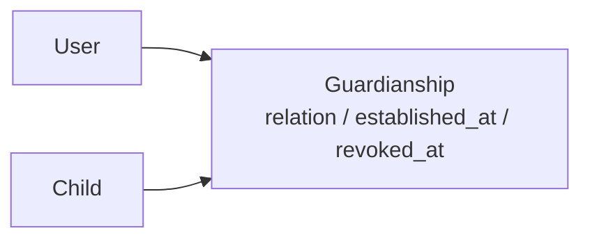
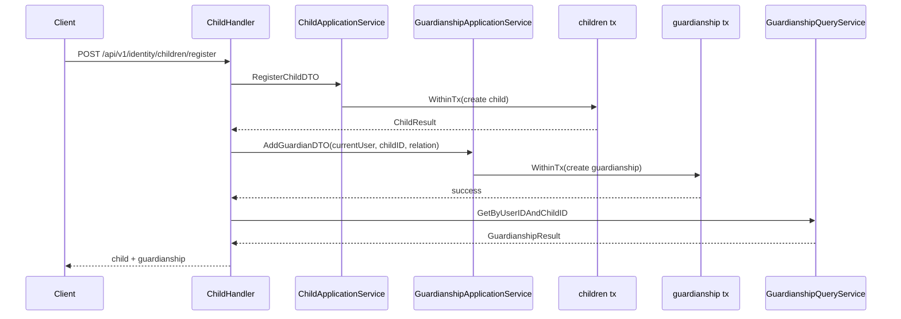
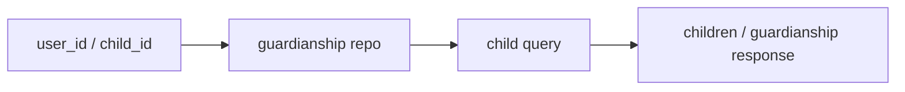

# 监护关系链路：用户、儿童、Guardianship 的协作

## 本文回答

本文只回答 4 件事：

1. 对象：`User / Child / Guardianship` 各自负责什么
2. 写链：`建档 + 授监护` 今天到底怎么落
3. 查询与判定：`我的孩子 / 指定关系 / IsGuardian` 今天如何工作
4. 暴露面与边界：REST / gRPC 当前提供了什么，还缺什么

**与业务域正文的分工**：相对 [../02-业务域/03-user-用户&儿童&Guardianship.md](../02-业务域/03-user-用户&儿童&Guardianship.md)，业务域文档讲 **静态模型、表结构、REST/gRPC 锚点、模块边界**；本篇讲 **建档与授监护的运行时主链**、**查询与判定如何消费 Guardianship**、**`revoked_at` 与 relation 漂移**、**REST/gRPC 合同与运行时之间的差异**。

## 30 秒结论

> **一句话**：`iam-contracts` 当前把 `User / Child / Guardianship` 组织成一条“先建身份对象、再挂关系、最后按关系查询/判定”的链路：`children/register` 会先创建 `Child`，再单独创建 `Guardianship`；查询和访问控制主要都先读 `Guardianship`，再回查 `Child`；写模型支持 `revoked_at` 软撤销，但读链和判定链还没有把这条状态统一收口。

| 主题 | 当前答案 |
| ---- | ---- |
| 对象 | `User` 是监护主体，`Child` 是儿童身份对象，`Guardianship` 是把两者连起来的关系对象 |
| 写链 | `POST /children/register` 不是单事务闭环，而是“先建 child，再建 guardianship” |
| 查询 / 判定 | “我的孩子”“是否是监护人”“按 user_id + child_id 查关系”都以 guardianship repo 为主入口 |
| 暴露面 | REST 提供 `children/register`、`me/children`、`guardians/grant`；gRPC 查询面比 REST 更完整，但仍有未实现和未注册能力 |

## 重点速查

| 关注点 | 当前答案 | 真实落点 |
| ---- | ---- | ---- |
| 模块装配 | `UserModule` 同时装配 `user / child / guardianship` 的 REST 与 gRPC | [../../internal/apiserver/container/assembler/user.go](../../internal/apiserver/container/assembler/user.go) |
| REST 路由 | 当前统一挂在 `/api/v1/identity` 下 | [../../internal/apiserver/interface/uc/restful/router.go](../../internal/apiserver/interface/uc/restful/router.go) |
| gRPC 服务 | 当前注册 `IdentityRead`、`GuardianshipQuery`、`GuardianshipCommand`、`IdentityLifecycle`，未注册 `IdentityStream` | [../../internal/apiserver/interface/uc/grpc/identity/service.go](../../internal/apiserver/interface/uc/grpc/identity/service.go)、[../../internal/apiserver/server.go](../../internal/apiserver/server.go) |
| 建档主链 | `ChildHandler.RegisterChild -> childApp.Register -> guardApp.AddGuardian` | [../../internal/apiserver/interface/uc/restful/handler/child.go](../../internal/apiserver/interface/uc/restful/handler/child.go)、[../../internal/apiserver/application/uc/child/services_impl.go](../../internal/apiserver/application/uc/child/services_impl.go)、[../../internal/apiserver/application/uc/guardianship/services_impl.go](../../internal/apiserver/application/uc/guardianship/services_impl.go) |
| 关系写入 | `GuardianshipManager.AddGuardian` 校验 user / child 存在与重复关系后写库 | [../../internal/apiserver/domain/uc/guardianship/manager.go](../../internal/apiserver/domain/uc/guardianship/manager.go) |
| 关系撤销 | 通过 `revoked_at` 软撤销，不是硬删除 | [../../internal/apiserver/domain/uc/guardianship/guardianship.go](../../internal/apiserver/domain/uc/guardianship/guardianship.go)、[../../internal/apiserver/infra/mysql/guardianship/repo.go](../../internal/apiserver/infra/mysql/guardianship/repo.go) |
| 查询主入口 | `ListChildrenByUserID / GetByUserIDAndChildID / IsGuardian` 都走 guardianship repo | [../../internal/apiserver/application/uc/guardianship/services_impl.go](../../internal/apiserver/application/uc/guardianship/services_impl.go)、[../../internal/apiserver/infra/mysql/guardianship/repo.go](../../internal/apiserver/infra/mysql/guardianship/repo.go) |
| 表结构 | 主落点是 `children` 与 `guardianships` 两张表，`(user_id, child_id)` 唯一键仍在 | [../../configs/mysql/schema.sql](../../configs/mysql/schema.sql) |
| REST 合同 | `identity.v1.yaml` 定义了 children / guardians 合同 | [../../api/rest/identity.v1.yaml](../../api/rest/identity.v1.yaml) |
| gRPC 合同 | `identity.proto` 定义了 `GuardianshipQuery / Command / Stream` | [../../api/grpc/iam/identity/v1/identity.proto](../../api/grpc/iam/identity/v1/identity.proto) |

## 1. 对象：`User / Child / Guardianship` 各自负责什么

这一部分先建立对象关系，再进入运行时链路。

### 1.1 对象关系图

**图意**：当前用户域不是“Child 直接挂在 User 下”，而是通过 `Guardianship` 这层关系对象把监护人和儿童串起来。后面的查询、判定、撤销几乎都围绕这张关系表展开。

### 1.2 三个对象分别解决什么问题

| 对象 | 解决的问题 | 当前在链路中的角色 |
| ---- | ---- | ---- |
| `User` | 谁是监护主体 | 作为监护关系的一端，也是 JWT 上下文里的当前操作者 |
| `Child` | 儿童身份对象是什么 | 作为被监护对象，承载儿童自身档案 |
| `Guardianship` | 谁和哪个 child 存在什么关系 | 作为“能不能查、能不能管”的核心关系事实 |

### 1.3 当前 `Guardianship` 模型真正约束了什么

当前领域模型比旧设计稿简单得多。核心字段只有：

- `user`
- `child`
- `relation`
- `established_at`
- `revoked_at`

当前 relation 主要落点是：

- `self`
- `parent`
- `grandparents`
- `other`

当前代码里**没有**这些机制：

- 主监护人 / 次监护人
- 邀请码 / 待接受状态
- 最多两个监护人
- “只有主监护人才能撤销别人”的流程

### 1.4 当前领域服务真正检查的约束

文件：[../../internal/apiserver/domain/uc/guardianship/manager.go](../../internal/apiserver/domain/uc/guardianship/manager.go)

`AddGuardian()` 当前主要检查：

| 约束 | 当前状态 |
| ---- | ---- |
| child 必须存在 | 已检查 |
| user 必须存在 | 已检查 |
| 同一 `user + child` 不能重复活跃关系 | 已检查 |
| child 最多几个监护人 | 未检查 |
| 某类 relation 是否只能由特定人创建 | 未检查 |

**结论**：当前模型已经足以表达“谁和谁有关系”，但还没有把更重的监护业务规则编码进去。

## 2. 写链：`建档 + 授监护` 今天到底怎么落

这一部分只回答“今天创建 child 和 guardianship 时到底发生了什么”。

### 2.1 主链工程流程图

**图意**：当前“注册儿童并授监护”不是单个应用服务里的原子事务，而是 handler 层串起的两个独立事务。

### 2.2 `children/register` 的真实顺序

文件：[../../internal/apiserver/interface/uc/restful/handler/child.go](../../internal/apiserver/interface/uc/restful/handler/child.go)

`RegisterChild()` 当前顺序：

| 步骤 | 内容 |
| ---- | ---- |
| 1 | 从上下文取当前 `user_id` |
| 2 | 组 `RegisterChildDTO` |
| 3 | 调 `childApp.Register(...)` 创建 child |
| 4 | 组 `AddGuardianDTO(currentUser, childID, relation)` |
| 5 | 调 `guardApp.AddGuardian(...)` 创建 guardianship |
| 6 | 再查一次关系用于回包 |

### 2.3 第一段事务：先建 `Child`

文件：[../../internal/apiserver/application/uc/child/services_impl.go](../../internal/apiserver/application/uc/child/services_impl.go)

`childApp.Register()` 自己会开 `WithinTx(...)`，主要做：

- 名称 / 生日校验
- 可选身份证处理
- 创建 `Child`
- 写 `children` 表

### 2.4 第二段事务：再建 `Guardianship`

文件：[../../internal/apiserver/application/uc/guardianship/services_impl.go](../../internal/apiserver/application/uc/guardianship/services_impl.go)

`guardApp.AddGuardian()` 会单独开另一次 `WithinTx(...)`：

- 解析 `user_id / child_id`
- 解析 relation
- 调 `ManagerService.AddGuardian(...)`
- 写 `guardianships` 表

### 2.5 当前写链的核心边界

这条链最重要的事实不是“能工作”，而是“事务边界在哪里”。

**当前结论**：

- 第一个事务：创建 child
- 第二个事务：创建 guardianship

所以如果第二步失败：

- `child` 已经落库
- 不会自动回滚

这就是今天最关键的运行时边界，不能包装成“建档 + 授监护已经是原子闭环”。

### 2.6 单独授监护：`POST /guardians/grant`

文件：[../../internal/apiserver/interface/uc/restful/handler/guardianship.go](../../internal/apiserver/interface/uc/restful/handler/guardianship.go)

`Grant` 的链路更简单：

| 步骤 | 内容 |
| ---- | ---- |
| 1 | 绑定 `GuardianGrantRequest` |
| 2 | 组 `AddGuardianDTO` |
| 3 | 调 `guardApp.AddGuardian(...)` |
| 4 | 再查一次关系，组装响应 |

所以当前监护关系写链，本质上只有两种：

- `children/register`：先建 child，再建关系
- `guardians/grant`：只建关系

## 3. 查询与判定：`我的孩子 / 指定关系 / IsGuardian` 今天如何工作

这一部分回答“写进去之后，系统如何按 Guardianship 去查和判定”。

### 3.1 查询链总览图

**图意**：当前几乎所有“我是不是监护人”“我有哪些孩子”“这个 child 我能不能查”的问题，第一站都是 guardianship repo，而不是 child 表本身。

### 3.2 “我的孩子列表”怎么查

文件：[../../internal/apiserver/interface/uc/restful/handler/child.go](../../internal/apiserver/interface/uc/restful/handler/child.go)

`ListMyChildren()` 当前顺序：

| 步骤 | 内容 |
| ---- | ---- |
| 1 | 从上下文取当前 `user_id` |
| 2 | 调 `guardQuery.ListChildrenByUserID(userID)` |
| 3 | 对每条 guardianship 再查 `childQuery.GetByID(childID)` |
| 4 | 组装 `ChildResponse` |

**结论**：当前“我的孩子”不是单独读模型，而是“先查关系，再查 child”。

### 3.3 `GetChild / PatchChild` 如何判定访问权限

同一个 handler 里的 `GetChild()` 和 `PatchChild()` 都会先做：

- `guardQuery.GetByUserIDAndChildID(currentUser, childID)`

只要这一步查到关系，后续就继续读取或修改 child。

### 3.4 gRPC 的查询面比 REST 更完整

文件：[../../internal/apiserver/interface/uc/grpc/identity/service.go](../../internal/apiserver/interface/uc/grpc/identity/service.go)、[../../internal/apiserver/interface/uc/grpc/identity/service_impl.go](../../internal/apiserver/interface/uc/grpc/identity/service_impl.go)

当前 gRPC 已接通的监护关系查询包括：

| 能力 | 当前状态 |
| ---- | ---- |
| `IsGuardian` | 已实现 |
| `ListChildren` | 已实现 |
| `ListGuardians` | 已实现 |

其中：

- `IsGuardian` 最终调用 `guardianshipQuerySvc.IsGuardian(...)`
- `ListChildren` 先列 guardianship，再组装 child edge
- `ListGuardians` 还会额外回查 user 信息，组装 `GuardianshipEdge{guardianship, guardian}`

### 3.5 当前最重要的读链风险：`revoked_at` 没有统一收口

这条边界需要单独写死，因为它直接影响“撤销关系后还算不算监护人”。

文件：[../../internal/apiserver/infra/mysql/guardianship/repo.go](../../internal/apiserver/infra/mysql/guardianship/repo.go)

当前 repo 中：

| 方法 | 是否过滤 `revoked_at` |
| ---- | ---- |
| `FindByUserIDAndChildID()` | 否 |
| `FindByUserID()` | 否 |
| `FindByChildID()` | 否 |
| `IsGuardian()` | 否 |

同时：

- [../../internal/apiserver/application/uc/guardianship/services.go](../../internal/apiserver/application/uc/guardianship/services.go) 的 `GuardianshipResult` 不带 `RevokedAt`
- [../../internal/apiserver/interface/uc/restful/handler/guardianship.go](../../internal/apiserver/interface/uc/restful/handler/guardianship.go) 的 `filterGuardianshipResults()` 目前只是占位，不会真按活跃/撤销过滤

**结论**：

- 写模型支持 `revoked_at` 软撤销
- 但读链和判定链还没有把它统一带进查询条件

所以今天不能讲成“撤销监护后，所有查询和访问控制都会自动排除这条关系”。

## 4. 暴露面与边界：REST / gRPC 当前提供了什么，还缺什么

这一部分只回答“今天对外能怎么接、哪些地方合同和运行时还没完全对齐”。

### 4.1 REST 当前真正注册了什么

文件：[../../internal/apiserver/interface/uc/restful/router.go](../../internal/apiserver/interface/uc/restful/router.go)

当前真正注册的 REST 路由包括：

- `GET /api/v1/identity/me`
- `PATCH /api/v1/identity/me`
- `GET /api/v1/identity/me/children`
- `POST /api/v1/identity/children/register`
- `GET /api/v1/identity/children/search`
- `GET /api/v1/identity/children/:id`
- `PATCH /api/v1/identity/children/:id`
- `POST /api/v1/identity/guardians/grant`

### 4.2 REST 合同与 router 的漂移

文件：[../../api/rest/identity.v1.yaml](../../api/rest/identity.v1.yaml)、[../../internal/apiserver/interface/uc/restful/handler/guardianship.go](../../internal/apiserver/interface/uc/restful/handler/guardianship.go)

当前可以明确证明的漂移有两类：

#### `GET /identity/guardians`

- OpenAPI 有
- Handler `List()` 也有
- 但 router 没注册

所以今天能讲成现状的是：

- `POST /guardians/grant` 已落地

不能讲成现状的是：

- “监护关系列表 REST 已经在运行时暴露”

#### 参数与返回码

当前还存在：

- OpenAPI 查询参数使用 `user_id / child_id`
- binder 使用 `userId / childId`
- `POST /children/register` 合同写 `201`
- handler 实际通过 `Success(...)` 返回 `200`

### 4.3 relation 在不同层之间并不完全一致

relation 漂移也需要单列出来，因为它同时影响 REST 与 gRPC。

文件：

- [../../internal/apiserver/interface/uc/restful/request/child.go](../../internal/apiserver/interface/uc/restful/request/child.go)
- [../../internal/apiserver/interface/uc/restful/request/guardianship.go](../../internal/apiserver/interface/uc/restful/request/guardianship.go)
- [../../internal/apiserver/application/uc/guardianship/services_impl.go](../../internal/apiserver/application/uc/guardianship/services_impl.go)
- [../../internal/apiserver/interface/uc/grpc/identity/service_impl.go](../../internal/apiserver/interface/uc/grpc/identity/service_impl.go)

当前事实：

| 层 | 当前值 |
| ---- | ---- |
| REST 请求 | `self / parent / guardian` |
| 应用层 `parseRelation()` | 只显式识别 `parent / grandparents / 祖父母`，其他都落 `other` |
| gRPC proto -> string | `GRANDPARENT` 会变成 `"grandparent"` |

这意味着：

- REST 的 `guardian` 最终会落到领域层 `other`
- gRPC 的 `"grandparent"` 也会因为应用层只认 `"grandparents"` 而落到 `other`

所以今天不能讲成“relation 在 REST / gRPC / domain 之间已经完全一致”。

### 4.4 gRPC 当前强在哪里、弱在哪里

#### 已经落地的服务

文件：[../../internal/apiserver/interface/uc/grpc/identity/service.go](../../internal/apiserver/interface/uc/grpc/identity/service.go)

当前真正注册的是：

- `IdentityRead`
- `GuardianshipQuery`
- `GuardianshipCommand`
- `IdentityLifecycle`

#### 当前还没落地或未完整落地的能力

文件：[../../internal/apiserver/interface/uc/grpc/identity/service_impl.go](../../internal/apiserver/interface/uc/grpc/identity/service_impl.go)

| 能力 | 当前状态 |
| ---- | ---- |
| `UpdateGuardianRelation` | 明确 `Unimplemented` |
| `BatchRevokeGuardians` | 已有包装，但本质是循环单个 `RevokeGuardian` |
| `ImportGuardians` | 已有包装，但本质是循环单个 `AddGuardian` |
| `IdentityStream.SubscribeGuardianshipEvents` | proto 有定义，但 service 注册里没有 `IdentityStream` |

**结论**：gRPC 查询面已经比 REST 更完整；命令面是“部分实现 + 部分占位”；Stream 仍停留在合同层。

## 5. 保证与风险边界

这一节只回答两件事：哪些现在可以对外断言，哪些仍然不能讲过头。

| 主题 | 状态 | 当前可断言 / 当前边界 | 证据 |
| ---- | ---- | ---- | ---- |
| `/api/v1/identity` 统一 REST 入口 | 已实现 | 用户域 REST 统一挂在这一前缀下 | [../../internal/apiserver/interface/uc/restful/router.go](../../internal/apiserver/interface/uc/restful/router.go) |
| `children/register` | 已实现 | 能完成建档并尝试授监护 | [../../internal/apiserver/interface/uc/restful/handler/child.go](../../internal/apiserver/interface/uc/restful/handler/child.go) |
| `guardians/grant` | 已实现 | 能单独建立监护关系 | [../../internal/apiserver/interface/uc/restful/handler/guardianship.go](../../internal/apiserver/interface/uc/restful/handler/guardianship.go) |
| gRPC `IsGuardian / ListChildren / ListGuardians` | 已实现 | 查询面已成型 | [../../internal/apiserver/interface/uc/grpc/identity/service_impl.go](../../internal/apiserver/interface/uc/grpc/identity/service_impl.go) |
| `revoked_at` 软撤销 | 已实现 | 写模型支持撤销，不做硬删除 | [../../internal/apiserver/infra/mysql/guardianship/repo.go](../../internal/apiserver/infra/mysql/guardianship/repo.go)、[../../configs/mysql/schema.sql](../../configs/mysql/schema.sql) |
| 重复关系约束 | 已实现 | 业务校验 + `(user_id, child_id)` 唯一键都在 | [../../internal/apiserver/domain/uc/guardianship/manager.go](../../internal/apiserver/domain/uc/guardianship/manager.go)、[../../configs/mysql/schema.sql](../../configs/mysql/schema.sql) |
| `children/register` 原子性 | 待补证据 | 仍是“先建 child，再建 guardianship”的两段事务 | [../../internal/apiserver/interface/uc/restful/handler/child.go](../../internal/apiserver/interface/uc/restful/handler/child.go) |
| 监护关系模型的重规则 | 待补证据 | 当前没有主/次监护人、邀请码、最多 2 人等规则 | [../../internal/apiserver/domain/uc/guardianship/guardianship.go](../../internal/apiserver/domain/uc/guardianship/guardianship.go) |
| `GET /identity/guardians` | 待补证据 | 合同和 handler 存在，但 router 未接 | [../../api/rest/identity.v1.yaml](../../api/rest/identity.v1.yaml)、[../../internal/apiserver/interface/uc/restful/router.go](../../internal/apiserver/interface/uc/restful/router.go) |
| relation 一致性 | 待补证据 | REST / gRPC / 应用层之间仍有归一与降级 | [../../internal/apiserver/interface/uc/restful/request/child.go](../../internal/apiserver/interface/uc/restful/request/child.go)、[../../internal/apiserver/application/uc/guardianship/services_impl.go](../../internal/apiserver/application/uc/guardianship/services_impl.go)、[../../internal/apiserver/interface/uc/grpc/identity/service_impl.go](../../internal/apiserver/interface/uc/grpc/identity/service_impl.go) |
| `revoked_at` 在读链里的统一过滤 | 待补证据 | repo 查询与 `IsGuardian()` 当前都不排除已撤销关系 | [../../internal/apiserver/infra/mysql/guardianship/repo.go](../../internal/apiserver/infra/mysql/guardianship/repo.go) |
| gRPC Stream | 规划改造 | proto 有定义，但 runtime 未注册 | [../../api/grpc/iam/identity/v1/identity.proto](../../api/grpc/iam/identity/v1/identity.proto)、[../../internal/apiserver/interface/uc/grpc/identity/service.go](../../internal/apiserver/interface/uc/grpc/identity/service.go) |

## 继续往下读

| 文档 | 说明 |
| ---- | ---- |
| [../02-业务域/03-user-用户&儿童&Guardianship.md](../02-业务域/03-user-用户&儿童&Guardianship.md) | 用户域静态模型与边界 |
| [../03-接口与集成/04-身份接入与监护关系边界.md](../03-接口与集成/04-身份接入与监护关系边界.md) | REST / gRPC 接入与边界 |
| [../03-接口与集成/01-REST契约与接入.md](../03-接口与集成/01-REST契约与接入.md) | REST 契约总览 |
| [../03-接口与集成/02-gRPC契约与接入.md](../03-接口与集成/02-gRPC契约与接入.md) | gRPC 合同总览 |
| [./README.md](./README.md) | 专题分析入口 |

## 如何验证本文结论（本地）

在仓库根目录执行。需要 `rg`；若无可用 `grep -R -n` 替代。

| 目的 | 命令 |
| ---- | ---- |
| 建档主链 | `rg -n 'RegisterChild|childApp.Register|guardApp.AddGuardian' internal/apiserver/interface/uc/restful/handler/child.go` |
| REST 路由 | `rg -n 'children/register|me/children|guardians/grant|guardians' internal/apiserver/interface/uc/restful/router.go` |
| `revoked_at` 过滤情况 | `rg -n 'FindByUserID|FindByChildID|FindByUserIDAndChildID|IsGuardian|revoked_at' internal/apiserver/infra/mysql/guardianship/repo.go` |
| gRPC 注册面 | `rg -n 'RegisterIdentityReadServer|RegisterGuardianshipQueryServer|RegisterGuardianshipCommandServer|IdentityStream' internal/apiserver/interface/uc/grpc/identity/service.go` |
| gRPC 占位方法 | `rg -n 'Unimplemented|UpdateGuardianRelation|BatchRevokeGuardians|ImportGuardians' internal/apiserver/interface/uc/grpc/identity/service_impl.go` |
| relation 漂移 | `rg -n 'guardian|grandparent|grandparents|parseRelation|protoRelationToString|stringToProtoRelation' internal/apiserver/interface/uc/restful/request internal/apiserver/application/uc/guardianship internal/apiserver/interface/uc/grpc/identity` |

**读结果提示**：

- `child.go` 中应先看到 `Register(...)`，再看到 `AddGuardian(...)`
- `router.go` 里应只有 `POST /guardians/grant`，没有 `GET /guardians`
- `repo.go` 如果仍没有 `revoked_at IS NULL` 一类条件，则本文关于读链边界的判断继续成立
- `service.go` 里如果没有 `IdentityStream` 注册，说明 Stream 仍停留在合同层
