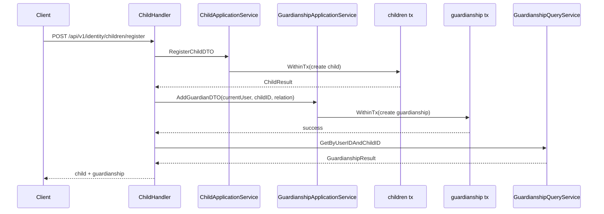

# 监护关系链路：用户、儿童、Guardianship 的协作

本文回答：`iam-contracts` 当前是如何把 `user / child / guardianship` 串成一条身份主链路的，`建档 + 授监护 + 查询` 今天到底怎么落，哪些约束已经在代码里成立，哪些还不能沿用旧设计稿的说法。

**与业务域正文的分工**：相对 [../02-业务域/03-user-用户、儿童、Guardianship.md](../02-业务域/03-user-用户、儿童、Guardianship.md)——业务域给**表结构、路由表、REST/gRPC 锚点**；本篇补**注册儿童两段事务**、**REST/gRPC/proto 与 router 的差异**、**`revoked_at` 与查询链**，以及 **gRPC 未实现/占位** 清单。

## 快速阅读（1 分钟）

| 维度 | 要点 |
| ---- | ---- |
| **主链** | `POST /children/register`：`childApp.Register`（事务①）→ `guardApp.AddGuardian`（事务②）；`POST /guardians/grant` 单独授监护；读链多经 **guardianship repo + child query** |
| **已可依赖（概括）** | REST 核心路由与 gRPC `IdentityRead` / `GuardianshipQuery` / `GuardianshipCommand` / `IdentityLifecycle` 已注册；`uk(user_id,child_id)`；写模型可写 **`revoked_at`** |
| **硬风险** | 注册**非单事务**（② 失败则 child 已落库）；**`revoked_at` 未在 `FindByUserID` 等全部路径过滤**；**`GET /guardians` 合同有、router 未接**；relation **跨层归一**；合同 **201** 与 handler **200** 不一致；部分 gRPC **Unimplemented** / Stream |

排障与产品承诺优先看 **§7.2**；与旧设计稿差异见 **§4**。

## 30 秒结论

- 当前监护关系主链路的核心是两类写操作和两类读操作：`注册儿童并授监护`、`单独授予监护`、`按用户列出儿童`、`按 user_id + child_id 判定关系`。
- 运行时暴露面分成两层：REST 当前注册的是 `/api/v1/identity/children/*`、`/api/v1/identity/me/children`、`/api/v1/identity/guardians/grant`；gRPC 当前注册了 `IdentityRead`、`GuardianshipQuery`、`GuardianshipCommand`。
- `children/register` 当前不是单事务闭环，而是 `ChildHandler` 里先调一次 `childApp.Register()`，再调一次 `guardApp.AddGuardian()`；如果第二步失败，儿童档案已经落库，不会自动回滚。
- 当前 `Guardianship` 模型只有 `user / child / relation / established_at / revoked_at`，代码里没有“主监护人/次监护人”“最多 2 个监护人”“邀请码邀请”这类旧设计稿中的机制。
- 当前不能讲过头的地方有 6 个：`revoked_at` 没有在查询链里统一过滤、`IsGuardian` 不排除已撤销关系、`GET /identity/guardians` 合同存在但 router 没注册、列表查询参数在 YAML 和 binder 之间有 snake_case / camelCase 漂移、REST `relation=guardian` 会被归一成 `other`、gRPC proto 里还有监护命令/流式接口未完全实现。

## 重点速查

| 关注点 | 当前答案 | 真实落点 |
| ---- | ---- | ---- |
| 模块装配 | `UserModule` 同时装配 `user / child / guardianship` REST 与 gRPC | [../../internal/apiserver/container/assembler/user.go](../../internal/apiserver/container/assembler/user.go) |
| REST 路由 | 当前统一挂在 `/api/v1/identity` 下，路由组会使用模块级认证中间件 | [../../internal/apiserver/interface/uc/restful/router.go](../../internal/apiserver/interface/uc/restful/router.go)、[../../internal/apiserver/routers.go](../../internal/apiserver/routers.go) |
| gRPC 服务 | 当前注册 `IdentityRead`、`GuardianshipQuery`、`GuardianshipCommand`、`IdentityLifecycle` | [../../internal/apiserver/interface/uc/grpc/identity/service.go](../../internal/apiserver/interface/uc/grpc/identity/service.go)、[../../internal/apiserver/server.go](../../internal/apiserver/server.go) |
| 建档链 | `ChildHandler.RegisterChild -> childApp.Register -> guardApp.AddGuardian` | [../../internal/apiserver/interface/uc/restful/handler/child.go](../../internal/apiserver/interface/uc/restful/handler/child.go)、[../../internal/apiserver/application/uc/child/services_impl.go](../../internal/apiserver/application/uc/child/services_impl.go)、[../../internal/apiserver/application/uc/guardianship/services_impl.go](../../internal/apiserver/application/uc/guardianship/services_impl.go) |
| 监护关系写入 | `GuardianshipManager.AddGuardian` 校验 user/child 存在与重复关系后写库 | [../../internal/apiserver/domain/uc/guardianship/manager.go](../../internal/apiserver/domain/uc/guardianship/manager.go) |
| 监护关系撤销 | `RemoveGuardian` 只给关系写 `revoked_at`，不是硬删除 | [../../internal/apiserver/domain/uc/guardianship/guardianship.go](../../internal/apiserver/domain/uc/guardianship/guardianship.go)、[../../internal/apiserver/infra/mysql/guardianship/repo.go](../../internal/apiserver/infra/mysql/guardianship/repo.go) |
| 查询判定 | `ListChildrenByUserID / GetByUserIDAndChildID / IsGuardian` 都走 guardianship repo | [../../internal/apiserver/application/uc/guardianship/services_impl.go](../../internal/apiserver/application/uc/guardianship/services_impl.go)、[../../internal/apiserver/infra/mysql/guardianship/repo.go](../../internal/apiserver/infra/mysql/guardianship/repo.go) |
| 持久化表 | `children` 与 `guardianships` 两张表是主落点 | [../../configs/mysql/schema.sql](../../configs/mysql/schema.sql) |
| REST 合同 | `identity.v1.yaml` 定义 children / guardians 合同 | [../../api/rest/identity.v1.yaml](../../api/rest/identity.v1.yaml) |
| gRPC 合同 | `identity.proto` 定义 `GuardianshipQuery / Command / Stream` | [../../api/grpc/iam/identity/v1/identity.proto](../../api/grpc/iam/identity/v1/identity.proto) |

## 1. 主链路总览



这张图先抓住两个事实：

- 当前“注册儿童并建立监护关系”是 handler 级编排，不是单个应用服务里的原子事务
- `child` 和 `guardianship` 各自有独立的 `WithinTx(...)` 边界

## 2. 当前到底暴露了哪些监护能力

### 2.1 REST 当前已经注册的主路径

[../../internal/apiserver/interface/uc/restful/router.go](../../internal/apiserver/interface/uc/restful/router.go) 当前实际注册的是：

- `GET /api/v1/identity/me`
- `PATCH /api/v1/identity/me`
- `GET /api/v1/identity/me/children`
- `POST /api/v1/identity/children/register`
- `GET /api/v1/identity/children/search`
- `GET /api/v1/identity/children/:id`
- `PATCH /api/v1/identity/children/:id`
- `POST /api/v1/identity/guardians/grant`

这组路由会统一套上 `deps.AuthMiddleware`。在正常运行且认证模块成功装配时，这意味着用户域 REST 是受 JWT 认证保护的；但 [../../internal/apiserver/routers.go](../../internal/apiserver/routers.go) 也明确写了一个退化路径：如果认证模块没起来，就会下发一个 `c.Next()` 的空中间件。

### 2.2 REST 合同与 router 已经存在可证明的漂移

[../../api/rest/identity.v1.yaml](../../api/rest/identity.v1.yaml) 当前声明了：

- `POST /identity/children/register`
- `GET /identity/children/search`
- `GET/PATCH /identity/children/{id}`
- `GET /identity/guardians`
- `POST /identity/guardians/grant`

但当前 router 只注册了 `POST /guardians/grant`，没有注册 `GET /guardians`。  
同时 handler 里虽然有 `GuardianshipHandler.List()`，也写了 `@Router /guardians [get]`，但这条方法当前没有被 router 接上。

所以今天可以讲成现状的是：

- 授予监护的 REST 写接口已落地

不能讲成现状的是：

- “监护关系列表 REST 已经在运行时暴露出来”

### 2.3 gRPC 暴露面比 REST 更完整

[../../internal/apiserver/interface/uc/grpc/identity/service.go](../../internal/apiserver/interface/uc/grpc/identity/service.go) 当前注册了：

- `IdentityRead`
- `GuardianshipQuery`
- `GuardianshipCommand`
- `IdentityLifecycle`

其中监护关系相关的可证明现状包括：

- 查询：`IsGuardian`、`ListChildren`、`ListGuardians`
- 写入：`AddGuardian`、`RevokeGuardian`
- 批量包装：`BatchRevokeGuardians`、`ImportGuardians`

但 [../../api/grpc/iam/identity/v1/identity.proto](../../api/grpc/iam/identity/v1/identity.proto) 里还定义了：

- `UpdateGuardianRelation`
- `IdentityStream.SubscribeGuardianshipEvents`

当前代码里：

- `UpdateGuardianRelation` 明确返回 `Unimplemented`
- 没有查到 `IdentityStream` 的服务注册或实现

## 3. “建档 + 授监护” 今天怎么走

### 3.1 `POST /identity/children/register` 先建儿童

[../../internal/apiserver/interface/uc/restful/handler/child.go](../../internal/apiserver/interface/uc/restful/handler/child.go) 的 `RegisterChild()` 当前顺序非常直接：

1. 从上下文取当前 `user_id`
2. 组 `RegisterChildDTO`
3. 调 `childApp.Register(...)`
4. 再组 `AddGuardianDTO`
5. 调 `guardApp.AddGuardian(...)`
6. 最后查询一次监护关系用于回包

[../../internal/apiserver/application/uc/child/services_impl.go](../../internal/apiserver/application/uc/child/services_impl.go) 的 `Register()` 自己包了一层 `WithinTx(...)`，主要做：

- 名称 / 生日校验
- 可选身份证转值对象
- 创建 `Child`
- 写 `children` 表

### 3.2 然后再单独创建 `Guardianship`

[../../internal/apiserver/application/uc/guardianship/services_impl.go](../../internal/apiserver/application/uc/guardianship/services_impl.go) 的 `AddGuardian()` 又会单独开一次 `WithinTx(...)`：

- 解析 `user_id / child_id`
- 解析 `relation`
- 调 `GuardianshipManager.AddGuardian(...)`
- 写 `guardianships` 表

这意味着当前 `children/register` 的真实事务边界不是“一个事务里同时创建 child + guardianship”，而是：

- 第一个事务：创建 child
- 第二个事务：创建 guardianship

所以最关键的当前风险边界是：

- 如果第二步失败，child 已经落库，不会自动回滚

### 3.3 合同与实现对返回码也有漂移

[../../api/rest/identity.v1.yaml](../../api/rest/identity.v1.yaml) 把 `POST /identity/children/register` 标成 `201`。  
但 [../../pkg/core/handler.go](../../pkg/core/handler.go) 里的 `SuccessResponse()` 固定返回 `200 OK`，而 `RegisterChild()` 调用的正是 `h.Success(...)`。

因此今天不能把“注册儿童接口运行时会返回 201”讲成已验证事实。

## 4. 当前 `Guardianship` 模型真正约束了什么

### 4.1 当前领域对象比旧设计稿更简单

[../../internal/apiserver/domain/uc/guardianship/guardianship.go](../../internal/apiserver/domain/uc/guardianship/guardianship.go) 当前模型只有：

- `User`
- `Child`
- `Rel`
- `EstablishedAt`
- `RevokedAt`

当前 relation 枚举只有：

- `self`
- `parent`
- `grandparents`
- `other`

代码里没有以下机制：

- 主监护人 / 次监护人
- 邀请码 / 待接受状态
- 最多两个监护人
- “只有主监护人才能撤销别人”的规则

所以旧设计稿里那些更重的业务流程，应视为历史设计或目标态，而不是当前代码事实。

### 4.2 当前领域服务真正检查的只有三件事

[../../internal/apiserver/domain/uc/guardianship/manager.go](../../internal/apiserver/domain/uc/guardianship/manager.go) 的 `AddGuardian()` 当前只做：

1. 校验 child 存在
2. 校验 user 存在
3. 校验“该 child 下是否已经存在同 user 的活跃关系”

只要通过这三步，就会创建关系。

这意味着：

- 当前有“同一 user + child 不允许重复活跃关系”的约束
- 当前没有“child 最多几个监护人”的约束
- 当前也没有“某些 relation 必须由特定角色创建”的约束

### 4.3 relation 的契约与实现也有漂移

REST 请求 DTO [../../internal/apiserver/interface/uc/restful/request/child.go](../../internal/apiserver/interface/uc/restful/request/child.go) 和 [../../internal/apiserver/interface/uc/restful/request/guardianship.go](../../internal/apiserver/interface/uc/restful/request/guardianship.go) 当前允许的值是：

- `self`
- `parent`
- `guardian`

但应用层 `parseRelation()` 只会显式识别：

- `parent`
- `grandparents`
- `祖父母`

其他值都会落成 `other`，见 [../../internal/apiserver/application/uc/guardianship/services_impl.go](../../internal/apiserver/application/uc/guardianship/services_impl.go)。

这意味着当前：

- REST 的 `guardian` 实际会落成领域层的 `other`
- gRPC 的 `GRANDPARENT` 会先被转成 `"grandparent"`，再因为应用层只认 `"grandparents"` 而落成 `other`

所以今天不能把 “relation 在 REST / gRPC / domain 之间已经完全一致” 讲成现状。

## 5. 查询与访问控制链今天是怎么工作的

### 5.1 “我的孩子列表” 走的是 guardianship 再回查 child

[../../internal/apiserver/interface/uc/restful/handler/child.go](../../internal/apiserver/interface/uc/restful/handler/child.go) 的 `ListMyChildren()` 当前做法是：

1. 从 context 取当前 `user_id`
2. 调 `guardQuery.ListChildrenByUserID(userID)`
3. 对每条 guardianship 再调 `childQuery.GetByID(childID)`
4. 组装 `ChildResponse`

这条链说明当前“我的孩子”并不是一个单独读模型，而是：

- 先拿 guardianship 关系
- 再按 child_id 查 child

### 5.2 `GetChild / PatchChild` 也只依赖“查得到关系”

同一个 handler 里的 `GetChild()` 和 `PatchChild()` 当前都会先调：

- `guardQuery.GetByUserIDAndChildID(rawUserID, childID)`

只要返回非空，就继续放行读取或修改 child。

### 5.3 当前最重要的风险边界：撤销关系并没有在查询链里被统一过滤

这一点需要明确写死，因为它直接影响权限口径。

[../../internal/apiserver/infra/mysql/guardianship/repo.go](../../internal/apiserver/infra/mysql/guardianship/repo.go) 当前：

- `FindByUserIDAndChildID()` 不过滤 `revoked_at`
- `FindByUserID()` 不过滤 `revoked_at`
- `FindByChildID()` 不过滤 `revoked_at`
- `IsGuardian()` 只是按 `(user_id, child_id)` 计数，也不排除已撤销记录

同时：

- [../../internal/apiserver/application/uc/guardianship/services.go](../../internal/apiserver/application/uc/guardianship/services.go) 的 `GuardianshipResult` 不带 `RevokedAt`
- [../../internal/apiserver/interface/uc/restful/handler/guardianship.go](../../internal/apiserver/interface/uc/restful/handler/guardianship.go) 的 `filterGuardianshipResults()` 也明确写了“目前没法根据 DTO 过滤活跃/撤销”

因此今天不能讲成现状的是：

- “撤销监护后，所有查询和访问控制都会自动排除这条关系”

更准确的说法是：

- 写模型支持撤销
- 但读链和判定链还没有把 `revoked_at` 统一收进所有查询条件

## 6. gRPC 这条链今天强在哪里、弱在哪里

### 6.1 强的地方：查询面比 REST 完整

当前 gRPC 至少已经把这些能力接通了：

- `IsGuardian`
- `ListChildren`
- `ListGuardians`
- `AddGuardian`
- `RevokeGuardian`

而且 `ListGuardians()` 还会额外回查 user 详情，组装 `GuardianshipEdge{guardianship, guardian}`，见 [../../internal/apiserver/interface/uc/grpc/identity/service_impl.go](../../internal/apiserver/interface/uc/grpc/identity/service_impl.go)。

### 6.2 弱的地方：proto 明显领先于实现

当前 proto 里更完整的设计包括：

- `UpdateGuardianRelation`
- `BatchRevokeGuardians`
- `ImportGuardians`
- `IdentityStream.SubscribeGuardianshipEvents`

但今天的实现状态其实是：

- `UpdateGuardianRelation` 直接 `Unimplemented`
- `BatchRevokeGuardians` 只是循环调用单个 `RevokeGuardian`
- `ImportGuardians` 只是循环调用单个 `AddGuardian`
- `IdentityStream` 完全没查到注册与实现

所以今天更准确的口径是：

- gRPC 监护关系查询面已经成型
- gRPC 监护关系命令面是“部分实现 + 部分占位”

## 7. 当前保证与风险边界

### 7.1 当前已能明确证明的能力

| 能力 | 当前状态 |
| ---- | ---- |
| 用户域 REST 统一挂在 `/api/v1/identity` 下 | 已落地 |
| `children/register` 能完成建档并尝试授监护 | 已落地 |
| `guardians/grant` 能单独建立监护关系 | 已落地 |
| gRPC `IsGuardian / ListChildren / ListGuardians` | 已落地 |
| 监护关系撤销使用软撤销 `revoked_at` | 已落地 |
| 重复活跃关系的数据库唯一键与业务校验 | 已落地 |

### 7.2 当前不能讲过头的地方

1. `children/register` 不是单事务闭环，child 落库成功后 guardianship 仍可能失败。
2. 监护关系模型当前没有主/次监护人、邀请码、最大 2 人等规则。
3. `GET /identity/guardians` 在 REST 合同和 handler 里存在，但 router 没注册。
4. `user_id / child_id` 查询参数在 OpenAPI 用 snake_case，而 binder 用 `userId / childId`。
5. `guardian` / `grandparent` 这些 relation 值在不同层之间会被归一或降级成 `other`。
6. 已撤销关系没有在 repo 查询和 `IsGuardian()` 中统一过滤，REST 访问控制也因此不能被包装成“完全收口”。
7. proto 里的 `IdentityStream` 和部分命令接口还没有 runtime 实现。
8. `ChildRegister` 合同声明 `201`，但当前 handler 实际返回 `200`。

## 8. 建议阅读顺序

如果想继续顺着这条链往下读，建议按这个顺序：

1. [../02-业务域/03-user-用户、儿童、Guardianship.md](../02-业务域/03-user-用户、儿童、Guardianship.md)
2. [../03-接口与集成/01-REST契约与接入.md](../03-接口与集成/01-REST契约与接入.md)
3. [../03-接口与集成/02-gRPC契约与接入.md](../03-接口与集成/02-gRPC契约与接入.md)

其中：

- 这篇专题负责讲“今天真实跑起来的是哪条链”
- 用户域正文负责讲“静态模型和边界”
- 接口与集成层负责讲“调用方该怎么接”

## 9. 如何验证本文结论（本地）

在**仓库根目录**执行（需 `rg`；若无可用 `grep -R -n` 按路径与关键字替代）。

```bash
rg -n "RegisterChild|childApp.Register|guardApp.AddGuardian" internal/apiserver/interface/uc/restful/handler/child.go
rg -n "registerChildRoutes|guardians/grant|/me/children" internal/apiserver/interface/uc/restful/router.go
rg -n "FindByUserID|IsGuardian|revoked" internal/apiserver/infra/mysql/guardianship/repo.go
rg -n "RegisterService|GuardianshipQuery|IdentityRead" internal/apiserver/interface/uc/grpc/identity/service.go
rg -n "Unimplemented" internal/apiserver/interface/uc/grpc/identity/service_impl.go
rg -n "UserModule|GRPCService.Register" internal/apiserver/server.go
```

**读结果提示**：`child.go` 中应先 **`Register`** 再 **`AddGuardian`**；`repo.go` 中 **`FindByUserID`** 若仍无 `revoked_at` 条件，则 §5.3 / §7.2 边界继续成立；`router.go` 可 **`rg "/guardians"`** 核对是否仅有 `grant` 而无列表路由；`service_impl.go` 中 **`Unimplemented`** 行仍应对应本文 gRPC 占位说明。

