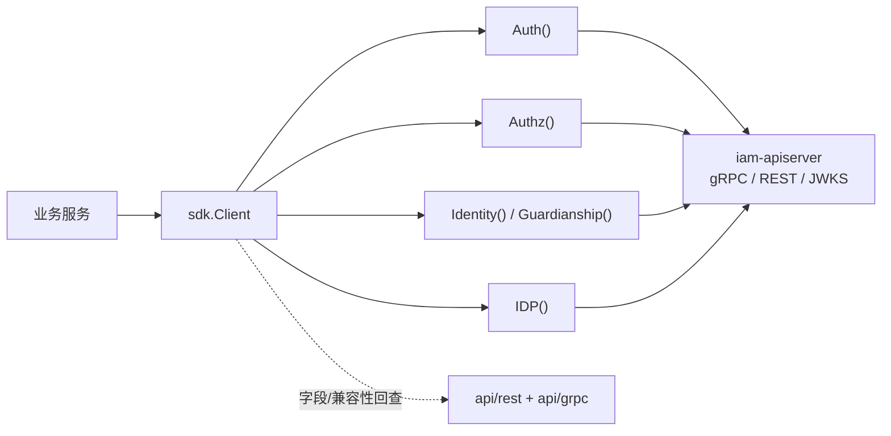
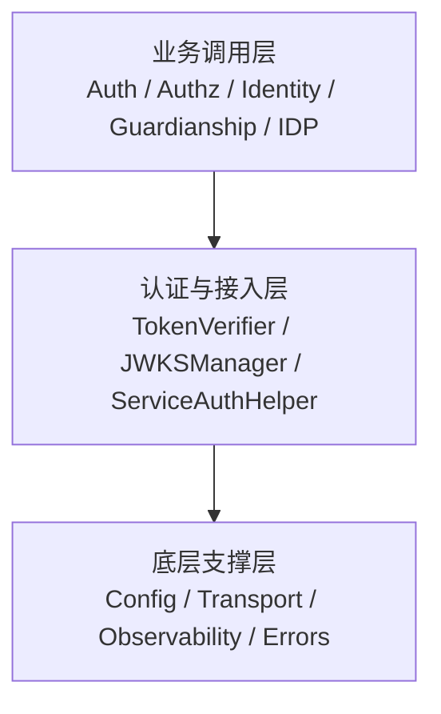
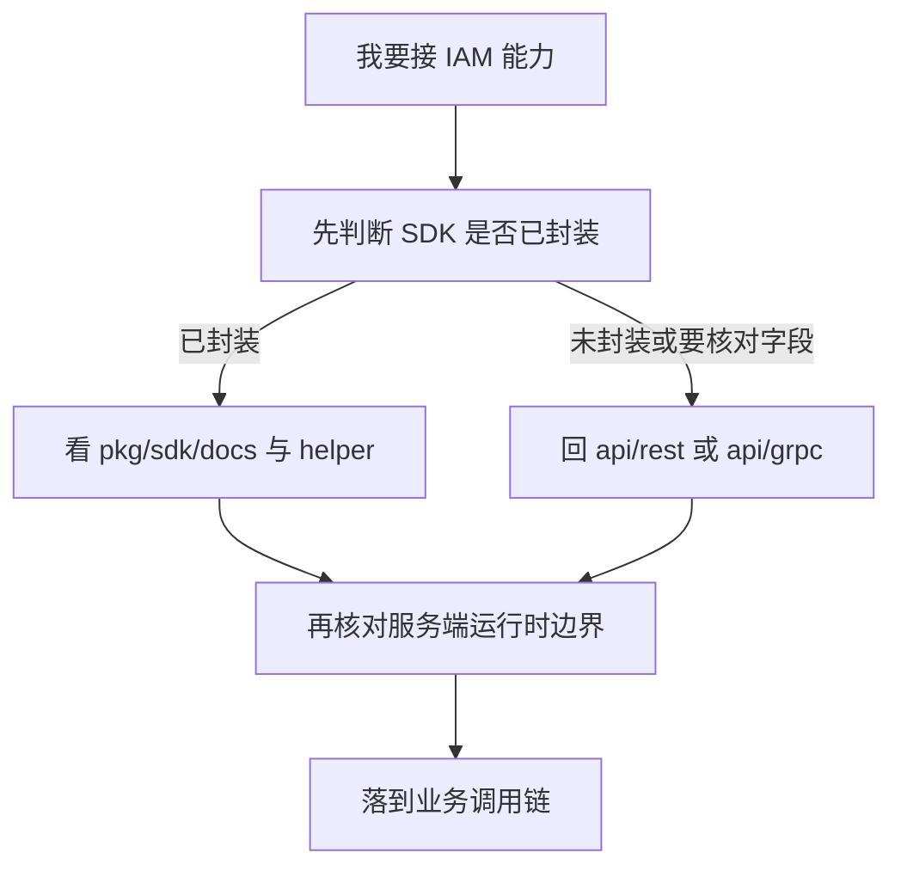

# SDK 封装与接入价值

## 本文回答

本文只回答 4 件事：

1. SDK 在 `iam-contracts` 接入链里到底负责什么
2. 当前 SDK 真实封了哪些能力，分别替业务方省掉什么复杂度
3. 接入时什么时候先看 SDK，什么时候必须回到 REST / gRPC 契约
4. 今天哪些能力已经可以依赖，哪些还不能讲过头

**与业务域、契约文档的分工**：

- `02-业务域` 解释 `iam-apiserver` 内部模块与能力边界
- `api/rest`、`api/grpc` 是字段、接口、状态码的机器契约真值
- **本篇**解释 `pkg/sdk` 为什么是接入主轴，以及它如何把“接 IAM”这件事产品化

## 30 秒结论

> **一句话**：`pkg/sdk` 不是一层薄薄的 client wrapper，而是 `iam-contracts` 把 **统一建连、认证消费、授权判定、身份查询、服务间认证生命周期、JWKS/JWT 本地验证** 这些接入复杂度收口给业务方的统一接入层；业务方更推荐“先看 SDK 能不能直接承载场景，再回契约层核对字段与边界”。

| 主题 | 当前答案 |
| ---- | ---- |
| SDK 定位 | 统一接入层，不是新的真值层 |
| 能力面 | `Auth / Authz / Identity / Guardianship / IDP` + `TokenVerifier` + `JWKSManager` + `ServiceAuthHelper` |
| 推荐读法 | 先看 `pkg/sdk/docs/*` 与 `sdk.Client`，再回 `api/rest` / `api/grpc` 校对字段和兼容性 |
| 当前边界 | SDK 暴露方法不等于所有服务端能力都已完全落地；部分 identity / guardianship gRPC 仍有占位能力 |

## 重点速查

| 关注点 | 当前答案 | 真实落点 |
| ---- | ---- | ---- |
| 统一客户端入口 | `sdk.Client` 暴露 `Auth()`、`Authz()`、`Identity()`、`Guardianship()`、`IDP()` | [../../pkg/sdk/sdk.go](../../pkg/sdk/sdk.go) |
| 认证消费 | `VerifyToken / RefreshToken / Revoke* / IssueServiceToken / GetJWKS` | [../../pkg/sdk/auth/client.go](../../pkg/sdk/auth/client.go) |
| 授权判定 | `Authz().Check()` / `Allow()` 对应单次 PDP | [../../pkg/sdk/authz/client.go](../../pkg/sdk/authz/client.go)、[../../api/grpc/iam/authz/v1/authz.proto](../../api/grpc/iam/authz/v1/authz.proto) |
| 身份与监护 | `Identity()`、`Guardianship()` 对应 identity gRPC | [../../pkg/sdk/identity/client.go](../../pkg/sdk/identity/client.go)、[../../pkg/sdk/identity/guardianship.go](../../pkg/sdk/identity/guardianship.go) |
| 本地 JWT 验签 | `TokenVerifier` + `JWKSManager` | [../../pkg/sdk/auth/verifier.go](../../pkg/sdk/auth/verifier.go)、[../../pkg/sdk/auth/jwks.go](../../pkg/sdk/auth/jwks.go) |
| 服务间认证生命周期 | `ServiceAuthHelper` | [../../pkg/sdk/auth/service_auth.go](../../pkg/sdk/auth/service_auth.go) |
| SDK 文档主入口 | `pkg/sdk/docs/*` 已按接入主轴组织 | [../../pkg/sdk/docs/README.md](../../pkg/sdk/docs/README.md) |
| 完整示例 | 完整程序已沉到 `_examples` | [../../pkg/sdk/_examples/README.md](../../pkg/sdk/_examples/README.md) |
| 契约真值 | 字段、服务名、状态码仍以 `api/rest`、`api/grpc` 为准 | [../03-接口与集成/01-REST契约与接入.md](../03-接口与集成/01-REST契约与接入.md)、[../03-接口与集成/02-gRPC契约与接入.md](../03-接口与集成/02-gRPC契约与接入.md) |

## 1. SDK 在 `iam-contracts` 接入链里到底负责什么

这一部分先回答 SDK 在整套系统中的位置，而不是先罗列方法名。

### 1.1 SDK 在接入链里的位置图

**图意**：SDK 不是和契约层对立的“第二真值层”，而是业务服务和 IAM 之间的统一接入层。它负责把“怎么接”收口，而不是替代“接口到底是什么”。

### 1.2 它为什么值得单列成一个专题

如果只有 `api/rest` 和 `api/grpc`，接入方仍然要自己处理这些重复问题：

- 怎么建连
- TLS / mTLS 怎么配
- metadata / request-id 怎么带
- JWT 是本地验签还是远程验证
- JWKS 怎么缓存、刷新、降级
- 服务 token 什么时候刷新、失败怎么退避
- 常用 identity / guardianship 请求怎么少写重复样板

SDK 的价值就在于：把这些“每个业务仓库都会重复写一次”的接入复杂度，收成统一入口。

### 1.3 更准确的定位

一句话说：

- 业务域文档解释 **IAM 自己内部怎么做**
- 契约文档解释 **接口到底长什么样**
- SDK 解释 **业务方应该怎么低成本、安全、稳定地消费这些能力**

## 2. 当前 SDK 真实封了哪些能力，分别替业务方省掉什么复杂度

这一部分回答“SDK 不只是几个方法名，它究竟替业务方屏蔽了哪些复杂度”。

### 2.1 能力分层图

**图意**：当前 SDK 已经有明显的三层结构，不只是“gRPC stub + 一点点 helper”。

### 2.2 统一客户端入口：`sdk.Client`

文件：[../../pkg/sdk/sdk.go](../../pkg/sdk/sdk.go)

今天统一入口已经是：

- `Auth()`
- `Authz()`
- `Identity()`
- `Guardianship()`
- `IDP()`

这意味着业务方通常只需要先建一个 `sdk.NewClient(...)`，而不是分别维护多套连接、初始化和子 client。

### 2.3 认证消费层：`Auth()`

文件：[../../pkg/sdk/auth/client.go](../../pkg/sdk/auth/client.go)

当前 `Auth()` 已稳定覆盖：

| 能力 | 说明 |
| ---- | ---- |
| `VerifyToken` | 远程校验 Access Token |
| `RefreshToken` | 用 Refresh 换新 token pair |
| `RevokeToken` | 撤销 Access Token |
| `RevokeRefreshToken` | 撤销 Refresh Token |
| `IssueServiceToken` | 签发服务间 token |
| `GetJWKS` | 拉取 JWKS 公钥集 |

这部分节省的不是“少写几行 stub 调用”，而是把 token 生命周期消费面统一到了一个客户端里。

### 2.4 本地 JWT 验签与 JWKS 管理

文件：

- [../../pkg/sdk/auth/verifier.go](../../pkg/sdk/auth/verifier.go)
- [../../pkg/sdk/auth/jwks.go](../../pkg/sdk/auth/jwks.go)

当前 SDK 还额外封了：

- `TokenVerifier`
- `JWKSManager`

这部分真正屏蔽的复杂度包括：

- 本地 JWKS 验签
- 远程验证降级
- issuer / audience / claim 校验
- JWKS 拉取、缓存、刷新和 fallback

所以 `Auth()` 不是 SDK 的全部；真正的“认证接入层”还包括本地验证和取钥策略。

### 2.5 服务间认证生命周期：`ServiceAuthHelper`

文件：[../../pkg/sdk/auth/service_auth.go](../../pkg/sdk/auth/service_auth.go)

`ServiceAuthHelper` 当前封装的不是一次简单发牌，而是：

- 获取服务 token
- 提前刷新
- 失败退避
- 熔断
- 用认证上下文执行下游调用

这部分的价值在于：业务方不用在每个服务仓库里重复造一套 token 刷新状态机。

### 2.6 授权判定：`Authz()`

文件：[../../pkg/sdk/authz/client.go](../../pkg/sdk/authz/client.go)

当前 `Authz()` 的真实能力是：

| 方法 | 当前定位 |
| ---- | ---- |
| `Check` | 单次 PDP |
| `Allow` | 更轻的布尔式封装 |
| `Raw` | 直接拿到底层 gRPC client |

它当前解决的问题是：

- 已经拿到 `(subject, domain, object, action)` 四元组
- 希望稳定地发到 IAM 做一次单次判定

它并不负责：

- 策略管理
- 批量判定
- 本地策略缓存
- HTTP 路由 guard

### 2.7 身份、监护、IDP 的便捷客户端

文件：

- [../../pkg/sdk/identity/client.go](../../pkg/sdk/identity/client.go)
- [../../pkg/sdk/identity/guardianship.go](../../pkg/sdk/identity/guardianship.go)
- [../../pkg/sdk/idp/client.go](../../pkg/sdk/idp/client.go)

今天 SDK 已经把这些常见消费面收出来了：

| 子客户端 | 当前覆盖 |
| ---- | ---- |
| `Identity()` | 用户、儿童读取与生命周期操作 |
| `Guardianship()` | 监护关系查询与命令操作 |
| `IDP()` | 微信应用等 IDP 能力 |

这部分让“常用身份调用”不必每次都从 proto client 开始手拼请求。

### 2.8 底层统一支撑：配置、传输、可观测性、错误

文件：

- [../../pkg/sdk/docs/02-configuration.md](../../pkg/sdk/docs/02-configuration.md)
- [../../pkg/sdk/transport/](../../pkg/sdk/transport/)
- [../../pkg/sdk/observability/](../../pkg/sdk/observability/)
- [../../pkg/sdk/errors/errors.go](../../pkg/sdk/errors/errors.go)

这部分的意义是：SDK 不只是“业务 API 封装”，它还统一了接入所需的工程基座。

## 3. 接入时什么时候先看 SDK，什么时候必须回到 REST / gRPC 契约

这一部分只回答“接入决策”。

### 3.1 接入决策流程图

### 3.2 优先看 SDK 的场景

这几类场景今天都应优先看 SDK：

| 场景 | 先看哪里 |
| ---- | ---- |
| 网关 / BFF 校验用户 JWT | [../../pkg/sdk/docs/04-jwt-verification.md](../../pkg/sdk/docs/04-jwt-verification.md) |
| 服务间认证 | [../../pkg/sdk/docs/05-service-auth.md](../../pkg/sdk/docs/05-service-auth.md) |
| Token 生命周期消费 | [../../pkg/sdk/docs/03-token-lifecycle.md](../../pkg/sdk/docs/03-token-lifecycle.md) |
| 单次授权判定 | [../../pkg/sdk/docs/06-authz.md](../../pkg/sdk/docs/06-authz.md) |
| 用户 / 儿童 / 监护关系查询 | [../../pkg/sdk/docs/01-quick-start.md](../../pkg/sdk/docs/01-quick-start.md)、[../../pkg/sdk/identity/](../../pkg/sdk/identity/) |
| 完整可运行示例 | [../../pkg/sdk/_examples/README.md](../../pkg/sdk/_examples/README.md) |

### 3.3 必须回到契约层的场景

这些问题仍然必须回 `api/`：

- 某个字段的精确定义
- proto service / method 的兼容性
- OpenAPI 路径、状态码、schema
- 某个能力是否真的正式对外暴露

对应入口：

- [../03-接口与集成/01-REST契约与接入.md](../03-接口与集成/01-REST契约与接入.md)
- [../03-接口与集成/02-gRPC契约与接入.md](../03-接口与集成/02-gRPC契约与接入.md)
- [../../api/rest/README.md](../../api/rest/README.md)
- [../../api/grpc/README.md](../../api/grpc/README.md)

**结论**：

- SDK 负责“更好接”
- 契约层负责“到底是什么”

## 4. 今天哪些能力已经可以依赖，哪些还不能讲过头

这一部分统一收口边界，不把 SDK 讲成无所不能。

### 4.1 SDK 与服务端运行时的关系

SDK 暴露方法，不等于所有服务端能力都已经同等成熟。更准确的说法是：

| SDK 入口 | 当前服务端状态 |
| ---- | ---- |
| `Auth().VerifyToken / RefreshToken / Revoke* / GetJWKS` | 标准装配下可用；服务未注入时返回 `Unimplemented` |
| `Auth().IssueServiceToken` | 已实现；标准装配下可用 |
| `Authz().Check` | 已实现；Casbin 未注入时返回 `Unavailable` |
| `Identity()` / `Guardianship()` | 多数查询已可用，但部分命令 / Stream 仍有占位能力 |

### 4.2 不要把 SDK 讲成新的真值层

今天不能讲成：

- “SDK 文档就是最终接口真值”
- “有了 SDK 就不用看 proto / OpenAPI”

更准确的说法是：

- SDK 是主阅读路径
- 契约层仍是字段与兼容性真值

### 4.3 不要把 `Authz()` 讲成完整授权平台

当前 `Authz()` 已经能稳定做单次 PDP，但它仍不代表：

- 批量判定已标准化
- 策略缓存与版本同步已封装
- HTTP 路由 guard 已在 SDK 里标准化

这些边界仍要回看：

- [../03-接口与集成/03-授权接入与边界.md](../03-接口与集成/03-授权接入与边界.md)
- [./02-授权判定链路：角色&策略&资源&Assignment&Casbin.md](./02-授权判定链路：角色&策略&资源&Assignment&Casbin.md)

### 4.4 不要把 `IssueServiceToken` 讲成完整服务身份平台

今天它已经是可用发牌入口，但仍要结合：

- `subject / audience / attributes / ttl` 的接入约定
- `ServiceAuthHelper` 的生命周期管理

也就是说：

- `IssueServiceToken` 解决“发牌”
- `ServiceAuthHelper` 解决“如何稳定地长期用牌”

### 4.5 不要把框架中间件塞进 SDK 的概念里

SDK 更适合承载：

- 统一 client
- 统一认证消费能力
- 统一身份 / 监护 / IDP 消费能力
- 单次授权 PDP

而像这些东西，更像业务或框架适配层职责：

- `gin` 路由 guard
- HTTP 错误响应
- 从上下文提 `user_id / tenant_id`

## 继续往下读

| 文档 | 说明 |
| ---- | ---- |
| [../../pkg/sdk/docs/README.md](../../pkg/sdk/docs/README.md) | SDK 文档入口 |
| [../../pkg/sdk/docs/01-quick-start.md](../../pkg/sdk/docs/01-quick-start.md) | SDK 主阅读路径起点 |
| [../../pkg/sdk/docs/03-token-lifecycle.md](../../pkg/sdk/docs/03-token-lifecycle.md) | Token 生命周期消费 |
| [../../pkg/sdk/docs/04-jwt-verification.md](../../pkg/sdk/docs/04-jwt-verification.md) | 本地 JWT 验签与 JWKS |
| [../../pkg/sdk/docs/05-service-auth.md](../../pkg/sdk/docs/05-service-auth.md) | 服务间认证生命周期 |
| [../../pkg/sdk/docs/06-authz.md](../../pkg/sdk/docs/06-authz.md) | 单次 PDP 与 `Authz()` 用法 |
| [../03-接口与集成/05-QS接入IAM.md](../03-接口与集成/05-QS接入IAM.md) | 面向业务方的接入说明 |

## 如何验证本文结论（本地）

在仓库根目录执行。需要 `rg`；若无可用 `grep -R -n` 替代。

| 目的 | 命令 |
| ---- | ---- |
| 统一客户端入口 | `rg -n 'type Client struct|Auth\\(|Authz\\(|Identity\\(|Guardianship\\(|IDP\\(' pkg/sdk/sdk.go` |
| `Authz()` 能力 | `rg -n 'type Client struct|Check\\(|Allow\\(|Raw\\(' pkg/sdk/authz/client.go` |
| `IssueServiceToken` 与服务认证 | `rg -n 'IssueServiceToken|ServiceAuthHelper|refreshToken' pkg/sdk/auth/client.go pkg/sdk/auth/service_auth.go` |
| 本地 JWT 验签 | `rg -n 'TokenVerifier|JWKSManager|VerifyToken' pkg/sdk/auth/verifier.go pkg/sdk/auth/jwks.go` |
| Identity / Guardianship 客户端 | `rg -n 'GetUser|GetChild|IsGuardian|ListChildren|ListGuardians|UpdateGuardianRelation' pkg/sdk/identity/client.go pkg/sdk/identity/guardianship.go` |
| SDK 文档入口 | `rg -n 'Quick Start|Token 生命周期|JWT 本地验证|ServiceAuth|授权判定' pkg/sdk/docs/README.md` |

**读结果提示**：

- `sdk.go` 里应能看到 5 个统一子客户端入口
- `authz/client.go` 里应只看到单次 PDP 相关能力，而不是策略管理
- `identity/guardianship.go` 如果仍暴露 `UpdateGuardianRelation` 等方法，而服务端仍有 `Unimplemented`，说明“SDK 暴露方法 ≠ 服务端完全落地”这一边界仍然成立
