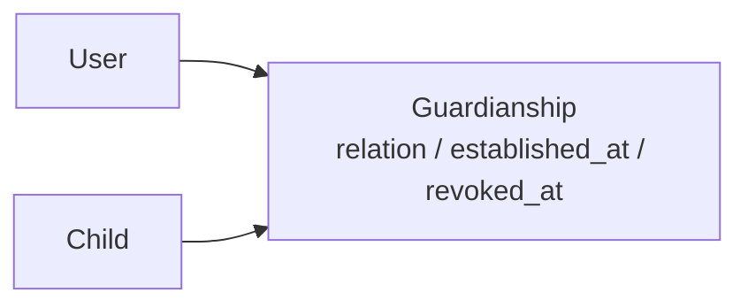
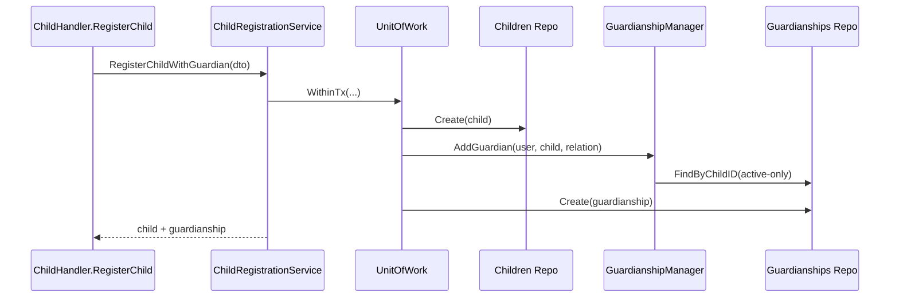

# 监护关系链路：用户、儿童、Guardianship 的协作

本文回答：`User / Child / Guardianship` 今天在运行时如何协作，建档写链如何保证事务闭环，查询判定为什么以 guardianship 为主入口，以及哪些语义已经从“合同猜测”收紧到“运行时事实”。

## 30 秒结论

- `Guardianship` 仍然是用户域里最关键的关系对象，几乎所有“能不能看/是不是监护人”的问题都先落到它。
- `children/register` 已经不是“两段事务”；当前是一个组合用例里的单事务创建。
- guardianship 默认查询语义已经收口为 active-only，撤销记录必须显式走历史查询。
- REST 与 gRPC 的 relation 词表已经统一为 `self | parent | grandparent | other`。
- 当前 identity 对外面只保留真实已注册的 4 个 gRPC 服务，不再保留 stream/占位 RPC。

## 对象协作图

### 三个对象分别负责什么

| 对象 | 当前职责 |
| ---- | ---- |
| `User` | 监护主体、身份真值、登录后上下文里的当前用户 |
| `Child` | 儿童实名档案、身高体重与证件等档案信息 |
| `Guardianship` | 把 user 与 child 连接起来的关系对象，也是访问控制的主入口 |

## 写链：`children/register`

### 当前真实链路

### 当前保证

- child 创建和 guardianship 创建在同一个事务里完成
- guardianship 创建失败时，child 不会提交
- response 直接返回聚合后的 `child + guardianship`

### 当前代码锚点

- [../../internal/apiserver/interface/uc/restful/handler/child.go](../../internal/apiserver/interface/uc/restful/handler/child.go)
- [../../internal/apiserver/application/uc/registration/services_impl.go](../../internal/apiserver/application/uc/registration/services_impl.go)
- [../../internal/apiserver/application/uc/uow/uow.go](../../internal/apiserver/application/uc/uow/uow.go)

## 关系写入：为什么还要经过 `GuardianshipManager`

`GuardianshipManager` 负责的不是“持久化”，而是关系语义校验：

1. child 是否存在
2. user 是否存在
3. 当前 active guardianship 是否重复
4. relation 如何落成领域对象

对应代码：

- [../../internal/apiserver/domain/uc/guardianship/manager.go](../../internal/apiserver/domain/uc/guardianship/manager.go)

## 查询与判定：为什么以 guardianship 为主入口

### 原因

“我的孩子”“是不是监护人”“这个孩子有哪些监护人”这类问题，本质上都不是单看 `User` 或单看 `Child` 能回答的；它们都依赖 user-child 关系。

所以当前运行时里：

- `ListChildrenByUserID`
- `ListGuardiansByChildID`
- `GetByUserIDAndChildID`
- `IsGuardian`

都先走 guardianship repo / query service，再按需要补 child 或 user 信息。

### 当前语义收口

默认公共查询只看 active guardianship：

| 方法 | 默认是否排除已撤销 |
| ---- | ---- |
| `FindByUserIDAndChildID` | 是 |
| `FindByUserID` | 是 |
| `FindByChildID` | 是 |
| `IsGuardian` | 是 |

如果要读历史，必须显式走：

- `FindByUserIDAndChildIDIncludingRevoked`
- `FindByUserIDIncludingRevoked`
- `FindByChildIDIncludingRevoked`

## 撤销链：当前不是硬删除

撤销 guardianship 的方式仍然是软撤销：

- 领域对象写 `revoked_at`
- repo 更新同一条关系记录
- 默认公共查询不再返回它
- 历史查询仍然能看到它

这意味着当前系统既支持“当前判定只看 active”，也保留了审计/历史追踪所需的关系记录。

## 对外合同：当前已经和运行时对齐的部分

### REST

- `GET /api/v1/identity/guardians` 已注册
- `POST /api/v1/identity/children/register` 返回 `201`
- `POST /api/v1/identity/guardians/grant` 返回 `201`
- `/identity/guardians` 只接受 `user_id / child_id`
- `GuardianshipResponse.revokedAt` 已真实填充

### gRPC

- 只保留 `IdentityRead`、`GuardianshipQuery`、`GuardianshipCommand`、`IdentityLifecycle`
- `UpdateUser` 现在回查真实更新后的 user
- `RevokeGuardian` 返回包含 `revoked_at` 的关系结果

### relation 词表

当前 REST / gRPC / domain 统一为：

- `self`
- `parent`
- `grandparent`
- `other`

## 仍需保持准确的边界

- 当前没有 identity 事件订阅型 gRPC
- 当前没有“更新监护关系类型”的独立对外 RPC
- 当前没有“绑定外部身份”的 identity lifecycle 对外 RPC
- IDP 仍以微信/企微现有链路为主，没有抽象成完整的通用 provider 平台

## 代码锚点索引

| 关注点 | 路径 |
| ---- | ---- |
| REST 写链 | [../../internal/apiserver/interface/uc/restful/handler/child.go](../../internal/apiserver/interface/uc/restful/handler/child.go) |
| 组合用例 | [../../internal/apiserver/application/uc/registration/services_impl.go](../../internal/apiserver/application/uc/registration/services_impl.go) |
| guardianship query service | [../../internal/apiserver/application/uc/guardianship/services_impl.go](../../internal/apiserver/application/uc/guardianship/services_impl.go) |
| guardianship repo | [../../internal/apiserver/infra/mysql/guardianship/repo.go](../../internal/apiserver/infra/mysql/guardianship/repo.go) |
| gRPC 注册面 | [../../internal/apiserver/interface/uc/grpc/identity/service.go](../../internal/apiserver/interface/uc/grpc/identity/service.go) |
| proto 合同 | [../../api/grpc/iam/identity/v1/identity.proto](../../api/grpc/iam/identity/v1/identity.proto) |

## 继续往下读

| 文档 | 说明 |
| ---- | ---- |
| [../03-接口与集成/04-身份接入与监护关系边界.md](../03-接口与集成/04-身份接入与监护关系边界.md) | 对外接入面、IDP 矩阵与缓存治理边界 |
| [../02-业务域/03-user-用户&儿童&Guardianship.md](../02-业务域/03-user-用户&儿童&Guardianship.md) | 静态模型、表结构与模块装配 |
