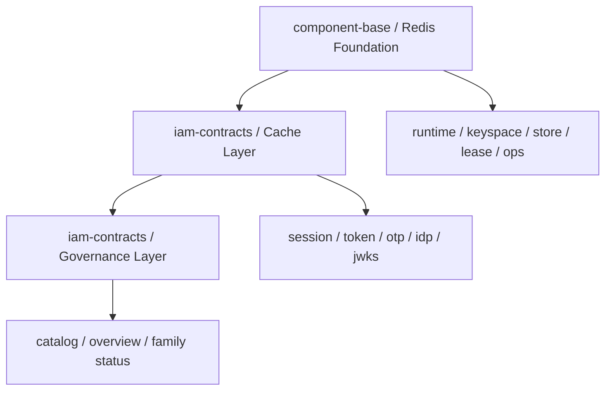
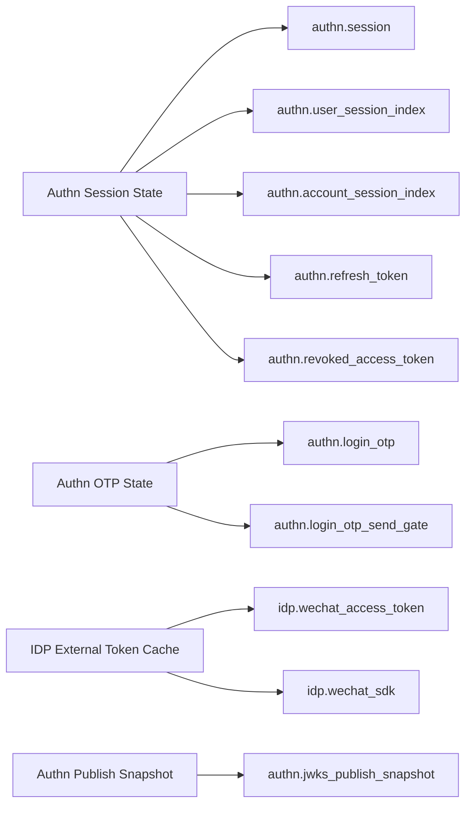
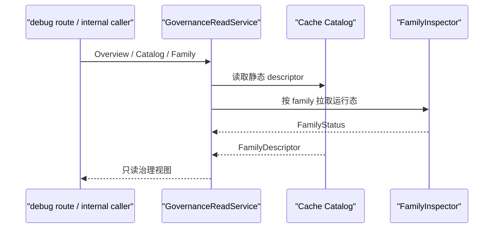

# IAM 缓存层：缓存层的设计与治理

## 本文回答

本文只回答 5 件事：

1. 在已经接入 `component-base` Redis Foundation 之后，IAM 自己还需要负责什么
2. 当前 IAM Cache Layer 到底有哪些 cache family，它们分别服务什么认证语义
3. 只读治理面今天已经做到了什么，哪些能力故意没有做
4. Session 引入后，IAM 缓存层为什么从“几组零散 token key”变成了“cache family + index family”
5. 读代码时，应该从哪些包进入，而不是再回头找旧的基础设施设计文

## 30 秒结论

> **一句话**：`iam-contracts` 已不再自己实现 Redis Foundation；Foundation 在 `component-base`，IAM 自己只负责 **Cache Layer** 和 **Governance Layer**。当前缓存层已经围绕 `session / refresh token / revoked access token / otp / idp token / jwks snapshot` 建立了稳定的 family 模型，而治理层第一版只做 **catalog + inspector + overview/family status** 这组只读能力。

| 主题 | 当前结论 |
| ---- | ---- |
| Foundation 在哪 | `component-base` 提供 runtime、keyspace、typed store、lease、ops |
| IAM 自己负责什么 | Cache Layer + Governance Layer |
| 当前 family 是否已稳定 | 已稳定，且已经包含 session 与两类 session index |
| 当前治理是否可写 | 不可写，第一版只有只读治理 |
| 线上治理接口是否默认公开 | 不是；生产默认不公开，显式开启时也要求 `JWT + admin role`，鉴权能力缺失则 fail-closed |

## 重点速查

| 想回答的问题 | 先看哪里 |
| ---- | ---- |
| 当前 cache family 清单与静态元数据 | [../../internal/apiserver/infra/cache/catalog.go](../../internal/apiserver/infra/cache/catalog.go) |
| family/status/overview 是怎么聚合出来的 | [../../internal/apiserver/application/cachegovernance/service.go](../../internal/apiserver/application/cachegovernance/service.go) |
| Redis family 的实际适配器有哪些 | [../../internal/apiserver/infra/redis/](../../internal/apiserver/infra/redis/) |
| JWKS snapshot 为什么也算 cache family | [../../internal/apiserver/domain/authn/jwks/keyset_builder.go](../../internal/apiserver/domain/authn/jwks/keyset_builder.go) |
| 为什么 `revoked_access_token` 不是 `Set` | [06-IAM缓存层--数据结构选择与 Redis 建模判断.md](./06-IAM缓存层--数据结构选择与 Redis 建模判断.md) |
| 为什么 session 这一轮开始引入 `ZSet` | [../02-业务域/01-authn-认证&Token&JWKS.md](../02-业务域/01-authn-认证&Token&JWKS.md)、[02-IAM认证语义拆层--用户状态、会话与Token边界.md](./02-IAM认证语义拆层--用户状态、会话与Token边界.md) |
| 只读治理接口暴露在哪里 | `/debug/cache-governance/catalog`、`/overview`、`/families/:family` |

## 1. 为什么 IAM 只负责 Cache Layer + Governance

现在的边界已经很明确：

- **Foundation**：`component-base`
- **Cache Layer**：`iam-contracts`
- **Governance Layer**：`iam-contracts`

这意味着 IAM 不再重复实现：

- Redis runtime / profile binding
- keyspace / typed store / lease 原语
- 通用 `consume-if-exists`、TTL 抖动、基础删除与扫描能力

IAM 只需要站在业务语义上回答：

- 哪些认证状态要缓存
- 这些状态按什么 family 拆分
- 每个 family 的后端、结构、TTL 和 owner 是什么
- 外部应该如何只读观察这些状态

**图意**：Foundation 解决“怎么跟 Redis 打交道”，IAM Cache Layer 解决“为什么要存这些认证状态”，Governance 解决“今天能如何只读看到这些状态”。

## 2. 当前 cache family 地图

### 2.1 子域划分

当前 IAM Cache Layer 已经固定成 4 个子域：

1. `Authn Session State`
2. `Authn OTP State`
3. `IDP External Token Cache`
4. `Authn Publish Snapshot`

### 2.2 当前 family 清单

| Family | 子域 | 后端 | 当前结构 | 当前作用 |
| ---- | ---- | ---- | ---- | ---- |
| `authn.session` | Authn Session State | Redis | `String(JSON)` | 会话主对象 |
| `authn.user_session_index` | Authn Session State | Redis | `ZSet` | 用户维度会话索引 |
| `authn.account_session_index` | Authn Session State | Redis | `ZSet` | 账号维度会话索引 |
| `authn.refresh_token` | Authn Session State | Redis | `String(JSON)` | Refresh token 凭据 |
| `authn.revoked_access_token` | Authn Session State | Redis | `String(marker)` | 单 access token 撤销标记 |
| `authn.login_otp` | Authn OTP State | Redis | `String(marker)` | 一次性验证码状态 |
| `authn.login_otp_send_gate` | Authn OTP State | Redis | `String(marker)` | 发送冷却窗口 |
| `idp.wechat_access_token` | IDP External Token Cache | Redis | `String(JSON)` | 微信应用 access token |
| `idp.wechat_sdk` | IDP External Token Cache | Redis | `String(string)` | 微信 SDK token/ticket |
| `authn.jwks_publish_snapshot` | Authn Publish Snapshot | Memory | memory object | 可发布 JWKS 快照 |

**图意**：session 子域现在已经成为 IAM 缓存层的重心；它不再只有 refresh token 和 revoke 标记，而是显式拥有 `session + session indexes` 这组 family。

## 3. 当前治理面如何工作

第一版治理面已经落地，但它有意保持收敛：

- 有 `Catalog`
- 有 `FamilyInspector`
- 有 `GovernanceReadService`
- 有 `/debug/cache-governance/*` 只读出口

没有：

- purge
- invalidate
- force refresh
- warmup / hotset
- 运维写操作

### 3.1 静态层

静态信息来自：

- `internal/apiserver/infra/cache/family.go`
- `datatype.go`
- `policy.go`
- `catalog.go`

它回答的问题是：

- family 叫什么
- owner 是谁
- backend 是什么
- Redis 数据结构是什么
- value codec 是什么
- TTL 来源是什么
- 为什么选这个结构

### 3.2 运行态层

运行态信息来自各 family 的 `FamilyInspector`：

- Redis family inspector 由 `internal/apiserver/infra/redis` 提供
- JWKS snapshot inspector 由 `internal/apiserver/application/cachegovernance/jwks_inspector.go` 提供

它回答的问题是：

- 当前是否已配置
- 当前 backend 是否健康
- 当前 family 能否读取状态
- 如果失败，失败发生在什么层

### 3.3 聚合层

`GovernanceReadService` 会把：

- 静态 catalog
- family inspector 状态
- Redis / memory 运行态

聚合成：

- `catalog`
- `overview`
- `family status`

**图意**：治理面不是另一套缓存实现，而是把“静态目录”和“运行态探测”收成统一的只读视图。

## 4. Session 引入后，缓存层发生了什么变化

如果只看第一轮 Redis adapter 迁移，IAM 的缓存层看起来仍然是：

- refresh token
- revoked access token
- otp
- idp token

但在认证语义拆层之后，真正的变化是：

1. `sid` 进入 Access Token 与 Refresh Token
2. `Session` 变成运行时锚点
3. access token revoke 与 session revoke 被明确拆开
4. 批量踢会话需要 user/account 维度的索引

所以这轮缓存层的变化不是“多了几个 key”，而是：

- **认证临时状态从 token-oriented 变成 session-oriented**

这也是为什么当前第一次正式引入：

- `authn.session`
- `authn.user_session_index`
- `authn.account_session_index`

如果没有这三类 family：

- refresh 仍然会绕过 session 语义
- “踢单个会话”和“踢某账号全部会话”没有正确承载点
- 治理面也无法解释当前系统里到底有哪些 active session 语义

## 5. 当前保证与边界

### 当前可以明确断言

- IAM 现在已经有稳定的 cache family catalog
- session family 已进入 catalog 和治理面
- Redis family 和 JWKS memory family 都有真实 inspector，不再只是静态目录
- 只读治理服务已经有运行时出口，不是停留在文档建模
- 生产环境下这组治理接口默认不公开；显式开启时要求管理员访问，鉴权能力缺失时 fail-closed

### 当前不要讲过头

- 这还不是完整的运维控制面
- 它不提供 cache purge / refresh / invalidate
- 它不承诺 Redis key 数量、family entry count 这类精确容量统计
- 它也不是 `qs-server` 那种完整 cache governance 平台

所以这层的正确定位是：

> **IAM 认证状态缓存的只读解释面和只读观察面，而不是可操作控制台。**

## 继续往下读

| 文档 | 说明 |
| ---- | ---- |
| [06-IAM缓存层--数据结构选择与 Redis 建模判断.md](./06-IAM缓存层--数据结构选择与 Redis 建模判断.md) | 为什么当前 family 这样选 Redis 结构，以及为什么 `revoked_access_token` 不是 `Set` |
| [02-IAM认证语义拆层--用户状态、会话与Token边界.md](./02-IAM认证语义拆层--用户状态、会话与Token边界.md) | 为什么 session 会成为新的认证运行时锚点 |
| [../02-业务域/01-authn-认证&Token&JWKS.md](../02-业务域/01-authn-认证&Token&JWKS.md) | 认证域静态结构、Session、Token 与 JWKS 的主叙事 |
| [07-SDK封装与接入价值.md](./07-SDK封装与接入价值.md) | SDK 如何把在线 verify / 本地验签 / 服务认证接入产品化 |
| [../../internal/apiserver/infra/cache/catalog.go](../../internal/apiserver/infra/cache/catalog.go) | Cache catalog 源码锚点 |
| [../../internal/apiserver/application/cachegovernance/service.go](../../internal/apiserver/application/cachegovernance/service.go) | 治理聚合服务源码锚点 |
