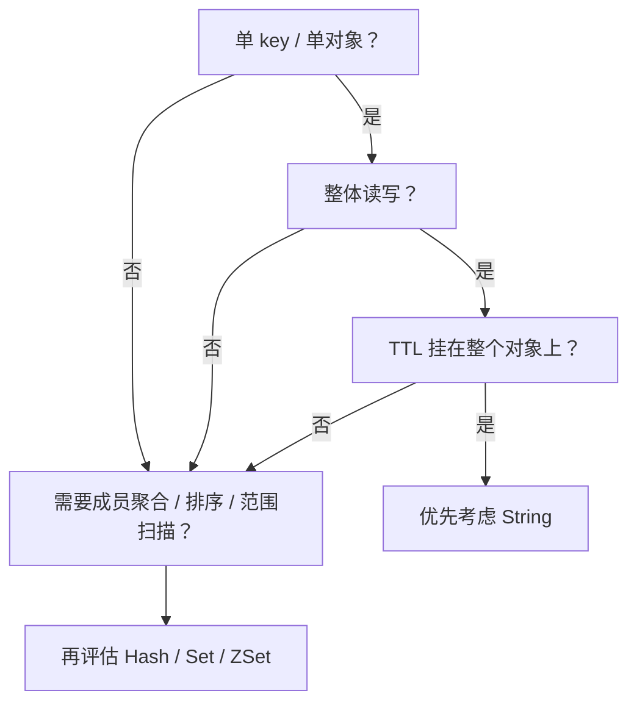

# IAM 缓存层专题：数据结构选择与 Redis 建模判断

## 本文回答

本文只回答 4 件事：

1. 当前 IAM 的各个 cache family 为什么分别选了这些 Redis 数据结构
2. 为什么“要查 membership”并不自动意味着“应该用 `Set`”
3. 为什么 `session` 这一轮开始正式引入 `ZSet`
4. 未来什么时候才值得把某个 family 从当前结构升级成别的结构

## 30 秒结论

> **一句话**：IAM 里的 Redis 数据结构不是按名字选，而是按 **访问模式 + TTL 粒度 + 原子语义 + 聚合需求** 选。当前大多数 family 仍然落在 `String`，因为它们都是单 key / 单对象 / key 级 TTL；真正第一次明确需要非 `String` 的，是 `authn.user_session_index` 和 `authn.account_session_index` 这两类会话索引，所以这里引入了 `ZSet`。

| 判断问题 | 当前结论 |
| ---- | ---- |
| `authn.revoked_access_token` 为什么不是 `Set` | 因为它更重要的是“逐 token 独立 TTL”，不是集合 membership |
| `authn.session` 为什么还是 `String(JSON)` | 它仍然是单 `sid` 单对象、整对象读写 |
| session index 为什么是 `ZSet` | 因为它承担的是“按 user/account 聚合 sid + 按过期时间懒清理” |
| `idp.wechat_access_token.lock` 算不算独立锁平台 | 不算；它只是内部刷新协调 key |
| `authn.jwks_publish_snapshot` 在哪 | 它是 memory-backed family，不进入 Redis |

## 重点速查

| 想回答的问题 | 先看哪里 |
| ---- | ---- |
| 当前 family 清单和结构元数据 | [../../internal/apiserver/infra/cache/catalog.go](../../internal/apiserver/infra/cache/catalog.go) |
| Session 为什么要加 index | [../../internal/apiserver/infra/redis/session_store.go](../../internal/apiserver/infra/redis/session_store.go) |
| `revoked_access_token` 的真实读写语义 | [../../internal/apiserver/infra/redis/token-store.go](../../internal/apiserver/infra/redis/token-store.go) |
| 为什么会出现 session / revoke / refresh 四层语义 | [02-IAM认证语义拆层--用户状态、会话与Token边界.md](./02-IAM认证语义拆层--用户状态、会话与Token边界.md) |
| 缓存层整体设计和治理面 | [05-IAM缓存层--缓存层的设计与治理.md](./05-IAM缓存层--缓存层的设计与治理.md) |

## 1. 结构选择总原则

IAM 里选择 Redis 数据结构，优先看这 5 件事：

1. 读取粒度
2. 写入粒度
3. TTL 附着粒度
4. 原子操作需求
5. 是否真的需要成员级聚合、排序或范围扫描

如果一个 family 同时满足：

- 单 key / 单对象
- 整体读取、整体写入
- TTL 挂在整个对象上
- 不需要成员级聚合

那默认就应先站在 `String` 这边，而不是为了“名字更像集合”去强行换结构。



**图意**：是否需要复合结构，关键不在对象名字，而在访问模式和 TTL 语义。

## 2. `String` 适用条件

### 2.1 什么情况下 `String` 最合适

当 family 具备这些特征时，`String` 几乎总是最自然的选择：

- 单 key / 单对象
- 点查远多于聚合查
- 整体序列化 / 整体反序列化
- 需要对象级 TTL
- 不依赖成员级删除、成员级过期或 score 范围操作

这正是当前这些 family 的共同特征：

- `authn.session`
- `authn.refresh_token`
- `authn.revoked_access_token`
- `authn.login_otp`
- `authn.login_otp_send_gate`
- `idp.wechat_access_token`
- `idp.wechat_sdk`

### 2.2 为什么 `String` 不是“简单但落后”

在 IAM 里，`String` 的价值不只是实现简单，而是它刚好保住了几件关键语义：

- 每条记录单独 TTL
- 单 key 原子写入
- 单 key 存在性判断
- 结构和业务对象一一对应

所以“继续使用 `String`”在这里不是保守，而是恰好匹配当前访问模式。

## 3. `Hash / Set / ZSet` 何时才值得引入

### 3.1 `Hash`

只有在这些条件同时出现时，才值得考虑 `Hash`：

- 一个对象内有多个稳定字段
- 高频局部字段更新明显多于整对象更新
- 读取也经常按字段读取
- 仍然接受整 key 共用一个 TTL

当前 IAM 里的认证状态对象没有一类明显满足这些条件，所以暂时没有 family 使用 `Hash`。

### 3.2 `Set`

只有在这些条件出现时，才值得考虑 `Set`：

- 核心操作真的是 membership / add / remove
- 成员去重是主价值
- 不要求成员级 TTL
- 不需要按成员时间排序或按过期时间清理

当前 IAM 里没有一个 family 完整满足这组条件。  
尤其 `authn.revoked_access_token` 看起来像集合，但它真正重要的是“每个 token 自己过期”，因此不适合 `Set`。

### 3.3 `ZSet`

当你需要这些能力时，`ZSet` 才会明显优于 `String`：

- 一个 key 下聚合多个成员
- 成员带时间或分值
- 需要范围查询、排序或懒清理

这正是 session index 的使用场景，所以当前第一次正式引入了 `ZSet`。

## 4. 按 family 判断

### 4.1 `authn.session`

- 当前结构：`String(JSON)`
- key：`session:{sid}`
- 为什么这样选：
  - 单 `sid` 单对象
  - Verify / Refresh / Revoke 都是按 `sid` 点查
  - 需要对象级 TTL
- 为什么不是 `Hash`：
  - 当前没有字段级热点更新
  - 整对象读取远多于字段级读取

### 4.2 `authn.refresh_token`

- 当前结构：`String(JSON)`
- key：`refresh_token:{value}`
- 为什么这样选：
  - 单 refresh token 单对象
  - 读取时总是整对象恢复主体与 `sid`
  - TTL 与 refresh token 生命周期一一对应
- 为什么不是 `Hash`：
  - 没有局部更新收益
  - 只会增加编码复杂度

### 4.3 `authn.revoked_access_token`

- 当前结构：`String(marker)`
- key：`revoked_access_token:{jti}`
- 为什么这样选：
  - 点查为主
  - 每个 `jti` 需要独立 TTL
  - 验证链只需要判断“这个 `jti` 是否已撤销”

#### 为什么不是 `Set`

因为 `Set` 解决的是：

- membership

而当前这个 family 还必须解决：

- **成员级过期**

如果改成一个公共 `Set`：

- `SISMEMBER` 能做 membership
- 但 TTL 只能挂在整个 key 上
- 已过期成员需要业务层自己清理

这会把当前天然的“逐 token 自动失效”模型改坏。

#### 如果未来真要升级，更可能是什么

如果未来出现：

- 需要按时间窗观测撤销标记
- 需要批量清理已过期成员
- 需要统计撤销规模

那更值得优先评估的是 `ZSet`：

- `member = jti`
- `score = expiresAtUnix`

而不是 `Set`。

```mermaid
flowchart LR
    String["String<br/>revoked_access_token:{jti} -> \"1\" + per-key TTL"] --> Fit["当前最合适"]
    Set["Set<br/>SADD revoked_access_token jti"] --> Bad["成员级 TTL 丢失"]
    ZSet["ZSet<br/>member=jti, score=expiresAtUnix"] --> Future["未来若要时间窗清理/观测可评估"]
```

### 4.4 `authn.login_otp`

- 当前结构：`String(marker)`
- key：`otp:{scene}:{phoneE164}:{code}`
- 为什么这样选：
  - 核心语义是“一次性存在性”
  - 依赖原子 `consume-if-exists`
  - 每条 OTP 都有独立 TTL
- 为什么不是 `Set / Hash`：
  - 不会让原子消费更简单
  - 也没有字段级更新收益

### 4.5 `authn.login_otp_send_gate`

- 当前结构：`String(marker)`
- key：`otp:sendgate:{scene}:{phoneE164}`
- 为什么这样选：
  - 它本质上就是 `SET NX EX`
  - 冷却窗口不需要成员级聚合
- 什么时候才会考虑 `ZSet`：
  - 如果需求升级成“滑动窗口限频”

### 4.6 `idp.wechat_access_token`

- 当前结构：`String(JSON)`
- key：`idp:wechat:token:{appID}`
- 为什么这样选：
  - 单 app 单对象
  - 整体读写
  - TTL 直接跟 token 生命周期绑定
- 为什么不是 `Hash`：
  - 当前主要复杂度在刷新协调，不在对象内部结构

### 4.7 `idp.wechat_access_token.lock`

- 当前结构：`String(lease token)`
- key：`idp:wechat:token:lock:{appID}`
- 为什么这样选：
  - 它不是 cache object，而是内部刷新协调 key
  - 只需要短 TTL + owner token 语义

这类 key 不应被单独扩写成“锁平台专题”；它只是 `idp.wechat_access_token` family 的内部机制。

### 4.8 `idp.wechat_sdk`

- 当前结构：`String(string)`
- 为什么这样选：
  - 当前缓存值本来就是字符串 token / ticket
  - 不存在对象级建模收益

### 4.9 `authn.jwks_publish_snapshot`

- 当前后端：memory
- 为什么不进 Redis：
  - 当前是单进程派生快照
  - 核心价值是发布视图与 cache tag，而不是跨实例共享缓存

它属于 cache family，但不属于 Redis family。

## 5. 当前例外：为什么 session index 使用 `ZSet`

Session 这一轮是第一个明确超出“全部 `String`”的例子。原因不是它更复杂，而是访问模式已经变了：

- 需要按 user/account 聚合多个 `sid`
- 需要按 `expires_at` 做懒清理
- 需要支持批量 revoke

所以：

- `authn.session` 继续用 `String(JSON)` 保存主对象
- `authn.user_session_index` / `authn.account_session_index` 使用 `ZSet`

这三者组合起来，正好对应：

- 主对象读取
- 聚合索引
- 过期时间驱动的索引维护

## 6. 未来升级触发条件

后续只有在满足真实收益时，才值得把 family 从当前结构升级：

| 触发条件 | 更可能考虑的结构 |
| ---- | ---- |
| 对象内字段级热点更新明显增加 | `Hash` |
| membership 成为核心操作，且成员级 TTL 不重要 | `Set` |
| 需要时间窗、排序、topN、懒清理 | `ZSet` |

如果只是“看起来更语义化”，但不改变 TTL 粒度或访问模式，那就不值得换。

## 继续往下读

| 文档 | 说明 |
| ---- | ---- |
| [05-IAM缓存层--缓存层的设计与治理.md](./05-IAM缓存层--缓存层的设计与治理.md) | IAM 缓存层与治理面的整体设计 |
| [02-IAM认证语义拆层--用户状态、会话与Token边界.md](./02-IAM认证语义拆层--用户状态、会话与Token边界.md) | 为什么 session 这一轮成为认证运行时锚点 |
| [../02-业务域/01-authn-认证&Token&JWKS.md](../02-业务域/01-authn-认证&Token&JWKS.md) | Session、Refresh、Revoke 与 JWKS 的主叙事 |
| [../../internal/apiserver/infra/cache/catalog.go](../../internal/apiserver/infra/cache/catalog.go) | family 与结构元数据的源码锚点 |
| [../../internal/apiserver/infra/redis/session_store.go](../../internal/apiserver/infra/redis/session_store.go) | session + ZSet index 的实际承载 |
