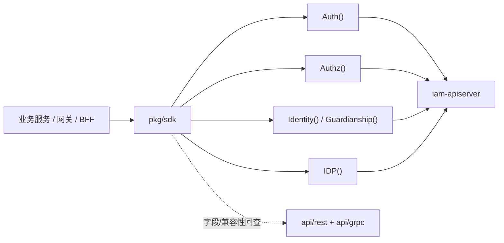
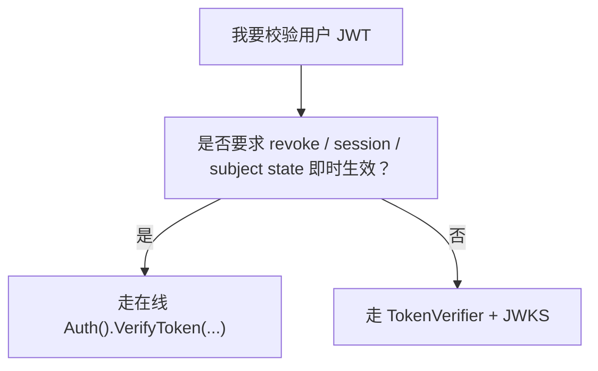
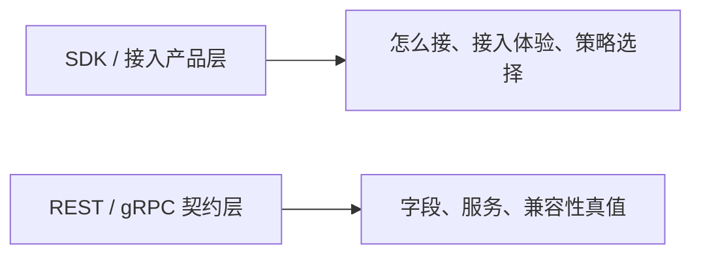

# SDK 封装与接入价值

## 本文回答

本文只回答 5 件事：

1. 为什么 `pkg/sdk` 不是一个薄薄的 wrapper，而是 IAM 的接入产品层
2. 当前 SDK 到底已经替接入方收口了什么复杂度
3. 在线权威校验和本地 JWKS 验签在 SDK 里分别是什么角色
4. 当前 SDK 已经与主代码对齐到了什么程度，还保留了哪些明确限制
5. 接入方什么时候应先读 SDK，什么时候必须回到 REST / gRPC 契约层

## 30 秒结论

> **一句话**：当前 `pkg/sdk` 已经不是“把 gRPC client 再包一层”的薄封装，而是 IAM 面向接入方的 **统一接入层**。它把在线 verify、本地 JWKS 验签、服务间认证、Authz 单次判定、Identity/Guardianship 查询这几条常见接入路径产品化了；同时它也明确保留了边界，例如本地验签不保证 `revoked_access_token / session / user-account state` 的即时生效，`ForceRemote` 也还不是逐次调用级真正切换策略的完整开关。

| 主题 | 当前结论 |
| ---- | ---- |
| SDK 定位 | 统一接入层，不是新的契约真值层 |
| 权威在线校验入口 | `Auth().VerifyToken(...)` |
| 本地验证入口 | `TokenVerifier` + `JWKSManager` |
| `VerifyToken` 当前字段 | 已包含 `session_id / token_id / amr` |
| 当前仍保留的限制 | `ForceRemote` 不是逐次调用级完整开关；高层 `VerifyResult` 仍未完整暴露 metadata |

## 重点速查

| 想回答的问题 | 先看哪里 |
| ---- | ---- |
| SDK 总入口与子客户端 | [../../pkg/sdk/sdk.go](../../pkg/sdk/sdk.go) |
| 在线 token 生命周期消费 | [../../pkg/sdk/auth/client.go](../../pkg/sdk/auth/client.go) |
| 本地 verifier / JWKS | [../../pkg/sdk/auth/verifier.go](../../pkg/sdk/auth/verifier.go)、[../../pkg/sdk/auth/jwks.go](../../pkg/sdk/auth/jwks.go) |
| SDK 文档主入口 | [../../pkg/sdk/docs/README.md](../../pkg/sdk/docs/README.md) |
| 在线 verify 与本地验签边界 | [../../pkg/sdk/docs/04-jwt-verification.md](../../pkg/sdk/docs/04-jwt-verification.md) |
| 服务间认证 | [../../pkg/sdk/docs/05-service-auth.md](../../pkg/sdk/docs/05-service-auth.md) |
| 机器契约真值 | [../03-接口与集成/01-REST契约与接入.md](../03-接口与集成/01-REST契约与接入.md)、[../03-接口与集成/02-gRPC契约与接入.md](../03-接口与集成/02-gRPC契约与接入.md) |

## 1. SDK 在接入链中的位置

SDK 的价值，不在于“少写几行 gRPC stub”，而在于把接入 IAM 的几条主路径收成一个统一入口：

- 用户 token 校验
- 服务 token 生命周期
- 单次授权判定
- 身份与监护关系查询
- IDP 能力消费

**图意**：SDK 不是契约真值层，而是接入层。它负责回答“怎么接最省心”，而不是替代 OpenAPI / Proto 本身。

## 2. SDK 当前已经替接入方收口了什么

### 2.1 认证消费

`Auth()` 现在已经稳定收口了：

- `VerifyToken`
- `RefreshToken`
- `RevokeToken`
- `RevokeRefreshToken`
- `IssueServiceToken`
- `GetJWKS`

它替接入方省掉的是：

- 远程 token 生命周期调用的样板代码
- gRPC request 组装
- 常见错误与配置的统一入口

### 2.2 本地 JWT 验签与 JWKS 管理

SDK 不只是远程 `Auth()`；它还提供：

- `TokenVerifier`
- `JWKSManager`

这层替接入方收口了：

- 本地 JWKS 拉取与缓存
- 本地签名验证
- issuer / audience / time claims 校验
- 常见 fallback 组合

### 2.3 服务间认证

`ServiceAuthHelper` 把这条链路统一起来了：

- 申请 service token
- 提前刷新
- 失败退避
- 用认证上下文发起下游调用

所以 SDK 的真正价值，是把“接 IAM”这件事从零散工具函数收成稳定的接入产品层。

## 3. 在线权威校验 vs 本地 JWKS 验签

这是当前 SDK 最重要的边界。

### 3.1 在线权威校验

当前权威在线校验入口是：

- `Auth().VerifyToken(...)`

它对应服务端真实语义是：

1. 验签
2. 过期检查
3. `revoked_access_token(jti)`
4. `session(sid)`
5. `user/account` 访问状态

所以它是当前唯一能保证这些状态**即时生效**的接入路径。

### 3.2 本地 JWKS 验签

本地验签入口是：

- `TokenVerifier.Verify(...)`

它能保证：

- 签名合法
- `exp / nbf / iss / aud` 等本地声明正确
- JWT 内自带 claims 可直接读取

它不能保证即时生效：

- `revoked_access_token`
- `session revoke`
- `user blocked`
- `account disabled`

**图意**：SDK 不是给你两种等价实现，而是明确提供了“高一致性在线 verify”和“高性能本地验签”两条不同产品路径。

## 4. SDK 当前已对齐的能力

这轮文档必须反映当前代码事实，而不是停留在旧口径。

### 4.1 `VerifyToken` 结果字段已对齐

当前 SDK 高层结果里，已经能拿到：

- `session_id`
- `token_id`
- `amr`

对应代码事实在：

- `api/grpc/iam/authn/v1/authn.proto`
- `internal/apiserver/interface/authn/grpc/service.go`
- `pkg/sdk/auth/verifier.go`

### 4.2 本地 verifier 已能提取 `sid` 与 `jti`

本地 `TokenVerifier` 现在不只回 `user_id` 这些基础字段，也会从 JWT claims 中提取：

- `sid`
- `jti`

这意味着 SDK 已经跟新的 session-aware token 模型对齐，而不是停留在“只有 user/account/tenant”的旧理解。

### 4.3 SDK 已能表达在线 verify 与本地 verifier 两条路

这不是“以后规划”，而是当前已经存在的两条消费面：

- `Auth().VerifyToken(...)`
- `TokenVerifier.Verify(...)`

两者的差异现在已经不是实现细节，而是接入策略差异。

## 5. SDK 当前仍然保留的限制

当前 SDK 仍有两处值得明确写进文档的限制。

### 5.1 `ForceRemote` 还不是逐次调用级的完整策略开关

`VerifyOptions.ForceRemote` 现在会透传到远程 `VerifyTokenRequest`，但它**不是**高层 `TokenVerifier.Verify()` 的真正逐次调用级策略切换开关。  
当前验证策略仍然主要在 verifier 构造时决定。

所以如果接入方读到 `ForceRemote`，不应误以为它已经具备“每次 Verify 都能强制改走另一条验证链”的完整语义。

### 5.2 `IncludeMetadata` 仍未完整浮出到高层结果

当前：

- `IncludeMetadata` 已能透传到远程 `VerifyTokenRequest`

但高层：

- `VerifyResult` 仍未完整暴露 `TokenMetadata`

如果调用方需要完整 metadata，当前仍更适合直接使用：

- `client.Auth().VerifyToken(...)`

而不是只依赖高层 verifier 结果。

## 6. 何时先读 SDK，何时必须回契约层

### 6.1 先读 SDK 的场景

这些场景今天都应优先看 SDK：

- 网关 / BFF 校验用户 JWT
- 服务间认证
- 单次授权判定
- 身份 / 监护关系查询
- IDP 应用 token 消费

因为这些场景里，SDK 解决的不是“能不能调用”，而是“如何用一套稳定方式调用”。

### 6.2 必须回契约层的场景

这些场景必须回到 REST / gRPC 契约：

- 核对字段名与 wire shape
- 核对错误语义
- 判断兼容性与升级影响
- 判断服务端有没有真的暴露某个能力

**图意**：SDK 负责接入体验，契约层负责真值；两者不是替代关系。

## 继续往下读

| 文档 | 说明 |
| ---- | ---- |
| [../../pkg/sdk/docs/README.md](../../pkg/sdk/docs/README.md) | SDK 文档总入口 |
| [../../pkg/sdk/docs/04-jwt-verification.md](../../pkg/sdk/docs/04-jwt-verification.md) | 在线 verify 与本地验签的详细接入说明 |
| [../../pkg/sdk/docs/05-service-auth.md](../../pkg/sdk/docs/05-service-auth.md) | 服务间认证生命周期 |
| [../03-接口与集成/05-QS接入IAM.md](../03-接口与集成/05-QS接入IAM.md) | 业务系统今天怎样优先使用 SDK 接 IAM |
| [../02-业务域/01-authn-认证&Token&JWKS.md](../02-业务域/01-authn-认证&Token&JWKS.md) | Session、Token、JWKS 的服务端主模型 |
| [../03-接口与集成/01-REST契约与接入.md](../03-接口与集成/01-REST契约与接入.md) | REST 契约解释层 |
| [../03-接口与集成/02-gRPC契约与接入.md](../03-接口与集成/02-gRPC契约与接入.md) | gRPC 契约解释层 |
