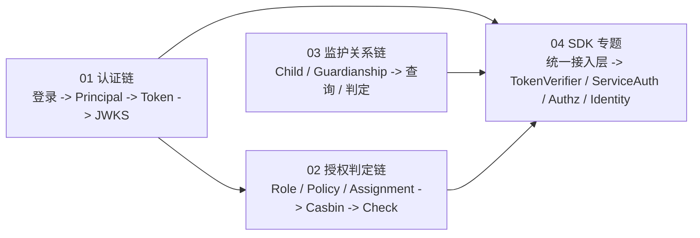
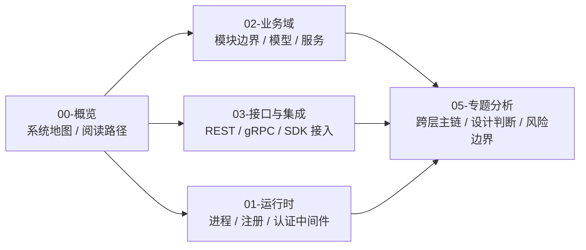

# 专题分析

## 本文回答

本组 README 只回答 4 件事：

1. 为什么 `05-专题分析` 需要单独存在
2. 当前这 4 篇专题分别在讲什么，应该先看哪篇
3. 这一组和 `02-业务域`、`03-接口与集成`、`01-运行时` 怎么分工
4. 专题文应该如何放图、如何继续扩充

## 30 秒结论

> **一句话**：`05-专题分析` 负责把 `iam-contracts` 里“跨层才能讲清楚”的主链路和设计判断单独拉出来讲，它不替代业务域正文，也不替代契约层，而是把 **对象、运行时链路、工程边界、当前保证与风险边界** 串成读者可以一口气读懂的专题文。

| 问题 | 当前答案 |
| ---- | ---- |
| 为什么需要这一组 | 因为认证、授权、监护关系、SDK 接入价值都不是单一模块能讲清的 |
| 当前已有哪些专题 | 认证链、授权判定链、监护关系链、SDK 封装与接入价值 |
| 这组最适合做什么 | 讲跨层主链、设计取舍、工程边界、当前风险 |
| 这组不适合做什么 | 不适合代替 `02-业务域` 写静态模型，也不适合代替 `api/*` 写契约真值 |

## 重点速查

| 想回答的问题 | 先打开哪里 |
| ---- | ---- |
| 登录请求如何走到认证、Token、JWKS？ | [01-认证链路：从登录请求到 Token 与 JWKS.md](./01-认证链路：从登录请求到 Token 与 JWKS.md) |
| 角色、策略、资源、Assignment、Casbin 今天怎么协作？ | [02-授权判定链路：角色、策略、资源、Assignment、Casbin.md](./02-授权判定链路：角色、策略、资源、Assignment、Casbin.md) |
| 用户、儿童、Guardianship 今天怎么协作？ | [03-监护关系链路：用户、儿童、Guardianship 的协作.md](./03-监护关系链路：用户、儿童、Guardianship 的协作.md) |
| 为什么 `pkg/sdk` 不只是 wrapper，而是接入主轴？ | [04-SDK封装与接入价值.md](./04-SDK封装与接入价值.md) |
| 认证域静态结构在哪里？ | [../02-业务域/01-authn-认证、Token、JWKS.md](../02-业务域/01-authn-认证、Token、JWKS.md) |
| 授权域静态结构在哪里？ | [../02-业务域/02-authz-角色、策略、资源、Assignment.md](../02-业务域/02-authz-角色、策略、资源、Assignment.md) |
| 用户域静态结构在哪里？ | [../02-业务域/03-user-用户、儿童、Guardianship.md](../02-业务域/03-user-用户、儿童、Guardianship.md) |
| REST / gRPC 契约入口在哪里？ | [../03-接口与集成/01-REST契约与接入.md](../03-接口与集成/01-REST契约与接入.md)、[../03-接口与集成/02-gRPC契约与接入.md](../03-接口与集成/02-gRPC契约与接入.md) |
| 运行时边界在哪里？ | [../01-运行时/README.md](../01-运行时/README.md) |

## 1. 为什么 `05-专题分析` 需要单独存在

如果只看 `02-业务域`，你能知道模块边界、模型和主要服务，但不一定能一口气看懂：

- 登录请求是怎么一路走到 Token 和 JWKS 的
- 策略和 Assignment 最终怎样变成一次 Casbin 判定
- `Child / Guardianship` 如何同时影响写链、查询链和访问控制
- SDK 为什么不只是“多一个客户端包”

这些问题都需要同时回看：

- interface
- application
- domain
- infra
- 契约层 / 运行时层

所以这组文档的职责是：把“跨层才能讲清的问题”单独抽出来。

## 2. 当前这 4 篇专题分别在讲什么

### 2.1 专题地图

**图意**：这 4 篇不是平铺的信息堆，而是分别覆盖“认证主链”“授权主链”“身份关系主链”“接入主轴”。

### 2.2 每篇现在各自负责什么

| 文档 | 现在主要回答什么 |
| ---- | ---- |
| [01-认证链路：从登录请求到 Token 与 JWKS.md](./01-认证链路：从登录请求到 Token 与 JWKS.md) | 登录如何变成 `Principal`，再进入 Token 生命周期、JWT 中间件和 JWKS 发布与轮换 |
| [02-授权判定链路：角色、策略、资源、Assignment、Casbin.md](./02-授权判定链路：角色、策略、资源、Assignment、Casbin.md) | Role / Resource / Policy / Assignment 如何变成 Casbin `p/g` 规则，并被 REST / gRPC / 中间件消费 |
| [03-监护关系链路：用户、儿童、Guardianship 的协作.md](./03-监护关系链路：用户、儿童、Guardianship 的协作.md) | `建档 + 授监护` 如何工作，查询链和 `revoked_at` 目前有什么边界 |
| [04-SDK封装与接入价值.md](./04-SDK封装与接入价值.md) | SDK 在接入链里的位置、能力面、接入决策，以及哪些能力已可依赖 |

## 3. 这一组和 `02/03/01` 怎么分工

### 3.1 分层关系图

### 3.2 更具体的职责分工

| 组别 | 主要负责什么 | 不主要负责什么 |
| ---- | ---- | ---- |
| `02-业务域` | 模块边界、领域模型、应用服务、静态结构 | 不主讲跨层运行时主链 |
| `03-接口与集成` | 契约解释层、接入方式、调用方视角 | 不主讲内部领域协作细节 |
| `01-运行时` | 进程、服务注册、认证中间件、gRPC / 健康检查 | 不主讲完整业务主链 |
| `05-专题分析` | 跨层主链、设计取舍、当前保证与风险边界 | 不替代静态模型文或契约真值 |

**结论**：`05-专题分析` 最适合做“把系统串起来”的那一层，而不是“把其它文档再重复讲一遍”的那一层。

## 4. 专题文应该如何放图、如何继续扩充

### 4.1 图表使用原则

专题文应该多用图，但图要放在它第一次真正解释问题的地方，而不是机械地堆在开头。

| 图类型 | 更适合放在哪里 | 它回答什么 |
| ---- | ---- | ---- |
| 总览图 | 文首或第一个总览小节 | 这篇专题整体在讲什么 |
| 对象关系图 / 设计图 | “对象 / 职责 / 关系”首次展开处 | 核心对象如何协作 |
| 工程流程图 / 时序图 | “写链 / 读链 / 调用顺序”小节 | 运行时按什么顺序发生 |
| 保证与风险边界表 | 专门的“保证 / 风险”小节 | 哪些已实现，哪些不能讲过头 |

### 4.2 当前这组专题已经统一到的结构

当前 4 篇专题都已经收成了同一套骨架：

1. `本文回答`
2. `30 秒结论`
3. `重点速查`
4. 按问题展开的 3～4 个正文段
5. `保证与风险边界`
6. `继续往下读`

所以后续新专题也应优先沿用这套结构，而不是再回到“大段铺陈 + 最后给结论”的写法。

### 4.3 下一批可扩展主题

如果继续扩展，本组更适合新增这些跨层专题：

- **JWT 本地验签 vs 远程 `VerifyToken` 决策链**
- **Suggest 联想数据链**：SQL → Store → REST，以及它和监护语义的边界
- **请求进入 `iam-apiserver` 后的模块装配与调用总览**

原则是一样的：

- 只有“跨层才能讲清”的问题，才值得进 `05-专题分析`
- 如果一篇文主要只讲静态模型，就应回 `02-业务域`
- 如果一篇文主要只讲契约和接入，就应回 `03-接口与集成`

## 继续往下读

| 文档 | 说明 |
| ---- | ---- |
| [01-认证链路：从登录请求到 Token 与 JWKS.md](./01-认证链路：从登录请求到 Token 与 JWKS.md) | 认证与 Token 主链 |
| [02-授权判定链路：角色、策略、资源、Assignment、Casbin.md](./02-授权判定链路：角色、策略、资源、Assignment、Casbin.md) | 授权管理链与单次 PDP |
| [03-监护关系链路：用户、儿童、Guardianship 的协作.md](./03-监护关系链路：用户、儿童、Guardianship 的协作.md) | 监护关系写链、查询链与合同边界 |
| [04-SDK封装与接入价值.md](./04-SDK封装与接入价值.md) | SDK 作为接入主轴的价值与边界 |
| [../02-业务域/README.md](../02-业务域/README.md) | 回到模块静态设计 |
| [../03-接口与集成/README.md](../03-接口与集成/README.md) | 回到契约与接入层 |
