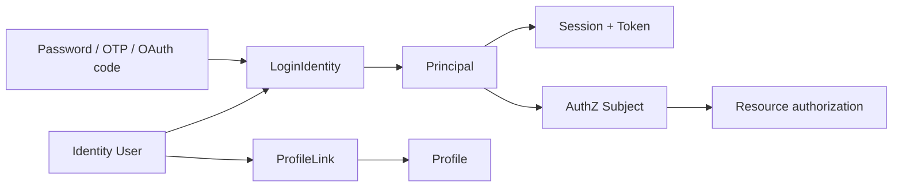

# 身份、认证与授权为什么必须分开

> 状态：已实现 · 本文以当前 Identity/AuthN/AuthZ 边界为基础沉淀概念关系与方案演化，未落地增强项明确标记。

## 1. 六个常被混淆的名词

```text
User          业务主体
LoginIdentity 可登录入口
Principal     本次认证结果
Session       持续登录状态
Subject       可赋权引用
Profile       业务档案
```

一次典型请求：



每个箭头都是显式映射或关系，没有哪个对象“天然等于”另一个。

## 2. 为什么 User 不直接保存登录方式

User 的变化原因是激活、封禁和业务身份管理；LoginIdentity 的变化原因是 provider 验证、绑定、禁用和解绑。一 User 对多登录身份，拆分后才能独立生命周期和 provider 扩展。

详见 [AuthN 领域模型](../02-业务模块/02-AuthN/01-领域模型与认证策略.md)。

## 3. 为什么 Principal 不能直接当权限

Principal 只说明“这次请求通过什么方式认证成谁”，不说明其在 tenant 下拥有哪些 Role。权限可能在 token 签发后立即被撤销，放入 Principal/JWT 会被冻结到 token 过期。

AuthZ 把 Principal 映射为 Subject，再用当前原生不可变快照对 Resource/Action 匹配判定。
详见 [AuthZ 领域模型设计](../02-业务模块/03-AuthZ/01-领域模型设计.md)。

## 4. ProfileLink 为什么不是 PermissionGrant

ProfileLink 是 Identity 拥有的用户—档案业务关系，回答“User 与这个 Profile 有什么关系”；PermissionGrant 回答“某 Role 对 Resource/Action 是否拥有无条件或对象条件
allow”。Subject 是否获得该能力还需要 Assignment 和 RoleInheritance。

关系事实可以作为授权输入，但不能直接等价：

- 同一 ProfileLink 关系对 read/update/export 的权限不同；
- 权限还受 Role、PermissionGrant、受信对象属性和当前状态约束；
- Identity 事务不应直接写 Assignment 或 PermissionGrant 代替业务关系；
- AuthZ 不应成为 ProfileLink 主数据源。

详见 [Identity 领域模型](../02-业务模块/01-Identity/01-领域模型-User-Profile-ProfileLink.md)。

## 5. Authentication 与 Authorization 的 TOCTOU

登录时 User active、权限允许，不代表后续请求仍成立。当前有两种收敛：

- AuthN 在线 token verify 重查 Session 与 User/LoginIdentity 状态；
- 每次敏感操作由 AuthZ Check 当前 immutable runtime snapshot。

本地 JWKS verify 只做签名/claims，存在状态撤销窗口；它适合低延迟路径，但高风险操作应选在线语义或足够短 token TTL。

## 6. 单一授权空间与业务组织

身份核验确认主体，登录准入决定是否接受本次登录，会话记录在线状态，令牌承载访问事实。AuthZ 使用统一角色空间：主体分配角色，角色通过继承和权限授予获得能力。角色管理保护独立于 `IsSystem`，敏感操作必须具备明确权限。业务 OrgID 仍用于对象约束，Realm 仍用于身份提供方命名空间。

## 7. 三个正交坐标：连续性、可信度与权力

身份系统中最常见的建模错误，是把“同一个人”“已证明是这个人”“这个人有权做某事”压成一个布尔状态。实际上它们是三个正交坐标：

| 坐标 | 核心问题 | 主要对象 | 典型变化 |
| --- | --- | --- | --- |
| identity continuity | 系统长期把谁视为同一主体 | User、Profile、ProfileLink、LoginIdentity 绑定 | 合并、解绑、封禁、关系撤销 |
| authentication assurance | 本次请求以多强证据证明了谁 | Challenge、Credential、Principal、Session、Token | 登录、MFA、刷新、过期、吊销 |
| authorization power | 在当前上下文能执行什么 | Subject、Assignment、PermissionGrant、Resource、Action | grant、revoke、策略 reload |

同一个 User 可以同时出现：

```text
identity continuity = 稳定存在
authentication assurance = 当前没有有效 Session
authorization power = 仍持有某些 Assignment，并通过 RoleInheritance 获得 PermissionGrant
```

也可以出现：

```text
JWT signature = valid
Session = revoked
User = blocked
AuthZ Check = allow
最终请求 = 必须拒绝
```

最终请求的安全性是多个条件的合取，不是任一条件成立即可：

```text
authenticated_now
AND subject_currently_accessible
AND session_not_revoked
AND request_context_trusted
AND authorization_decision_allowed
```

这解释了为什么“JWT 能验签”与“请求应该放行”不是同一个结论。

## 8. 对象生命周期为什么必须分开

### 8.1 User 与 LoginIdentity

User 是内部稳定锚点；LoginIdentity 是可登录入口。二者变化原因不同：

- User 因业务主体创建、激活、停用或封禁而变化；
- LoginIdentity 因手机号、用户名、微信/企微标识的绑定、禁用、解绑而变化；
- 同一个 User 可以有多个 LoginIdentity；
- LoginIdentity 失效不应删除 User/Profile 历史；
- User blocked 应影响其所有登录入口和会话，而不是逐条修改外部标识。

如果把 provider identifier 直接作为 User 主键，provider realm、应用或账号迁移都会改变内部身份；跨 provider 合并也只能靠业务表到处保存特殊规则。

### 8.2 Credential、Challenge 与 LoginIdentity

Credential 是可重复验证的长期或中期秘密材料；Challenge 是一次性、短生命周期的认证状态；LoginIdentity 只是“可以用哪种方式找到主体”。

```text
LoginIdentity(username) --uses--> Password Credential
LoginIdentity(phone)    --uses--> OTP Challenge
LoginIdentity(wechat)   --uses--> provider code verification
```

把 OTP code 写进 Credential 会混淆一次性消费和长期轮换；把 password hash 写进 User 又让 Identity 被迫理解认证算法。当前拆分使 password、OTP、
provider proof 共享“产生 Principal”的主线，但各自拥有不同 verifier 和防重放策略。

### 8.3 Principal、Session 与 Token

Principal 是认证结果的语义对象；Session 是服务端持续状态；Token 是跨请求携带认证声明的凭证。

```text
Principal：谁、通过什么方式、属于哪个认证上下文
Session：这次登录是否仍活跃，能否继续刷新
AccessToken：短期把 Principal 声明带给请求处理方
RefreshToken：证明持有续期资格，只交给 AuthN
```

无状态 JWT 只消除了“每次解析声明都查数据库”的需要，没有消除封禁、登出、密钥轮换、权限撤销等状态问题。当前 IAM 选择短期 JWT + 在线 Session/主体检查并存，而不是声称系统完全无状态。

### 8.4 Principal 与 Subject

Principal 包含本次认证的细节，Subject 是可赋权的稳定引用。映射分开有三个价值：

1. 同一 User 的多个 LoginIdentity 可以共享授权；
2. service/group 等非人类主体可以进入统一 AuthZ 模型；
3. 认证强度可以作为额外上下文，而不是污染 Assignment 主键。

如果某操作要求 step-up authentication，应在可信 Principal 上检查 assurance/auth method，再用 Subject 做资源授权；不能通过给“刚做过 MFA 的人”创建临时永久角色来表达。

## 9. ProfileLink、Assignment 与 PermissionGrant 的推理链

三者虽然都像关系边，但分别属于事实、授权绑定和动作能力：

```text
ProfileLink(User, Profile, relation)
    说明业务关系
    ↓ 可作为可信事实输入
业务服务加载对象并验证关系
    检查业务对象范围与状态
    ↓
Check(Subject, Resource, Action)
    由直接 Assignment 与 PermissionGrant 得到动作 allow/deny
```

为什么需要中间的翻译：

- guardian 关系可以允许 read，但不一定允许 export/delete；
- staff 可能没有 ProfileLink，却通过组织角色获得工作权限；
- 同一关系在不同 tenant 或业务应用中的权限不同；
- ProfileLink 撤销是 Identity 事实变化，授权系统仍需定义传播和旧权限窗口。

“关系即权限”只在规则极简单且永不演进时看似方便。一旦动作、例外和审计出现，隐式权限就会变得不可解释。

## 10. 认证与授权的时间模型

登录时刻 `t0` 与资源请求时刻 `t1` 之间可能发生：

- User 被 blocked；
- LoginIdentity 被 disabled/unlinked；
- Session 被 logout/revoke；
- AccessToken 被加入撤销标记；
- Assignment 或 PermissionGrant 被 revoke；
- signing key 因安全事件被撤销。

因此系统必须选择每类状态在 `t1` 如何重新求值：

| 状态 | 本地 JWT 验签 | IAM 在线验证 | AuthZ Check |
| --- | --- | --- | --- |
| 签名、issuer、audience、时间 | 检查 | 检查 | 依赖上游可信 Principal |
| AccessToken revocation | 不检查 | 检查 | 不负责 |
| Session/User/LoginIdentity 当前状态 | 不检查 | 检查 | 不负责认证生命周期 |
| 当前 Assignment/PermissionGrant | 不检查 | 不负责资源授权 | 检查当前 immutable runtime snapshot |

不存在“永远最优”的统一模式：

- 本地验签延迟低、隔离 IAM 故障，但撤销窗口由 Token TTL 决定；
- 在线验证撤销更及时，但增加网络依赖和中心容量压力；
- 短 TTL 能缩小窗口，却增加刷新流量和密钥/时钟敏感性；
- introspection cache 能降压，但重新引入缓存新鲜度问题。

当前文档要求接入方按操作风险选择，而不是把 SDK 本地 verifier 描述成在线 verify 的等价替代。

## 11. 方案演化与当前选择

### 11.1 单体 User 表

方案：User 同时保存档案、password hash、openid 和 role。

优点是早期查询简单；问题是四种变化原因耦合，外部 provider 迁移会影响主体标识，角色变化污染身份事实，多档案关系难表达。当前拆分模型接受更多映射和事务编排，以换取独立生命周期。

### 11.2 登录成功时把全部权限写入 JWT

优点是业务服务完全本地判断；问题是 revoke 延迟到 Token 过期、跨 tenant claim 膨胀、策略解释与审计分散。当前 JWT 主要承载认证声明，服务端 AuthZ 保留资源动作决策。

对极低风险、离线或网络隔离场景，可以设计窄 audience、短期、显式 capability 的 Token；那是独立凭证类型，不应扩大普通 AccessToken 的默认语义。

### 11.3 每次请求统一远程 IAM 判定

优点是状态集中且撤销即时；问题是所有业务流量增加网络跳转，IAM 故障会扩大为全系统故障。当前同时提供在线能力和 JWKS 本地验证基础，允许按风险选取；但无论如何，资源授权仍需在服务端可靠执行。

### 11.4 把认证和授权合成一个 middleware

工程上可以串联，语义上必须保留阶段：先建立可信 Principal，再构造 Subject/Resource/Action，最后 Check。
阶段分离才能正确映射 Unauthenticated 与 PermissionDenied，也能独立度量 token failure 和 policy deny。

## 12. 当前跨模块不变量

1. IDP 返回的 ExternalIdentity 必须经 AuthN LoginIdentity 映射，不能直接成为 User/Subject；
2. Principal 必须来自可信 middleware/service identity，不能取请求体自报字段；
3. Subject 必须由服务端可信认证上下文建立；业务属性不提交 IAM；
4. ProfileLink 不直接写成 Assignment、PermissionGrant 或角色图边；
5. User block/deactivate 的 Session 撤销意图与状态同事务提交；
6. 敏感请求不能仅以 UI 能力或 Snapshot 作为授权证据；
7. 本地验签、在线主体检查和资源授权的能力差异必须对接入方可见。

## 13. 面试追问

### 认证和授权能合成一个 middleware 吗？

实现上可以串联，但概念和失败语义不能合并。认证失败是 Unauthenticated，身份可信但无权限是 PermissionDenied；缓存、审计和演进也不同。

### 用户被封禁后 JWT 为什么还能验签成功？

签名只证明签发时的声明未被篡改。封禁是签发后的状态变化，需要在线 subject access/session check 或等待短 token 过期。

### Profile 所有者是否天然可以做任何事？

不是。所有权只是授权输入，还需按 Action、PermissionGrant 和业务状态判定。尤其导出、分享、删除等动作通常需要额外权限。

## 14. 事实来源与验证

- 统一关系图：[跨模块统一模型](../00-概览/06-跨模块统一模型.md)
- Identity：`internal/apiserver/domain/identity`、`internal/apiserver/application/identity`
- AuthN：`internal/apiserver/domain/authn`、`internal/apiserver/application/authn`
- AuthZ：`internal/apiserver/domain/authz`、`internal/apiserver/application/authz`
- 组合与信任上下文：`internal/apiserver/container`、`internal/apiserver/transport`

```bash
go test ./internal/apiserver/domain/... ./internal/apiserver/application/... ./internal/apiserver/container/...
```
