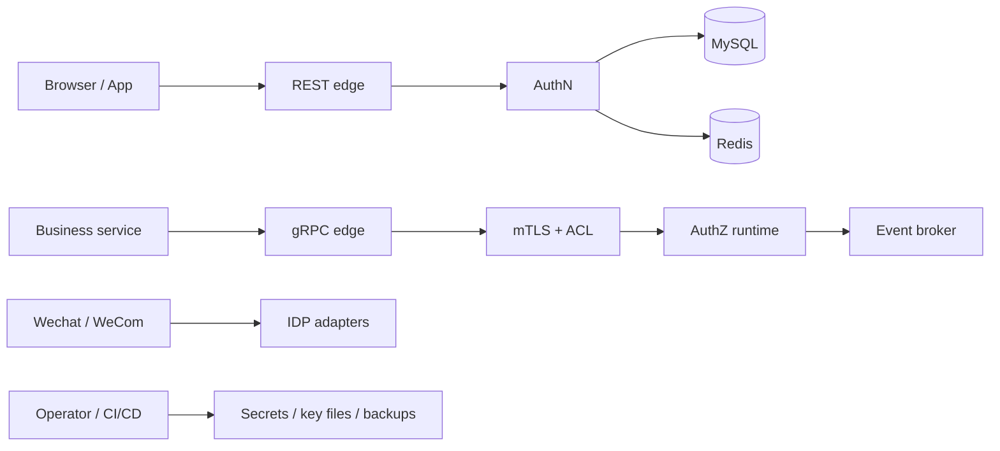

# IAM 威胁模型与安全边界

> 状态：已实现 · 保护对象、信任边界、现有控制和残余风险已按当前实现复核；增强项不作为当前能力。

## 1. 保护对象

IAM 至少保护：

- 用户账户和 Profile 关系；
- password/OTP/OAuth proof；
- Session、access/refresh token；
- JWT 私钥和 IDP AppSecret；
- Role/Assignment/RoleInheritance/PermissionGrant/ConstraintSet；
- 审计/运行日志中的身份元数据；
- 管理接口与数据库备份。

攻击者可能是外部匿名者、已登录普通用户、被攻陷业务服务、内部操作者、读取数据库/Redis/日志的人，或控制部分网络/依赖的人。不同信任边界需要不同控制。

## 2. 威胁建模方法

本文不按 OWASP 名词罗列漏洞，而按一条攻击链分析：

```text
攻击者控制什么输入或组件？
  -> 跨越哪条信任边界？
  -> 试图伪造哪类事实/证明/决策？
  -> 当前哪一层阻断？
  -> 阻断失败后下一道控制是什么？
  -> 能否检测、撤销和恢复？
```

IAM 的安全不能只依赖入口校验。一个高价值操作通常需要：

```text
prevent   TLS/认证/授权/数据库约束阻止非法状态
contain   短 TTL、tenant 隔离、最小权限限制爆炸半径
detect    audit/metric/readiness 发现异常和陈旧状态
respond   revoke/rotate/drain/restore 收敛风险
prove     测试、契约和生产证据证明控制实际存在
```

只写“使用 JWT、AES、Casbin”不能构成威胁模型，因为算法/组件并不说明 key custody、可信输入、撤销窗口和运行失败时的行为。

## 3. 信任边界地图



边界及默认假设：

| 边界 | 不可信输入 | 可信化条件 | 失败方向 |
| --- | --- | --- | --- |
| client -> REST | header/body/query 和对象 ID | schema + AuthN + 服务端上下文 + AuthZ | 缺条件即拒绝 |
| service -> gRPC | 网络连接、Bearer/HMAC/API key | TLS/mTLS、应用身份、ACL | 管理 RPC fail closed |
| provider -> IDP | code exchange response、错误和限流 | TLS、官方协议、最小字段校验 | 不降级信任客户端声明 |
| process -> MySQL/Redis | 连接成功不代表数据语义正确 | repository invariants、transaction/Lua | 错误显式传播 |
| broker -> subscriber | 重复、延迟、乱序事件 | catalog、payload 校验、幂等 reload | 不把事件当完整事实 |
| deploy -> key/secret | 文件、环境和操作员权限 | Secret 注入、权限、审计和轮换 | 缺关键 secret 禁止生产启动 |

## 4. 入口威胁

| 威胁 | 当前控制 | 仍需关注 |
| --- | --- | --- |
| 密码爆破 | 失败计数/锁定、统一错误 | 分布式速率、账号枚举 |
| OTP 滥发/猜测 | gate、quota、TTL、原子消费、scene | provider 成本、SIM swap |
| OAuth login CSRF/replay | state/nonce Challenge 消费 | redirect allowlist、code 时效 |
| 账号绑定劫持 | provider proof、最近认证、唯一约束 | recovery/social engineering |
| 解绑锁死 | 最后 active identity 原子保护 | 管理员恢复流程 |
| token 重放 | short access TTL、session/revocation、refresh rotation | token family reuse detection |

## 5. 密钥威胁

JWT 签名私钥与 IDP secret 使用不同保护方式：

| 材料 | 当前存储保护 | 泄漏边界 |
| --- | --- | --- |
| JWT 签名私钥 | 未加密的 PKCS#8/PKCS#1 PEM；目录 0700、文件 0600；MySQL 只保存 public JWK 和元数据 | 读取 PEM 目录或其备份可得到私钥，文件权限不等于内容加密 |
| IDP AppSecret/消息密钥 | AES-GCM 密文落库，master key 来自部署 Secret/进程 | 只读数据库不足以解密；同时获得 master key 则失去保护 |
| 用户密码 | Argon2id 哈希与独立 pepper | 防护目标是提高离线猜解成本，不能恢复原文 |

具体算法、存储与备份对象以 [密码学边界](../03-基础设施/04-密码学密钥与令牌.md) 为唯一详细说明。不能从 IDP Vault 的加密能力推导 JWT 私钥也经过同一 Vault。

生产需要权限分离、Secret 注入、文件权限、轮换、备份加密和日志禁止。KMS/HSM 能改善 key custody 和审计，但当前 IDP Vault 不是 KMS 等价实现。

### 5.1 加密正确不等于密钥管理正确

AES-GCM 同时提供机密性和完整性，但前提是 nonce 唯一、master key 受控、AAD/上下文不被混用。当前本地 Vault 的主要残余风险不是算法，而是：

- master key 与应用进程处于同一信任域；
- 缺少 key version，master key 轮换和历史密文迁移困难；
- 数据库与部署 Secret 同时泄漏时无法继续保护；
- secret 轮换与 provider token cache invalidation 没有统一协议。

Envelope encryption/KMS 的价值是把“能读数据库”和“能解密 secret”拆给不同权限与审计面，而不是换一个更花哨的算法。

### 5.2 JWT 私钥和 IDP AppSecret 的差别

二者都敏感，但爆炸半径不同：

- JWT signing key 泄漏允许攻击者伪造 IAM 身份声明，必须紧急停用 key、刷新 JWKS 和缩短旧 token 信任；
- provider AppSecret 泄漏允许调用特定外部应用能力，需要 provider 侧轮换并处理现有 AppToken；
- password hash 泄漏需要离线破解防护，因此使用慢哈希而不是可逆加密。

事故预案必须按凭据类型区分，不能统一写“修改密码”。

## 6. 授权威胁

- confused deputy：服务用客户端提供的 Subject 做 Check；
- stale revoke：某实例不可变授权快照未 reload；
- over-broad pattern：受信系统 Grant 的 resource/action wildcard 过宽；
- UI-only auth：前端隐藏按钮但服务未 Check；
- route/object mismatch：路由 capability 通过后未加载对象并执行所需的 ObjectAttribute Check；
- service credential compromise：可信服务 token 被用于越权管理 RPC。

控制包括可信上下文构造、default deny、PermissionGrant/Resource Schema 校验、per-instance broadcast/reload health、
mTLS + ACL 和敏感操作对象级 Check。

### 6.1 Confused deputy 的完整路径

典型攻击不是绕过某个 matcher，而是诱导高权限服务替攻击者选择错误输入：

```text
普通用户提交 tenant=admin-tenant, subject=service:root
  -> handler 原样构造 CheckCommand
  -> authorization runtime 对这组伪造输入正确返回 allow
```

因此值对象格式合法远远不够。Subject 来自已验证用户上下文或 service identity，Resource/Action 来自服务端注册表，对象属性来自服务端已加载的领域对象。
这些构造点都属于授权机制的一部分。

### 6.2 撤权比赋权更危险

grant 传播慢通常造成暂时拒绝；revoke 传播慢可能继续放行。对二者使用相同“最终一致即可”的 SLO 会低估风险。

当前通过 durable outbox、每实例 channel、reload health/readiness 收敛，但没有 per-tenant loaded-version barrier。因此应急撤权仍需结合摘流量、
在线确认或更强栅栏，不能仅依据写接口 200 响应。

## 7. 数据泄漏威胁

Suggest 内存含手机号，日志过去可能包含 token/SQL，备份含完整业务数据。输出脱敏只是最后一道控制：

- 日志完全省略 credential 和 body；
- production 禁止关闭 mobile mask；
- debug/heap dump受严格访问控制；
- 备份目录/文件权限、保留和恢复审计；
- maintenance 删除范围精确且默认 dry-run；
- 错误响应不泄露 internal err。

### 7.1 搜索为什么是特殊泄漏面

联想搜索同时容易造成存在性枚举、手机号匹配和越权候选泄漏。安全顺序必须是：

```text
认证调用方
  -> route permission
  -> 解析可见 Profile scope
  -> 召回候选
  -> 在最终 limit 前过滤
  -> 输出字段脱敏
```

只做输出脱敏仍可能通过“是否命中、结果数、排序变化”泄漏存在性；只在取前 N 条后过滤又会让无权候选挤占可见结果并形成侧信道。

### 7.2 日志和备份不是低风险副本

日志、heap/core dump、数据库备份会绕过在线 API 的字段脱敏和授权。它们必须有独立的权限、保留、加密、删除和恢复审计；“生产接口不返回 secret”不能证明离线副本安全。

## 8. 可用性与安全的冲突

- Redis 故障时 token online verify 若 fail open 会扩大信任；当前关键认证状态应 fail closed；
- Suggest rate limiter fail open 保持可用但降低抗滥用；
- remote token verify fallback local 提高可用但牺牲即时撤销；
- AuthZ stale policy 对 revoke 风险大于 grant；
- provider 不可用不能降级为信任客户端 openid。

每个降级都要写清“失去什么安全语义”，不能只写可用性提升。

### 8.1 Fail-open/Fail-closed 不是全局开关

应按失效对象决定：

| 依赖失败 | fail-open 后果 | 当前合理方向 |
| --- | --- | --- |
| Session/User 状态存储 | 被撤销主体继续访问 | fail closed |
| AuthZ runtime/reload health | 旧权限继续生效 | 高风险路径 fail closed/not ready |
| provider identity verification | 客户端可伪造身份 | fail closed |
| Suggest rate limiter | 搜索滥用增加 | 当前可用性优先但必须告警 |
| 非关键指标导出 | 失去观测 | 请求可继续，单独告警 |

同一 Redis 故障在 Session store 与限流器上可以有不同策略；“Redis 不可用统一降级”是错误抽象。

## 9. 审计与隐私

审计需要 actor、action、resource、tenant、request ID、结果和时间；隐私要求不收集秘密、最小化个人数据、限制保留。好的审计记录“发生了什么”，不是复制整个请求/响应。

对 Grant/Revoke、credential rotation、session revoke、database restore 等高风险动作，还需记录 change reason、批准/操作者和事实版本，
但不能把 secret/token 或完整 SQL 作为证据。

### 9.1 审计事实与普通日志

普通运行日志服务排障，可以采样和轮转；安全审计服务追责，需要防篡改、稳定事件 schema、受控保留和访问记录。当前代码中的 audit interceptor/日志不应被自动描述为完整合规审计平台。

同样，“没有在日志搜索到 secret”只证明给定样本，不能证明所有错误分支都安全。应优先从数据流和架构测试阻止 credential/body 进入 logger，再用运行抽样补证。

## 10. 方案比较：单层控制为什么不够

| 单层方案 | 看似收益 | 失败原因 | 当前组合 |
| --- | --- | --- | --- |
| 只有 JWT 签名 | 全本地、快 | 不感知撤销和权限变化 | 短 TTL + 在线状态 + AuthZ |
| 只有 mTLS | 服务身份强 | 不表达 RPC/业务动作权限 | mTLS + app auth + ACL/AuthZ |
| 只有数据库加密 | 静态数据保护 | app/master key 泄漏后失效 | 加密 + key custody +权限+轮换 |
| 只有前端隐藏 | 体验简单 | 请求可直接伪造 | 服务端 Check |
| 只有缓存 TTL | 自动过期 | 窗口内仍可能越权 | 主动撤销/version + TTL 兜底 |
| 只有日志审计 | 事后可查 | 无法阻止攻击，日志也可泄漏 | 预防 + 检测 + 响应 |

深度防御不是机械堆控制，而是让相邻控制覆盖不同失败模式。例如 User 状态在线检查覆盖 Session revocation worker 延迟；数据库 single-active guard 覆盖应用预检查的并发窗口。

## 11. 当前未完全覆盖的增强项

- KMS/envelope encryption 与 master-key versioning；
- refresh token family/reuse detection；
- WebAuthn/强 MFA 和更细 step-up authentication；
- AuthZ per-tenant loaded-version barrier；
- Suggest 手机号 HMAC 索引与跨实例 generation；
- 后台任务 join/有界 shutdown；
- 独立 migration runner 与生产权限分离的实证。

这些是设计建议，不是当前已实现能力。

## 12. 事故响应推演

### JWT signing key 疑似泄漏

1. 识别受影响 `kid`、签发窗口和 audience；
2. 停止该 key 签发并按风险提前撤销发布；
3. 激活可信新 key、确认 JWKS 分发；
4. 评估未过期 token，必要时强制 Session/AccessToken 撤销；
5. 检查 key file、部署 Secret、日志和备份访问证据；
6. 记录对可用性的有意破坏，不能为保持旧 token 可用而继续信任泄漏 key。

### AuthZ revoke 后仍被允许

按 `committed -> published -> delivered -> loaded -> checked` 逐层定位，不能只重复写 revoke。需要确认命中的实例/ channel、reload error/time、
实际 matcher input 和 Decision matched policy。

### provider AppSecret 轮换后调用失败

同时检查数据库密文、master key 解密、provider 端新 secret、Redis AppToken 和 cache invalidation。当前单槽轮换没有 previous-secret grace，
回滚与缓存策略必须由运维显式控制。

## 13. 面试追问

### IAM 最危险的 fail-open 在哪里？

认证主体状态和授权撤销。依赖异常时继续接受旧 Session/旧 policy 可能直接越权；相比之下 Suggest 限流 fail-open 主要扩大滥用和可用性风险，但仍需告警。

### 密码哈希和 secret 加密为什么不同？

密码验证不需要恢复原文，当前使用慢、带盐的 Argon2id。IDP AppSecret 调用 provider 前需要解密，当前使用 AES-GCM；JWT 签名需要私钥能力，当前从受文件权限保护的 PEM 加载，尚未采用应用层 AEAD 包装或 KMS/HSM。三类材料的保护机制不能混写。

### 安全日志为什么不能只靠关键词脱敏？

结构和字段会不断变化，黑名单容易漏。应默认 metadata-only、credential 类型不进入 logger 参数，并用架构测试阻止读取 body/header 等高风险源。

## 14. 事实来源与验证

- [传输层与服务间安全](../03-基础设施/05-传输层与服务间安全.md)
- [密码学、密钥与令牌](../03-基础设施/04-密码学密钥与令牌.md)
- [Redis 与缓存一致性](../03-基础设施/02-Redis与缓存一致性.md)
- [领域模型设计](../02-业务模块/03-AuthZ/01-领域模型设计.md)
- [安全日志与凭据处置](../05-工程质量与运维/04-安全日志与凭据处置.md)

```bash
make docs-facts
go test ./internal/pkg/architecture/... ./internal/apiserver/application/authn/... ./internal/apiserver/infra/authz/runtime/... ./internal/apiserver/transport/grpc/...
```
