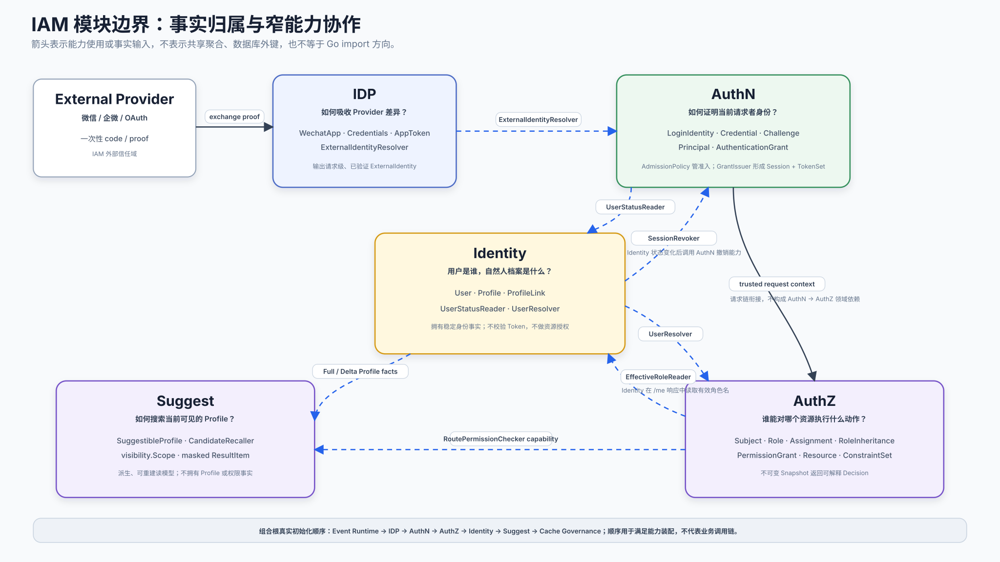
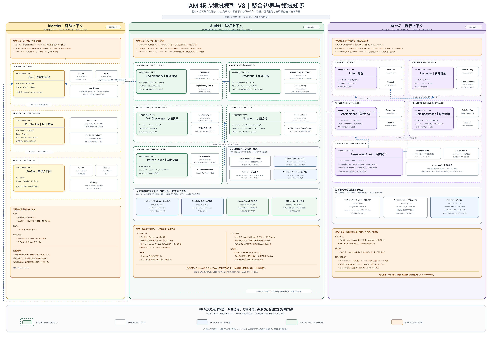

# IAM 系统演讲稿

> 状态：已实现 · 面向技术交流与现场展示。当前版本聚焦 IAM 业务场景与系统设计，核心业务功能暂不展开。本文是讲解层，不取代 canonical 文档、源码、机器契约和运行证据。

## 本文回答

```text
多个业务系统为什么需要 IAM？
IAM 在业务系统中管什么，不管什么？
IAM 如何按业务问题拆分模块？
这些模块如何保持边界，并组装成可运行系统？
```

## 讲解主线

```text
不同业务系统拥有不同业务身份和服务对象
  → 共同需要稳定的身份锚点、认证证明和授权决策
  → IAM 统一身份基础，但不接管业务对象和业务规则
  → DDD 划定纵向模块边界
  → Ports & Adapters 约束横向依赖
  → 窄能力接口表达模块协作
  → Process 与 Container 组装为模块化单体
```

| 部分 | 参考时间 |
| --- | ---: |
| IAM 业务场景分析 | 4–5 分钟 |
| IAM 系统设计 | 4–5 分钟 |
| 总结 | 1 分钟 |

---

## 01｜IAM 业务场景分析

### 1.1 为什么需要 IAM

IAM（Identity and Access Management）是一套面向业务系统接入的身份识别与访问管理服务。

它服务的不是一个单一业务系统，而是多个拥有不同业务身份、服务对象和业务关系的系统。

| 业务系统 | 可操作系统的专业业务身份 | 被服务的业务对象 |
| --- | --- | --- |
| 互联网医院 | Doctor、DoctorAssistant、Pharmacist | Patient |
| 训练中心 | Teacher | Student |
| Qlume 测评系统 | Clinician | Testee |

这些系统关心的是自己的领域语义：

- 医生诊疗患者，医生助理协助医生，药师提供药事服务；
- 教师为学员组织课程和训练；
- 临床从业者为受试者提供测评服务。

但它们又必须共同回答四个基础问题：

```text
当前操作系统的是哪个用户？
患者、学员和受试者背后是哪份自然人档案？
如何证明当前请求者的身份？
当前用户能否对某个资源执行某个动作？
```

如果每个业务系统分别建设，就会重复维护账号体系、第三方登录、Session、Token、角色权限和安全边界。

> 核心矛盾：业务身份和业务关系可以不同，但身份锚点、认证证明和授权决策不应该由每个业务系统重复建设。

### 1.2 IAM 的业务职责

IAM 集中回答三个核心问题：

| 核心问题 | 对应能力 | 主要对象 |
| --- | --- | --- |
| 用户是谁，自然人档案是什么 | Identity | User、Profile、ProfileLink |
| 如何证明当前请求者的身份 | AuthN | LoginIdentity、Credential、Principal、Session、Token |
| 当前用户能访问什么资源 | AuthZ | Subject、Role、Assignment、RoleInheritance、PermissionGrant、ConstraintSet、Resource、ObjectAttributes、Decision |

在三个核心能力之外，IAM 还提供两个辅助能力：

- IDP 隔离微信、企微等外部身份提供方，将已验证的外部声明收敛为统一 `ExternalIdentity`；
- Suggest 从 Identity 事实派生受可见范围约束的 Profile 联想搜索读模型。

```text
Identity 提供稳定身份事实；
AuthN 形成可信认证证明；
AuthZ 对具体资源和动作给出决策；
IDP 隔离外部 Provider 差异；
Suggest 提供面向 Profile 的搜索投影。
```

> IAM 不是“登录接口 + 权限 CRUD”，而是明确拆分身份事实、认证证明和授权决策，并为外部身份接入和 Profile 查询提供辅助能力。

事实依据：[IAM 系统定位](../00-概览/01-IAM系统定位.md) · [跨模块统一模型](../00-概览/06-跨模块统一模型.md)

### 1.3 IAM 在业务系统中如何落位


业务系统不会把 Doctor、Patient、Teacher 或 Testee 迁入 IAM，而是在保留自己领域对象的前提下，引用 IAM 提供的两类稳定身份锚点。

```text
Doctor / DoctorAssistant / Pharmacist
Teacher / Clinician
              -- iam_user_id --> IAM User

Patient / Student / Testee
              -- profile_id --> IAM Profile
```

| IAM 对象 | 定位 | 业务系统怎样使用 | 它不是什么 |
| --- | --- | --- | --- |
| User | 系统使用者身份 | 专业业务身份通过 `iam_user_id` 引用；也是统一授权主体的身份锚点 | 不等于 Doctor、Teacher、Clinician 等业务对象 |
| Profile | 自然人档案 | Patient、Student、Testee 通过 `profile_id` 引用 | 不拥有就诊、训练、测评等业务数据 |

`ProfileLink` 只表达 IAM 内部 User 与 Profile 的自然人身份关系，例如本人、监护人或其他关系。

它不表达：

- Doctor 与 Patient 的诊疗关系；
- DoctorAssistant 与 Doctor 的协作关系；
- Teacher 与 Student 的教学关系；
- Clinician 与 Testee 的测评关系；
- 角色授权或权限继承。

### 1.4 授权如何作用到业务身份

AuthZ 以 IAM User 作为授权主体的身份锚点。业务系统中的 Doctor、Teacher 或 Clinician 通过 `iam_user_id` 引用该 User，因此对 User 的访问授权可以作用到当前业务身份的系统访问。

但授权不会取代业务规则：

```text
IAM AuthZ 判断：
当前 User 能否执行 prescription:create？

互联网医院判断：
该 User 对应的 Doctor 是否具有有效执业资格？
是否满足为当前 Patient 开具处方的业务规则？
```

| IAM 拥有 | 业务系统拥有 |
| --- | --- |
| User、Profile、ProfileLink 等身份事实 | Doctor、Patient、Teacher、Student 等领域对象 |
| LoginIdentity、Session、Token 等认证事实 | 诊疗、教学、测评等业务关系 |
| 角色、权限、资源和访问决策 | 专业资质、委派关系和领域不变量 |

> IAM 统一的是身份锚点、认证证明和访问授权；业务系统仍然拥有自己的领域对象、业务关系和专业规则。

事实依据：[Identity 领域模型](../02-业务模块/01-Identity/01-领域模型-User-Profile-ProfileLink.md) ·
[身份认证与授权边界](../06-专题设计/01-身份认证与授权边界.md)

---

## 02｜IAM 系统设计

### 2.1 架构结论

IAM 的整体形态是一个 **DDD 引导的模块化单体**：

- DDD 按业务问题和事实归属划定模块边界；
- 单一职责原则校验每个模块的内聚性和变化原因；
- Ports & Adapters 隔离协议、数据库和技术实现；
- 窄能力接口约束模块之间的协作；
- Process 与 Container 把模块、适配器和运行时任务组装起来。

> 模块是纵向切分，分层是横向约束；DDD 决定纵向业务边界，Ports & Adapters 约束横向依赖，Container 在进程启动时把两者组合起来。

### 2.2 第一步：纵向拆分业务边界

#### 2.2.1 五个业务模块如何形成



IAM 不按接口、数据库表或技术组件拆分，而是按业务问题和变化原因拆成三个核心模块和两个辅助模块。

| 模块类型 | 模块 | 独立承担的业务问题 | 主要变化原因 |
| --- | --- | --- | --- |
| 核心模块 | Identity | 用户是谁，自然人档案是什么 | User、Profile、ProfileLink 身份事实变化 |
| 核心模块 | AuthN | 如何证明当前请求者的身份 | 登录方式、凭据、Session、Token 变化 |
| 核心模块 | AuthZ | 当前用户能访问什么资源 | 角色、权限和资源匹配规则变化 |
| 辅助模块 | IDP | 如何接入外部身份提供方 | Provider 协议和应用配置变化 |
| 辅助模块 | Suggest | 如何快速搜索可见 Profile | 索引、召回、排序和可见范围变化 |

三个核心模块拥有三类不同事实：

```text
Identity 拥有身份事实；
AuthN 拥有认证事实；
AuthZ 拥有授权事实。
```

IDP 和 Suggest 可以支撑核心模块，但不能吞并核心模块职责。

例如：

- 微信接口变化不应该迫使 AuthN 领域模型同步变化；
- 搜索索引实现变化不应该改动 Identity Profile 主数据模型；
- 角色图技术实现变化不应该污染 AuthZ 的业务语义。

> DDD 回答“系统应该有哪些业务模块”，单一职责原则进一步检查“每个模块是否只有一个主要变化原因”。

#### 2.2.2 三个核心模块如何协作



> Canonical 核心领域模型图 V8：本图以当前 Domain 模型、聚合边界与稳定跨上下文引用为事实依据，是整体介绍 Identity、AuthN、AuthZ 时的主图。

这张图不是数据库 ER 图，也不是登录时序图，而是用来表达“谁拥有什么事实、哪些对象必须在一个一致性边界内变化、模型之间如何关联、哪些领域规则必须成立”的领域模型图。

整体介绍按限界上下文与聚合边界讲：

```text
Identity：User｜ProfileLink｜Profile
AuthN：LoginIdentity｜Credential｜AuthChallenge｜Session｜RefreshToken
AuthZ：Role｜Resource｜Assignment｜RoleInheritance｜PermissionGrant
```

这 13 个模型当前都以聚合根身份承担各自生命周期和不变量，整体上是多个小聚合，而不是每个上下文一个大聚合。请求值、领域结果与已颁发凭证会单列展示，但不因此被画成聚合根。

进入模块详解后，再沿业务动作展开领域服务和应用服务：AuthN 使用“建立认证关系 → 确认身份与准入 → 延续认证状态”，AuthZ 使用“建权与赋权 → 验权与决策 → 施权与执行”。V7 保留为领域模型与服务的综合讲解图；
V8 不展示服务编排、运行时投影和基础设施。

模块入口：[Identity](../02-业务模块/01-Identity/00-模块总览.md) · [AuthN](../02-业务模块/02-AuthN/00-模块总览.md) ·
[AuthZ](../02-业务模块/03-AuthZ/00-模块总览.md)

| 模块 | 自己拥有的事实 | 与 Identity 的边界 |
| --- | --- | --- |
| Identity | `User`、`Profile`、`ProfileLink` 及 User 状态 | 对外提供 `UserStatusReader`、`UserResolver` |
| AuthN | `LoginIdentity`、`Credential`、`Challenge`、`Principal`、`Session`、Token | 通过 `UserStatusReader` 检查 User 是否允许建立或继续会话 |
| AuthZ | `Subject`、`Role`、`Assignment`、`RoleInheritance`、`PermissionGrant`、`ConstraintSet`、`Resource`、`ObjectAttributes`、`Decision` | 通过 `UserResolver` 确认 `user` Subject 对应的 User 存在 |

这里有三个不能混同的概念：

```text
User       = Identity 拥有的稳定身份锚点
Principal  = AuthN 对本次认证结果的表达
Subject    = AuthZ 用于赋权和判定的主体引用
```

AuthN 不会把 `Principal` 领域对象直接交给 AuthZ。资源服务在认证完成后从可信请求上下文取得 `UserID / TenantID`，再以 Identity User 为锚点构造 AuthZ Subject。
因此 AuthN 和 AuthZ 不直接关联彼此的领域模型，二者都以 Identity User 为稳定桥梁。

两个关键不变量已经落到实现：

- RefreshToken 只有在曾经有效且已被原子换新后再次出现，才会被判定为重放并撤销对应 Session；任意未签发令牌不会触发会话撤销。
- 同一 `subject_type + subject_id + role_id + tenant_id` 的 active Assignment 由数据库唯一索引保护，并发写入不依赖应用层“先查后写”。
- Assignment 只产生 direct roles，RoleInheritance 才产生继承的 effective roles；编辑 Assignment 不能把两者混用。
- REST v3 只管理 AuthZ 事实，授权 `Check` 由 gRPC v3 提供；服务间 Assignment 写入还需方法 ACL 与内容级 constraints。

#### 2.2.3 辅助模块如何支撑核心模块

IDP 和 Suggest 不拥有 User、认证会话或授权事实，它们以明确输出支撑核心模块：

- IDP 隔离微信、企微等 Provider 的协议和应用凭据差异，只向 AuthN 产出请求级 `ExternalIdentity`；
- Suggest 从 Identity Profile 事实派生搜索读模型，并使用 AuthZ 提供的可见范围限制候选结果。

辅助模块可以被替换或关闭，但不会改变三个核心问题的事实归属。

### 2.3 第二步：横向约束模块内部结构


模块是 Identity、AuthN、AuthZ、IDP 和 Suggest 这些纵向业务切片；Transport、Application、Domain 和 Infra 则是每个模块共同遵循的横向结构约束。

```text
External Clients
  -> Transport Adapter
  -> Application
  -> Domain

Application / Domain
  -> Driven Ports
  <- Infra Adapters
```

| 层次 | 主要职责 | 不应该承担 |
| --- | --- | --- |
| Transport | REST/gRPC 契约、DTO 映射、上下文解析、错误映射 | 业务规则和认证方式分派 |
| Application | 用例编排、事务边界、端口调用、跨模块协作 | 直接依赖 MySQL、Redis、JWT 或角色图实现 |
| Domain | 实体、值对象、业务规则和不变量 | 协议、数据库和第三方 API 细节 |
| Infra | Repository、Cache、JWT、AuthZ Snapshot、Provider、Trie/Hash 等适配器 | 重新定义业务语义 |

这里最重要的不是分成了几层，而是依赖方向：

- Transport 通过 driving ports 调用 Application；
- Application 编排用例并执行 Domain 规则；
- Domain 或 Application 定义 driven ports；
- Infra 实现这些端口；
- Container 在运行时把端口和适配器连接起来。

例如，AuthN 依赖的是 `AccessTokenEncoder` 和 `AccessTokenSignatureVerifier`，而不是具体 JWT 库；Suggest 查询用例依赖 `CandidateRecaller`，而不是具体 TST 或 Hash 实现。

> Ports & Adapters 不是为了多画一层接口，而是让业务代码不知道外部技术的具体实现。

### 2.4 第三步：通过窄能力完成模块协作

模块化不是禁止模块之间调用，而是要求模块只暴露其他模块真正需要的能力。

| 调用方 | 能力提供方 | 暴露的窄能力 |
| --- | --- | --- |
| AuthN | IDP | `ExternalIdentityResolver` |
| AuthN | Identity | `UserStatusReader` |
| AuthZ | Identity | `UserResolver` |
| Identity | AuthZ | `EffectiveRoleReader` |
| Identity | AuthN | `SessionRevoker` |
| Suggest | AuthZ | `AuthorizationFactsReader`，读取平台列表和手机号搜索授权事实并派生 `visibility.Scope` |

例如：

- AuthN 不需要知道 IDP 如何读取应用凭据和选择 Provider endpoint，只需要请求解析外部身份；
- AuthN 不直接读取 Identity User Repository，只通过 `UserStatusReader` 判断 User 状态；
- AuthZ 不直接读取 Identity User Repository，只通过 `UserResolver` 校验 User Subject；
- Identity 撤销用户时不需要操作 AuthN 的 Session Repository，只需要调用 `SessionRevoker`；
- Suggest 不需要访问 AuthZ 内部的 Assignment、PermissionGrant 或不可变快照实现；authorization adapter 只用窄的 `RoutePermissionChecker` 对平台
  `profiles/list` 和平台/tenant `profiles/search_by_mobile` 等 Resource/Action 求值，
  再向 application 暴露 `AuthorizationFactsReader`，不依赖角色名特例。

AuthN 和 AuthZ 也不需要建立领域模型直连：

```text
AuthN 验证 Token，向请求上下文写入可信 UserID / TenantID
  -> 资源服务理解当前资源和业务动作
  -> 资源服务以 Identity User 为锚点构造 AuthZ Subject
  -> AuthZ 对 Subject / Resource / Action / trusted ObjectAttributes 给出 Decision
```

模块协作由 Container 中的 module graph 集中表达，REST、gRPC 和运行时任务通过 capability collectors 获取能力，而不是随意穿透模块内部。

> 模块并不是完全隔绝，而是通过最小、明确、可测试的能力接口协作。

### 2.5 第四步：由组合根形成可运行系统

IAM 当前是模块化单体，而不是五个独立微服务。五个模块运行在同一个进程中，由 Process 和 Container 负责组成完整服务。

| 运行时组成 | 职责 |
| --- | --- |
| Process | 加载配置和资源、管理 HTTP/gRPC 生命周期、启动后台任务、Readiness 和优雅关闭 |
| Container | 作为 composition root，创建模块、选择适配器、注入依赖、连接模块能力 |
| Runtime Tasks | Process 启动 JWKS Key Rotation、AuthZ Policy Sync 和 Outbox Relay；Suggest Refresh 由 Suggest 模块初始化时启动 |

两者的边界是：

```text
Process 决定系统何时启动、运行和停止；
Container 决定使用什么实现、把谁装配给谁。
```

进程启动主线是：

```text
cmd / app
  -> Process 准备配置和资源
  -> Container 初始化模块并连接能力
  -> Transport 收集 REST / gRPC 依赖
  -> Runtime Tasks 获取后台运行能力
  -> 注册优雅关闭回调
```

Container 可以把 MySQL Repository、Redis Adapter、Provider Adapter、AuthZ 原生 Runtime（内部使用自有不可变角色图）和 Suggest Runtime 装配给对应模块，
但不执行认证、授权或身份关系等业务用例。

> Process 管理进程生命周期，Container 只负责组装系统；它们都不应该成为新的业务模块。

### 2.6 架构边界如何防止漂移

架构边界不只依靠团队约定，当前还由 architecture tests 保护。

| 架构护栏 | 目的 |
| --- | --- |
| Domain 不得依赖 Infra、数据库和 Transport | 保持领域模型纯粹 |
| Application 不得依赖 Transport 和 Infra 实现 | 迫使外部能力经过端口接入 |
| REST Router 不得直接访问 Container | 防止 Transport 穿透组合根 |
| 角色图实现细节不得污染 AuthZ Domain | 保持授权业务语义稳定 |
| JWT、Suggest Runtime 等实现必须位于端口之外 | 保持适配器可替换 |
| AuthN/AuthZ Domain 不得直接导入 Identity User Repository | 强制 User 访问经过 Identity 窄能力 |
| 模块能力只能在指定 collector 和 module graph 中导航 | 防止任意穿透模块内部 |

这些测试不能证明所有业务行为都正确，但能证明代码没有轻易打破已经确立的依赖方向。

### 2.7 这套设计带来什么

| 设计结果 | 价值 |
| --- | --- |
| 按事实和变化原因拆分模块 | 一类业务变化尽量收敛在一个模块内 |
| 通过 Ports & Adapters 隔离技术 | Provider、Token、存储和搜索实现变化不直接污染核心模型 |
| 通过窄能力协作 | 模块关系显式，跨模块依赖面积更小 |
| 由 Container 统一装配 | 业务代码不承担对象创建和技术选型 |
| 保持模块化单体 | 不承担分布式成本，同时保留清晰模块边界 |
| 使用 architecture tests | 将架构规则从文档约定变成自动化护栏 |

### 2.8 不要说过头

- IAM 是模块化单体，不是五个独立部署的微服务；
- 五个模块按 DDD 的边界思想划分，但不是五个完全自治、可独立部署的限界上下文；
- 系统遵循 Ports & Adapters 原则，没有必要描述为教科书式的“纯六边形架构”；
- 模块图中的箭头表达能力请求和业务协作，不等同于 Go import 依赖；
- architecture tests 证明依赖护栏成立，不等于所有业务、集成和生产行为都已经被验证。

### 2.9 架构收束

```text
DDD                  -> 划定纵向业务边界
单一职责原则          -> 校验模块内聚性
Ports & Adapters     -> 控制横向依赖方向
Narrow Capabilities  -> 约束模块协作方式
Container            -> 完成依赖与适配器装配
Process              -> 管理进程生命周期
Architecture Tests   -> 防止边界在演进中漂移
```

> IAM 先按照业务变化原因划分模块，再通过端口保护模块内部，通过窄能力表达模块协作，最后由组合根显式组装为一个可运行的模块化单体。

事实依据：[模块划分与协作关系](../00-概览/02-模块划分与协作关系.md) · [架构风格与设计原则](../00-概览/05-架构风格与设计原则.md) · [启动与组合根](../01-运行时/01-启动与组合根.md)

---

## 03｜IAM 核心业务功能

> 本轮暂不展开。

---

## 总结

IAM 面向多个拥有不同业务身份和业务对象的系统，提供统一身份锚点、可信认证和访问授权。它不接管 Doctor、Patient、Teacher 或 Testee 等业务对象，也不取代诊疗、教学和测评领域规则。

在系统内部，IAM 按业务问题划分 Identity、AuthN、AuthZ、IDP 和 Suggest，使用 Ports & Adapters 保护模块内部，通过窄能力表达模块协作，
最后由 Process 和 Container 组装为一个模块化单体。

> IAM 的价值不在于接口数量，而在于让业务边界、代码依赖和运行时装配保持一致。

---

## 事实导航

| 主题 | Canonical 入口 |
| --- | --- |
| IAM 的定位和业务边界 | [IAM 系统定位](../00-概览/01-IAM系统定位.md)、[模块划分与协作关系](../00-概览/02-模块划分与协作关系.md) |
| User、Profile 与 ProfileLink | [Identity 领域模型](../02-业务模块/01-Identity/01-领域模型-User-Profile-ProfileLink.md) |
| Identity、AuthN、AuthZ 三核心领域模型 | [Canonical V8 核心领域模型图](../_images/architecture/core-domain-model-v8.png) |
| 领域模型、领域服务与应用边界综合讲解 | [V7 综合图](../_images/architecture/core-domain-model-v7.png) |
| AuthN 与 AuthZ 边界 | [身份认证与授权边界](../06-专题设计/01-身份认证与授权边界.md) |
| AuthZ 模块、领域模型与关键链路 | [AuthZ canonical 文档](../02-业务模块/03-AuthZ/README.md) |
| 分层、端口和依赖方向 | [架构风格与设计原则](../00-概览/05-架构风格与设计原则.md) |
| Process、Container 和运行时装配 | [启动与组合根](../01-运行时/01-启动与组合根.md) |
| 测试与架构护栏 | [测试、契约与验收证据](../05-工程质量与运维/02-测试契约与验收证据.md) |

继续阅读：[IAM 面试索引](README.md) · [IAM 系统演讲底稿](01-IAM系统演讲底稿.md) · [文档总入口](../README.md)
