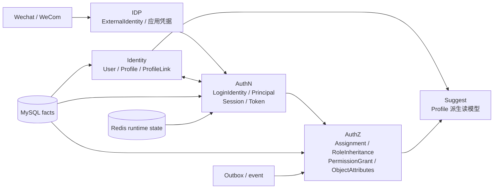

# IAM 文档中心

> 状态：已实现 · 当前体系已按代码、配置、迁移、机器契约和测试重建；运行/生产结论仍只由对应环境证据支持。

## 1. 这套文档解决什么问题

IAM 不只是“登录 + 权限接口”。它同时处理内部身份、外部身份声明、认证会话、资源授权、派生搜索，以及 MySQL/Redis/事件/密钥/多实例运行时的一致性问题。

本体系的目标是让读者能回答三层问题：

```text
概念层：对象是什么，彼此为什么不能合并？
设计层：约束和矛盾是什么，候选方案如何演化，为什么选择当前方案？
实现层：代码如何落地，事务/并发/失败/安全语义在哪里，怎样验证？
```

文档不是代码路径清单，也不是“当前事实 + 决策摘要”。每个 canonical 主题应保留完整推理链：

```text
问题与场景
  -> 概念和责任边界
  -> 不变量与风险
  -> 候选方案及其失败方式
  -> 当前选择与代价
  -> 代码实现和运行时语义
  -> 已知限制、证据与 Verify
```

## 2. 一张系统地图



五个模块的最短边界：

| 模块 | 拥有的核心问题 | 明确不拥有 |
| --- | --- | --- |
| Identity | 内部 User、Profile 与业务关系事实 | 凭据验证、Token、Permission |
| AuthN | 如何证明请求者、维持 Session、签发/验证 Token | Profile 主数据、资源授权 |
| AuthZ | Subject 能对 Resource/Action 做什么，并按受信对象属性求值 | 登录凭据、外部 provider、搜索索引和业务关系事实 |
| IDP | provider app/secret/token 与外部声明验证 | IAM User、Session、资源授权 |
| Suggest | 从 Identity 派生可见、脱敏的联想候选 | 主数据写入、通用授权结论 |

跨模块完整模型见 [跨模块统一模型](00-概览/06-跨模块统一模型.md)。

## 3. 文档结构

```text
docs/
├── README.md
├── CONTRIBUTING-DOCS.md
├── 00-概览/                 系统定位、术语、架构原则、统一模型
├── 01-运行时/               启动、组合根、配置、传输、readiness、关闭
├── 02-业务模块/             Identity / AuthN / AuthZ / IDP / Suggest
├── 03-基础设施/             MySQL / Redis / Event / Crypto / Transport / Observability
├── 04-接口与SDK/            REST / gRPC / Go SDK / 契约治理
├── 05-工程质量与运维/       架构护栏、测试、迁移、发布、安全、文档治理
├── 06-专题设计/             跨模块概念、方案演化与面试高频专题
├── 07-面试索引/             90 秒介绍、核心案例、追问导航、公开履历口径
└── _archive/                历史追溯，不是当前事实源
```

| 目录 | 入口 | 主要问题 |
| --- | --- | --- |
| `00-概览` | [概览](00-概览/README.md) | IAM 是什么、术语如何统一、模块为什么这样拆 |
| `01-运行时` | [运行时](01-运行时/README.md) | 进程如何从配置走到可接流量并安全退出 |
| `02-业务模块` | [业务模块](02-业务模块/README.md) | 每个模块的问题、模型、链路、失败与替代方案 |
| `03-基础设施` | [基础设施](03-基础设施/README.md) | 事务、缓存、事件、密钥、传输和生命周期怎样成立 |
| `04-接口与SDK` | [接口与 SDK](04-接口与SDK/README.md) | 契约、注册、实现、SDK 与调用方怎样闭环 |
| `05-工程质量与运维` | [工程质量与运维](05-工程质量与运维/README.md) | 什么证据能证明什么，怎样迁移、发布、恢复和处置凭据 |
| `06-专题设计` | [专题设计](06-专题设计/README.md) | 跨模块推理和高频深入追问 |
| `07-面试索引` | [面试索引](07-面试索引/README.md) | 怎样在不复制事实层的前提下组织项目介绍、案例和追问 |

## 4. 推荐阅读路径

### 4.1 从零建立 IAM 心智模型

1. [IAM 系统定位](00-概览/01-IAM系统定位.md)
2. [模块划分与协作关系](00-概览/02-模块划分与协作关系.md)
3. [核心概念术语表](00-概览/03-核心概念术语表.md)
4. [跨模块统一模型](00-概览/06-跨模块统一模型.md)
5. [身份、认证与授权为什么必须分开](06-专题设计/01-身份认证与授权边界.md)

目标：能从 ExternalIdentity 一直解释到 LoginIdentity、User、Principal、Session、Subject 和 Decision，并知道每一步为何存在。

### 4.2 深入基础设施和一致性

1. [启动、生命周期与组合根](01-运行时/01-启动与组合根.md)
2. [MySQL、事务与迁移](03-基础设施/01-MySQL事务与迁移.md)
3. [Redis 与缓存一致性](03-基础设施/02-Redis与缓存一致性.md)
4. [事件与 Transactional Outbox](03-基础设施/03-事件与Transactional-Outbox.md)
5. [事务、缓存与事件的一致性谱系](06-专题设计/02-事务缓存与事件一致性.md)
6. [后台任务、Readiness 与优雅关闭](01-运行时/03-后台任务就绪与优雅关闭.md)

目标：能逐条说明哪些状态强一致、哪些最终一致、谁重试、陈旧状态偏向越权还是拒绝，以及探针如何发现超限。

### 4.3 按业务模块深入

- [Identity](02-业务模块/01-Identity/README.md)：User/Profile/ProfileLink、不变量、创建与关系链路；
- [AuthN](02-业务模块/02-AuthN/README.md)：认证模型、登录绑定、Session/Token/JWKS；
- [AuthZ](02-业务模块/03-AuthZ/README.md)：RBAC、对象属性条件、原生不可变快照、写入与多实例一致性；
- [IDP](02-业务模块/04-IDP/README.md)：外部信任、应用密钥、AppToken 与 provider 边界；
- [Suggest](02-业务模块/05-Suggest/README.md)：读模型、Full/Delta、授权过滤和敏感数据。

### 4.4 面试与架构评审

先用 [面试索引](07-面试索引/README.md) 选择可公开的结论和个人贡献口径，以 [IAM 系统演讲稿](07-面试索引/02-IAM系统演讲稿.md) 作为现场展示页面，
再用 [IAM 系统演讲底稿](07-面试索引/01-IAM系统演讲底稿.md) 练习 90 秒、5 分钟和 15 分钟讲述，最后回到模块正文与专题验证细节：

1. [身份、认证与授权边界](06-专题设计/01-身份认证与授权边界.md)
2. [事务、缓存与事件的一致性谱系](06-专题设计/02-事务缓存与事件一致性.md)
3. [IAM 威胁模型与安全边界](06-专题设计/03-IAM威胁模型与安全边界.md)
4. [JWT/JWS/JWK/JWKS 与密钥轮换](06-专题设计/04-JWT-JWS-JWK-JWKS与密钥轮换.md)
5. [Suggest 为什么采用派生读模型](06-专题设计/05-Suggest为什么是读模型.md)
6. [为什么从 Casbin 迁移到自有不可变角色图](06-专题设计/06-从Casbin到自有不可变角色图.md)

面试索引只组织表达顺序；专题中的“面试追问”用于检验理解，答案的推理和代码证据仍在 canonical 正文。

### 4.5 遗留资产与数据库退役

1. [遗留资产、兼容层与数据库退役审计](05-工程质量与运维/06-遗留资产兼容层与数据库退役审计.md)
2. [迁移、发布与数据库运维](05-工程质量与运维/03-迁移发布与数据库运维.md)

先按审计台账区分代码候选、活动兼容、数据库候选和治理缺口；历史执行提示词已经归档，不再作为 active 操作入口。没有生产零读写、数据对账与恢复证据时，不生成破坏性退役 migration。

## 5. 事实、设计与建议怎样区分

事实源优先级：

```text
当前代码与运行时行为
  > 机器契约、配置、迁移、生成源
  > 测试和架构门禁
  > active docs
  > _archive 历史材料
```

文档中的语气必须区分：

| 类别 | 含义 | 示例 |
| --- | --- | --- |
| 当前事实 | 代码今天真实执行 | Refresh 当前先延长 Session 再 CAS 轮换 |
| 设计决策 | 已采用方案及其约束 | DB 是 AuthZ fact truth，原生不可变 runtime snapshot 是投影 |
| 当前限制 | 已知失败窗口/缺失能力 | 无 per-tenant loaded-version barrier |
| 设计建议 | 尚未实现的增强 | KMS envelope encryption、Refresh family reuse detection |
| 运行证据 | 特定环境和时刻的观察 | 生产 backup restore、部署 digest、时间窗口 |

无法由当前实现或决策记录确认原始动机时，应写“基于当前约束的设计分析”，不能把合理推断冒充历史事实。

## 6. 五条统一推理原则

1. **变化原因决定模块边界**：User、LoginIdentity、Session、PermissionGrant 和 provider app 因不同原因变化，不能因都带 ID 就合表。
2. **强声明必须由足够强的证明推导**：openid、JWT 签名、ProfileLink、UI capability 都不能单独推出资源允许。
3. **一致性按不变量和风险选择**：同库事务、数据库约束、Redis Lua、Outbox、可重建投影各自解决不同问题。
4. **投影永远回到事实源**：AuthZ 不可变快照（含内存角色图）、Suggest Store、JWKS snapshot 和普通 cache 不能成为隐式第二份主数据。
5. **安全方向必须显式**：依赖失败时是拒绝、保留旧值、返回空结果还是继续服务，要说明失去的语义和观测方式。

## 7. 机器事实入口

| 事实 | 入口 |
| --- | --- |
| REST | `api/rest/*.yaml` + runtime router registration |
| gRPC | `api/grpc/**/*.proto` + service registry |
| Go SDK | `pkg/sdk` + `public_api_compile_test.go` |
| 数据结构 | `internal/pkg/migration/migrations` |
| 事件语义 | `configs/events.yaml` |
| AuthZ 判定契约与运行时 | `api/grpc/iam/authz/v4/authz.proto` + `internal/apiserver/infra/authz/runtime` |
| 运行模式 | `internal/pkg/server/runtime_profile.go` + dev/prod config |
| 分层边界 | `internal/pkg/architecture` |
| 人工/生产证据 | [IAM 重构与生产验收记录](01-运行时/08-IAM重构最终验收记录.md) |

一个文件存在不等于能力可用：对外接口必须闭合“机器契约、运行时注册、实现、错误语义、调用方和测试”。

## 8. 文档维护与验证

维护规则见 [CONTRIBUTING-DOCS.md](CONTRIBUTING-DOCS.md)。最小门禁：

```bash
make docs-hygiene
make docs-facts
```

这两个门禁分别检查链接/路径/结构和已编码的关键事实，但不证明全部业务语义。按改动范围继续运行 module tests、architecture tests、contract validation、SDK compile、
MySQL/Redis integration，以及 staging/production observation；每类证据分别报告。

## 9. 当前必须诚实保留的边界

- Suggest 只有 REST，没有 gRPC 或 Go SDK；
- SDK 本地 JWKS 验签不具备 IAM 在线 Session/主体撤销语义；
- AuthZ 有 durable version event 和 reload health，但没有请求级/全实例 loaded-version barrier；
- IDP SecretVault 是本地 AES-GCM，不等价于 KMS，且当前 secret 轮换为单槽覆盖；
- Refresh 先延长 Session 再轮换 token，失败请求可能改变 Session TTL；
- Suggest 原始手机号存在于进程内索引，默认输出脱敏，当前没有持久化索引快照；
- 单元/契约/架构门禁通过不等于生产迁移、备份恢复和发布已验收。

这些限制不是文档缺陷，而是当前系统设计的一部分。只有代码、配置、迁移和运行证据改变后，才能把它们从当前事实中移除。
