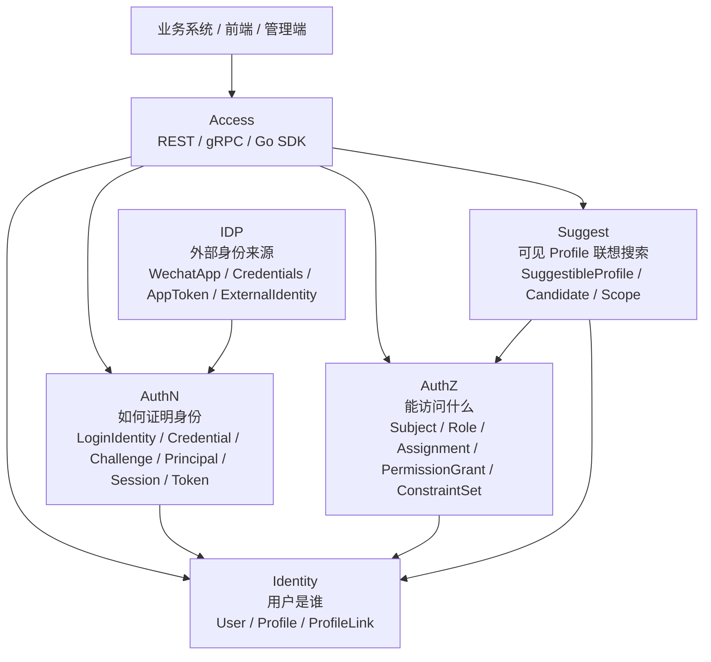

# IAM 系统定位

> 状态：已实现 · 系统定位、模块边界和事实源已按当前代码与机器契约复核；演进方向不作为当前能力。

---

## 1. 本文回答

本文回答 4 个问题：

- IAM 是什么？
- IAM 解决什么问题？
- IAM 不应该被理解成什么？
- Identity、AuthN、AuthZ、IDP、Suggest 在系统定位上分别承担什么职责？

本文只建立系统级定位，不展开每个模块的内部模型和关键链路。业务模块细节见 [02-业务模块](../02-业务模块/README.md)。

---

## 2. 30 秒结论

IAM 是面向业务系统接入的身份与访问管理服务。

它围绕 3 个核心问题组织能力：

```text
用户是谁？        -> Identity
如何证明用户身份？ -> AuthN + IDP
用户能访问什么？   -> AuthZ
```

同时，IAM 还提供两类配套能力：

```text
接入能力：REST / gRPC / Go SDK。
辅助读模型：Suggest Profile 联想搜索。
```

IAM 不是普通用户中心、单纯登录系统、权限 CRUD、微信登录适配器或 Profile 搜索服务。

如果只记一句话：

> IAM 以 `User` 为稳定身份锚点，把身份事实、认证事实、授权事实、外部身份源适配、Profile 联想搜索读模型，以及 REST/gRPC/SDK 接入能力组织在同一个身份与访问管理系统中。

---

## 3. 系统定位图



这张图表达 5 个边界：

| 边界 | 含义 |
| --- | --- |
| Access -> 业务模块 | REST、gRPC、Go SDK 是接入形态，不是业务模型本身 |
| AuthN -> Identity | AuthN 通过 `UserID` 指向 Identity 的 `User`，不复制 User 写模型 |
| AuthZ -> Identity | AuthZ 通过 `Subject` 引用 User，不拥有 User/Profile/ProfileLink 写模型 |
| IDP -> AuthN | IDP 提供外部身份源证明，IAM 登录态由 AuthN 决定 |
| Suggest -> Identity/AuthZ | Suggest 消费 Profile 事实，并用权限范围控制可见结果 |

---

## 4. IAM 解决的问题

IAM 解决的是业务系统接入中的身份与访问控制问题。

典型问题包括：

```text
一个业务系统如何识别当前调用者是谁？
一个用户可以通过哪些登录身份进入系统？
密码、验证码、微信、企微等身份来源如何统一进入认证体系？
认证成功后如何表达调用者身份？
AccessToken、RefreshToken、Session 如何划分边界？
资源服务如何验证 Token？
某个用户是否有权限访问某个资源？
权限策略变更后如何传播到运行时？
管理端如何快速搜索自己可见范围内的 Profile？
业务系统如何通过 REST、gRPC、Go SDK 接入 IAM？
```

因此，IAM 的核心价值不是“多几个接口”，而是统一治理：

```text
身份事实；
认证事实；
授权事实；
外部身份源事实；
接入契约；
模块边界；
文档和代码事实源。
```

---

## 5. IAM 的模块分工

### 5.1 Identity：用户是谁

Identity 是身份事实中心。

它回答：

```text
系统内部这个人是谁？
这个人有哪些业务档案？
User 和 Profile 之间是什么关系？
这些关系如何建立、查询和撤销？
```

Identity 的核心对象是：

```text
User；
Profile；
ProfileLink。
```

Identity 不负责登录认证、Token 签发、权限判定，也不负责 Profile 联想搜索索引。

详细文档见 [Identity](../02-业务模块/01-Identity/README.md)。

---

### 5.2 AuthN：如何证明用户身份

AuthN 是认证域。

它回答：

```text
系统如何通过登录身份找到 User？
请求者如何证明自己控制某个 LoginIdentity？
认证成功后如何表达 Principal？
认证结果如何转化为 Session、AccessToken、RefreshToken？
资源服务如何通过 JWKS 完成本地验签？
```

AuthN 的核心对象是：

```text
LoginIdentity；
Credential；
Challenge；
Principal；
Session；
AccessToken；
RefreshToken；
JWKS。
```

AuthN 不负责 Role、Assignment、RoleInheritance 或 PermissionGrant，不负责 ProfileLink 关系治理，也不拥有外部身份源配置。

详细文档见 [AuthN](../02-业务模块/02-AuthN/README.md)。

---

### 5.3 AuthZ：用户能访问什么

AuthZ 是授权域。

它回答：

```text
某个 Subject，
在某个授权域下，
能不能对某个 Resource 执行某个 Action，
并让受信 ObjectAttributes 满足 PermissionGrant 的 ConstraintSet？
```

AuthZ 的核心对象是：

```text
Subject；
Resource；
Action；
ObjectAttribute；
Role；
Assignment；
DirectRole / EffectiveRole；
RoleInheritance；
PermissionGrant；
ConstraintSet；
AuthorizationDecision；
PolicyVersion。
```

AuthZ 不负责登录认证、Token 签发、User/Profile 写模型，也不负责 ProfileLink 关系治理。

详细文档见 [AuthZ](../02-业务模块/03-AuthZ/README.md)。

---

### 5.4 IDP：外部身份来源如何接入

IDP 是外部身份源辅助模块。

它回答：

```text
微信、企微等外部身份源如何配置？
外部应用密钥如何治理？
外部 access token 如何获取和缓存？
外部身份声明如何被解析出来并交给 AuthN 消费？
```

IDP 的核心对象是：

```text
WechatApp；
Credentials；
AppToken；
ExternalIdentity。
```

IDP 不创建 IAM 登录态，不签发 IAM Token，不拥有 User，也不决定权限。

详细文档见 [IDP](../02-业务模块/04-IDP/README.md)。

---

### 5.5 Suggest：如何快速搜索可见 Profile

Suggest 是 Profile 联想搜索读模型模块。

它回答：

```text
管理端或业务后台如何快速搜索 Profile？
如何基于进程内索引快速召回候选？
如何用 visibility.Scope 控制可见范围？
手机号搜索如何脱敏、限流和治理？
索引如何刷新和降级？
```

Suggest 的核心对象是：

```text
SuggestibleProfile；
Keyword / Candidate；
visibility.Scope / ResultItem。
```

Suggest 不拥有 Profile 写模型，不负责认证，不负责通用授权策略管理，也不是核心身份域。

详细文档见 [Suggest](../02-业务模块/05-Suggest/README.md)。

---

## 6. IAM 不是什么

### 6.1 IAM 不是普通用户中心

普通用户中心通常围绕用户资料 CRUD 展开。

IAM 的核心不是“维护用户表”，而是围绕身份与访问管理组织：

```text
Identity 维护 User/Profile/ProfileLink；
AuthN 维护 LoginIdentity/Credential/Session/Token；
AuthZ 维护 Subject/Role/Assignment/RoleInheritance/PermissionGrant，并区分直接角色与继承后的有效角色；
IDP 适配外部身份源；
Suggest 构建 Profile 联想搜索读模型。
```

`User` 是 IAM 的稳定身份锚点，但 IAM 不等于 User CRUD。

---

### 6.2 IAM 不是单纯登录系统

单纯登录系统通常只关心“能不能登录”和“登录后给一个 token”。

IAM 的 AuthN 还需要明确：

```text
一个 User 可以绑定多个 LoginIdentity；
Credential 和 Challenge 是不同认证事实；
Principal 是认证成功后的运行时主体；
Session 是服务端认证上下文；
AccessToken 和 RefreshToken 有不同安全边界；
JWKS 让资源服务可以本地验签。
```

因此，登录只是 AuthN 的一条关键链路，不是 IAM 的全部。

---

### 6.3 IAM 不是权限 CRUD

权限 CRUD 只是在表上增删改查角色和权限。

IAM 的 AuthZ 需要解决：

```text
授权主体如何表达；
资源如何建模；
Action 和受信 ObjectAttributes 如何参与判定；
Role 如何聚合 PermissionGrant；
Assignment 如何表达 Subject 在 Tenant 内持有 Role；
RoleInheritance 如何复用角色能力；
ConstraintSet 如何限制对象级 Grant；
Check 如何在运行时快速判定；
PolicyVersion 和 Outbox 如何传播授权事实变化。
```

因此，AuthZ 的核心是授权模型和运行时判定，不是简单 CRUD。

---

### 6.4 IAM 不是微信登录适配器

微信、企微等外部身份源属于 IDP 的适配范围。

IDP 的输出是外部身份声明，IAM 登录态由 AuthN 创建，User 事实由 Identity 维护。

```text
IDP 证明外部身份；
AuthN 绑定或认证 LoginIdentity；
Identity 提供 User；
AuthZ 决定访问权。
```

因此，微信登录只是外部身份源接入的一种场景，不是 IAM 的系统定位。

---

### 6.5 IAM 不是 Profile 搜索服务

Suggest 服务 Profile autocomplete，但它不是独立搜索产品，也不是核心身份域。

Suggest 的定位是辅助读模型：

```text
从 Identity 消费 Profile 事实；
构建搜索索引和快照；
根据 visibility.Scope 过滤可见结果；
对手机号等敏感查询做脱敏、限流和安全治理。
```

因此，Suggest 是 IAM 里的辅助查询能力，不拥有 User/Profile/ProfileLink 主事实。

---

## 7. 系统边界

### 7.1 IAM 对外提供什么

IAM 对外主要提供：

```text
REST API：面向前端、管理端、调试和部分业务接入；
gRPC API：面向服务间调用；
Go SDK：面向 Go 业务服务的产品化接入封装；
JWKS：面向资源服务的本地验签；
```

接入细节见 [接口与 SDK](../04-接口与SDK/README.md)。

---

### 7.2 IAM 内部如何分层

IAM 内部采用分层与组合根组织：

```text
process：生命周期管理；
container：组合根和依赖装配；
transport：REST/gRPC 协议适配；
application：用例编排；
domain：领域模型和业务规则；
infra：数据库、缓存、token、授权快照、外部服务等基础设施适配。
```

运行时细节见 [01-运行时](../01-运行时/README.md)。

---

## 8. 事实源

本文是系统定位说明，不是机器契约。

当本文与代码、契约、测试冲突时，按以下优先级判断：

1. 源码与运行时行为。
2. 机器可读契约与配置：OpenAPI、proto、配置、迁移。
3. 测试：架构测试、契约测试、模块测试、SDK compile test。
4. 现行维护中的 `docs/`。
5. `_archive/` 历史材料。

当前主要事实源：

| 事实 | 路径 |
| --- | --- |
| 运行时入口 | `../../cmd/apiserver` |
| App 初始化 | `../../internal/apiserver/app.go` |
| 进程生命周期 | `../../internal/apiserver/process` |
| 组合根 | `../../internal/apiserver/container` |
| REST transport | `../../internal/apiserver/transport/rest` |
| gRPC transport | `../../internal/apiserver/transport/grpc` |
| Identity | `../../internal/apiserver/domain/identity`、`../../internal/apiserver/application/identity` |
| AuthN | `../../internal/apiserver/domain/authn`、`../../internal/apiserver/application/authn` |
| AuthZ | `../../internal/apiserver/domain/authz`、`../../internal/apiserver/application/authz` |
| IDP | `../../internal/apiserver/domain/idp`、`../../internal/apiserver/application/idp` |
| Suggest | `../../internal/apiserver/domain/suggest`、`../../internal/apiserver/application/suggest` |
| REST 契约 | `../../api/rest` |
| gRPC 契约 | `../../api/grpc` |
| Go SDK | `../../pkg/sdk` |
| 架构测试 | `../../internal/pkg/architecture` |

---

## 9. Verify

修改本文后至少执行：

```bash
make docs-hygiene
```

涉及模块边界或分层依赖时，再执行：

```bash
go test ./internal/pkg/architecture
```

涉及 REST、gRPC、SDK 契约时，再执行：

```bash
make api-validate
make proto-gen
go test ./internal/apiserver/transport/grpc
go test ./pkg/sdk/...
```

---

## 10. 本文总结

IAM 的系统定位可以压缩成 5 个判断：

```text
Identity 回答“用户是谁”；
AuthN 回答“如何证明身份”；
AuthZ 回答“能访问什么”；
IDP 回答“外部身份来源如何接入”；
Suggest 回答“如何快速搜索可见 Profile”。
```

IAM 不是普通用户中心、不是单纯登录系统、不是权限 CRUD、不是微信登录适配器、也不是 Profile 搜索服务。

它是面向业务系统接入的身份与访问管理服务，核心价值在于把身份事实、认证事实、授权事实、外部身份源、Profile 联想搜索读模型和接入契约分开治理，并通过清晰的模块边界组织起来。
