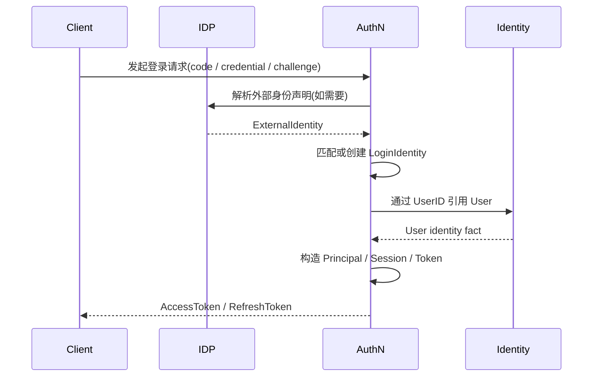
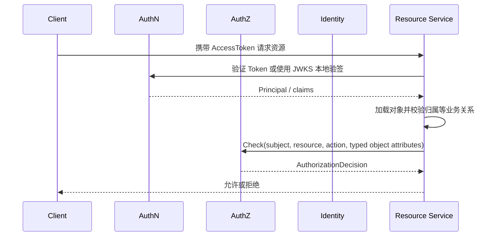
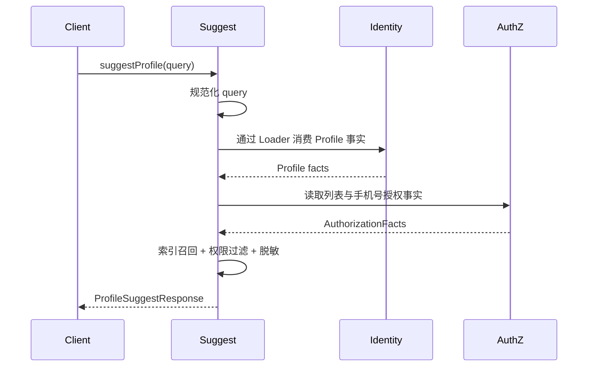

# 模块划分与协作关系

> 状态：已实现 · 模块职责、依赖方向与三条协作主线已按组合根和应用端口复核。

---

## 1. 本文回答

本文回答 5 个问题：

- IAM 为什么拆成 Identity、AuthN、AuthZ、IDP、Suggest 这 5 个模块？
- 3 个核心模块和 2 个辅助模块分别是什么？
- 模块之间如何协作？
- 哪些协作关系容易被误解成职责归属？
- 后续阅读业务模块文档时应该抓住什么主线？

本文只讲模块级协作关系，不展开每个模块内部领域模型。具体模型和链路见 [02-业务模块](../02-业务模块/README.md)。

---

## 2. 30 秒结论

IAM 按 3 个核心问题拆成 3 个核心模块：

```text
用户是谁？        -> Identity
如何证明用户身份？ -> AuthN
用户能访问什么？   -> AuthZ
```

同时，为了接入外部身份源和提升 Profile 查询体验，IAM 又提供 2 个辅助模块：

```text
外部身份来源如何接入？       -> IDP
如何快速搜索可见 Profile？   -> Suggest
```

模块分层如下：

| 类型 | 模块 | 定位 |
| --- | --- | --- |
| 核心模块 | Identity | 身份事实中心 |
| 核心模块 | AuthN | 认证域 |
| 核心模块 | AuthZ | 授权域 |
| 辅助模块 | IDP | 外部身份源适配 |
| 辅助模块 | Suggest | Profile 联想搜索读模型 |

辅助模块可以支撑核心模块，但不能吞并核心模块的领域职责。

如果只记一句话：

> Identity 提供稳定身份事实，AuthN 证明调用者身份，AuthZ 判断访问权，IDP 为 AuthN 提供外部身份来源，Suggest 基于 Identity 的 Profile 事实和 AuthZ 的可见范围提供联想搜索。

---

## 3. 模块协作总图


[SVG 图源](../_images/architecture/module-boundary.svg)

这张图表达的是模块事实输入和窄能力协作，不是代码包导入关系。图中的箭头必须连同标签阅读：例如 AuthN 使用 `UserStatusReader`、AuthZ 使用 `UserResolver`、
Identity 使用 `SessionRevoker` 和 `EffectiveRoleReader`、Suggest application 使用 `AuthorizationFactsReader`；
组合根以 AuthZ `RoutePermissionChecker` 装配其 adapter，这不等于模块共享聚合。

其中：

```text
Access 是接入形态，不是业务模块；
Identity、AuthN、AuthZ 是核心业务模块；
IDP、Suggest 是辅助业务模块；
IDP 支撑 AuthN，但不拥有 AuthN 登录态；
Suggest 消费 Identity/Profile 事实，并受 AuthZ 可见范围约束。
```

---

## 4. 为什么这样拆分

### 4.1 按问题拆分，而不是按接口拆分

IAM 不是按接口路径拆模块，也不是按数据库表拆模块。

它按业务问题拆分：

| 问题 | 模块 | 核心事实 |
| --- | --- | --- |
| 用户是谁 | Identity | User、Profile、ProfileLink |
| 如何证明身份 | AuthN | LoginIdentity、Credential、Challenge、Principal、Session、Token |
| 能访问什么 | AuthZ | Subject、Resource、Action、ObjectAttribute、Role、Assignment、RoleInheritance、PermissionGrant、ConstraintSet |
| 外部身份来源如何接入 | IDP | WechatApp、Credentials、AppToken、ExternalIdentity |
| 如何快速搜索可见 Profile | Suggest | SuggestibleProfile、Keyword、Candidate、Scope、ResultItem |

这种拆分方式的好处是：

```text
领域职责清晰；
核心模型稳定；
模块边界可测试；
接入方式可以变化，但业务模型不被接口形态牵着走；
辅助能力可以扩展，但不会污染核心域。
```

---

### 4.2 核心模块与辅助模块分开

核心模块负责 IAM 的核心身份与访问管理事实。

```text
Identity 是身份事实；
AuthN 是认证事实；
AuthZ 是授权事实。
```

辅助模块服务核心模块或使用核心模块事实。

```text
IDP 服务 AuthN；
Suggest 使用 Identity 和 AuthZ。
```

辅助模块不能反向吞并核心模块职责。

例如：

```text
IDP 可以解析微信 openid/unionid，但不能决定 IAM 登录态；
Suggest 可以搜索 Profile，但不能维护 Profile 写模型；
Suggest 可以使用权限范围过滤结果，但不能管理通用授权策略。
```

---

## 5. 核心模块

### 5.1 Identity：身份事实中心

Identity 回答“用户是谁”。

它维护 IAM 内部稳定身份事实：

```text
User；
Profile；
ProfileLink。
```

Identity 的职责是：

```text
创建和维护 User；
创建和维护 Profile；
建立、查询、撤销 User 与 Profile 的关系；
为 AuthN、AuthZ、Suggest 提供身份事实引用。
```

Identity 不负责：

```text
登录认证；
Token 签发；
授权判定；
外部身份源适配；
Profile 联想搜索索引。
```

Identity 是共同身份事实来源，但不是所有模块的“大对象仓库”。

详细文档见 [Identity](../02-业务模块/01-Identity/README.md)。

---

### 5.2 AuthN：认证域

AuthN 回答“如何证明用户身份”。

它围绕登录身份、认证材料、认证挑战和登录态组织：

```text
LoginIdentity；
Credential；
Challenge；
Principal；
Session；
AccessToken；
RefreshToken；
JWKS。
```

AuthN 的职责是：

```text
通过 LoginIdentity 定位 User；
通过 Credential 或 Challenge 证明请求者控制某个登录身份；
认证成功后构造 Principal；
创建和维护 Session；
签发、刷新、吊销 Token；
通过 JWKS 支撑资源服务本地验签。
```

AuthN 不负责：

```text
角色和权限管理；
授权判定；
ProfileLink 关系治理；
AuthZ authorization runtime 与内存角色图；
外部身份源配置所有权。
```

AuthN 可以消费 IDP 的外部身份声明，但登录态仍由 AuthN 决定。

详细文档见 [AuthN](../02-业务模块/02-AuthN/README.md)。

---

### 5.3 AuthZ：授权域

AuthZ 回答“用户能访问什么”。

它围绕授权判定句式组织：

```text
某个 Subject，
在某个授权域下，
能不能对某个 Resource 执行某个 Action，
并让受信 ObjectAttributes 满足 PermissionGrant 的 ConstraintSet？
```

AuthZ 的核心对象是：

```text
Subject；
Resource；
Action；
ObjectAttribute；
Role；
Assignment；
DirectRole / EffectiveRole；
RoleInheritance；
PermissionGrant；
ConstraintSet；
AuthorizationDecision；
PolicyVersion。
```

AuthZ 的职责是：

```text
维护 Resource、Action、Role、Assignment、RoleInheritance、PermissionGrant 和 ConstraintSet；区分直接角色与继承后的有效角色；
执行权限检查；
管理授权写入；
通过 PolicyVersion 和 Outbox 传播授权事实变化；
从 MySQL 事实编译原生不可变快照；自有不可变角色图装载 Assignment 与 RoleInheritance，计算租户隔离的角色闭包。
```

AuthZ 不负责：

```text
登录认证；
Token 签发；
User/Profile 写模型；
ProfileLink 关系治理；
外部身份源适配。
```

AuthZ 可以引用 Identity 的 User，但它通过 `Subject` 表达授权主体，不复制 Identity 写模型。

详细文档见 [AuthZ](../02-业务模块/03-AuthZ/README.md)。

---

## 6. 辅助模块

### 6.1 IDP：外部身份源适配

IDP 回答“外部身份来源如何接入”。

它管理外部身份源相关事实：

```text
WechatApp；
Credentials；
AppToken；
ExternalIdentity。
```

IDP 的职责是：

```text
管理外部应用配置；
管理外部应用密钥；
获取和缓存外部 access token；
解析外部身份声明；
把外部身份证明交给 AuthN 消费。
```

IDP 不负责：

```text
创建 IAM 登录态；
签发 IAM Token；
拥有 User；
决定权限；
维护 LoginIdentity 的认证生命周期。
```

典型协作是：

```text
微信/企微 code
  -> IDP 解析外部身份声明
  -> AuthN 绑定或认证 LoginIdentity
  -> AuthN 创建 Principal / Session / Token
```

详细文档见 [IDP](../02-业务模块/04-IDP/README.md)。

---

### 6.2 Suggest：Profile 联想搜索读模型

Suggest 回答“如何快速搜索可见 Profile”。

它围绕 Profile autocomplete 构建读模型：

```text
SuggestibleProfile；
Keyword / Candidate；
visibility.Scope / ResultItem。
```

Suggest 的职责是：

```text
从 Identity 消费 Profile 事实；
构建可重建的 Profile 候选索引；
基于进程内索引快速召回候选；
通过 visibility.Scope 过滤可见结果；
对手机号搜索做脱敏、限流和安全治理；
支持索引刷新、降级和观测。
```

Suggest 不负责：

```text
Profile 写模型；
User/Profile/ProfileLink 主事实维护；
登录认证；
通用授权策略管理；
角色和权限写入。
```

典型协作是：

```text
管理端输入关键词
  -> Suggest 规范化 query
  -> Suggest 基于索引召回候选 Profile
  -> Suggest 使用 visibility.Scope 过滤可见范围
  -> 返回脱敏后的候选结果
```

详细文档见 [Suggest](../02-业务模块/05-Suggest/README.md)。

---

## 7. 模块协作主线

### 7.1 登录主线：IDP + AuthN + Identity

第三方登录场景下，模块协作主线是：



关键边界：

```text
IDP 只证明外部身份；
AuthN 决定认证结果和登录态；
Identity 提供 User 事实；
AuthZ 不参与登录态创建。
```

---

### 7.2 授权主线：AuthN + AuthZ + Identity

访问受保护资源时，模块协作主线是：



关键边界：

```text
AuthN 证明调用者是谁；
AuthZ 决定能不能访问；
Identity 提供身份事实；
资源服务执行最终业务响应。
```

---

### 7.3 Profile 搜索主线：Suggest + Identity + AuthZ

管理端或业务后台搜索 Profile 时，模块协作主线是：



关键边界：

```text
Suggest 只负责读模型和搜索体验；
Identity 拥有 Profile 主事实；
AuthZ 提供访问范围或授权能力；
Suggest 不管理通用授权策略。
```

---

## 8. 容易误解的协作关系

| 误解 | 正确理解 |
| --- | --- |
| IDP 接入微信，所以 IDP 负责登录 | IDP 只解析外部身份声明，AuthN 才负责 IAM 登录态 |
| AuthN 有 UserID，所以 AuthN 拥有 User | User 属于 Identity，AuthN 只引用 UserID |
| AuthZ 判断 user 权限，所以 AuthZ 拥有 User | AuthZ 通过 Subject 引用 User，不维护 User 写模型 |
| ProfileLink 连接 User 和 Profile，所以它是授权事实 | ProfileLink 是身份关系事实，不是 Assignment 或 PermissionGrant |
| Suggest 搜索 Profile，所以 Suggest 拥有 Profile | Profile 属于 Identity，Suggest 只消费读事实并维护可重建索引 |
| Suggest 做可见范围过滤，所以 Suggest 是授权系统 | Suggest 使用 visibility.Scope，不管理通用授权策略 |
| 把历史 Casbin 实现当成当前业务模型 | 权限匹配由领域 Evaluator 执行；自有不可变角色图只计算角色继承 |
| REST/gRPC/SDK 暴露了接口，所以它们是业务模块 | Access 是接入形态，不是领域模型 |

---

## 9. 模块边界总表

| 模块 | 拥有什么 | 消费什么 | 不负责什么 |
| --- | --- | --- | --- |
| Identity | User、Profile、ProfileLink | 无需消费其他核心模块即可维护身份事实 | 登录态、Token、权限判定、Suggest 索引 |
| AuthN | LoginIdentity、Credential、Challenge、Principal、Session、Token、JWKS | Identity.User；IDP.ExternalIdentity | 授权判定、ProfileLink 治理、外部身份源配置所有权 |
| AuthZ | Subject、Resource、Action、ObjectAttribute、Role、Assignment、RoleInheritance、PermissionGrant、ConstraintSet、AuthorizationDecision、PolicyVersion | Identity.User/Profile 引用；AuthN 认证结果 | 登录认证、Token 签发、User/Profile 写模型和业务关系事实 |
| IDP | WechatApp、Credentials、AppToken、ExternalIdentity | 外部身份源 API | IAM 登录态、IAM Token、User 所有权、权限判定 |
| Suggest | SuggestibleProfile、Keyword、Candidate、Scope、ResultItem | Identity.Profile；AuthZ 授权事实 | Profile 写模型、登录认证、通用授权策略管理 |

---

## 10. 和后续文档的关系

本文是模块级地图。

后续阅读建议：

```text
想理解模块为什么这样分：继续读 03-核心概念术语表.md。
想理解服务如何启动装配：读 01-运行时/README.md。
想理解每个模块内部模型：读 02-业务模块/README.md。
想理解 REST/gRPC/SDK 接入：读 04-接口与SDK/README.md。
想理解为什么这样设计并准备深入追问：读 06-专题设计/README.md。
```

业务模块入口：

| 模块 | 文档 |
| --- | --- |
| Identity | [../02-业务模块/01-Identity/README.md](../02-业务模块/01-Identity/README.md) |
| AuthN | [../02-业务模块/02-AuthN/README.md](../02-业务模块/02-AuthN/README.md) |
| AuthZ | [../02-业务模块/03-AuthZ/README.md](../02-业务模块/03-AuthZ/README.md) |
| IDP | [../02-业务模块/04-IDP/README.md](../02-业务模块/04-IDP/README.md) |
| Suggest | [../02-业务模块/05-Suggest/README.md](../02-业务模块/05-Suggest/README.md) |

---

## 11. 事实源

本文是模块划分说明，不是机器契约。

当本文与代码、契约、测试冲突时，按以下优先级判断：

1. 源码与运行时行为。
2. 机器可读契约与配置：OpenAPI、proto、配置、迁移。
3. 测试：架构测试、契约测试、模块测试、SDK compile test。
4. 现行维护中的 `docs/`。
5. `_archive/` 历史材料。

当前主要事实源：

| 事实 | 路径 |
| --- | --- |
| Identity 领域模型 | `../../internal/apiserver/domain/identity` |
| Identity 应用层 | `../../internal/apiserver/application/identity` |
| AuthN 领域模型 | `../../internal/apiserver/domain/authn` |
| AuthN 应用层 | `../../internal/apiserver/application/authn` |
| AuthZ 领域模型 | `../../internal/apiserver/domain/authz` |
| AuthZ 应用层 | `../../internal/apiserver/application/authz` |
| IDP 领域模型 | `../../internal/apiserver/domain/idp` |
| IDP 应用层 | `../../internal/apiserver/application/idp` |
| Suggest 领域模型 | `../../internal/apiserver/domain/suggest` |
| Suggest 应用层 | `../../internal/apiserver/application/suggest` |
| REST transport | `../../internal/apiserver/transport/rest` |
| gRPC transport | `../../internal/apiserver/transport/grpc` |
| REST 契约 | `../../api/rest` |
| gRPC 契约 | `../../api/grpc` |
| Go SDK | `../../pkg/sdk` |
| 架构测试 | `../../internal/pkg/architecture` |

---

## 12. Verify

修改本文后至少执行：

```bash
make docs-hygiene
```

涉及模块边界或分层依赖时，再执行：

```bash
go test ./internal/pkg/architecture
```

涉及 REST、gRPC、SDK 契约时，再执行：

```bash
make api-validate
make proto-gen
go test ./internal/apiserver/transport/grpc
go test ./pkg/sdk/...
```

---

## 13. 本文总结

IAM 的模块划分可以压缩成一句话：

> Identity 提供身份事实，AuthN 证明身份，AuthZ 判断访问权，IDP 接入外部身份来源，Suggest 提供可见 Profile 联想搜索。

其中：

```text
Identity、AuthN、AuthZ 是核心模块；
IDP、Suggest 是辅助模块；
辅助模块支撑核心模块，但不能吞并核心模块职责；
Access 是接入形态，不是业务模块；
_archive 是历史材料，不是当前事实源。
```
