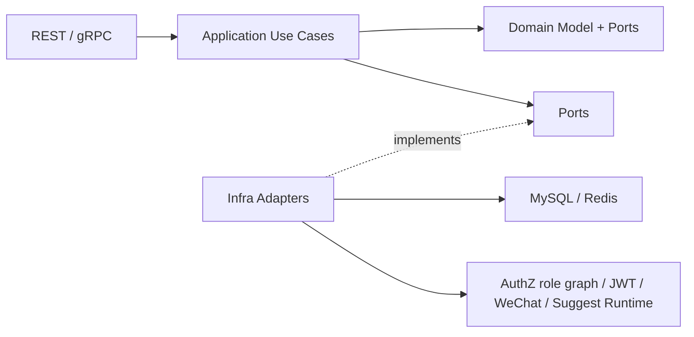

# 架构风格与设计原则

> 状态：已实现 · 分层、端口、事务、运行时与契约原则已按当前架构护栏和组合根复核；建议项单独表述。

---

## 1. 本文回答

本文回答 5 个问题：

- IAM 整体采用什么架构风格？
- `cmd / process / container / transport / application / domain / infra` 分别承担什么职责？
- Identity、AuthN、AuthZ、IDP、Suggest 的业务模块边界如何被架构风格保护？
- Ports & Adapters、组合根、事务边界、Outbox、AuthZ Snapshot、JWT/JWKS、Suggest Runtime 在架构中分别处于什么位置？
- 后续修改代码和文档时，应该遵守哪些设计原则？

本文是概览层架构原则，不展开具体模块内部模型。业务模块事实见 [02-业务模块](../02-业务模块/README.md)，运行时细节见 [01-运行时](../01-运行时/README.md)。

---

## 2. 30 秒结论

IAM 使用分层架构和 Ports & Adapters，把业务规则、用例编排、协议适配和基础设施实现分开。

整体主线是：

```text
cmd/apiserver
  -> internal/apiserver/app.go
  -> process
  -> container
  -> transport/rest + transport/grpc
  -> application
  -> domain
  -> infra
```

架构目标是：

```text
业务规则不依赖协议；
领域模型不依赖数据库；
用例编排不泄漏到 transport；
基础设施细节不污染 domain；
模块通过明确边界协作；
契约、测试和文档共同防漂移。
```

如果只记一句话：

> IAM 的架构核心是“领域模型稳定、用例编排清晰、协议适配可替换、基础设施可替换、组合根集中装配、架构护栏持续校验”。

---

## 3. 总体架构图


[SVG 图源](../_images/architecture/layer-architecture.svg)

图中重点：

```text
cmd 和 app 负责启动入口；
process 负责生命周期；
container 是组合根；
transport 负责协议适配；
application 负责编排用例；
domain 表达业务模型和规则；
infra 实现外部能力和技术细节。
```

图里没有 `application -> infra` 的运行时依赖箭头。具体适配器由 `container` 创建并注入 Domain/Application 端口；请求执行期间，application 只持有端口或窄能力。
AuthZ 的 AuthZ 的自有角色图被限定在 immutable snapshot 内部，只作为可重建索引。

---

## 4. 分层职责

### 4.1 cmd：启动命令层

`cmd/apiserver` 是进程启动入口。

它应该负责：

```text
解析命令；
加载启动入口；
调用 app 或 process；
保持 main 足够薄。
```

它不应该负责：

```text
业务规则；
模块装配细节；
数据库访问；
REST/gRPC 路由注册细节；
认证、授权、身份关系等业务逻辑。
```

设计原则：

> `main` 保持薄，越接近业务的代码越不应该出现在 `cmd`。

---

### 4.2 app：应用启动入口

`internal/apiserver/app.go` 是应用启动入口。

它应该负责：

```text
承接 cmd 调用；
组织启动参数；
进入 process 生命周期；
把启动流程从 main 中剥离出来。
```

它不应该负责：

```text
直接创建所有 repository；
直接注册所有模块路由；
直接写业务用例；
直接访问数据库或外部服务。
```

设计原则：

> app 是启动入口，不是组合根本身；真正依赖装配应收敛在 container。

---

### 4.3 process：生命周期层

`process` 负责进程级生命周期。

它应该负责：

```text
加载配置；
初始化资源；
构建 container；
启动 REST/gRPC server；
启动后台任务；
处理 shutdown signal；
统一资源关闭和优雅退出。
```

它不应该负责：

```text
具体业务规则；
具体 repository 查询；
模块内部领域对象构造；
权限判定细节；
登录认证细节。
```

设计原则：

> process 管“进程怎么活着和怎么退出”，不管“业务怎么判断”。

---

### 4.4 container：组合根

`container` 是组合根，负责依赖装配。

它应该负责：

```text
创建 infra adapter；
创建 repository；
创建 domain/application service；
装配 token、AuthZ authorization runtime、idp、suggest runtime 等技术能力；
把模块依赖集中收敛到一个可审计位置。
```

它不应该负责：

```text
处理 HTTP 请求；
执行业务用例；
写业务规则；
在装配时偷跑业务流程；
把跨模块业务协作写成隐式全局变量。
```

设计原则：

> 依赖可以在 container 中集中装配，但业务行为不能藏在 container 里。

---

### 4.5 transport：协议适配层

`transport/rest` 和 `transport/grpc` 是协议适配层。

它应该负责：

```text
路由注册；
请求 DTO 解析；
参数校验；
认证 middleware / interceptor 接入；
调用 application 用例；
响应 DTO 组装；
错误码和协议错误映射。
```

它不应该负责：

```text
领域规则；
权限模型；
认证核心逻辑；
事务边界；
数据库查询；
复杂跨模块编排。
```

设计原则：

> transport 是协议翻译器，不是业务层。

---

### 4.6 application：用例编排层

`application` 负责用例编排。

它应该负责：

```text
承接 transport 调用；
编排 domain service 和 repository；
控制事务边界；
调用端口；
处理跨聚合、跨模块协作；
把领域结果转换为 application result。
```

它不应该负责：

```text
HTTP/gRPC DTO 细节；
数据库 SQL 细节；
Redis key 细节；
角色图遍历与 Grant 索引细节；
JWT 签名细节；
微信 API HTTP 细节。
```

设计原则：

> application 讲“这个用例怎么完成”，domain 讲“业务规则是什么”，infra 讲“外部能力怎么实现”。

---

### 4.7 domain：领域层

`domain` 负责领域模型、领域规则和领域端口定义。

它应该负责：

```text
定义 User / Profile / ProfileLink；
定义 LoginIdentity / Credential / Challenge / Session；
定义 Subject / Resource / Action / ObjectAttribute / Role / Assignment / RoleInheritance / PermissionGrant / ConstraintSet；
定义 WechatApp / ExternalIdentity 等 IDP 领域对象；
定义 SuggestibleProfile / Keyword / Candidate / Scope 等 Suggest 领域对象；
表达领域不变量；
定义领域端口接口。
```

它不应该负责：

```text
HTTP handler；
gRPC service；
SQL 实现；
Redis 实现；
AuthZ 快照或不可变角色图构造；
JWT 具体签名实现；
微信 HTTP API 调用细节。
```

设计原则：

> domain 是业务语言的中心，不能被 transport 或 infra 的术语污染。

---

### 4.8 infra：基础设施适配层

`infra` 负责实现外部能力和技术细节。

它应该负责：

```text
数据库访问；
Redis 访问；
AuthZ authorization runtime 与内存角色图；
JWT/JWK/JWKS 实现；
微信/企微 API 调用；
Suggest 进程内索引 runtime；
repository adapter；
外部服务 adapter。
```

它不应该负责：

```text
定义领域语言；
决定模块边界；
把 Casbin facts 当成 AuthZ 领域模型；
把 JWT claims 当成 AuthN 全部模型；
把数据库表结构直接暴露给 transport。
```

设计原则：

> infra 可以很复杂，但复杂性应被 adapter 封装，不能反向污染 domain。

---

## 5. Ports & Adapters 设计

IAM 使用 Ports & Adapters 思路隔离业务模型和技术实现。



### 5.1 Port 是业务需要的能力

Port 应表达业务需要，而不是技术实现。

例如：

```text
AuthN 需要签发 Token；
AuthZ 需要加载授权策略并执行 Check；
IDP 需要解析外部身份；
Suggest 需要构建和查询 Profile 索引。
```

这些能力可以由不同 adapter 实现。

---

### 5.2 Adapter 是技术实现

Adapter 负责把业务需要转换成具体技术调用。

例如：

```text
JWT adapter 负责签名和验签；
AuthZ runtime adapter 负责构建不可变授权快照、组织 Grant 候选并调用领域 Evaluator 完成条件求值；
MySQL repository 负责持久化；
Redis adapter 负责缓存或运行时状态；
WeChat adapter 负责外部 API；
Suggest runtime adapter 负责进程内索引。
```

设计原则：

> application 可以依赖 port，infra 实现 port；domain 不应该依赖 infra 实现细节。

---

## 6. 业务模块边界原则

IAM 的业务模块包括：

```text
Identity；
AuthN；
AuthZ；
IDP；
Suggest。
```

它们的边界应由领域职责决定，而不是由接口路径、数据库表或第三方库决定。

| 模块 | 负责 | 不负责 |
| --- | --- | --- |
| Identity | User、Profile、ProfileLink 身份事实 | 登录态、Token、权限判定、Suggest 索引 |
| AuthN | LoginIdentity、Credential、Challenge、Principal、Session、Token、JWKS | Role、Assignment、RoleInheritance、PermissionGrant、ConstraintSet、ProfileLink |
| AuthZ | Subject、Resource、Action、ObjectAttribute、Role、Assignment、RoleInheritance、PermissionGrant、ConstraintSet、Decision、PolicyVersion | 登录认证、Token 签发、User/Profile 写模型与业务关系事实 |
| IDP | 外部身份源配置、密钥、AppToken、ExternalIdentity | IAM 登录态、IAM Token、User 所有权、权限判定 |
| Suggest | Profile 联想搜索读模型、索引、可见范围、脱敏和限流 | Profile 写模型、登录认证、通用授权策略管理 |

设计原则：

```text
模块可以协作，但不能互相吞并职责；
引用别的模块事实时，优先通过 ID、端口或 application 协作；
不要把一个模块的领域对象复制成另一个模块的写模型；
不要因为 transport 接口方便，就把跨模块逻辑塞进 handler。
```

---

## 7. 依赖方向原则

推荐依赖方向：

```text
transport -> application -> domain
application -> ports
infra -> ports/domain interfaces
container -> all concrete implementations
process -> container + servers
cmd -> app/process
```

不推荐依赖方向：

```text
domain -> transport；
domain -> infra concrete；
domain -> mysql/redis/authz-runtime/jwt/wechat sdk；
transport -> infra repository；
handler -> database；
handler -> authz runtime concrete；
handler -> jwt signer；
infra -> transport DTO；
```

设计原则：

> 依赖应该指向更稳定的业务抽象，而不是指向更具体的技术实现。

---

## 8. 用例编排原则

Application service 应该是用例编排中心。

典型职责：

```text
注册 / 开通身份；
登录认证；
绑定登录身份；
刷新 Token；
执行权限检查；
授权写入；
刷新 Suggest 索引；
调用 IDP 解析外部身份。
```

Application service 应避免：

```text
直接写 HTTP response；
直接拼 SQL；
直接操作 Redis key；
直接暴露 Casbin facts；
直接泄漏 JWT 签名细节；
直接把 transport DTO 传入 domain。
```

设计原则：

> 一个用例可以协调多个模块，但必须尊重模块边界。

例如第三方登录：

```text
AuthN application 编排登录流程；
IDP 提供外部身份声明；
Identity 提供 User 身份事实；
AuthN 创建 Principal / Session / Token。
```

不要写成：

```text
IDP 直接创建 IAM Session；
transport handler 直接写 LoginIdentity 和 Token；
微信 adapter 直接创建 User。
```

---

## 9. 事务边界原则

事务边界应由 application 层控制，而不是由 transport 或 infra 随意扩散。

推荐做法：

```text
一个用例明确一个事务边界；
事务中完成业务事实写入；
需要事件传播时，在同一事务内写 Outbox；
事务外执行异步发布、重试、刷新 runtime 等副作用。
```

避免做法：

```text
handler 中手写事务；
domain 对象直接持有数据库事务；
infra adapter 自己决定跨多个 repository 的事务边界；
业务写入成功但事件记录丢失；
事件发布成功但业务事务回滚。
```

设计原则：

> application 决定“一个业务用例的原子性”，infra 只实现事务机制。

---

## 10. Outbox 原则

Outbox 用于本地事务内记录待发布事件，典型用于授权版本传播等场景。

它解决的问题是：

```text
业务事实写入和事件记录在同一事务中完成；
事务提交后由后台任务异步发布事件；
发布失败可以重试；
消费者需要幂等处理。
```

它不解决的问题是：

```text
不等于消息队列本身；
不等于 exactly-once；
不自动保证消费者只处理一次；
不替代业务幂等；
不替代 runtime reload 的健康检查。
```

设计原则：

> Outbox 负责“事务内事实与事件记录一致”，不负责承诺端到端 exactly-once。

---

## 11. AuthZ 与不可变角色图原则

不可变角色图是 infra runtime 的派生索引，而不是 AuthZ 领域模型本身。

AuthZ 领域语言是：

```text
Subject；
Resource；
Action；
ObjectAttribute；
Role；
Assignment；
DirectRole / EffectiveRole；
RoleInheritance；
PermissionGrant；
ConstraintSet；
AuthorizationDecision；
PolicyVersion。
```

AuthZ authorization runtime 负责：

```text
从一致性 MySQL 视图编译不可变快照；
按 Tenant 与有效角色选择 PermissionGrant 候选；
把请求与不可变 EvaluationContext 交给领域 AuthorizationEvaluator；
承载当前快照、策略版本与运行健康；
在 version event 后完整 reload 并原子替换。
```

领域 `AuthorizationEvaluator` 负责匹配 Resource/Action、校验 ObjectAttribute Schema、求值 ConstraintSet 并产生 Decision；
runtime 索引本身不拥有这些判定规则。

不可变角色图只负责：

```text
在快照内装载 Assignment 的 Subject→Role 边和 RoleInheritance 的 Role→Role 边，计算租户隔离的有效 Role 闭包。
```

不可变角色图不负责：

```text
定义业务授权语言；
匹配 PermissionGrant 或求值 ConstraintSet；
替代 Role / Assignment / RoleInheritance；
决定 Identity 和 AuthN 边界；
替代授权写入模型；
替代 PolicyVersion 和 Outbox 传播语义。
```

设计原则：

> AuthZ 领域模型先成立，再编译为原生不可变快照；角色图只实现角色闭包，不能反过来用运行时索引定义业务模型。

---

## 12. AuthN 与 JWT/JWKS 原则

JWT/JWS/JWK/JWKS 是 AuthN 的 Token 基础设施能力，不是 AuthN 的全部模型。

AuthN 领域语言是：

```text
LoginIdentity；
Credential；
Challenge；
Principal；
Session；
AccessToken；
RefreshToken。
```

JWT/JWKS 负责：

```text
AccessToken 编码；
签名和验签；
kid 和 key rotation；
向资源服务发布公钥；
支持资源服务本地验签。
```

JWT/JWKS 不负责：

```text
保存用户密码；
表达完整 User/Profile；
替代 Session；
替代 RefreshToken 管理；
替代 AuthZ Check。
```

设计原则：

> Token 是认证结果的凭证表达，不是认证域的全部模型，也不是授权判定的最终答案。

---

## 13. Suggest Runtime 原则

Suggest 是 Profile 联想搜索读模型，其 runtime 当前使用可重建的进程内索引和 Full/Delta 刷新任务。

Suggest 领域语言是：

```text
SuggestibleProfile；
Keyword / Candidate；
visibility.Scope；
queryprofile.ResultItem。
```

Suggest runtime 负责：

```text
加载 Profile 搜索数据；
构建索引；
维护可替换的索引 runtime；
执行快速召回；
按 visibility.Scope 过滤；
对手机号搜索做安全治理。
```

Suggest runtime 不负责：

```text
维护 Profile 主事实；
创建 User/Profile/ProfileLink；
登录认证；
通用授权策略管理；
替代 AuthZ Assignment / PermissionGrant。
```

设计原则：

> Suggest 可以为了读性能使用专门的读模型和索引，但不能因此拥有 Identity 的写模型。

---

## 14. 接入契约原则

REST、gRPC、Go SDK 是 IAM 的接入形态。

它们应该负责：

```text
暴露业务能力；
表达输入输出契约；
提供错误语义；
服务业务系统接入；
通过机器契约和测试防漂移。
```

它们不应该负责：

```text
定义领域边界；
替代业务模型；
复制完整内部实现；
绕过 application 直接操作 infra。
```

事实源规则：

```text
REST 字段、路径、错误响应以 api/rest 为准；
gRPC service、message、RPC 以 api/grpc 为准；
Go SDK public API 以 pkg/sdk 为准；
文档只解释，不复制完整契约。
```

设计原则：

> 接口可以演进，领域模型要稳定；契约变化必须同步文档、测试和 SDK。

---

## 15. 错误处理原则

错误处理应该分层表达。

推荐分层：

```text
domain：表达领域错误，例如状态非法、关系不存在、权限语义不成立；
application：表达用例失败，例如认证失败、绑定冲突、授权写入失败；
transport：映射 HTTP/gRPC 错误码和响应结构；
infra：封装外部依赖错误，例如数据库、Redis、微信 API、AuthZ runtime。
```

避免做法：

```text
domain 返回 HTTP status；
infra 直接决定业务错误码；
transport 根据数据库错误字符串判断业务语义；
application 泄漏第三方 SDK 原始错误到客户端。
```

设计原则：

> 错误可以向上转换，但不应该让底层技术错误直接成为外部业务契约。

---

## 16. 配置与运行模式原则

配置属于运行时事实，不属于业务领域模型。

配置应该用于：

```text
启用或关闭外部依赖；
选择运行模式；
配置数据库、Redis、JWT key、IDP app、Suggest refresh；
控制超时、缓存、后台任务等运行参数。
```

配置不应该用于：

```text
硬编码业务规则；
绕过领域模型；
隐藏模块依赖；
在运行时随意改变领域语义。
```

设计原则：

> 配置控制运行方式，不定义业务事实。

---

## 17. 架构护栏原则

架构风格必须可验证，不能只停留在文档里。

护栏包括：

```text
分层依赖边界；
架构测试；
REST/gRPC 契约测试；
SDK compile test；
docs-hygiene；
旧术语和 archive 回流检查。
```

目标是防止：

```text
domain 依赖 infra；
transport 绕过 application；
handler 直接访问 repository；
Casbin facts 回流成领域模型；
Account 等旧术语回流；
_archive 被当成当前事实源；
文档链接和目录长期漂移。
```

设计原则：

> 架构规则必须进入测试、CI 或 docs-hygiene，否则迟早漂移。

架构护栏细节见 [工程质量与运维](../05-工程质量与运维/README.md)。

---

## 18. 文档设计原则

IAM 文档本身也遵守架构分层。

```text
00-概览：系统定位、模块关系、术语、阅读路径、设计原则；
01-运行时：服务入口、生命周期、组合根、transport、配置、后台任务；
02-业务模块：当前模型、当前链路、当前边界、代码索引；
03-基础设施：MySQL、Redis、事件、密码学、传输与可观测性；
04-接口与SDK：REST/gRPC/SDK 接入和契约事实源；
05-工程质量与运维：分层依赖、测试、迁移、发布和文档治理；
06-专题设计：跨模块设计取舍、替代方案与面试高频问题；
_archive：历史材料，不作为当前事实源。
```

设计原则：

```text
业务模块文档写当前事实；
专题设计文档写设计取舍；
宣讲文档组织表达，不创造事实；
archive 只能迁移参考，不能证明当前事实。
```

---

## 19. 常见反模式

| 反模式 | 问题 | 推荐做法 |
| --- | --- | --- |
| handler 直接访问 repository | transport 泄漏业务编排和持久化细节 | handler 调 application service |
| domain import infra/mysql | 领域层被数据库污染 | domain 定义 port，infra 实现 adapter |
| AuthZ 直接以第三方 policy facts 作为领域语言 | 业务授权模型被工具吞并 | 以 Assignment/RoleInheritance/PermissionGrant 为事实，自有角色图只计算角色闭包 |
| IDP 直接创建 IAM Session | 外部身份源吞并认证域 | IDP 输出 ExternalIdentity，AuthN 创建登录态 |
| Suggest 写 Profile 主表 | 读模型吞并写模型 | Suggest 消费 Identity.Profile 事实并构建索引 |
| ProfileLink 当 PermissionGrant 用 | 身份关系和授权事实混淆 | ProfileLink 归 Identity，PermissionGrant 归 AuthZ |
| JWT claims 塞完整 User/Profile | Token 过重且泄漏隐私 | Token 只放必要 claims，详情按需查询 |
| Outbox 写成 exactly-once | 误导可靠性边界 | Outbox 只保证本地事务内事实与事件记录一致 |
| 文档直接复制 archive 结论 | 旧事实回流 | 先核对代码/契约/测试，再迁移 |

---

## 20. 事实源

本文是架构原则说明，不是机器契约。

当本文与代码、契约、测试冲突时，按以下优先级判断：

1. 源码与运行时行为。
2. 机器可读契约与配置：OpenAPI、proto、配置、迁移。
3. 测试：架构测试、契约测试、模块测试、SDK compile test。
4. 现行维护中的 `docs/`。
5. `_archive/` 历史材料。

当前主要事实源：

| 事实 | 路径 |
| --- | --- |
| 启动入口 | `../../cmd/apiserver` |
| 应用入口 | `../../internal/apiserver/app.go` |
| 进程生命周期 | `../../internal/apiserver/process` |
| 组合根 | `../../internal/apiserver/container` |
| REST transport | `../../internal/apiserver/transport/rest` |
| gRPC transport | `../../internal/apiserver/transport/grpc` |
| Application 层 | `../../internal/apiserver/application` |
| Domain 层 | `../../internal/apiserver/domain` |
| Infra 层 | `../../internal/apiserver/infra` |
| REST 契约 | `../../api/rest` |
| gRPC 契约 | `../../api/grpc` |
| Go SDK | `../../pkg/sdk` |
| 架构测试 | `../../internal/pkg/architecture` |
| 架构护栏文档 | `../05-工程质量与运维/README.md` |

---

## 21. Verify

修改本文后至少执行：

```bash
make docs-hygiene
```

涉及架构边界时，再执行：

```bash
go test ./internal/pkg/architecture
```

涉及 REST 契约时，再执行：

```bash
make api-validate
```

涉及 gRPC 契约时，再执行：

```bash
make proto-gen
go test ./internal/apiserver/transport/grpc
```

涉及 Go SDK 公开 API 时，再执行：

```bash
go test ./pkg/sdk/...
```

---

## 22. 本文总结

IAM 的架构风格可以压缩成 6 个判断：

```text
cmd/app/process 负责启动和生命周期；
container 负责组合根和依赖装配；
transport 负责 REST/gRPC 协议适配；
application 负责用例编排和事务边界；
domain 负责领域模型、业务规则和端口；
infra 负责数据库、Redis、AuthZ 不可变快照与内存角色图、JWT、微信 API、Suggest Runtime 等技术实现。
```

最重要的设计原则是：

```text
业务规则不依赖协议；
领域模型不依赖数据库；
用例编排不泄漏到 transport；
基础设施细节不污染 domain；
模块协作不能吞并职责；
架构规则必须通过测试和 docs-hygiene 防漂移。
```

这套风格的目的不是追求形式上的分层，而是让 Identity、AuthN、AuthZ、IDP、Suggest 五个模块的模型和边界长期稳定，并能被代码、契约、测试和文档共同维护。
