# IAM 跨模块统一模型

> 状态：已实现 · 概念关系、责任边界和关键链路已与当前 domain、application、container、transport、迁移和运行时实现核对；未落地方案单独标记。

## 1. 为什么需要统一模型

分别阅读 Identity、AuthN、AuthZ、IDP 和 Suggest，很容易知道每个目录里有什么，却仍回答不了更重要的问题：

- 微信 `openid`、LoginIdentity、User、Principal、Subject 为什么不是同一个 ID？
- ProfileLink、Assignment、PermissionGrant 为什么不能合成一种“关系”？
- JWT 已经带有主体声明，为什么请求还可能需要 Session 检查和 AuthZ Check？
- MySQL 是事实源，为什么运行时还需要 Redis、AuthZ 原生不可变快照和 Suggest 索引？
- 一次变更已经提交，为什么另一个实例可能暂时还看不到？

这些问题不能靠类名表回答。IAM 的统一模型建立在四类对象和三种转换之上：

```text
事实 Fact        可审计、可恢复，定义系统长期相信什么
证明 Proof       说明某个请求为什么可以被认为来自某个主体
决策 Decision    在具体上下文中回答允许/拒绝
投影 Projection  从事实派生，用性能或可用性换取有限的一致性
```

三种转换是：

```text
外部声明 -> 内部认证主体       信任转换
认证主体 -> 授权主体与请求     语义转换
权威事实 -> 运行时视图         一致性转换
```

如果不区分这四类对象和三种转换，常见结果是把缓存当事实、把关系当权限、把签名有效当请求应被允许。

## 2. 四类对象

### 2.1 事实：系统长期相信什么

当前主要事实及所有者：

| 事实 | 所有模块 | 权威存储 | 变化原因 |
| --- | --- | --- | --- |
| User、Profile、ProfileLink | Identity | MySQL | 主体生命周期、档案与业务关系变化 |
| LoginIdentity、Credential、签名密钥元数据 | AuthN | MySQL | 登录入口、凭据、密钥生命周期变化 |
| Session、Refresh Token、撤销标记 | AuthN | Redis | 登录、刷新、登出、封禁与过期 |
| Role、Assignment、RoleInheritance、PermissionGrant、Resource Schema、PolicyVersion | AuthZ | MySQL | 授权配置变化 |
| WechatApp、加密后的 provider credential | IDP | MySQL | 外部应用配置或密钥轮换 |
| Provider AppToken | IDP | Redis cache | provider token 获取和过期 |

“事实”不等于全部都必须永久保存。例如 Session 是短生命周期事实，但在有效期内 Redis 中的当前状态仍是在线验证的权威输入。关键是明确谁拥有它、丢失后语义是什么、能否从别处重建。

### 2.2 证明：为什么相信请求者是谁

证明具有时效和上下文：password、OTP、provider code、Refresh Token、Access Token、mTLS certificate 都是不同层次的证明材料。

```text
外部 provider code
  -> IDP 验证并标准化 ExternalIdentity
  -> AuthN 查找绑定的 LoginIdentity
  -> AuthN 产生 Principal
  -> 创建 Session，签发 Token
```

`ExternalIdentity` 不是 User，因为 provider 只对自己的标识负责；`Principal` 也不是 User 表，因为它描述“本次认证以什么方式、在哪个租户和会话中成为谁”。证明会过期、可撤销，
也可能只适用于特定 audience。

### 2.3 决策：此刻是否允许

认证决策和授权决策必须分开：

| 决策 | 输入 | 输出 | 典型失败 |
| --- | --- | --- | --- |
| authentication | proof、LoginIdentity、Credential、User 状态 | Principal/Session/Token | Unauthenticated |
| authorization | Subject、Tenant、Resource、Action、受信 ObjectAttributes、当前 snapshot | allow/deny + reason/version | PermissionDenied |
| Suggest visibility | Principal、route authorization、局部 Profile scope、候选 | 可见且脱敏的候选 | 空结果/拒绝/降级 |

授权不是某个实体上的静态布尔字段。它是主体、资源、动作、授权域和当前策略共同决定的函数：

```text
decision = f(subject, tenant, resource, action, object_attributes, policy_snapshot)
```

因此 JWT 验签成功只建立可信声明，不能推出 `decision=allow`。

### 2.4 投影：为了运行效率保存什么视图

当前有三类重要投影：

| 投影 | 来源 | 用途 | 失效方式 |
| --- | --- | --- | --- |
| AuthZ immutable runtime | AuthZ MySQL facts | 低延迟 Check | version event 后原子 reload |
| Suggest TST/Hash Store | Identity/ProfileLink/User 查询 | 候选召回 | Full 原子替换、Delta 修正 |
| Redis cache | DB/provider response | 减少 DB/provider 压力 | TTL、删除、version/重读 |

投影遵循三个共同规则：

1. 不反向成为主数据写入口；
2. 必须能描述“何时算可用、多久算过旧”；
3. 投影失败时的安全方向必须明确，不能用“最终一致”掩盖无限期陈旧。

## 3. 一条完整的信任链

```mermaid
flowchart LR
    P["Password / OTP / Provider code"] --> E["Evidence verification"]
    E --> LI["LoginIdentity"]
    LI --> U["Identity User"]
    U --> PR["Principal"]
    PR --> SESS["Session + Token"]
    SESS --> CTX["Trusted request context"]
    CTX --> SUB["AuthZ Subject"]
    SUB --> REQ["Tenant + Resource + Action + ObjectAttributes"]
    REQ --> DEC["AuthorizationDecision"]
```



每一步都提升或转换信任：

- evidence verification 只证明某种凭据有效；
- LoginIdentity 把凭据定位到 IAM 登录入口；
- User 状态确认内部主体仍可访问；
- Principal 固化本次认证上下文；
- Session/Token 把认证结果带到后续请求；
- Subject mapping 将认证语义转换为授权引用；
- AuthZ 用当前策略对具体动作决策。

任何一步被省略，都会把上游较弱的声明误当成下游较强的结论。例如直接把 `openid` 当 Subject，会跳过 realm/app 隔离、LoginIdentity 绑定和 User 生命周期检查。

## 4. 三条主责任链

### 4.1 注册与登录链

```text
IDP：验证外部声明，不创建内部授权
  -> AuthN：建立/查找 LoginIdentity，校验凭据
  -> Identity：创建或读取 User/Profile 事实
  -> AuthN：形成 Principal、Session 和 Token
```

当前 Signup 的外部调用放在本地事务外形成已验证输入，真正的 Identity/AuthN 写入由同一 MySQL UnitOfWork 提交。原因是第三方网络延迟不应占用数据库事务；同时内部多表不变量又应由一笔本地事务保护。

### 4.2 资源访问链

```text
AuthN middleware：验证 Token，建立可信 Principal
  -> tenant/resource mapper：建立授权上下文
  -> AuthZ：映射 Subject 并用当前策略 Check
  -> 业务 handler/application：只在 allow 后执行用例
```

认证和授权可以在 middleware pipeline 中连续执行，但不能合成一种错误或缓存语义。认证失败表示无法确认调用者；授权失败表示调用者已知但没有所请求的权力。

### 4.3 Profile 搜索链

```text
Identity facts
  -> Suggest Loader 派生 SuggestibleProfile / ProjectionChange
  -> Full/Delta 更新进程内索引
  -> visibility.Principal + AuthZ AuthorizationFacts
  -> visibility.Scope 过滤
  -> 排序、limit、脱敏 DTO
```

这里至少有三层安全门：能否调用 route、哪些 Profile 能进入候选、哪些字段能返回。搜索结果只是候选，不是详情访问凭证。

## 5. 关系模型不是一个万能 Edge

从图数据库角度看，ProfileLink、Assignment 和 RoleInheritance 都像“边”，但业务语义不同：

| 边 | 起点/终点 | 回答的问题 | 生命周期所有者 |
| --- | --- | --- | --- |
| ProfileLink | User -> Profile | 两者是什么业务关系 | Identity |
| Assignment | Subject -> Role@Tenant | 某授权域绑定什么角色 | AuthZ |
| PermissionGrant | Role -> Action@Resource + ConstraintSet | 角色拥有什么动作能力及对象条件 | AuthZ |
| RoleInheritance | Role -> inherited Role | 角色继承哪些稳定能力 | AuthZ；运行时由自有不可变角色图计算闭包 |

一个 guardian ProfileLink 可以是生成授权输入的依据，但不是 `read/update/export/delete` 四个动作的默认结论。若把它直接写成 Permission：

- 关系撤销与权限撤销难以独立审计；
- 新动作会被旧关系隐式放行；
- Identity repository 被迫理解 AuthZ 策略；
- Suggest 会把“有关系”误当成“可见”。

正确方式是显式分工：业务关系由拥有事实的模块判断；只有注册的对象属性进入 ConstraintSet，再由 AuthZ 对动作作决定。

## 6. 一个系统内有多种一致性

IAM 不是统一的“强一致”或“最终一致”系统。当前按风险选择不同机制：

| 场景 | 机制 | 保证 | 未保证 |
| --- | --- | --- | --- |
| 同一 MySQL 内多表写 | transaction/UoW | 原子提交/回滚 | Redis/MQ 同步变化 |
| 并发唯一性 | unique constraint/row lock | 提交时最终裁决 | 友好错误本身 |
| Redis 状态转移 | Lua/WATCH | 指定键集合的原子条件更新 | MySQL 跨存储原子性 |
| DB 事实 + 事件 | transactional outbox | 事实与待发布事件同提交 | exactly-once、即时消费 |
| AuthZ policy runtime | version event + reload | 最终让实例重新加载 | 当前无全实例 loaded barrier |
| Suggest 索引 | Full/Delta | 可重建、查询不中断 | 多实例瞬时同版本 |

“最终一致”必须继续回答三个问题：

```text
最终收敛到什么权威事实？
由谁重试、何时停止或告警？
收敛前旧状态会偏向放行还是拒绝？
```

AuthZ 陈旧策略可能造成旧授权继续有效，风险高于搜索短暂缺结果；因此两者不能共用一句“缓存失败降级”。

## 7. 控制信号与事实不能混淆

事件、版本号、readiness 和日志主要是控制或观测信号：

- outbox event 表示“应当重新读取事实”，不是完整事实本身；
- PolicyVersion 表示发生过有序变更，不等于某实例已加载；
- readiness 表示当前是否应接流量，不等于业务数据正确性证明；
- metric/log 说明系统观察到什么，不承担业务事务。

当前 AuthZ 链应区分：

```text
committed  MySQL policy/version/outbox 已提交
published  relay 已把事件交给 broker
delivered  某实例 subscriber 收到事件
loaded     某实例 reload 成功
```

当前没有请求级或全实例 `loaded_version` barrier，因此写接口成功后不能承诺所有实例立即按新权限判定。

## 8. 安全方向：状态变化后谁关闭窗口

JWT 签名只能证明 token 未被篡改，不会感知签发后的 User blocked、LoginIdentity disabled、Session revoked 或权限撤销。

当前通过不同层关闭窗口：

- 短 Access Token TTL 限制离线验签窗口；
- IAM 在线 verify 检查撤销标记、Session 和主体状态；
- Identity block/deactivate 同事务写 Session revocation outbox；
- AuthZ 对敏感操作读取当前 immutable runtime snapshot；
- readiness 在策略 reload unhealthy、撤销积压过旧时拒绝接流量。

这是“多层收敛”，不是一种机制包打天下。高风险接口选择本地验签还是在线验证，必须根据可接受撤销窗口决定。

## 9. 方案演化：为什么形成当前边界

### 9.1 从大用户表到独立生命周期

最初最简单的模型常把手机号、密码、openid、档案、角色都放在 User。它适合单登录方式、单档案、简单权限，但变化原因互相污染：换密码更新主体表，provider 迁移影响业务外键，封禁账号可能误删档案。

当前拆分 User/Profile/ProfileLink、LoginIdentity/Credential、Assignment/RoleInheritance/PermissionGrant，使每类事实按自己的生命周期演化。
代价是需要明确跨模块用例和映射，不能再靠一条 SQL 得到所有结论。

### 9.2 从 Token 内角色到在线策略

把 roles/permissions 全塞进 JWT 可实现完全本地授权，但权限撤销只能等 token 过期，claim 体积和多租户语义也会膨胀。当前 Token 主要携带认证上下文，资源动作仍由 AuthZ 当前策略判断。

如果未来某些低风险、离线场景需要 capability token，应把 audience、动作范围、有效期和撤销模型作为独立设计，不能悄悄扩大普通 Access Token 语义。

### 9.3 从每请求查库到可重建运行时

每次授权或搜索直接查规范化表实现简单一致，但高频路径会复制复杂 join/matcher，数据库成为延迟和可用性瓶颈。当前选择 AuthZ 不可变授权快照与 Suggest 派生运行时，将写一致性和读性能解耦；
自有角色图 只参与快照内的角色闭包计算。

代价是必须建设 version、reload、freshness、readiness 和重建流程；没有这些，所谓缓存只是不可控的第二份真相。

### 9.4 从跨存储同步写到可靠异步

MySQL 事务中同步写 Redis/MQ 无法获得真正原子性，还会把外部延迟放进锁持有时间。当前在能单库提交的地方先用本地事务，需要跨边界传播时使用 outbox、幂等消费和在线兜底。

不是所有事件都 durable：只影响优化的 signal 可以 best effort；关闭安全或业务不变量窗口的事件必须有可恢复交付语义。

## 10. 跨模块不变量

以下规则应作为代码评审的统一检查表：

1. 外部 provider identifier 不能绕过 LoginIdentity 直接成为内部主体；
2. User/Profile 关系不能直接推出某动作权限；
3. Principal 只能来自可信认证上下文，客户端不能自报；
4. Tenant 必须由可信上下文解析，不能任由请求切换授权域；
5. AuthZ 写入的权威事实与 version/outbox 必须同事务；
6. 派生缓存和索引不能反向写主数据；
7. 并发唯一性最终由原子存储约束裁决；
8. 安全相关降级要说明 fail-open/fail-closed，不能只写“容错”；
9. 后台任务必须有重试、可观测性和关闭所有权；
10. 对外能力必须同时存在机器契约、注册、实现与测试证据。

## 11. 如何用统一模型阅读代码

遇到一个对象或接口，依次问：

```text
它属于事实、证明、决策还是投影？
哪个模块拥有其生命周期？
权威存储在哪里？
谁把它转换成下一个语义对象？
事务或原子边界在哪里结束？
失败后是回滚、重试、降级还是等待过期？
旧状态更可能导致越权还是拒绝服务？
对应 readiness/metric/log/test 在哪里？
```

这组问题比从 handler 顺着函数调用阅读更稳定，因为它能揭示边界错误，而不只是实现细节。

## 12. 事实来源与验证

| 统一模型部分 | 主要证据 |
| --- | --- |
| 模块与依赖图 | `internal/apiserver/container/bootstrap_modules.go`、`module_graph.go` |
| Identity/AuthN 事务 | `internal/apiserver/application/authn`、Identity/AuthN UoW ports 与 MySQL 实现 |
| 认证准入与在线身份检查 | `internal/apiserver/domain/authn/{admission,grant,token}` 与对应 adapters |
| AuthZ 写入与运行时 | `internal/apiserver/application/authz`、`internal/apiserver/infra/authz/runtime` |
| 事件语义 | `configs/events.yaml`、`pkg/event`、`internal/apiserver/eventing`、`internal/apiserver/infra/messaging`、`internal/apiserver/infra/mysql/eventoutbox` |
| Suggest 投影 | `internal/apiserver/application/suggest`、`internal/apiserver/infra/suggest` |
| Readiness 与关闭 | `internal/apiserver/container/readiness.go`、`internal/apiserver/process/shutdown_lifecycle.go` |

```bash
go test ./internal/apiserver/container/... ./internal/apiserver/application/... ./internal/apiserver/infra/authz/runtime/... ./internal/apiserver/infra/suggest/...
```

继续阅读：

- [Identity 模块](../02-业务模块/01-Identity/README.md)
- [AuthN 模块](../02-业务模块/02-AuthN/README.md)
- [AuthZ 模块](../02-业务模块/03-AuthZ/README.md)
- [IDP 模块](../02-业务模块/04-IDP/README.md)
- [Suggest 模块](../02-业务模块/05-Suggest/README.md)
- [事务、缓存与事件的一致性谱系](../06-专题设计/02-事务缓存与事件一致性.md)
