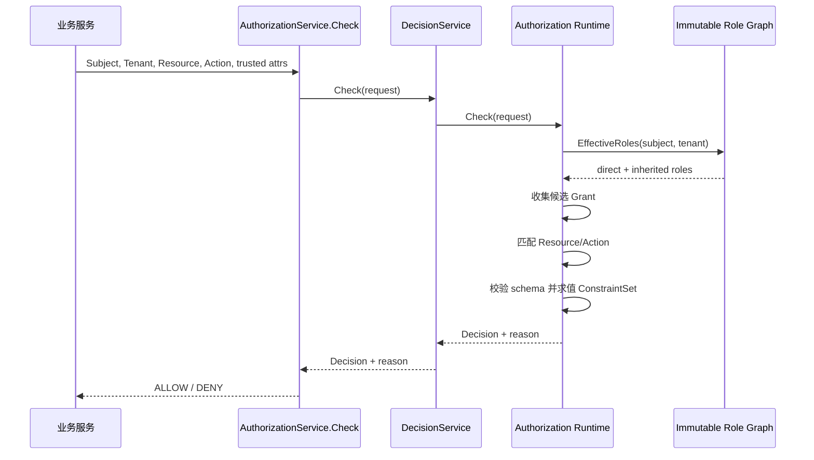

# 关键链路：授权判定与不可变快照

> 状态：已实现 · 本文解释 MySQL 事实如何编译为快照，以及请求期如何得到可解释 Decision。

## 结论

AuthZ v3 在 reload 时从 MySQL 构建完整不可变快照，并以原子替换方式发布。请求期不查权限事实表：自有不可变角色图先算有效角色，
领域 `Evaluator` 再匹配 PermissionGrant 并求值 ConstraintSet。

这条链的设计目标不是“尽量缓存”，而是同时得到三个性质：

- **请求期稳定**：不 join 多张表，不与管理写争抢可变结构。
- **发布原子**：一次判定只看到一个完整版本，不会同时观察新 Role 和旧 Grant。
- **事实可重建**：快照丢失或构建失败不会创造新事实，MySQL 仍是唯一权威源。

## 从 MySQL 到 Dataset

`MySQLSource.Load` 读取六类数据：Role、未删除 Assignment、未撤销 RoleInheritance、未撤销 PermissionGrant、
Resource 与每个 Tenant 的 PolicyVersion。

MySQL 下整个读取使用 read-only `REPEATABLE READ` 事务。因此 Role、Assignment、Grant 等不是分别从不同时刻拼出来的；它们共享同一个一致读视图。这是“完整快照”的数据库前提。

Dataset 是构建阶段的中间投影，不对外提供查询，也不承诺长期兼容。所有记录按稳定字段排序读取，使构建与错误更容易重现。

## BuildSnapshot 是第二道数据防线

管理写链上的领域校验不足以保证历史数据永远干净。`BuildSnapshot` 在发布前会拒绝：

- 缺少 ID、Tenant 或 name 的 Role；
- 同 Tenant 重复 Role name 或重复 Role ID；
- 无效、重复 Resource key 或重复 Resource ID；
- Assignment 引用未知或跨 Tenant Role；
- RoleInheritance 引用未知/跨 Tenant Role、自环或任意环；
- PermissionGrant 引用未知/跨 Tenant Role、未知 Resource 或违反 catalog/schema；
- 无法解析的 Subject key、ConstraintSet 或资源模式。

加载、校验、构建与发布通过同一个可取消入口串行执行。候选版本必须覆盖每个已发布租户，不能用全局最大版本替代。只有所有数据都通过，新 Snapshot 才会进入 `atomic.Pointer`。任意一条错误都会让整次 reload 失败，而不是跳过脏数据继续发布。

## 快照组成

`AuthorizationRuntimeSnapshot` 包含：

- 策略版本；
- Assignment 与 RoleInheritance 构建的角色图；
- Tenant/Role 下的 PermissionGrant 候选集合；
- Resource 的对象属性 schema；
- 判定所需的已编译/规范化条件数据。

实际内存结构可理解为：

```text
ImmutableRoleGraph
  tenant + SubjectRef -> direct RoleName
  tenant + RoleName   -> parent RoleName

grantsByRole[tenant + role-name] -> []*PermissionGrant
resources[resource-key]          -> *Resource
versions[tenant]                 -> policy version
```

`grantsByRole` 是按 Tenant+Role 缩小候选集的索引，不是把所有授权维度固定为物理四维数组。Resource/Action/Constraint 仍在候选 Grant 内依次匹配。

快照是 MySQL 权限事实的可重建投影，不是第二事实源。一次 reload 要么完整成功并替换旧快照，要么保留旧快照，不能发布半成品。

## `Check` 主链



判定步骤：

1. 校验 Subject、Tenant、Resource、Action 和属性输入。
2. 从角色图得到当前 Subject 的有效角色。
3. 按 Tenant 与有效角色收集候选 Grant。
4. 匹配 Resource 和 Action。
5. 无条件 Grant 可直接允许；有条件 Grant 必须校验属性 schema 并求值条件。
6. 没有任何允许 Grant 时默认拒绝。

### 阶段 1：输入规范化

`Request` 必须包含非空 Subject、Tenant、四段具体 Resource key 和具体 Action。请求中的 Resource 不允许通配；通配只属于 Grant Pattern。

如果提交 ObjectAttributes，必须同时提交 `object_id`。每个属性 key 必须使用 `object.*`，value 必须是唯一的类型值。
gRPC transport 还会在进入领域请求前检查 caller/resource/key 白名单。

### 阶段 2：角色闭包

不可变角色图使用 Tenant、`subject.Ref` 与 `role.Name` 组成的类型化键，先取 Subject 的直接角色，再求全部可达 parent role，最后稳定排序。

这个阶段只回答“有哪些 effective roles”，不会因为得到某个叫 `admin` 的角色就立即允许。

### 阶段 3：属性合同校验

若请求提交属性，快照必须找到精确 Resource catalog 记录，并逐个校验 key、type 和 allowed values。

- 未注册 Resource 却带属性：合同错误。
- Resource 已注册但 key 未在 schema：合同错误。
- 类型或枚举值不合法：合同错误。
- 没有提交属性：可继续查找无条件 Grant，也可最终得到 `attribute_missing` deny。

### 阶段 4：Grant 匹配与条件求值

对每个 effective role，运行时只遍历 `tenant + role` 候选 Grant：

1. Resource Pattern 是否逐段覆盖请求 Resource。
2. Action 是否精确相等，或 Grant Action 是 `*`。
3. ConstraintSet 是否无条件，或所有 `eq` predicate 都成立。

找到第一条成功 Grant 后即返回 ALLOW，并记录 matched Grant ID 和 matched Role。如果条件仅因缺 key 不成立，运行时会汇总、去重、排序缺失 key；如果 key 存在但值不等，
它是普通 no-match，不报错。

## Decision 是可解释结果，不只是 bool

| 结果 | `reason` | `deny_code` | 附加证据 |
| --- | --- | --- | --- |
| 允许 | `allowed` | 空 | matched grant ID、matched role、policy version |
| 无规则命中 | `not_matched` | `policy_not_matched` | policy version |
| 缺条件属性 | `attribute_missing` | `attribute_missing` | 缺失 key 集合、policy version |
| 输入不合法 | 不生成普通 Decision | gRPC/REST 错误 | 输入合同违反 |

Decision 还包含求值时间。对外 proto 当前返回 allowed、reason、deny code、matched grant/role、policy version 与缺失 key，
但不将整个候选 Grant 集合或内部图暴露给调用方。

## 两类使用模式

| 模式 | 使用场景 | 要求 |
| --- | --- | --- |
| capability 检查 | 列表、搜索、批量操作、管理路由 | 必须命中无条件 Grant |
| object-aware `Check` | 已加载单个业务对象后的读写 | 可提交服务端生成的受信对象属性 |

列表接口不能因为“某些对象也许满足条件”而接受条件 Grant；否则会在加载对象前扩大可见范围。

## `GetAuthorizationSnapshot`

快照接口用于向可信调用方返回当前授权视图：

- `roles`：有效角色，包含继承所得角色；
- `direct_roles`：由 Assignment 直接授予的角色；
- capability：按当前 Grant 得到的能力候选；
- `policy_version`：该实例当前快照的策略版本。

`roles` 字段保留兼容名称，但语义是 effective roles。调用方如果要编辑 Assignment，必须使用 `direct_roles`，不能把 inherited role 回写为直接 Assignment。

Snapshot 还有两个容易误读的细节：

1. `app_name` 会过滤 role 和 permission。角色只返回名称中可解析出该 app namespace 的项；Grant 只返回 Resource Pattern 属于该 app 的项。
2. 同一 `resource + action` 可由多个角色/Grant 得出。返回会合并去重；只要有一条无条件 Grant，mode 就是 `UNCONDITIONAL`，否则为 `OBJECT_CHECK_REQUIRED`。

`OBJECT_CHECK_REQUIRED` 不是“当前已允许”。它只说明 Subject 有一条可能命中的条件 Grant，调用方仍必须加载具体对象并调用 `Check`。

## 不可变角色图负责什么

`infra/authz/runtime/role_graph.go` 是当前角色闭包实现。Snapshot 构建阶段向 builder 装载两类边：

```text
Subject -> Role        来自 Assignment
Role -> ParentRole     来自 RoleInheritance
```

角色图不负责：

- PermissionGrant 的 Resource/Action 匹配；
- ConstraintSet 求值；
- Resource attribute schema 校验；
- 权限事实持久化；
- REST/gRPC 接口鉴权。

因此准确表述是“角色图是快照中的派生索引”，不是权限事实源或完整授权决策器。

角色图直接使用 `tenant.ID`、`subject.Ref` 和 `role.Name` 作为类型化键，不再需要 domain 参数或 `role:` 字符串编码。自有实现保持以下契约：

- 直接角色查询；
- 多层有效角色闭包；
- Tenant 隔离；
- 循环/最大层级失败语义；
- 稳定去重排序与快照测试。

这些契约由角色图单元测试、Snapshot/Runtime 测试和架构门禁共同保护。

## Reload 与撤权窗口

授权写事务提交后，当前实例尝试本地 reload；Outbox 事件驱动其他实例 reload。运行时构建新快照成功后才原子替换。

失败语义：

- 本地 reload 最多尝试 3 次，间隔 100ms；
- 版本事件处理在最终失败后返回错误，让消息机制继续重试；
- reload 失败时保留旧快照，但仅在最近一致性确认未满 60 秒时继续服务；到达边界返回 503 / Unavailable；
- 因此撤权不是“数据库提交后所有实例瞬时生效”，需要结合版本滞后指标与 readiness 观察。

快照的原子替换避免半新半旧，但不能消除多实例收敛时间。

### 为什么失败时保留旧快照

新数据集如果含有成环继承、跨 Tenant 引用或不符合 schema 的 Grant，将其“部分发布”会形成无法对应任何数据库版本的策略。当前选择是：

```text
新快照完整成功且逐租户版本不回退 -> atomic swap(snapshot + proof)
新快照失败 -> 保留旧快照，确认年龄不足 60 秒时 degraded
确认年龄达到 60 秒 -> 未就绪，授权查询返回不可用
```

这个选择保住了请求期内部一致，但意味着一次撤权写入已成功时，运行时仍可能暂时使用旧权限。因此 reload 错误和 version lag 是安全告警，不是普通缓存命中率问题。

## 请求期成本模型

Check 的主要成本来自：

```text
角色闭包
+ 每个 effective role 下候选 Grant 数
+ 命中 Resource/Action 的 predicate 数
```

当前每个 ConstraintSet 最多 8 个 predicate，角色继承最多 32 个节点（31 条继承边）。它们是可控上界，但不等于经过任意规模生产压测。若 Grant 数量大幅增长，应使用实际角色/ Grant 分布重新基准测试，
而不是仅从无数据库查询推导为恒定成本。

## 可观测性与解读边界

| 指标 | 用途 | 不能单独证明 |
| --- | --- | --- |
| `iam_authz_native_checks_total{result}` | allowed/denied/error 趋势 | 某个 deny 一定是异常 |
| `iam_authz_native_check_duration_seconds{result}` | Check 延迟分布 | 外部业务整链延迟 |
| `iam_authz_native_reloads_total{result}` | reload 成败趋势 | 所有实例已收敛 |
| `iam_authz_native_reload_duration_seconds` | 构建+切换耗时 | 数据库事实正确 |
| `iam_authz_native_loaded_policy_version_max` | 当前快照最大版本 | 每个 Tenant 都在目标版本 |
| `iam_authz_native_policy_version_lag_max` | 已观察事件与已加载版本滞后 | 没收到的事件不存在 |

指标不带高基数 Tenant 标签，运行时健康详情另外返回最后事件 Tenant/version、已加载版本映射、reload 时间和同步 channel。生产收敛应结合实例维度健康数据，不应只看一个全局 gauge。

## 主要代码与测试

- `internal/apiserver/infra/authz/runtime/snapshot.go`：角色图和不可变快照构建。
- `internal/apiserver/infra/authz/runtime/runtime.go`：实现授权运行时端口，组织候选并调用领域 Evaluator。
- `internal/apiserver/application/authz/authorization`：`DecisionService.Check`、路由判定转换与快照查询。
- `internal/apiserver/transport/grpc/service/authz`：gRPC 映射。
- `internal/apiserver/infra/authz/runtime/runtime_test.go`：角色图、匹配和快照行为。

### 测试能证明什么

- domain constraint 测试证明规范化、类型校验、缺失与不等值的分流。
- runtime 测试证明 Assignment+Inheritance 闭包、Grant 匹配、条件判定和 snapshot 合并语义。
- gRPC service 测试证明 proto 映射、服务身份要求与当前对象属性白名单。
- reloader 测试证明 3 次重试和最终错误返回。

### 测试不能证明什么

- 单元测试不证明生产 MySQL 当前事实没有污染。
- 一个实例 reload 成功不证明所有实例已切换。
- 快照的 policy version 不证明当前部署产物就是预期 commit。
- 目前代码快照测试不等于大规模角色图/Grant 的容量验收。

## 所有权与新鲜度

Snapshot 深复制输入的 Grant、Resource、条件集合、schema、嵌套切片及标量指针。内部 `evaluationContext` 只供 Runtime 调用，不向外暴露候选 map 和实体指针；主体快照、有效角色和版本映射返回独立副本。

条件 Grant 构建时同时校验资源 schema 与可信提供者覆盖。数据库版本核对默认每 10 秒执行；确认时间采用成功证明的读取开始时刻。完整规则见 [多实例策略收敛](04-关键链路-多实例策略收敛.md)。
