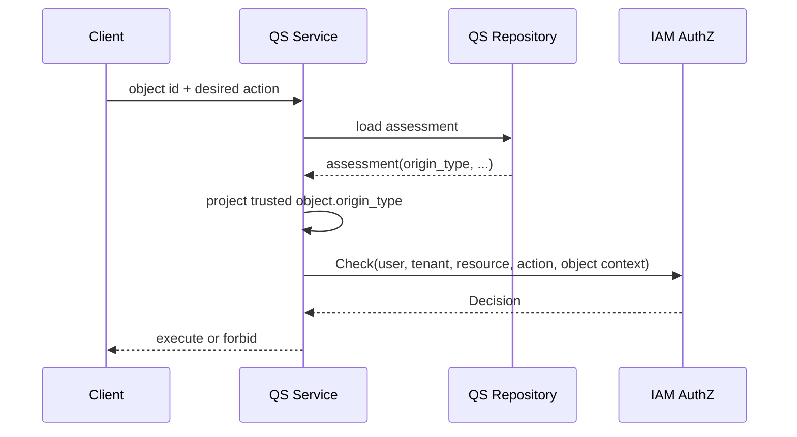

# 模块边界：AuthZ 与 AuthN、Identity、Suggest

> 状态：已实现 · 本文以当前组合根、应用端口、REST/gRPC 路由与运行时依赖方向为依据。

## 结论

AuthZ 的责任是根据受信的 Subject、Tenant、Resource、Action 和最小 ObjectAttributes 做授权决策。它不负责证明调用者是谁，不拥有用户与登录身份，不拥有业务对象，
也不自己决定查询数据的最终范围。

```text
AuthN       证明人/服务身份，产生 Principal
Identity    拥有 User/Profile/ProfileLink 事实
AuthZ       管理授权事实，产生 Decision/Capability
Suggest     组合 Principal + Capability + Identity 查询得到最终建议
业务服务  拥有业务对象，提取受信 ObjectAttributes
```

边界的核心判断是：**谁拥有事实，谁负责加载与证明它；AuthZ 只消费授权所需的最小投影。**

## 事实拥有矩阵

| 事实/能力 | 拥有模块 | AuthZ 如何使用 | 不允许的捷径 |
| --- | --- | --- | --- |
| 密码、验证码、外部登录、Session | AuthN | 不读取；只接收已验证 Principal | 用“登录成功”代替权限检查 |
| User 存在性/状态 | Identity | Assignment 写入通过 User resolver 校验 | 在 AuthZ 复制 User 属性 |
| Profile/ProfileLink | Identity | Suggest 根据 capability 选择查询范围 | 把 profile 所属关系长期写成 Role |
| Role/Assignment/Inheritance/Grant | AuthZ | 直接作为权限事实 | 让业务服务各自维护 policy 副本 |
| Resource schema | AuthZ catalog | 限制可进入条件授权的属性 | 把 schema 当成业务对象存储 |
| Assessment origin/status/owner | QS 业务模块 | 由 QS 加载后投影最小属性给 Check | 由客户端自报或全量同步到 IAM |
| WeChat App 配置 | IDP | IAM 路由使用 AuthZ 保护管理操作 | 把 App 配置当作 PermissionGrant |

## AuthN → AuthZ：认证结果变成 Subject

AuthN 回答“这个请求代表谁”，AuthZ 回答“这个主体能不能做某事”。两者的连接点是 Principal 中稳定 UserID 和 TenantDomain，而不是登录名、手机号、UnionID 或角色名。

REST 链路为：

```text
Bearer token
  -> AuthN VerifyToken
  -> verified TokenClaims
  -> request context(UserID, TenantDomain, ...)
  -> AuthZ route middleware builds subject user:<UserID>
  -> current Tenant Check
  -> optional platform Tenant fallback
```

不变量：

- AuthZ 不自行解析未验证 JWT claims。
- URL/body 中的 user ID 是目标对象，不是操作者。
- token 过期、撤销或无效应在 AuthN 层拒绝，不进入权限判定。
- 已认证不代表已授权；受保护管理路由必须再调 Resource/Action Check。

AuthN 的 JWKS 管理与 Session 撤销虽属于 AuthN 业务，但这些管理动作本身由 AuthZ PermissionGrant 保护。这是“业务归 AuthN，操作权归 AuthZ”的典型跨模块边界。

## 服务认证 → AuthZ：gRPC caller 不是被判定 Subject

gRPC `CheckRequest.subject` 通常是要被判定的用户，而 context 中 service identity 是发起请求的业务服务。两者必须同时保留：

```text
caller service: qs-apiserver.svc
subject:        user:42
```

caller service 决定能否调用 RPC、能否提交某个对象属性、能管理哪些 Assignment；Subject 则参与 Role/Grant 判定。用 Subject 字段伪造 caller service，
或用 service identity 直接代替用户 Subject，都会混淆威胁边界。

## Identity → AuthZ：存在性解析，不复制用户模型

Assignment 要防止给不存在的 Subject 授角色。当前 assignment validator 通过 SubjectResolverRegistry 调用 Identity User resolver 做存在性检查。

这是一个反腐层：

- AuthZ 依赖“某类 Subject 是否存在”端口，而不依赖 Identity repository 的所有查询能力。
- Identity 返回存在性证据，不把 User 聚合整体交给 AuthZ 存储。
- 当 User 停用/删除的生命周期语义需要影响已有 Assignment 时，应显式设计撤权/事件链，不应依赖 Check 时每次 join User 表。

领域 Subject 值对象已接受 user/group/service，但当前只有 User resolver 被组合。因此未来支持 Group/Service Assignment 是模块协作变更，不是单文件枚举扩展。

## Suggest ↔ AuthZ：capability 决定查询范围

Suggest 不拥有新的权限模型。它使用 AuthZ capability 决定可以向 Identity 请求哪一种查询范围，再由 Suggest/Identity 执行具体搜索。

当前链路是：

```text
REST /suggest/profiles
  -> AuthN user JWT
  -> current Tenant profiles/search route permission
  -> Suggest application service
  -> platform profiles/list permission ? AllProfile : Tenant-limited scope
  -> mobile query additionally requires profiles/search_by_mobile
  -> Identity provider executes filtered query
```

关键语义：

- 外层 `search` 是进入 Suggest 的 capability。
- 平台域 `list` 是扩大到 AllProfile 的 capability。
- `search_by_mobile` 是敏感查询条件的独立 capability。
- 没有旧的超级管理员布尔旁路或角色名特例；即使 Subject 角色名为 `super_admin`，也必须有对应 PermissionGrant。

AuthZ 不返回最终 Profile 列表，Identity 也不自己判断平台权限。这样权限决策与查询事实保持分离。

## 业务服务 → AuthZ：对象级授权

以 Assessment 为例，对象级链路必须由 QS 先加载事实：



这条链中：

- Client 只能选择对象 ID 和请求动作，不能决定 `origin_type`。
- QS 是 Assessment 事实拥有者，负责存在性、并发状态与属性正确性。
- IAM 只接受白名单属性，根据 Resource schema/ConstraintSet 求值。
- ALLOW 只证明授权规则允许，QS 仍要检查对象是否可在当前业务状态下执行动作。

## IDP 与 AuthZ：配置事实与管理权限分开

WeChat App 配置归 IDP 聚合与仓储，但管理 REST 路由使用 `iam:idp:collection:wechat_apps` 及明确 Action 做 AuthZ 检查。

AuthZ 不保存 AppID/secret 也不解释微信配置；IDP 不使用“某个角色名”自行开特权。这种边界允许 IDP 模型独立演进，同时保持管理权限统一可审计。

## 事件与传输边界

AuthZ 对外有两类信息：

- **同步决策/command**：REST 管理、gRPC Check/Snapshot/Assignment。
- **异步收敛信号**：`iam.authz.version_changed` 通知 IAM 其他实例重建快照。

PolicyVersion 事件不是给业务服务的权限 delta 流。外部服务不应消费该 topic 并在本地复制 AuthZ runtime。它是 IAM 实例间的内部快照收敛机制。

## 失败责任矩阵

| 故障 | 首要负责模块 | 预期处理 |
| --- | --- | --- |
| token 无效/过期/撤销 | AuthN | 认证失败，不进入 AuthZ |
| User 不存在 | Identity + Assignment 写链 | 拒绝建立新 Assignment |
| 无匹配 Grant | AuthZ | 正常 deny |
| 业务对象不存在 | 业务服务 | 在 Check 前返回 not-found，不伪造属性 |
| 属性缺失 | AuthZ Decision + 调用方 | `attribute_missing` deny，调用方检查投影链 |
| 属性类型/来源不合法 | gRPC transport/Runtime | 合同错误，不得当作普通 deny |
| Suggest 越界搜索 | Suggest + AuthZ 接入 | 检查外层 search、AllProfile 与 mobile 三层 capability |
| 快照滞后 | AuthZ 运行时/运维 | 观察 version lag、subscriber/reload 健康 |

## 跨模块反模式

### 用角色名作为公共接口特权

`if role == super_admin` 会让不同模块各自定义超级管理员语义，绕过 PermissionGrant 审计。当前应统一使用 Resource/Action capability。

### 把业务组织关系全部变成 Role

班级成员、测评所属计划、档案链接等有独立生命周期的关系应留在业务/Identity 模块。只有稳定的授权聚合才应进入 Role/Assignment。

### 让 IAM 回调业务库加载对象

这会让 IAM 依赖每个业务模型、网络可用性和并发语义，并容易形成 confused deputy。当前选择由拥有对象的服务先加载，IAM 只接受受限投影。

### 让业务服务持久化 AuthorizationSnapshot

Snapshot 是 IAM 运行时投影。外部服务长期存储它会产生独立撤权窗口和版本收敛问题。如需缓存，必须显式设计 TTL、version、撤权 SLO 和失效机制，不能默认把 snapshot 当作静态用户属性。

## 跨模块变更清单

新增一条对象级权限链时，必须共同评审：

1. 业务对象的事实拥有者与加载时机。
2. Resource 四段 key、具体 Action 与列表/单对象语义。
3. Resource attribute schema 的最小 key/type/value 集合。
4. 哪个 service identity 可提交哪些属性。
5. PermissionGrant/ConstraintSet 如何 bootstrap 或通过管理面创建。
6. deny、attribute missing、contract error 与业务 not-found 的分层。
7. proto/SDK、ACL、属性白名单、集成测试和运维观测。

新增一条管理路由时，则必须检查 AuthN Principal、current/platform Tenant 语义、permission catalog、bootstrap Grant、OpenAPI 和 route-contract。

## 证据边界

组合根和接口测试可以证明当前代码依赖方向、路由绑定与白名单。它们不能证明：

- 生产 token/service credential 一定按预期签发；
- 业务服务确实从数据库加载了对象而非复用客户端字段；
- 生产 PermissionGrant 与 bootstrap 基线完全一致；
- 多实例在撤权后已达到目标收敛时间。

这些结论需要跨仓集成测试、部署 SHA、运行时版本与真实请求样本。

## SubjectResolver 适配边界

AuthZ 领域声明 SubjectResolver；`infra/authz/subjectresolver.UserSubjectResolver` 适配 Identity UserResolver。组合根创建同一个注册器并传给领域验证器和 AuthZ UoW，事务用例不重新建立注册器。Group/Service 写入口仍关闭。AuthZ 的授权准入与 AuthN AdmissionPolicy 各自负责自己的用例边界。
