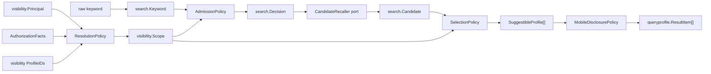

# Suggest 领域模型与应用端口

> 状态：已实现 · domain 已拆为 `profile`、`visibility`、`search`，application 已拆为 `queryprofile`、`refreshindex`。

## 1. 设计结论

Suggest 不是围绕事务一致性维护状态的聚合域，而是围绕“谁可以用什么关键词看见哪些候选，以及候选如何排序和披露”的策略型查询域。

因此它的领域表达不应照搬 Identity/AuthN 的实体、仓储和领域事件结构。当前最重要的领域对象是：

```text
SuggestibleProfile       允许进入 Suggest 的最小派生模型
Principal                发起查询的最小身份快照
AuthorizationFacts       AuthZ 适配器读取出的能力事实
Scope                    本次查询的可见范围
Keyword / Decision       查询语义与准入结果
Candidate                索引召回结果及匹配强度
SelectionPolicy          可见性过滤、去重、排序和截断
MobileDisclosurePolicy   手机号输出规则
```

TST、Hash、SQL、Cron、Prometheus 和 Redis 是这些模型与用例的实现手段，属于 infra/container，而不是领域概念。

## 2. 模型全景



这张图刻意把“决策”和“执行机制”分开：domain 决定 intent、scope、排序与披露；application 编排；infra 按 intent 执行具体召回。

## 3. `profile`：受约束的派生模型

### 3.1 `SuggestibleProfile`

`profile.SuggestibleProfile` 不是 Identity `Profile` 的复制品，只保存查询链真正需要的字段：

| 字段 | 用途 |
| --- | --- |
| `ID` | 候选身份、去重、稳定排序、Hash key |
| `DisplayName` | 展示、TST 原名 key、直接前缀加分 |
| `Mobiles` | 获准后的手机号精确召回和输出掩码 |
| `Weight` | 第一排序键 |
| `OrgID` | scope 的组织维度 |
| `OwnerOperatorIDs` | scope 的 owner 维度 |

构造器 `profile.New` 固定以下不变量：

- `ProfileID > 0`；
- `DisplayName` trim 后非空；
- 手机号 trim，并移除空项；
- owner operator ID 去重并移除 `0`；
- 对外返回手机号和 owner ID 时复制 slice，避免调用方修改内部状态。

MySQL Loader 必须通过该构造器恢复读模型。P1 修复后，任意一行不能构成合法 `SuggestibleProfile` 时，Full/Delta 会返回带 ProfileID 的映射错误，不再跳过坏行后推进刷新游标。

### 3.2 为什么没有 `Save`、`UpdateName` 或领域事件

Suggest 不拥有 Profile 生命周期。名称、手机号、关系状态的写入都发生在 Identity；Suggest 只能把这些事实投影成可重建状态。
给 `SuggestibleProfile` 增加写仓储或主数据修改方法会制造双写和所有权冲突。

它当前承担的是派生模型不变量和查询行为，而不是事务聚合行为。

### 3.3 手机号识别与披露

`profile.LooksLikeMobile` 对通常的 7–15 位纯数字关键词做宽松手机号形态判断。它只用于选择安全策略，不承担 E.164 归一化或号码真实性校验。

`MobileDisclosurePolicy` 只披露第一个手机号：

| 配置 | 结果 |
| --- | --- |
| 默认 | `MaskMobile`，例如 `138****8000` |
| `DisableMask=true` | 原样返回第一个手机号 |
| 无手机号或长度不足 | 空字符串 |

`DisableMask` 只允许非生产环境；production 的禁止规则由 composition root 检查，因为运行环境不是领域事实。

## 4. `visibility`：把授权事实变成本次查询范围

### 4.1 四种对象不要混用

| 对象 | 表达什么 | 不表达什么 |
| --- | --- | --- |
| `Principal` | 当前操作员、授权域和业务组织身份 | 完整 JWT、角色列表 |
| `AuthorizationFacts` | AuthZ 已判定出的 list/mobile 能力 | Casbin policy、角色名 |
| `Resource` | 一个候选用于 scope 判断的最小属性 | Profile 详情 |
| `Scope` | 本次查询可见的 Profile 范围与手机号能力 | 持久授权策略 |

`Principal.TenantDomain` 是 AuthZ domain 字符串；`OrgID/OrgIDs` 是业务数据可见维度。它们不能再次合并为一个数值 TenantID。

### 4.2 `Scope` 的判定规则

`Scope.Allows(resource)` 是 OR 语义：

```text
allProfiles
OR resource.ProfileID in explicit profileIDs
OR resource.OrgID in orgIDs
OR current OperatorID in resource.OwnerOperatorIDs
```

`Scope` 的集合字段不可直接修改；构造时忽略零 ID，对外返回排序后的副本。这让选择策略得到稳定、只读的查询上下文。

`AllowsMobileSearch` 与 Profile 可见性是两个维度：能看见某个 Profile 不自动获得手机号搜索能力，平台全量可见也不自动获得手机号搜索能力。

### 4.3 `ResolutionPolicy`

`ResolutionPolicy.Resolve` 只组合已经读取出的事实，不访问数据库或 AuthZ：

| 条件 | 生成的 Scope |
| --- | --- |
| `PlatformListAllowed=true` | `allProfiles=true`；手机号能力取 `PlatformMobileSearchAllowed` |
| 否则 | operator + principal orgs + visibility ProfileIDs；手机号能力取 `TenantMobileSearchAllowed` |

若 `Principal.OrgIDs` 非空则优先使用它；否则使用单值 `OrgID`。重复与非法 ID 会在 Scope 内归一化。

## 5. `search`：准入、候选和选择

### 5.1 `Keyword` 与查询意图

`NewKeyword` 先 trim，再由 `AdmissionPolicy` 生成封闭决策：

| 关键词 | 条件 | `Intent` / 拒绝原因 |
| --- | --- | --- |
| 空 | — | `DenialEmptyKeyword` |
| 手机号形态 | 无手机号能力 | `DenialMobileSearchForbidden` |
| 任意纯数字 | 已通过上述检查 | `IntentNumericExact` |
| 非纯数字 | — | `IntentTextPrefix` |

这意味着手机号形态关键词不会在无权限时到达索引；其他纯数字按 ProfileID/手机号 Hash key 做精确匹配，不做数字前缀扫描。

`DecisionKind` 是无基础设施字符串的领域枚举。infra metrics 才把它映射为 `mobile_denied`、`numeric_exact`、`prefix_text`。

### 5.2 `Candidate` 与匹配强度

索引 adapter 返回 `Candidate{Profile, Strength}`。匹配强度按以下优先级参与排序：

```text
MatchExact > MatchDirectPrefix > MatchExpandedPrefix
```

Domain 不关心 Exact 来自 Hash、DirectPrefix 来自 TST，还是未来来自 Elasticsearch；adapter 只需把技术命中解释成这三个稳定语义。

### 5.3 `SelectionPolicy`

`SelectionPolicy.Select` 固定执行顺序：

1. 记录 scope 过滤前的 `MatchedCount`；
2. 用 `Scope.Allows` 过滤候选；
3. 记录过滤后、去重前的 `VisibleCount`；
4. 按 ProfileID 去重；
5. 排序；
6. 应用最终 limit。

同一 ProfileID 被多个 key 召回时，先保留 Weight 更高的候选；Weight 相同时保留匹配强度更高的候选。随后 `RankingPolicy` 使用稳定顺序：

1. `Weight` 降序；
2. `MatchStrength` 降序；
3. `DisplayName` 是否直接以前缀开头，命中者优先；
4. `ProfileID` 升序。

排序与 scope 不放进 TST/Hash，是为了不让索引遍历顺序成为业务规则，也避免 adapter 替领域层决定权限。

## 6. `queryprofile` 应用用例

`queryprofile.Service` 负责按固定顺序调用领域策略和端口：

```text
Command
  -> validate Principal
  -> normalize Keyword
  -> ResolveScope
  -> AdmissionPolicy.Decide
  -> CandidateRecaller.Recall
  -> SelectionPolicy.Select
  -> MobileDisclosurePolicy.Disclose
  -> ResultItem[]
```

它不实现 SQL、不遍历 TST、不读取 Gin Context，也不拼 Prometheus label。

### 6.1 查询端口

| 端口 | 责任 | 当前实现 |
| --- | --- | --- |
| `AuthorizationFactsReader` | 读取 Suggest 所需的 AuthZ capability | `infra/suggest/authorization.FactsReader` |
| `VisibilityReader` | 读取显式可见 ProfileID | MySQL reader，可包短 TTL cache |
| `ScopeResolver` | 编排事实读取并调用 `ResolutionPolicy` | `ScopeResolverService` |
| `CandidateRecaller` | 按 intent 召回候选，不做 scope/排序 | `index/memory.Runtime` |
| `Metrics` | 记录查询与选择规模 | Prometheus recorder |
| `Querier` | transport 使用的查询用例 | `Service` 或 `DegradedQuerier` |

`DegradedQuerier` 明确返回空数组。它是可选模块启动失败时的运行降级，不等价于“索引已就绪但没有匹配”。

### 6.2 应用 DTO

`Command` 携带领域 `Principal`、原始关键词和请求 limit；`ResultItem` 携带 ProfileID、DisplayName、MobileMask 和 Weight。
REST 负责把 ProfileID 转成字符串并包装成统一 `{code,message,data}` envelope。

## 7. `refreshindex` 应用用例

刷新不是 `SuggestibleProfile` 的领域行为，而是派生索引的应用生命周期。因此 Full/Delta 编排和物理变更协议位于 `application/suggest/refreshindex`。

### 7.1 `ProjectionChange`

`ProjectionChange` 封闭表达两种物理投影动作：

- `Upsert(profile)`：重新校验合法 `SuggestibleProfile`；
- `Delete(profileID)`：要求正 ProfileID。

Delete 不再伪装成一个空 DisplayName 的领域对象。只有 MySQL adapter 在解析自定义/默认 Delta 行时，把空名称行解释成 Delete。

### 7.2 刷新端口

| 端口 | 责任 | 当前实现 |
| --- | --- | --- |
| `ProjectionSource` | 提供 Full profiles 与 Delta changes | `infra/mysql/suggest.Loader` |
| `IndexWriter` | Replace 全量快照或 Apply 增量变更 | `index/memory.Runtime` |
| `Metrics` | 刷新耗时、结果、upsert/tombstone 和成功时间 | Prometheus recorder |

游标、互斥和成功时间由 `Refresher` 管理；Cron 表达式和后台调度由 container 管理。

## 8. 配置归属

外部键仍集中在 `SuggestOptions`，但 `container/suggest.ModuleConfigFromOptions` 必须把它们映射成各层的小配置：

| 外部配置 | 内部 owner |
| --- | --- |
| `max_results`、`internal_max_results`、`disable_mobile_mask` | `queryprofile.Config` |
| `key_pad_len`、`trie_wildcard_key_cap` | `index/memory.Config` |
| `full_sql`、`delta_sql`、`loader_placeholder_org_id` | MySQL `LoaderConfig` |
| `visibility_cache_ttl_seconds` | visibility adapter `Config` |
| `rate_limit.*` | ratelimit adapter `Config` |
| `enable`、`required`、`full_sync_cron`、`delta_sync_cron` | `container/suggest.ModuleConfig` |

P2 修复后，`infra/suggest` 不再 import 全局 `options`；转换只发生在 composition root。

## 9. 模型强度的验收标准

Suggest 不需要为了“看起来像 DDD”增加空 Repository、Manager 或聚合根。判断它是否贫血，应检查领域规则是否能在 domain 中直接读到：

- 合法候选状态由 `SuggestibleProfile` 保证；
- 可见范围由 `Scope` 和 `ResolutionPolicy` 表达；
- 手机号准入由 `AdmissionPolicy` 表达；
- scope filter、去重、排序和 limit 顺序由 `SelectionPolicy` 表达；
- 输出敏感度由 `MobileDisclosurePolicy` 表达。

这些规则当前都不依赖 Gin、SQL、TST、Prometheus 或 Cron。模型规模不大，但并不贫血；继续增强应由新的业务不变量驱动，而不是机械增加类型数量。

## 10. 证据入口

- 领域行为：`internal/apiserver/domain/suggest/**/*_test.go`
- 查询编排：`internal/apiserver/application/suggest/queryprofile/service_test.go`
- scope 解析：`internal/apiserver/application/suggest/queryprofile/scope_resolver_test.go`
- 刷新协议：`internal/apiserver/application/suggest/refreshindex/refresher_test.go`
- 分层护栏：`internal/pkg/architecture/architecture_test.go` 中 `TestSuggestProfileSuggestionBoundaries`
