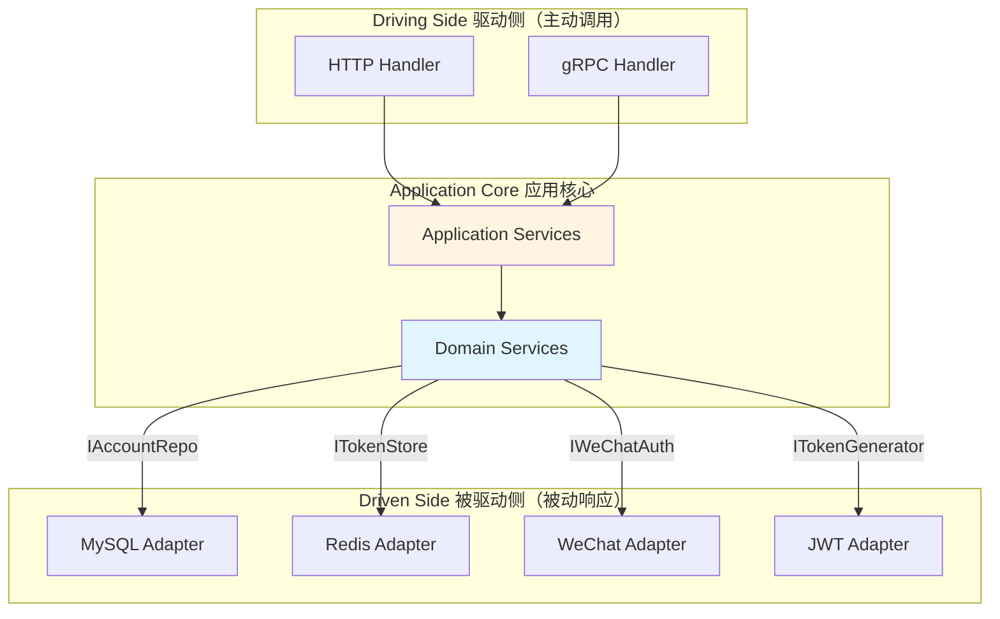
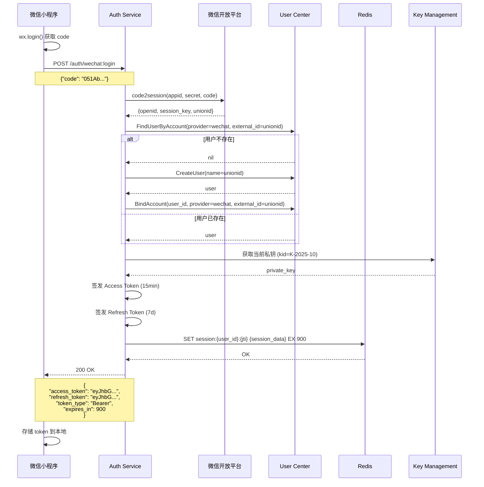
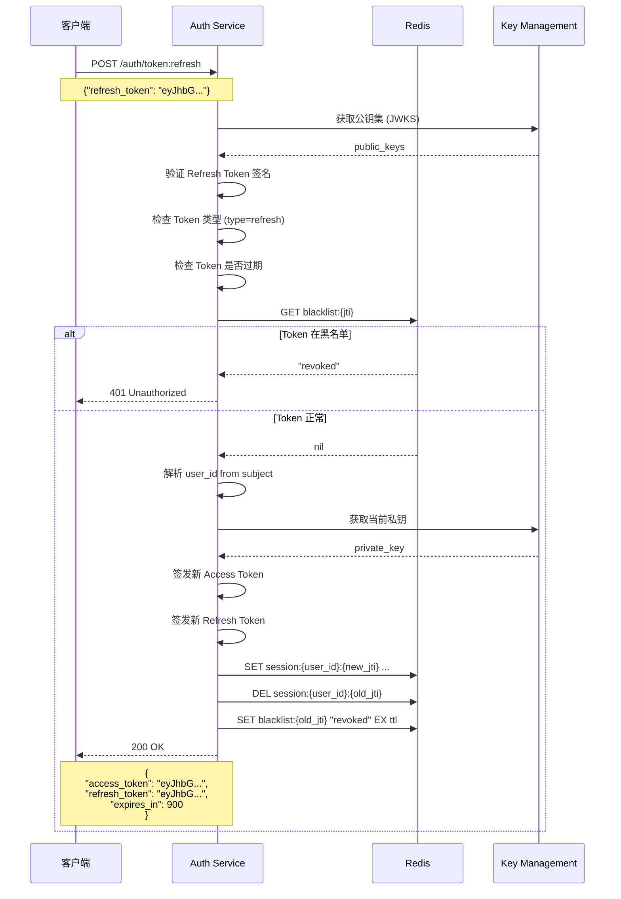
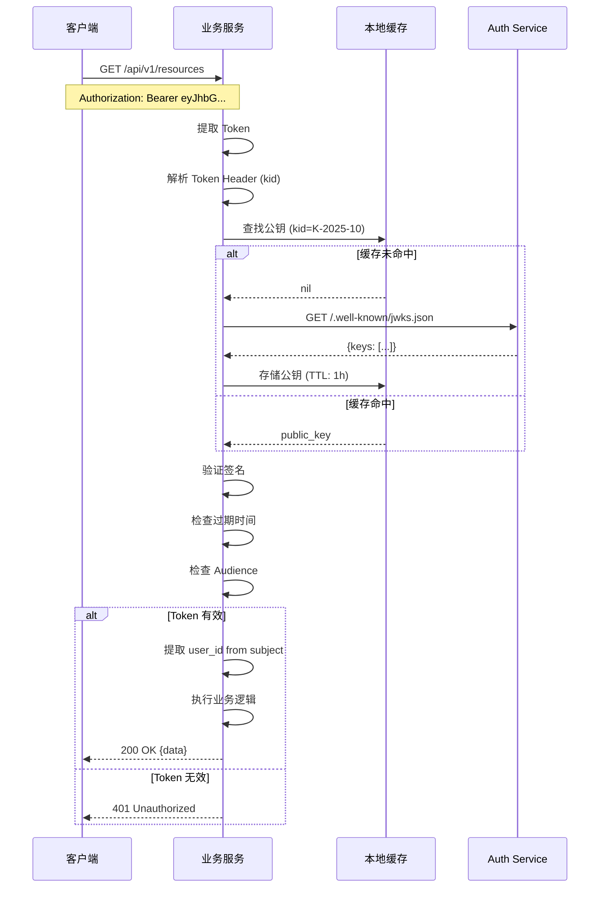

# 认证中心（Authn Module）架构设计

## 📋 目录

- [1. 模块概述](#1-模块概述)
- [2. 目录结构](#2-目录结构)
- [3. 核心职责](#3-核心职责)
- [4. 认证流程](#4-认证流程)
- [5. Token 管理](#5-token-管理)
- [6. 安全设计](#6-安全设计)
- [7. API 设计](#7-api-设计)
- [8. 集成方案](#8-集成方案)
- [9. 总结](#9-总结)
  
---

## 1. 模块概述

认证中心（Authentication Center, Authn）负责用户身份认证、JWT 令牌签发与验证、多渠道登录支持等核心能力。

### 1.1 设计目标

- ✅ **多渠道登录**: 支持微信、企业微信、本地密码等多种认证方式
- ✅ **JWT 标准**: 基于 RFC 7519 标准签发和验证 Token
- ✅ **JWKS 支持**: 公钥集发布，支持业务服务自验证
- ✅ **Token 刷新**: Refresh Token 机制，提升用户体验
- ✅ **会话管理**: Redis 存储活跃会话，支持强制登出

### 1.2 技术特性

| 特性 | 实现方式 |
|------|---------|
| **JWT 签名** | RS256 (RSA 非对称加密) |
| **密钥管理** | 定期轮换，支持多密钥并存 |
| **Token 存储** | Redis + 黑名单机制 |
| **密码加密** | BCrypt 哈希 |
| **防重放攻击** | Nonce + 时间戳验证 |

---

## 2. 目录结构

Authn 模块遵循六边形架构（Hexagonal Architecture）和领域驱动设计（DDD）原则，清晰分离关注点。

### 2.1 整体结构

```text
internal/apiserver/modules/authn/
├── application/                    # 应用层 - 应用服务和用例编排
│   ├── account/                    # 账户管理应用服务
│   │   ├── services.go             # 应用服务接口定义
│   │   ├── account_app_service.go  # 账户创建/更新/删除
│   │   ├── wechat_app_service.go   # 微信账户绑定服务
│   │   ├── operation_app_service.go # 账户操作记录服务
│   │   ├── lookup_app_service.go   # 账户查询服务
│   │   └── util.go                 # 工具函数
│   ├── login/                      # 登录应用服务
│   │   └── service.go              # 登录服务（编排认证器+令牌签发）
│   ├── token/                      # Token 管理应用服务
│   │   └── service.go              # Token 签发/刷新/撤销
│   ├── jwks/                       # JWKS 发布应用服务
│   │   └── query.go                # PublicJWKSApp（产出 /.well-known/jwks.json）
│   ├── adapter/                    # 适配器（跨模块调用）
│   │   ├── user_adapter.go         # UC 模块适配器接口
│   │   └── user_adapter_impl.go    # UC 模块适配器实现
│   └── uow/                        # 工作单元（Unit of Work）
│       └── uow.go                  # 事务管理
│
├── domain/                         # 领域层 - 核心业务逻辑
│   ├── account/                    # 账户聚合根
│   │   ├── account.go              # 账户实体（聚合根）
│   │   ├── wechat.go               # 微信账户实体
│   │   ├── operation.go            # 账户操作记录实体
│   │   ├── user_id.go              # 用户ID值对象
│   │   ├── vo.go                   # 其他值对象
│   │   ├── service/                # 账户领域服务
│   │   │   ├── query.go            # 账户查询服务
│   │   │   ├── creater.go          # 账户创建服务
│   │   │   ├── editor.go           # 账户编辑服务
│   │   │   ├── status.go           # 账户状态管理服务
│   │   │   └── registerer.go       # 账户注册服务
│   │   └── port/                   # 端口（接口定义）
│   │       ├── driven/             # 被驱动端口（基础设施接口）
│   │       │   └── repo.go         # 账户仓储接口
│   │       └── driving/            # 驱动端口（应用层接口）
│   │           └── service.go      # 账户领域服务接口
│   │
│   ├── authentication/             # 认证聚合根
│   │   ├── authentication.go       # 认证实体
│   │   ├── token.go                # Token 值对象
│   │   ├── service/                # 认证领域服务
│   │   │   ├── authenticator/      # 认证器
│   │   │   │   ├── authenticator.go           # 认证器接口
│   │   │   │   ├── wechat_authenticator.go    # 微信认证器
│   │   │   │   └── basic_authenticator.go     # 基础认证器（密码）
│   │   │   └── token/              # Token 服务
│   │   │       ├── issuer.go       # Token 签发服务
│   │   │       ├── verifyer.go     # Token 验证服务
│   │   │       └── refresher.go    # Token 刷新服务
│   │   │       └── port/                   # 端口（接口定义）
│   │   │           ├── driven/             # 被驱动端口
│   │   │           │   ├── token.go        # Token 存储接口
│   │   │           │   └── wechat_auth.go  # 微信认证接口
│   │   │           └── driving/            # 驱动端口
│   │   │               └── [reserved]      # 预留
│   │   
│   └── jwks/                         # JWKS 发布子域（只管公钥&发布元数据）
│       ├── key.go                    # Key/PublicJWK/KeyStatus 等实体
│       ├── vo.go                     # JWKS/CacheTag/RotationPolicy(预留)
│       └── port/
│           ├── driven/               # 被驱动端口（供 infra 实现）
│           │   ├── keyset_reader.go  # KeySetReader（对外发布 JWKS）
│           │   └── privkey_resolver.go # PrivateKeyResolver（签名侧拿私钥句柄）
│           └── driving/              # 驱动端口（管理面/将来轮换，首版可空）
│               └── [reserved]
│
├── infra/                          # 基础设施层 - 外部依赖实现
│   ├── mysql/                      # MySQL 实现
│   │   └── account/                # 账户仓储实现
│   │       ├── po.go               # 持久化对象（PO）
│   │       ├── mapper.go           # DO <-> PO 映射器
│   │       ├── repo_account.go     # 账户仓储实现
│   │       ├── repo_wechat.go      # 微信账户仓储
│   │       ├── repo_operation.go   # 账户操作记录仓储
│   │       └── password_adapter.go # 密码哈希适配器
│   ├── redis/                      # Redis 实现
│   │   └── token/                  # Token 存储实现
│   │       └── store.go            # Redis Token 存储
│   ├── jwt/                        # JWT 实现
│   │   └── generator.go            # 
│   │   ├── generator.go            # JWT 生成器（RS256）
│   │   ├── keyset_static.go        # KeySetReader 的静态实现（单 key）
│   │   └── signer_file.go          # 文件/KMS 私钥签名器实现（用在 generator.go 内）
│   └── wechat/                     # 微信 SDK 适配器
│       └── auth_adapter.go         # 微信登录适配器（code2session）
│
└── interface/                      # 接口层 - 对外暴露 API
    └── restful/                    # RESTful API
        ├── router.go               # 路由注册
        ├── handler/                # HTTP 处理器
        │   ├── base.go             # 基础处理器
        │   ├── account.go          # 账户管理 API
        │   ├── auth.go             # 认证相关 API（登录/登出/刷新）
        │   └── jwks.go             # JWKS 发布 API
        ├── request/                # 请求 DTO
        │   ├── auth.go             # 认证请求 DTO
        │   └── account.go          # 账户请求 DTO
        └── response/               # 响应 DTO
            ├── auth.go             # 认证响应 DTO
            └── account.go          # 账户响应 DTO
```

### 2.2 分层职责

#### Interface Layer（接口层）

- **职责**: 对外暴露 HTTP API，处理请求/响应转换
- **关键文件**:
  - `handler/auth.go`: 登录、登出、Token 刷新
  - `handler/account.go`: 账户绑定、解绑、查询
  - `request/*.go`: 请求参数校验和 DTO 定义
  - `response/*.go`: 响应格式化和 DTO 定义

#### Application Layer（应用层）

- **职责**: 用例编排，协调领域服务和基础设施
- **关键文件**:
  - `login/service.go`: 登录流程编排（认证 → 创建用户 → 签发 Token）
  - `account/*_app_service.go`: 账户管理用例
  - `token/service.go`: Token 生命周期管理
  - `adapter/user_adapter.go`: 跨模块调用（UC 模块）
  - `uow/uow.go`: 事务管理，确保原子性

#### Domain Layer（领域层）

- **职责**: 核心业务逻辑，不依赖外部框架
- **关键组件**:
  - **Account Aggregate（账户聚合根）**:
    - 实体: `Account`, `WeChatAccount`, `Operation`
    - 值对象: `UserID`, `Provider`, `ExternalID`
    - 领域服务: 账户查询、创建、编辑、状态管理
  - **Authentication Aggregate（认证聚合根）**:
    - 实体: `Authentication`
    - 值对象: `Token`, `Credentials`
    - 领域服务:
      - 认证器: `WeChatAuthenticator`, `BasicAuthenticator`
      - Token 服务: `Issuer`, `Verifier`, `Refresher`

#### Infrastructure Layer（基础设施层）

- **职责**: 实现领域层定义的接口，与外部系统交互
- **关键实现**:
  - `mysql/account/`: GORM 仓储实现，PO <-> DO 映射
  - `redis/token/`: Redis Token 存储（黑名单、会话）
  - `jwt/generator.go`: RS256 JWT 签发和验证
  - `wechat/auth_adapter.go`: 微信 code2session API 调用

### 2.3 端口与适配器（Hexagonal Architecture）



### 2.4 关键设计模式

| 模式 | 应用场景 | 文件位置 |
|------|---------|---------|
| **Repository** | 数据访问抽象 | `domain/account/port/driven/repo.go` |
| **Adapter** | 外部系统集成 | `infra/wechat/auth_adapter.go` |
| **Strategy** | 多种认证方式 | `domain/authentication/service/authenticator/` |
| **Factory** | Token 生成 | `infra/jwt/generator.go` |
| **Unit of Work** | 事务管理 | `application/uow/uow.go` |
| **DTO/Mapper** | 层间数据转换 | `infra/mysql/account/mapper.go` |

---

## 3. 核心职责

### 3.1 身份认证

支持多种认证方式：

```text
┌─────────────────────────────────────────────────────┐
│              Authentication Channels                 │
├─────────────────────────────────────────────────────┤
│                                                      │
│  ┌──────────────────┐    ┌──────────────────┐     │
│  │  WeChat MiniApp  │    │  WeChat OA       │     │
│  │  微信小程序登录   │    │  微信公众号登录   │     │
│  └──────────────────┘    └──────────────────┘     │
│           │                        │                │
│           └────────────┬───────────┘                │
│                        ▼                            │
│            ┌───────────────────────┐                │
│            │  WeChat Adapter       │                │
│            │  - code2session       │                │
│            │  - getAccessToken     │                │
│            │  - getUserInfo        │                │
│            └───────────────────────┘                │
│                                                      │
│  ┌──────────────────┐    ┌──────────────────┐     │
│  │  QWeChat         │    │  eSign           │     │
│  │  企业微信登录     │    │  电子签名登录     │     │
│  └──────────────────┘    └──────────────────┘     │
│                                                      │
│  ┌──────────────────┐                               │
│  │  Local Password  │                               │
│  │  本地账号密码登录 │                               │
│  └──────────────────┘                               │
│           │                                          │
│           ▼                                          │
│  ┌──────────────────┐                               │
│  │  Password Hasher │                               │
│  │  - BCrypt hash   │                               │
│  │  - Salt random   │                               │
│  └──────────────────┘                               │
│                                                      │
└─────────────────────────────────────────────────────┘
```

### 2.2 Token 签发

**Access Token**: 短期有效（15分钟），用于 API 访问
**Refresh Token**: 长期有效（7天），用于刷新 Access Token

```text
┌─────────────────────────────────────────────────────┐
│                 JWT Token Structure                  │
├─────────────────────────────────────────────────────┤
│                                                      │
│  Access Token (15min)                               │
│  {                                                   │
│    "sub": "usr_1234567890",      // Subject (用户ID) │
│    "iat": 1697529600,            // Issued At       │
│    "exp": 1697530500,            // Expires At      │
│    "aud": "iam-platform",        // Audience        │
│    "iss": "iam-auth-service",    // Issuer          │
│    "jti": "jti_abcdef123456",    // JWT ID          │
│    "kid": "K-2025-10",           // Key ID          │
│    "type": "access",             // Token Type      │
│    "scope": "user:read user:write" // Scopes        │
│  }                                                   │
│                                                      │
│  Refresh Token (7d)                                 │
│  {                                                   │
│    "sub": "usr_1234567890",                         │
│    "iat": 1697529600,                               │
│    "exp": 1698134400,                               │
│    "aud": "iam-platform",                           │
│    "iss": "iam-auth-service",                       │
│    "jti": "jti_refresh_xyz789",                     │
│    "kid": "K-2025-10",                              │
│    "type": "refresh",                               │
│    "parent": "jti_abcdef123456"  // Parent Access   │
│  }                                                   │
│                                                      │
└─────────────────────────────────────────────────────┘
```

### 2.3 JWKS 公钥发布

```text
┌─────────────────────────────────────────────────────┐
│            JWKS (JSON Web Key Set)                   │
├─────────────────────────────────────────────────────┤
│                                                      │
│  GET /.well-known/jwks.json                         │
│                                                      │
│  {                                                   │
│    "keys": [                                         │
│      {                                               │
│        "kty": "RSA",                                 │
│        "kid": "K-2025-10",      // Current Key      │
│        "use": "sig",                                 │
│        "alg": "RS256",                               │
│        "n": "0vx7agoeb...",     // Modulus          │
│        "e": "AQAB"              // Exponent          │
│      },                                              │
│      {                                               │
│        "kty": "RSA",                                 │
│        "kid": "K-2025-09",      // Old Key (grace)  │
│        "use": "sig",                                 │
│        "alg": "RS256",                               │
│        "n": "xjwU2L9s...",                           │
│        "e": "AQAB"                                   │
│      }                                               │
│    ]                                                 │
│  }                                                   │
│                                                      │
└─────────────────────────────────────────────────────┘
```

**密钥轮换策略**:

- ✅ 每月生成新密钥
- ✅ 新旧密钥并存（Grace Period: 7天）
- ✅ 旧密钥只验证不签发
- ✅ 过期密钥自动清理

---

## 4. 认证流程

### 4.1 微信小程序登录流程



### 4.2 Token 刷新流程



### 4.3 Token 验证流程（业务服务）



---

## 5. Token 管理

### 5.1 Token 生命周期

```text
┌─────────────────────────────────────────────────────┐
│             Token Lifecycle Management               │
├─────────────────────────────────────────────────────┤
│                                                      │
│  1. 签发 (Issue)                                     │
│     - 用户登录成功                                    │
│     - 生成 Access + Refresh Token                    │
│                                                      │
│  2. 使用 (Use)                                       │
│     - 业务服务验证 Token                              │
│     - 通过 JWKS 获取公钥                              │
│     - 验证签名、过期时间                              │
│                                                      │
│  3. 刷新 (Refresh)                                   │
│     - Access Token 即将过期                          │
│     - 使用 Refresh Token 换取新 Token                │
│     - 旧 Token 加入黑名单                             │
│                                                      │
│  4. 撤销 (Revoke)                                    │
│     - 用户登出                                        │
│     - 管理员强制下线                                  │
│     - Token 加入黑名单                                │
│     - 删除 Redis 会话                                 │
│                                                      │
│  5. 过期 (Expire)                                    │
│     - Token 自然过期                                  │
│     - Redis TTL 自动清理                              │
│                                                      │
└─────────────────────────────────────────────────────┘
```

### 5.2 密钥轮换机制

```text
时间线：
─────────────────────────────────────────────────────►
                                                       
2025-09-01  K-2025-09 生成并开始签发
            │
            ▼
2025-10-01  K-2025-10 生成并开始签发 (当前)
            K-2025-09 进入 Grace Period (仅验证)
            │
            ▼
2025-10-08  K-2025-09 过期，从 JWKS 移除
            │
            ▼
2025-11-01  K-2025-11 生成并开始签发
            K-2025-10 进入 Grace Period
            │
            ▼
2025-11-08  K-2025-10 过期，从 JWKS 移除
```

**轮换策略**:

```go
// 伪代码
type KeyRotationPolicy struct {
    RotationInterval time.Duration  // 30 days
    GracePeriod      time.Duration  // 7 days
    MinKeysInJWKS    int            // 1 (current)
    MaxKeysInJWKS    int            // 2 (current + grace)
}

func (p *KeyRotationPolicy) ShouldRotate(currentKey *Key) bool {
    return time.Since(currentKey.CreatedAt) >= p.RotationInterval
}

func (p *KeyRotationPolicy) ShouldRemove(key *Key) bool {
    return time.Since(key.CreatedAt) >= p.RotationInterval + p.GracePeriod
}
```

### 5.3 黑名单管理

```go
// 添加到黑名单
func RevokeToken(ctx context.Context, jti string, exp time.Time) error {
    ttl := time.Until(exp)
    if ttl <= 0 {
        return nil // 已过期，无需加黑名单
    }
    
    key := fmt.Sprintf("blacklist:%s", jti)
    return redis.Set(ctx, key, "revoked", ttl).Err()
}

// 检查黑名单
func IsRevoked(ctx context.Context, jti string) (bool, error) {
    key := fmt.Sprintf("blacklist:%s", jti)
    val, err := redis.Get(ctx, key).Result()
    
    if err == redis.Nil {
        return false, nil // 不在黑名单
    }
    if err != nil {
        return false, err
    }
    
    return true, nil // 在黑名单
}
```

---

## 6. 安全设计

### 6.1 密码安全

```go
// 密码哈希
func HashPassword(password string) (string, error) {
    cost := 12 // BCrypt cost factor
    hash, err := bcrypt.GenerateFromPassword([]byte(password), cost)
    return string(hash), err
}

// 密码验证
func VerifyPassword(password, hash string) bool {
    err := bcrypt.CompareHashAndPassword([]byte(hash), []byte(password))
    return err == nil
}
```

**密码策略**:

- ✅ 最小长度: 8 字符
- ✅ 复杂度要求: 大小写字母 + 数字 + 特殊字符
- ✅ 密码历史: 不能重复使用最近 5 次密码
- ✅ 过期策略: 90 天强制修改
- ✅ 失败锁定: 5 次失败后锁定 15 分钟

### 6.2 防重放攻击

```go
// OAuth 2.0 PKCE (Proof Key for Code Exchange)
type PKCEChallenge struct {
    CodeVerifier  string // 随机字符串（43-128字符）
    CodeChallenge string // SHA256(CodeVerifier) 的 Base64URL
    Method        string // "S256"
}

// 授权请求
func AuthorizeWithPKCE(challenge PKCEChallenge) (authCode string) {
    // 存储 challenge 到 Redis (TTL: 10min)
    redis.Set(authCode, challenge.CodeChallenge, 10*time.Minute)
    return authCode
}

// Token 请求（必须提供 verifier）
func ExchangeTokenWithPKCE(authCode, verifier string) (*Token, error) {
    storedChallenge := redis.Get(authCode)
    computedChallenge := base64url.Encode(sha256.Sum256(verifier))
    
    if storedChallenge != computedChallenge {
        return nil, errors.New("PKCE verification failed")
    }
    
    // 签发 Token
    return issueToken(userID)
}
```

### 6.3 速率限制

```go
// 基于 Token Bucket 算法
type RateLimiter struct {
    Capacity int           // 桶容量
    Rate     time.Duration // 补充速率
}

// 登录速率限制
// - 同一 IP: 10次/分钟
// - 同一账号: 5次/分钟

// 伪代码
func CheckRateLimit(ctx context.Context, key string, limit int, window time.Duration) error {
    count := redis.Incr(ctx, key)
    
    if count == 1 {
        redis.Expire(ctx, key, window)
    }
    
    if count > limit {
        return errors.ErrTooManyRequests
    }
    
    return nil
}
```

### 6.4 HTTPS Only

```text
┌─────────────────────────────────────────────────────┐
│              TLS/HTTPS Configuration                 │
├─────────────────────────────────────────────────────┤
│                                                      │
│  - TLS 1.2+ 强制                                     │
│  - HSTS (Strict-Transport-Security) 启用             │
│  - Certificate Pinning 客户端可选                    │
│  - 证书自动续期 (Let's Encrypt)                      │
│                                                      │
│  Nginx 配置示例:                                     │
│  ssl_protocols TLSv1.2 TLSv1.3;                     │
│  ssl_ciphers HIGH:!aNULL:!MD5;                      │
│  add_header Strict-Transport-Security               │
│    "max-age=31536000; includeSubDomains" always;    │
│                                                      │
└─────────────────────────────────────────────────────┘
```

---

## 7. API 设计

### 7.1 认证 API

```http
# 微信小程序登录
POST /api/v1/auth/wechat:login
Content-Type: application/json

{
  "code": "051Ab2ll2QMRCH05o2nl2vhOX64Ab2lx",
  "device_id": "iPhone13_iOS16"
}

Response: 200 OK
{
  "access_token": "eyJhbGciOiJSUzI1NiIsInR5cCI6IkpXVCIsImtpZCI6IkstMjAyNS0xMCJ9...",
  "refresh_token": "eyJhbGciOiJSUzI1NiIsInR5cCI6IkpXVCIsImtpZCI6IkstMjAyNS0xMCJ9...",
  "token_type": "Bearer",
  "expires_in": 900
}

# 刷新 Token
POST /api/v1/auth/token:refresh
Content-Type: application/json

{
  "refresh_token": "eyJhbGciOiJSUzI1NiIsInR5cCI6IkpXVCIsImtpZCI6IkstMjAyNS0xMCJ9..."
}

Response: 200 OK
{
  "access_token": "eyJhbGciOiJSUzI1NiIsInR5cCI6IkpXVCIsImtpZCI6IkstMjAyNS0xMCJ9...",
  "refresh_token": "eyJhbGciOiJSUzI1NiIsInR5cCI6IkpXVCIsImtpZCI6IkstMjAyNS0xMCJ9...",
  "token_type": "Bearer",
  "expires_in": 900
}

# 登出（撤销 Token）
POST /api/v1/auth:logout
Authorization: Bearer {access_token}

Response: 204 No Content

# 本地密码登录
POST /api/v1/auth:login
Content-Type: application/json

{
  "phone": "13800138000",
  "password": "P@ssw0rd123"
}

Response: 200 OK
{
  "access_token": "...",
  "refresh_token": "...",
  "token_type": "Bearer",
  "expires_in": 900
}
```

### 7.2 公钥 API

```http
# JWKS 公钥集
GET /.well-known/jwks.json

Response: 200 OK
{
  "keys": [
    {
      "kty": "RSA",
      "kid": "K-2025-10",
      "use": "sig",
      "alg": "RS256",
      "n": "0vx7agoebGcQSuuPiLJXZptN9nndrQmbXEps2aiAFbWhM78LhWx...",
      "e": "AQAB"
    },
    {
      "kty": "RSA",
      "kid": "K-2025-09",
      "use": "sig",
      "alg": "RS256",
      "n": "xjwU2L9sTxMvXLh5YU8k8qS7wX9_Vkj3sP2nL8mQ5zRtYpO...",
      "e": "AQAB"
    }
  ]
}

# OpenID Connect Discovery
GET /.well-known/openid-configuration

Response: 200 OK
{
  "issuer": "https://iam.example.com",
  "authorization_endpoint": "https://iam.example.com/auth/authorize",
  "token_endpoint": "https://iam.example.com/auth/token",
  "jwks_uri": "https://iam.example.com/.well-known/jwks.json",
  "response_types_supported": ["code", "token"],
  "subject_types_supported": ["public"],
  "id_token_signing_alg_values_supported": ["RS256"]
}
```

---

## 8. 集成方案

### 8.1 业务服务集成（Middleware）

```go
// 业务服务中间件
package middleware

import (
    "context"
    "github.com/gin-gonic/gin"
    "github.com/golang-jwt/jwt/v5"
)

type AuthMiddleware struct {
    jwksURL    string
    publicKeys map[string]*rsa.PublicKey // kid -> public key
    cacheTTL   time.Duration
}

func NewAuthMiddleware(jwksURL string) *AuthMiddleware {
    m := &AuthMiddleware{
        jwksURL:    jwksURL,
        publicKeys: make(map[string]*rsa.PublicKey),
        cacheTTL:   1 * time.Hour,
    }
    
    // 启动时加载公钥
    m.RefreshPublicKeys()
    
    // 定期刷新
    go m.periodicRefresh()
    
    return m
}

func (m *AuthMiddleware) Authenticate() gin.HandlerFunc {
    return func(c *gin.Context) {
        // 1. 提取 Token
        tokenString := extractToken(c)
        if tokenString == "" {
            c.AbortWithStatusJSON(401, gin.H{"error": "missing token"})
            return
        }
        
        // 2. 解析 Token
        token, err := jwt.Parse(tokenString, func(token *jwt.Token) (interface{}, error) {
            // 获取 kid
            kid, ok := token.Header["kid"].(string)
            if !ok {
                return nil, errors.New("missing kid in token header")
            }
            
            // 查找公钥
            publicKey, ok := m.publicKeys[kid]
            if !ok {
                // 尝试刷新公钥
                m.RefreshPublicKeys()
                publicKey, ok = m.publicKeys[kid]
                if !ok {
                    return nil, errors.New("unknown kid")
                }
            }
            
            return publicKey, nil
        })
        
        if err != nil || !token.Valid {
            c.AbortWithStatusJSON(401, gin.H{"error": "invalid token"})
            return
        }
        
        // 3. 提取 Claims
        claims, ok := token.Claims.(jwt.MapClaims)
        if !ok {
            c.AbortWithStatusJSON(401, gin.H{"error": "invalid claims"})
            return
        }
        
        // 4. 验证 Claims
        if err := m.validateClaims(claims); err != nil {
            c.AbortWithStatusJSON(401, gin.H{"error": err.Error()})
            return
        }
        
        // 5. 设置用户上下文
        userID := claims["sub"].(string)
        c.Set("user_id", userID)
        c.Set("claims", claims)
        
        c.Next()
    }
}

func (m *AuthMiddleware) RefreshPublicKeys() error {
    resp, err := http.Get(m.jwksURL)
    if err != nil {
        return err
    }
    defer resp.Body.Close()
    
    var jwks struct {
        Keys []struct {
            Kid string `json:"kid"`
            N   string `json:"n"`
            E   string `json:"e"`
        } `json:"keys"`
    }
    
    if err := json.NewDecoder(resp.Body).Decode(&jwks); err != nil {
        return err
    }
    
    newKeys := make(map[string]*rsa.PublicKey)
    for _, key := range jwks.Keys {
        pubKey, err := jwkToPublicKey(key.N, key.E)
        if err != nil {
            continue
        }
        newKeys[key.Kid] = pubKey
    }
    
    m.publicKeys = newKeys
    return nil
}

func (m *AuthMiddleware) validateClaims(claims jwt.MapClaims) error {
    // 验证 Issuer
    if claims["iss"] != "iam-auth-service" {
        return errors.New("invalid issuer")
    }
    
    // 验证 Audience
    if claims["aud"] != "iam-platform" {
        return errors.New("invalid audience")
    }
    
    // 验证 Expiration (jwt 库已自动验证)
    
    // 验证 Token Type
    if claims["type"] != "access" {
        return errors.New("invalid token type")
    }
    
    return nil
}
```

### 8.2 使用示例

```go
// main.go
func main() {
    r := gin.Default()
    
    // 创建认证中间件
    authMiddleware := middleware.NewAuthMiddleware(
        "https://iam.example.com/.well-known/jwks.json",
    )
    
    // 公开路由（无需认证）
    r.GET("/health", healthCheck)
    
    // 受保护路由（需要认证）
    authorized := r.Group("/api/v1")
    authorized.Use(authMiddleware.Authenticate())
    {
        authorized.GET("/users/me", getUserProfile)
        authorized.GET("/children", listChildren)
    }
    
    r.Run(":8080")
}

func getUserProfile(c *gin.Context) {
    userID := c.GetString("user_id")
    claims := c.MustGet("claims").(jwt.MapClaims)
    
    // 业务逻辑
    user := fetchUser(userID)
    c.JSON(200, user)
}
```

### 8.3 客户端集成（小程序）

```javascript
// utils/auth.js
class AuthManager {
  constructor() {
    this.accessToken = wx.getStorageSync('access_token') || '';
    this.refreshToken = wx.getStorageSync('refresh_token') || '';
    this.expiresAt = wx.getStorageSync('expires_at') || 0;
  }
  
  // 微信登录
  async loginWithWechat() {
    // 1. 获取微信 code
    const { code } = await wx.login();
    
    // 2. 调用后端登录接口
    const res = await wx.request({
      url: 'https://api.example.com/api/v1/auth/wechat:login',
      method: 'POST',
      data: {
        code: code,
        device_id: this.getDeviceId()
      }
    });
    
    // 3. 保存 Token
    this.saveTokens(res.data);
    
    return res.data;
  }
  
  // 保存 Token
  saveTokens(data) {
    this.accessToken = data.access_token;
    this.refreshToken = data.refresh_token;
    this.expiresAt = Date.now() + data.expires_in * 1000;
    
    wx.setStorageSync('access_token', this.accessToken);
    wx.setStorageSync('refresh_token', this.refreshToken);
    wx.setStorageSync('expires_at', this.expiresAt);
  }
  
  // 自动刷新 Token
  async autoRefreshToken() {
    // 提前 1 分钟刷新
    if (Date.now() < this.expiresAt - 60 * 1000) {
      return;
    }
    
    try {
      const res = await wx.request({
        url: 'https://api.example.com/api/v1/auth/token:refresh',
        method: 'POST',
        data: {
          refresh_token: this.refreshToken
        }
      });
      
      this.saveTokens(res.data);
    } catch (err) {
      // Refresh Token 也过期，需要重新登录
      this.logout();
      wx.reLaunch({ url: '/pages/login/login' });
    }
  }
  
  // HTTP 请求拦截器
  async request(options) {
    // 自动刷新
    await this.autoRefreshToken();
    
    // 添加 Authorization Header
    options.header = options.header || {};
    options.header['Authorization'] = `Bearer ${this.accessToken}`;
    
    const res = await wx.request(options);
    
    // 处理 401
    if (res.statusCode === 401) {
      await this.loginWithWechat();
      // 重试
      return this.request(options);
    }
    
    return res;
  }
  
  // 登出
  logout() {
    this.accessToken = '';
    this.refreshToken = '';
    this.expiresAt = 0;
    
    wx.removeStorageSync('access_token');
    wx.removeStorageSync('refresh_token');
    wx.removeStorageSync('expires_at');
  }
}

export default new AuthManager();

// 使用示例
import auth from './utils/auth';

// 登录
await auth.loginWithWechat();

// 调用 API
const res = await auth.request({
  url: 'https://api.example.com/api/v1/users/me',
  method: 'GET'
});
```

---

## 9. 总结

### 9.1 核心优势

- ✅ **多渠道支持**: 微信、企业微信、本地密码等多种认证方式
- ✅ **标准化**: 基于 JWT + JWKS 标准，易于集成
- ✅ **高性能**: 本地 Token 验证，无需每次调用认证服务
- ✅ **安全性**: RS256 签名、密钥轮换、黑名单机制
- ✅ **易扩展**: 新增认证方式只需实现 Adapter 接口

### 9.2 最佳实践

1. **Token 短期有效**: Access Token 15分钟，减少泄露风险
2. **Refresh Token 管理**: 只存储在安全位置，使用后立即撤销
3. **HTTPS Only**: 所有认证请求必须 HTTPS
4. **速率限制**: 防止暴力破解
5. **审计日志**: 记录所有认证事件，便于追溯

---

**维护者**: Authn Team  
**最后更新**: 2025-10-17
