# 认证中心 - 认证流程

> 详细介绍微信登录、Token 刷新、Token 验证等核心认证流程

📖 [返回主文档](./README.md)

---

## 认证流程

### 1. 微信小程序登录流程

### 4.2 Token 刷新流程

```mermaid
sequenceDiagram
    participant Client as 客户端
    participant Auth as Auth Service
    participant Redis as Redis
    participant KMS as Key Management
    
    Client->>Auth: POST /auth/token:refresh
    Note over Client,Auth: {"refresh_token": "eyJhbG..."}
    
    Auth->>KMS: 获取公钥集 (JWKS)
    KMS-->>Auth: public_keys
    
    Auth->>Auth: 验证 Refresh Token 签名
    Auth->>Auth: 检查 Token 类型 (type=refresh)
    Auth->>Auth: 检查 Token 是否过期
    
    Auth->>Redis: GET blacklist:{jti}
    
    alt Token 在黑名单
        Redis-->>Auth: "revoked"
        Auth-->>Client: 401 Unauthorized
    else Token 正常
        Redis-->>Auth: nil
        
        Auth->>Auth: 解析 user_id from subject
        Auth->>KMS: 获取当前私钥
        KMS-->>Auth: private_key
        
        Auth->>Auth: 签发新 Access Token
        Auth->>Auth: 签发新 Refresh Token
        
        Auth->>Redis: SET session:{user_id}:{new_jti} ...
        Auth->>Redis: DEL session:{user_id}:{old_jti}
        Auth->>Redis: SET blacklist:{old_jti} "revoked" EX ttl
        
        Auth-->>Client: 200 OK
        Note over Auth,Client: {<br/>  "access_token": "eyJhbG...",<br/>  "refresh_token": "eyJhbG...",<br/>  "expires_in": 900<br/>}
    end
```

### 4.3 Token 验证流程（业务服务）

```mermaid
sequenceDiagram
    participant Client as 客户端
    participant BizSvc as 业务服务
    participant Cache as 本地缓存
    participant Auth as Auth Service
    
    Client->>BizSvc: GET /api/v1/resources
    Note over Client,BizSvc: Authorization: Bearer eyJhbG...
    
    BizSvc->>BizSvc: 提取 Token
    BizSvc->>BizSvc: 解析 Token Header (kid)
    
    BizSvc->>Cache: 查找公钥 (kid=K-2025-10)
    
    alt 缓存未命中
        Cache-->>BizSvc: nil
        BizSvc->>Auth: GET /.well-known/jwks.json
        Auth-->>BizSvc: {keys: [...]}
        BizSvc->>Cache: 存储公钥 (TTL: 1h)
    else 缓存命中
        Cache-->>BizSvc: public_key
    end
    
    BizSvc->>BizSvc: 验证签名
    BizSvc->>BizSvc: 检查过期时间
    BizSvc->>BizSvc: 检查 Audience
    
    alt Token 有效
        BizSvc->>BizSvc: 提取 user_id from subject
        BizSvc->>BizSvc: 执行业务逻辑
        BizSvc-->>Client: 200 OK {data}
    else Token 无效
        BizSvc-->>Client: 401 Unauthorized
    end
```

---
