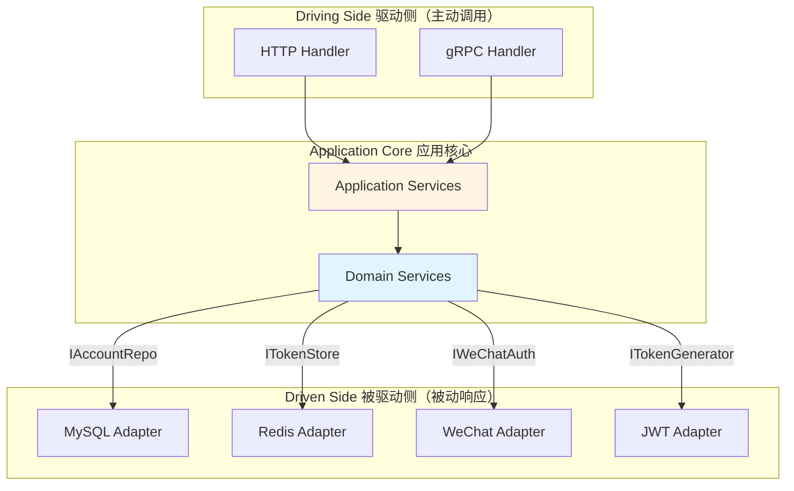

# 认证中心 - 目录结构

> 详细介绍 Authn 模块的代码组织、分层架构、端口适配器和设计模式

📖 [返回主文档](./README.md)

---

## 目录结构

Authn 模块遵循六边形架构（Hexagonal Architecture）和领域驱动设计（DDD）原则，清晰分离关注点。

### 2.1 整体结构

```text
internal/apiserver/modules/authn/
├── application/                    # 应用层 - 应用服务和用例编排
│   ├── account/                    # 账户管理应用服务
│   │   ├── services.go             # 应用服务接口定义
│   │   ├── account_app_service.go  # 账户创建/更新/删除
│   │   ├── wechat_app_service.go   # 微信账户绑定服务
│   │   ├── operation_app_service.go # 账户操作记录服务
│   │   ├── lookup_app_service.go   # 账户查询服务
│   │   └── util.go                 # 工具函数
│   ├── login/                      # 登录应用服务
│   │   └── service.go              # 登录服务（编排认证器+令牌签发）
│   ├── token/                      # Token 管理应用服务
│   │   └── service.go              # Token 签发/刷新/撤销
│   ├── jwks/                       # JWKS 发布应用服务
│   │   └── query.go                # PublicJWKSApp（产出 /.well-known/jwks.json）
│   ├── adapter/                    # 适配器（跨模块调用）
│   │   ├── user_adapter.go         # UC 模块适配器接口
│   │   └── user_adapter_impl.go    # UC 模块适配器实现
│   └── uow/                        # 工作单元（Unit of Work）
│       └── uow.go                  # 事务管理
│
├── domain/                         # 领域层 - 核心业务逻辑
│   ├── account/                    # 账户聚合根
│   │   ├── account.go              # 账户实体（聚合根）
│   │   ├── wechat.go               # 微信账户实体
│   │   ├── operation.go            # 账户操作记录实体
│   │   ├── user_id.go              # 用户ID值对象
│   │   ├── vo.go                   # 其他值对象
│   │   ├── service/                # 账户领域服务
│   │   │   ├── query.go            # 账户查询服务
│   │   │   ├── creater.go          # 账户创建服务
│   │   │   ├── editor.go           # 账户编辑服务
│   │   │   ├── status.go           # 账户状态管理服务
│   │   │   └── registerer.go       # 账户注册服务
│   │   └── port/                   # 端口（接口定义）
│   │       ├── driven/             # 被驱动端口（基础设施接口）
│   │       │   └── repo.go         # 账户仓储接口
│   │       └── driving/            # 驱动端口（应用层接口）
│   │           └── service.go      # 账户领域服务接口
│   │
│   ├── authentication/             # 认证聚合根
│   │   ├── authentication.go       # 认证实体
│   │   ├── token.go                # Token 值对象
│   │   ├── service/                # 认证领域服务
│   │   │   ├── authenticator/      # 认证器
│   │   │   │   ├── authenticator.go           # 认证器接口
│   │   │   │   ├── wechat_authenticator.go    # 微信认证器
│   │   │   │   └── basic_authenticator.go     # 基础认证器（密码）
│   │   │   └── token/              # Token 服务
│   │   │       ├── issuer.go       # Token 签发服务
│   │   │       ├── verifyer.go     # Token 验证服务
│   │   │       └── refresher.go    # Token 刷新服务
│   │   │       └── port/                   # 端口（接口定义）
│   │   │           ├── driven/             # 被驱动端口
│   │   │           │   ├── token.go        # Token 存储接口
│   │   │           │   └── wechat_auth.go  # 微信认证接口
│   │   │           └── driving/            # 驱动端口
│   │   │               └── [reserved]      # 预留
│   │   
│   └── jwks/                         # JWKS 发布子域（只管公钥&发布元数据）
│       ├── key.go                    # Key/PublicJWK/KeyStatus 等实体
│       ├── vo.go                     # JWKS/CacheTag/RotationPolicy(预留)
│       └── port/
│           ├── driven/               # 被驱动端口（供 infra 实现）
│           │   ├── keyset_reader.go  # KeySetReader（对外发布 JWKS）
│           │   └── privkey_resolver.go # PrivateKeyResolver（签名侧拿私钥句柄）
│           └── driving/              # 驱动端口（管理面/将来轮换，首版可空）
│               └── [reserved]
│
├── infra/                          # 基础设施层 - 外部依赖实现
│   ├── mysql/                      # MySQL 实现
│   │   └── account/                # 账户仓储实现
│   │       ├── po.go               # 持久化对象（PO）
│   │       ├── mapper.go           # DO <-> PO 映射器
│   │       ├── repo_account.go     # 账户仓储实现
│   │       ├── repo_wechat.go      # 微信账户仓储
│   │       ├── repo_operation.go   # 账户操作记录仓储
│   │       └── password_adapter.go # 密码哈希适配器
│   ├── redis/                      # Redis 实现
│   │   └── token/                  # Token 存储实现
│   │       └── store.go            # Redis Token 存储
│   ├── jwt/                        # JWT 实现
│   │   └── generator.go            # 
│   │   ├── generator.go            # JWT 生成器（RS256）
│   │   ├── keyset_static.go        # KeySetReader 的静态实现（单 key）
│   │   └── signer_file.go          # 文件/KMS 私钥签名器实现（用在 generator.go 内）
│   └── wechat/                     # 微信 SDK 适配器
│       └── auth_adapter.go         # 微信登录适配器（code2session）
│
└── interface/                      # 接口层 - 对外暴露 API
    └── restful/                    # RESTful API
        ├── router.go               # 路由注册
        ├── handler/                # HTTP 处理器
        │   ├── base.go             # 基础处理器
        │   ├── account.go          # 账户管理 API
        │   ├── auth.go             # 认证相关 API（登录/登出/刷新）
        │   └── jwks.go             # JWKS 发布 API
        ├── request/                # 请求 DTO
        │   ├── auth.go             # 认证请求 DTO
        │   └── account.go          # 账户请求 DTO
        └── response/               # 响应 DTO
            ├── auth.go             # 认证响应 DTO
            └── account.go          # 账户响应 DTO
```

### 2.2 分层职责

#### Interface Layer（接口层）

- **职责**: 对外暴露 HTTP API，处理请求/响应转换
- **关键文件**:
  - `handler/auth.go`: 登录、登出、Token 刷新
  - `handler/account.go`: 账户绑定、解绑、查询
  - `request/*.go`: 请求参数校验和 DTO 定义
  - `response/*.go`: 响应格式化和 DTO 定义

#### Application Layer（应用层）

- **职责**: 用例编排，协调领域服务和基础设施
- **关键文件**:
  - `login/service.go`: 登录流程编排（认证 → 创建用户 → 签发 Token）
  - `account/*_app_service.go`: 账户管理用例
  - `token/service.go`: Token 生命周期管理
  - `adapter/user_adapter.go`: 跨模块调用（UC 模块）
  - `uow/uow.go`: 事务管理，确保原子性

#### Domain Layer（领域层）

- **职责**: 核心业务逻辑，不依赖外部框架
- **关键组件**:
  - **Account Aggregate（账户聚合根）**:
    - 实体: `Account`, `WeChatAccount`, `Operation`
    - 值对象: `UserID`, `Provider`, `ExternalID`
    - 领域服务: 账户查询、创建、编辑、状态管理
  - **Authentication Aggregate（认证聚合根）**:
    - 实体: `Authentication`
    - 值对象: `Token`, `Credentials`
    - 领域服务:
      - 认证器: `WeChatAuthenticator`, `BasicAuthenticator`
      - Token 服务: `Issuer`, `Verifier`, `Refresher`

#### Infrastructure Layer（基础设施层）

- **职责**: 实现领域层定义的接口，与外部系统交互
- **关键实现**:
  - `mysql/account/`: GORM 仓储实现，PO <-> DO 映射
  - `redis/token/`: Redis Token 存储（黑名单、会话）
  - `jwt/generator.go`: RS256 JWT 签发和验证
  - `wechat/auth_adapter.go`: 微信 code2session API 调用

### 2.3 端口与适配器（Hexagonal Architecture）



### 2.4 关键设计模式

| 模式 | 应用场景 | 文件位置 |
|------|---------|---------|
| **Repository** | 数据访问抽象 | `domain/account/port/driven/repo.go` |
| **Adapter** | 外部系统集成 | `infra/wechat/auth_adapter.go` |
| **Strategy** | 多种认证方式 | `domain/authentication/service/authenticator/` |
| **Factory** | Token 生成 | `infra/jwt/generator.go` |
| **Unit of Work** | 事务管理 | `application/uow/uow.go` |
| **DTO/Mapper** | 层间数据转换 | `infra/mysql/account/mapper.go` |

---
