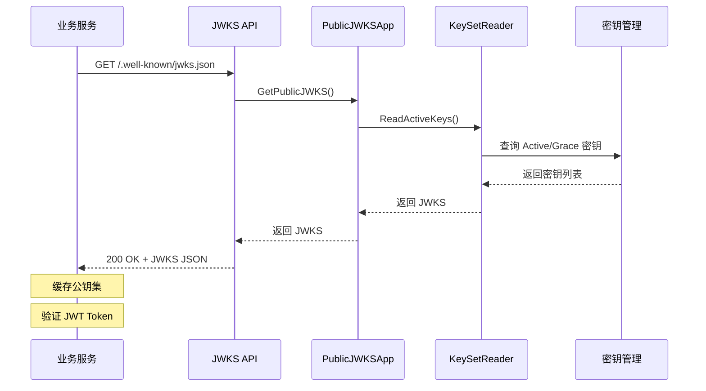

# JWKS（JSON Web Key Set）发布指南

> [返回认证中心文档](./README.md)

---

## 📖 目录

1. [什么是 JWKS](#什么是-jwks)
2. [为什么需要 JWKS](#为什么需要-jwks)
3. [JWKS 架构设计](#jwks-架构设计)
4. [JWKS 端点](#jwks-端点)
5. [密钥轮换与 JWKS](#密钥轮换与-jwks)
6. [业务服务集成](#业务服务集成)
7. [缓存策略](#缓存策略)
8. [故障排查](#故障排查)

---

## 什么是 JWKS

**JWKS (JSON Web Key Set)** 是一个用于发布公钥的标准格式（RFC 7517），使得第三方服务可以验证 JWT Token 的签名。

### 核心概念

```text
┌──────────────┐                    ┌──────────────┐
│  认证中心    │                    │  业务服务    │
│              │                    │              │
│  签发 JWT    │  ──────────────>  │  验证 JWT    │
│  (私钥签名)  │                    │  (公钥验证)  │
│              │                    │              │
│  发布 JWKS   │  <──────────────  │  获取 JWKS   │
│  (公钥集)    │                    │  (公钥集)    │
└──────────────┘                    └──────────────┘
```

### JWK 字段说明

```json
{
  "kty": "RSA",           // 密钥类型：RSA/EC/OKP
  "kid": "K-2025-10",     // 密钥ID，用于匹配 JWT Header 中的 kid
  "use": "sig",           // 用途：sig=签名, enc=加密
  "alg": "RS256",         // 算法：RS256/RS384/RS512
  "n": "0vx7ago...",      // RSA 公钥模数（Base64URL 编码）
  "e": "AQAB"             // RSA 公钥指数（通常是 65537 的 Base64URL）
}
```

---

## 为什么需要 JWKS

### 传统方式的问题

**❌ 共享密钥方式**:

```text
问题：
1. 所有服务共享同一个密钥文件
2. 密钥更新需要重启所有服务
3. 密钥泄露影响范围大
4. 难以实现密钥轮换
```

### JWKS 的优势

**✅ JWKS 方式**:

```text
优势：
1. 公钥公开，私钥集中管理
2. 支持密钥轮换，平滑过渡
3. 标准化，易于集成
4. 动态获取，无需重启服务
5. 支持多密钥并存（轮换期间）
```

### 安全模型

```text
┌─────────────────────────────────────────┐
│           认证中心 (IAM)                │
│                                         │
│  ┌────────────┐      ┌──────────────┐  │
│  │  私钥库    │ ───> │  签发 JWT    │  │
│  │  (KMS)     │      │  (签名)      │  │
│  └────────────┘      └──────────────┘  │
│         │                               │
│         │ 提取公钥                      │
│         ↓                               │
│  ┌────────────┐                         │
│  │ JWKS 发布  │ ────────────────────┐   │
│  │ (公开API)  │                     │   │
│  └────────────┘                     │   │
└─────────────────────────────────────│───┘
                                      │
                           HTTP GET   │
                                      ↓
                        ┌──────────────────────┐
                        │    业务服务          │
                        │                      │
                        │  1. 获取 JWKS       │
                        │  2. 缓存公钥        │
                        │  3. 验证 JWT        │
                        └──────────────────────┘
```

---

## JWKS 架构设计

### 领域模型

```text
internal/apiserver/modules/authn/domain/jwks/
├── vo.go                           # 值对象
│   ├── JWKS                        # JWKS 集合
│   ├── JWK                         # 单个密钥
│   └── CacheTag                    # 缓存标签
├── model/
│   └── keyset/
│       ├── keyset_reader.go        # KeySetReader（读取密钥集）
│       └── cache_tag_generator.go  # 缓存标签生成
```

### 应用服务

```text
internal/apiserver/modules/authn/app/jwks/
└── query.go                        # PublicJWKSApp
    ├── GetPublicJWKS()             # 获取公钥集
    └── GetCacheTag()               # 获取缓存标签
```

### HTTP 适配器

```text
internal/apiserver/modules/authn/adapter/driving/http/rest/
└── jwks.go                         # JWKS 发布 API
    ├── GET /.well-known/jwks.json  # JWKS 端点
    └── GET /.well-known/openid-configuration  # OIDC Discovery
```

### 核心流程



---

## JWKS 端点

### 1. JWKS 端点

**请求**:

```http
GET /.well-known/jwks.json HTTP/1.1
Host: iam.example.com
Accept: application/json
```

**响应**:

```json
{
  "keys": [
    {
      "kty": "RSA",
      "kid": "K-2025-10",
      "use": "sig",
      "alg": "RS256",
      "n": "0vx7agoebGcQSuuPiLJXZptN9nndrQmbXEps2aiAFbWhM78LhWx4cbbfAAtVT86zwu1RK7aPFFxuhDR1L6tSoc_BJECPebWKRXjBZCiFV4n3oknjhMstn64tZ_2W-5JsGY4Hc5n9yBXArwl93lqt7_RN5w6Cf0h4QyQ5v-65YGjQR0_FDW2QvzqY368QQMicAtaSqzs8KJZgnYb9c7d0zgdAZHzu6qMQvRL5hajrn1n91CbOpbISD08qNLyrdkt-bFTWhAI4vMQFh6WeZu0fM4lFd2NcRwr3XPksINHaQ-G_xBniIqbw0Ls1jF44-csFCur-kEgU8awapJzKnqDKgw",
      "e": "AQAB"
    },
    {
      "kty": "RSA",
      "kid": "K-2025-09",
      "use": "sig",
      "alg": "RS256",
      "n": "xjwU2L9sTxMvXLh5YU8k8qS7wX9_Vkj3sP2nL8mQ5zRtYpOyWcLGfDqj8N3kK9pL5mR2vX7wY8qT3nL9sM5zQ2wP8kR7vX5yL9sN3kP2mL8sQ5zR7tY9pO8wL3cG6fD9qj8N",
      "e": "AQAB"
    }
  ]
}
```

**响应头**:

```http
HTTP/1.1 200 OK
Content-Type: application/json
Cache-Control: public, max-age=3600
ETag: "jwks-v20251018120000"
```

### 2. OpenID Connect Discovery 端点

**请求**:

```http
GET /.well-known/openid-configuration HTTP/1.1
Host: iam.example.com
Accept: application/json
```

**响应**:

```json
{
  "issuer": "https://iam.yangshujie.com",
  "authorization_endpoint": "https://iam.yangshujie.com/auth/authorize",
  "token_endpoint": "https://iam.yangshujie.com/auth/token",
  "jwks_uri": "https://iam.yangshujie.com/.well-known/jwks.json",
  "response_types_supported": ["code", "token"],
  "subject_types_supported": ["public"],
  "id_token_signing_alg_values_supported": ["RS256"],
  "token_endpoint_auth_methods_supported": ["client_secret_basic", "client_secret_post"]
}
```

---

## 密钥轮换与 JWKS

### 密钥生命周期与 JWKS

```text
时间轴：密钥如何出现和消失在 JWKS 中

2025-09-01  K-2025-09 生成，立即加入 JWKS
            ┌─────────────────────────────────────┐
            │  JWKS: [K-2025-09]                  │
            │  - 用于签发新 Token                 │
            │  - 用于验证现有 Token               │
            └─────────────────────────────────────┘

2025-10-01  K-2025-10 生成，加入 JWKS（轮换期开始）
            ┌─────────────────────────────────────┐
            │  JWKS: [K-2025-10, K-2025-09]       │
            │  - K-2025-10 用于签发新 Token       │
            │  - K-2025-09 仍可验证旧 Token       │
            └─────────────────────────────────────┘

2025-10-08  K-2025-09 过期，从 JWKS 移除
            ┌─────────────────────────────────────┐
            │  JWKS: [K-2025-10]                  │
            │  - K-2025-09 移除，旧 Token 失效    │
            └─────────────────────────────────────┘

2025-11-01  K-2025-11 生成，加入 JWKS（新一轮轮换）
            ┌─────────────────────────────────────┐
            │  JWKS: [K-2025-11, K-2025-10]       │
            │  - K-2025-11 用于签发新 Token       │
            │  - K-2025-10 仍可验证旧 Token       │
            └─────────────────────────────────────┘
```

### JWKS 更新机制

#### 1. 实时更新

```go
// JWKS 始终反映当前活跃的密钥
func (s *PublicJWKSApp) GetPublicJWKS(ctx context.Context) (*jwksdomain.JWKS, error) {
    // 查询所有 Active 和 Grace 状态的密钥
    activeKeys := s.keyRepo.FindByStatus(ctx, []Status{Active, Grace})
    
    // 转换为 JWKS 格式
    return s.toJWKS(activeKeys), nil
}
```

#### 2. JWKS 内容规则

```go
type RotationPolicy struct {
    GracePeriod      time.Duration  // 7 days
    MinKeysInJWKS    int            // 1 (current)
    MaxKeysInJWKS    int            // 2 (current + grace)
}
```

- **正常期**: JWKS 包含 1 个 Active 密钥
- **轮换期**: JWKS 包含 2 个密钥（新 Active + 旧 Grace）
- **过期后**: JWKS 移除过期密钥

### 业务服务如何应对密钥轮换

```text
业务服务视角：

T0 时刻：获取 JWKS，缓存 1 小时
┌──────────────────────┐
│ JWKS: [K-2025-09]    │
└──────────────────────┘

T1 时刻（30分钟后）：密钥轮换发生
- 认证中心：JWKS 更新为 [K-2025-10, K-2025-09]
- 业务服务：仍使用旧缓存 [K-2025-09]
- 影响：可以验证旧 Token（K-2025-09），但收到新 Token（K-2025-10）时验证失败

T2 时刻（60分钟后）：缓存过期，重新获取
┌──────────────────────────────────┐
│ JWKS: [K-2025-10, K-2025-09]     │
└──────────────────────────────────┘
- 影响：可以验证新旧两种 Token

T3 时刻（8天后）：Grace 期结束，K-2025-09 移除
┌──────────────────────┐
│ JWKS: [K-2025-10]    │
└──────────────────────┘
- 影响：使用 K-2025-09 签发的 Token 失效
```

---

## 业务服务集成

### Go 集成示例

#### 1. 使用标准库

```go
package middleware

import (
    "context"
    "crypto/rsa"
    "encoding/base64"
    "encoding/json"
    "fmt"
    "math/big"
    "net/http"
    "sync"
    "time"
    
    "github.com/golang-jwt/jwt/v5"
)

// AuthMiddleware JWT 验证中间件
type AuthMiddleware struct {
    jwksURL    string
    publicKeys map[string]*rsa.PublicKey
    mu         sync.RWMutex
    cacheTTL   time.Duration
}

func NewAuthMiddleware(jwksURL string) *AuthMiddleware {
    m := &AuthMiddleware{
        jwksURL:    jwksURL,
        publicKeys: make(map[string]*rsa.PublicKey),
        cacheTTL:   1 * time.Hour,
    }
    
    // 启动时立即获取 JWKS
    _ = m.refreshPublicKeys()
    
    // 定期刷新
    go m.periodicRefresh()
    
    return m
}

// Middleware Gin 中间件函数
func (m *AuthMiddleware) Middleware() gin.HandlerFunc {
    return func(c *gin.Context) {
        authHeader := c.GetHeader("Authorization")
        if authHeader == "" {
            c.JSON(http.StatusUnauthorized, gin.H{"error": "missing token"})
            c.Abort()
            return
        }
        
        tokenString := strings.TrimPrefix(authHeader, "Bearer ")
        
        // 验证 Token
        claims, err := m.validateToken(tokenString)
        if err != nil {
            c.JSON(http.StatusUnauthorized, gin.H{"error": err.Error()})
            c.Abort()
            return
        }
        
        // 将 claims 存入上下文
        c.Set("user_id", claims.Subject)
        c.Set("claims", claims)
        c.Next()
    }
}

// validateToken 验证 JWT Token
func (m *AuthMiddleware) validateToken(tokenString string) (*jwt.RegisteredClaims, error) {
    token, err := jwt.ParseWithClaims(tokenString, &jwt.RegisteredClaims{}, func(token *jwt.Token) (interface{}, error) {
        // 检查签名算法
        if _, ok := token.Method.(*jwt.SigningMethodRSA); !ok {
            return nil, fmt.Errorf("unexpected signing method: %v", token.Header["alg"])
        }
        
        // 获取 kid
        kid, ok := token.Header["kid"].(string)
        if !ok {
            return nil, fmt.Errorf("missing kid in token header")
        }
        
        // 获取对应的公钥
        publicKey, err := m.getPublicKey(kid)
        if err != nil {
            // 如果找不到密钥，尝试刷新 JWKS
            if err := m.refreshPublicKeys(); err != nil {
                return nil, fmt.Errorf("failed to refresh JWKS: %w", err)
            }
            
            // 再次尝试获取
            publicKey, err = m.getPublicKey(kid)
            if err != nil {
                return nil, err
            }
        }
        
        return publicKey, nil
    })
    
    if err != nil {
        return nil, fmt.Errorf("invalid token: %w", err)
    }
    
    if claims, ok := token.Claims.(*jwt.RegisteredClaims); ok && token.Valid {
        return claims, nil
    }
    
    return nil, fmt.Errorf("invalid token claims")
}

// refreshPublicKeys 刷新公钥集
func (m *AuthMiddleware) refreshPublicKeys() error {
    resp, err := http.Get(m.jwksURL)
    if err != nil {
        return fmt.Errorf("failed to fetch JWKS: %w", err)
    }
    defer resp.Body.Close()
    
    var jwks struct {
        Keys []struct {
            Kid string `json:"kid"`
            Kty string `json:"kty"`
            Use string `json:"use"`
            Alg string `json:"alg"`
            N   string `json:"n"`
            E   string `json:"e"`
        } `json:"keys"`
    }
    
    if err := json.NewDecoder(resp.Body).Decode(&jwks); err != nil {
        return fmt.Errorf("failed to decode JWKS: %w", err)
    }
    
    newKeys := make(map[string]*rsa.PublicKey)
    for _, key := range jwks.Keys {
        if key.Kty != "RSA" || key.Use != "sig" {
            continue
        }
        
        publicKey, err := m.parseRSAPublicKey(key.N, key.E)
        if err != nil {
            return fmt.Errorf("failed to parse RSA public key: %w", err)
        }
        
        newKeys[key.Kid] = publicKey
    }
    
    m.mu.Lock()
    m.publicKeys = newKeys
    m.mu.Unlock()
    
    return nil
}

// parseRSAPublicKey 解析 RSA 公钥
func (m *AuthMiddleware) parseRSAPublicKey(nStr, eStr string) (*rsa.PublicKey, error) {
    nBytes, err := base64.RawURLEncoding.DecodeString(nStr)
    if err != nil {
        return nil, err
    }
    
    eBytes, err := base64.RawURLEncoding.DecodeString(eStr)
    if err != nil {
        return nil, err
    }
    
    n := new(big.Int).SetBytes(nBytes)
    e := new(big.Int).SetBytes(eBytes)
    
    return &rsa.PublicKey{
        N: n,
        E: int(e.Int64()),
    }, nil
}

// getPublicKey 获取指定 kid 的公钥
func (m *AuthMiddleware) getPublicKey(kid string) (*rsa.PublicKey, error) {
    m.mu.RLock()
    defer m.mu.RUnlock()
    
    key, ok := m.publicKeys[kid]
    if !ok {
        return nil, fmt.Errorf("public key not found for kid: %s", kid)
    }
    
    return key, nil
}

// periodicRefresh 定期刷新 JWKS
func (m *AuthMiddleware) periodicRefresh() {
    ticker := time.NewTicker(m.cacheTTL)
    defer ticker.Stop()
    
    for range ticker.C {
        _ = m.refreshPublicKeys()
    }
}
```

#### 2. 使用第三方库（推荐）

```go
package middleware

import (
    "github.com/MicahParks/keyfunc/v2"
    "github.com/golang-jwt/jwt/v5"
)

func NewAuthMiddlewareWithKeyfunc(jwksURL string) (*AuthMiddleware, error) {
    // 使用 keyfunc 自动管理 JWKS
    jwks, err := keyfunc.Get(jwksURL, keyfunc.Options{
        RefreshInterval: 1 * time.Hour,
        RefreshRateLimit: 5 * time.Minute,
    })
    if err != nil {
        return nil, err
    }
    
    return &AuthMiddleware{
        jwks: jwks,
    }, nil
}

func (m *AuthMiddleware) ValidateToken(tokenString string) (*jwt.RegisteredClaims, error) {
    token, err := jwt.ParseWithClaims(tokenString, &jwt.RegisteredClaims{}, m.jwks.Keyfunc)
    if err != nil {
        return nil, err
    }
    
    if claims, ok := token.Claims.(*jwt.RegisteredClaims); ok && token.Valid {
        return claims, nil
    }
    
    return nil, fmt.Errorf("invalid token")
}
```

### JavaScript/TypeScript 集成示例

```typescript
import jwt from 'jsonwebtoken';
import jwksClient from 'jwks-rsa';

// 创建 JWKS 客户端
const client = jwksClient({
  jwksUri: 'https://iam.yangshujie.com/.well-known/jwks.json',
  cache: true,
  cacheMaxAge: 3600000, // 1 小时
  rateLimit: true,
  jwksRequestsPerMinute: 10
});

// 获取签名密钥
function getKey(header: jwt.JwtHeader, callback: jwt.SigningKeyCallback) {
  client.getSigningKey(header.kid, (err, key) => {
    if (err) {
      callback(err);
      return;
    }
    const signingKey = key?.getPublicKey();
    callback(null, signingKey);
  });
}

// 验证 Token
export function verifyToken(token: string): Promise<jwt.JwtPayload> {
  return new Promise((resolve, reject) => {
    jwt.verify(token, getKey, {
      issuer: 'https://iam.yangshujie.com',
      algorithms: ['RS256']
    }, (err, decoded) => {
      if (err) {
        reject(err);
      } else {
        resolve(decoded as jwt.JwtPayload);
      }
    });
  });
}

// Express 中间件
export function authMiddleware(req, res, next) {
  const authHeader = req.headers.authorization;
  if (!authHeader) {
    return res.status(401).json({ error: 'Missing authorization header' });
  }

  const token = authHeader.replace('Bearer ', '');
  
  verifyToken(token)
    .then(decoded => {
      req.user = decoded;
      next();
    })
    .catch(err => {
      res.status(401).json({ error: 'Invalid token', details: err.message });
    });
}
```

---

## 缓存策略

### 1. HTTP 缓存头

```http
Cache-Control: public, max-age=3600
ETag: "jwks-v20251018120000"
```

- **max-age=3600**: 客户端可缓存 1 小时
- **ETag**: 基于密钥版本生成，支持条件请求

### 2. 客户端缓存建议

```go
type JWKSCache struct {
    Keys      map[string]*rsa.PublicKey
    ETag      string
    ExpiresAt time.Time
}

// 缓存策略
func (c *JWKSCache) ShouldRefresh() bool {
    return time.Now().After(c.ExpiresAt)
}

// 条件请求
func fetchJWKS(url string, etag string) (*http.Response, error) {
    req, _ := http.NewRequest("GET", url, nil)
    if etag != "" {
        req.Header.Set("If-None-Match", etag)
    }
    return http.DefaultClient.Do(req)
}
```

### 3. 刷新策略

**推荐策略**:

- ✅ **定时刷新**: 每 1 小时刷新一次（匹配 Cache-Control）
- ✅ **失败时刷新**: 验证失败时立即刷新
- ✅ **条件请求**: 使用 ETag 避免不必要的传输
- ❌ **过度刷新**: 避免每次验证都请求 JWKS

---

## 故障排查

### 问题 1: Token 验证失败 "signature invalid"

**可能原因**:

1. JWKS 缓存过期，未包含新密钥
2. kid 不匹配
3. 算法不匹配

**排查步骤**:

```bash
# 1. 检查 Token 的 kid
echo "YOUR_TOKEN" | cut -d'.' -f1 | base64 -d | jq .kid

# 2. 检查 JWKS 是否包含该 kid
curl https://iam.yangshujie.com/.well-known/jwks.json | jq '.keys[].kid'

# 3. 强制刷新 JWKS 缓存
# (业务服务端实现刷新逻辑)
```

### 问题 2: JWKS 端点返回 500

**可能原因**:

1. 数据库连接失败
2. KMS 服务不可用

**排查步骤**:

```bash
# 检查认证中心日志
tail -f /var/log/iam/apiserver.log | grep "JWKS"

# 检查数据库连接
mysql -u iam -p -e "SELECT kid, status FROM signing_keys WHERE status IN ('active', 'grace');"

# 检查 Redis 连接
redis-cli PING
```

### 问题 3: 密钥轮换后 Token 立即失效

**原因**: 业务服务缓存了旧的 JWKS，不包含新密钥

**解决方案**:

```go
// 在 Token 验证失败时，尝试刷新 JWKS
func (m *AuthMiddleware) validateToken(tokenString string) error {
    err := m.verify(tokenString)
    if err != nil {
        // 刷新 JWKS 并重试一次
        if refreshErr := m.refreshPublicKeys(); refreshErr == nil {
            err = m.verify(tokenString)
        }
    }
    return err
}
```

### 问题 4: JWKS 包含过多密钥

**预期行为**: JWKS 应该只包含 1-2 个密钥（轮换期间）

**排查**:

```bash
# 检查数据库中的密钥状态
SELECT kid, status, created_at, expires_at 
FROM signing_keys 
WHERE status IN ('active', 'grace')
ORDER BY created_at DESC;

# 预期结果：
# - 1个 active 密钥
# - 0-1个 grace 密钥（仅在轮换期间）
```

---

## 最佳实践

### 1. 业务服务端

- ✅ 缓存 JWKS，避免每次验证都请求
- ✅ 缓存时间 ≤ 1 小时（匹配 Cache-Control）
- ✅ 验证失败时刷新 JWKS 并重试
- ✅ 使用 ETag 实现条件请求
- ✅ 处理 kid 不存在的情况
- ❌ 不要硬编码公钥

### 2. 认证中心端

- ✅ JWKS 只包含 Active 和 Grace 状态的密钥
- ✅ 设置合理的 Cache-Control (max-age=3600)
- ✅ 使用 ETag 支持条件请求
- ✅ 密钥轮换保留 Grace 期（7天）
- ❌ 不要在 JWKS 中包含私钥信息

### 3. 监控告警

- ✅ 监控 JWKS 端点可用性
- ✅ 监控 JWKS 中的密钥数量（1-2个）
- ✅ 监控密钥过期时间
- ✅ 告警密钥轮换失败

---

## 相关文档

- [Token 管理](./TOKEN_MANAGEMENT.md) - JWT Token 生命周期和密钥轮换
- [API 参考](./API_REFERENCE.md) - 完整的 REST API 文档
- [安全设计](./SECURITY_DESIGN.md) - 安全机制和最佳实践

---

**最后更新**: 2025-10-18  
**维护人**: IAM Team
