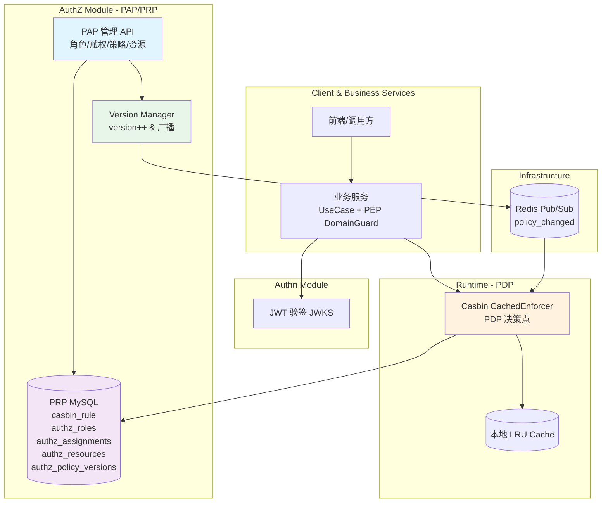
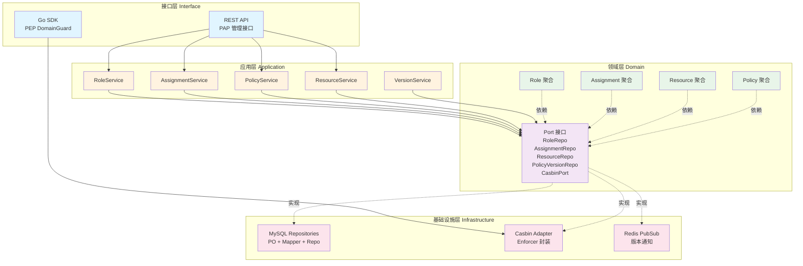
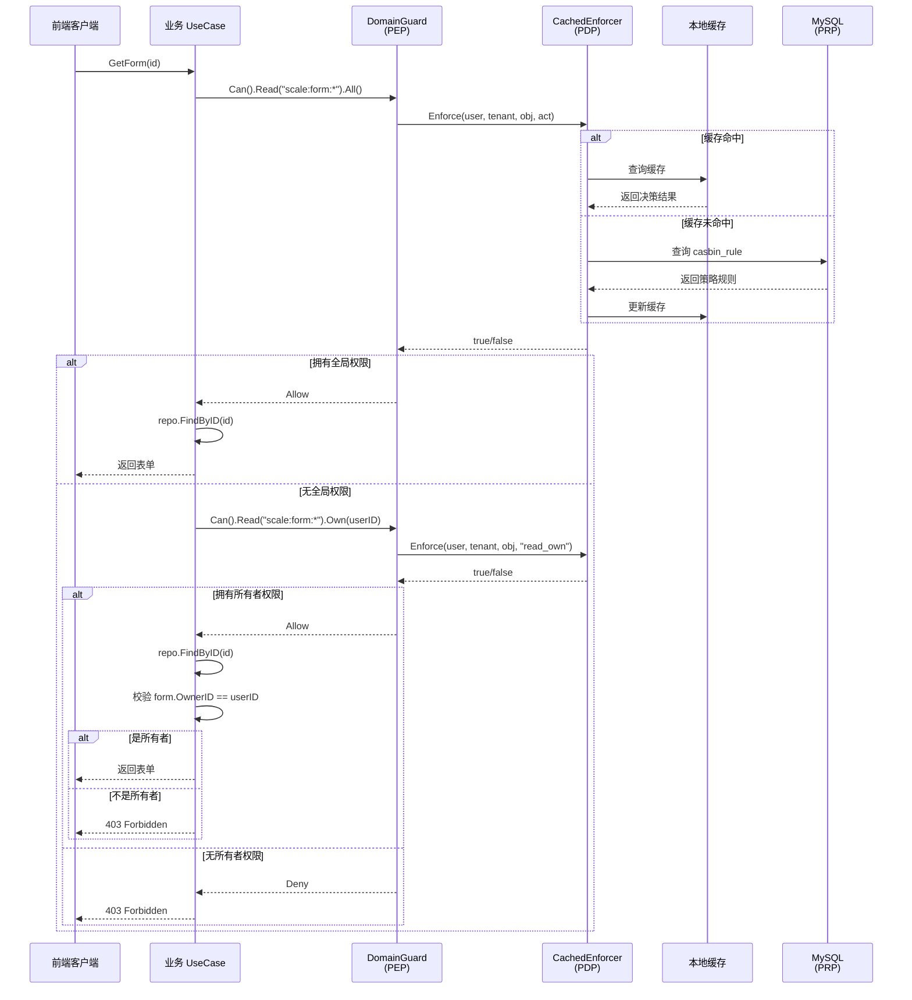
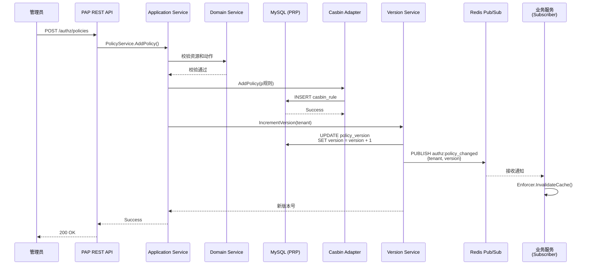
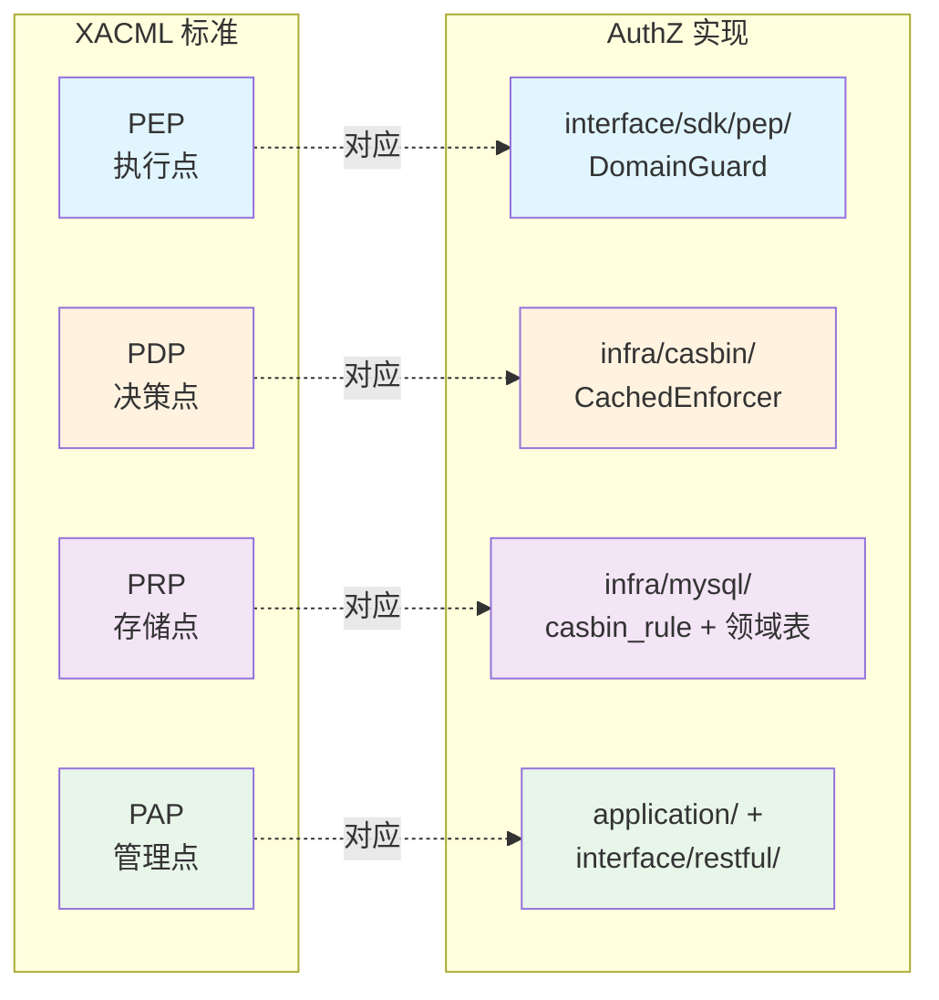
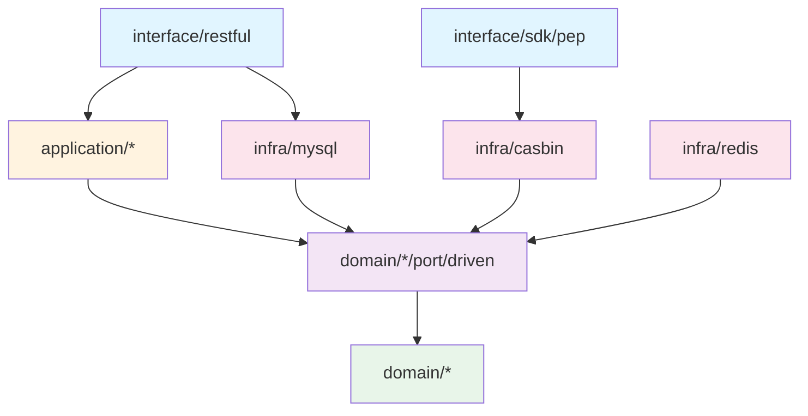

# AuthZ 模块架构图

## 系统架构图 (Mermaid)

## 分层架构图

## 权限判定流程图

## 策略管理流程图

## XACML 架构映射

## 依赖关系图

## 图例说明

- 🔵 **蓝色**: 接口层（REST API / SDK）
- 🟡 **橙色**: 应用层（Application Services）
- 🟢 **绿色**: 领域层（Domain Models & Services）
- 🟣 **紫色**: 端口层（Port 接口定义）
- 🔴 **红色**: 基础设施层（MySQL / Casbin / Redis）

## 使用建议

1. **架构图**: 理解整体组件交互关系
2. **分层架构图**: 理解分层依赖关系和六边形架构
3. **权限判定流程图**: 理解 PEP → PDP → PRP 的判定流程
4. **策略管理流程图**: 理解 PAP 管理策略和版本广播机制
5. **XACML 映射**: 理解标准架构与实现的对应关系
6. **依赖关系图**: 理解各层之间的依赖方向（依赖倒置原则）

---

**提示**: 可使用支持 Mermaid 的工具查看图表，如 VS Code 插件、GitHub、Typora 等。
