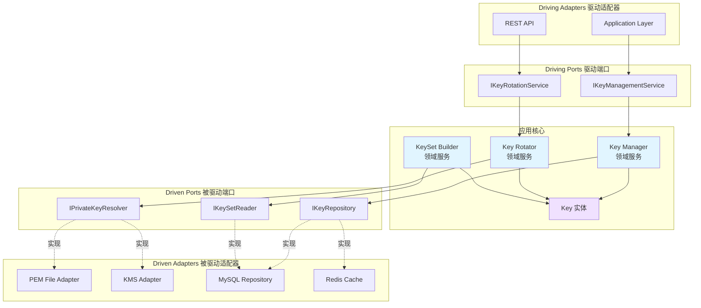

# Authn 模块领域层设计分析与建议

## 📋 目录

- [1. 当前架构分析](#1-当前架构分析)
- [2. JWKS 子模块现状](#2-jwks-子模块现状)
- [3. 设计建议](#3-设计建议)
- [4. 实施方案](#4-实施方案)
- [5. 最佳实践总结](#5-最佳实践总结)

---

## 1. 当前架构分析

### 1.1 领域层整体结构

```text
domain/
├── account/                    # 账户聚合根 ✅ 完善
│   ├── account.go              # Account 实体（聚合根）
│   ├── operation.go            # OperationAccount 实体
│   ├── wechat.go               # WeChatAccount 实体
│   ├── user_id.go              # UserID 值对象
│   ├── vo.go                   # 其他值对象（Provider, Status）
│   ├── service/                # 领域服务 ✅
│   │   ├── creater.go          # 账户创建服务
│   │   ├── editor.go           # 账户编辑服务
│   │   ├── query.go            # 账户查询服务
│   │   ├── registerer.go       # 账户注册服务
│   │   └── status.go           # 账户状态管理服务
│   └── port/                   # 端口 ✅
│       ├── driven/             # 被驱动端口
│       │   └── repo.go         # 仓储接口
│       └── driving/            # 驱动端口
│           └── service.go      # 领域服务接口
│
├── authentication/             # 认证聚合根 ✅ 完善
│   ├── authentication.go       # Authentication 实体（聚合根）
│   ├── token.go                # Token 值对象
│   ├── credential.go           # Credential 值对象
│   ├── password.go             # Password 值对象
│   ├── service/                # 领域服务 ✅
│   │   ├── authenticator/      # 认证器（策略模式）
│   │   │   ├── authenticator.go           # 认证器接口
│   │   │   ├── wechat_authenticator.go    # 微信认证器
│   │   │   └── basic_authenticator.go     # 基础认证器
│   │   └── token/              # Token 服务
│   │       ├── issuer.go       # Token 签发服务
│   │       ├── verifyer.go     # Token 验证服务
│   │       └── refresher.go    # Token 刷新服务
│   └── port/                   # 端口 ✅
│       ├── driven/             # 被驱动端口
│       │   ├── token.go        # Token 存储接口
│       │   ├── wechat_auth.go  # 微信认证接口
│       │   └── account_password.go  # 密码验证接口
│       └── driving/            # 驱动端口
│           └── authenticator.go     # 认证器接口
│
└── jwks/                       # JWKS 聚合根 ⚠️ 待完善
    ├── key.go                  # Key 实体 ✅
    ├── vo.go                   # JWKS、CacheTag、RotationPolicy ✅
    ├── service/                # 领域服务 ❌ 空目录
    └── port/                   # 端口 ⚠️ 不完整
        └── driven/             # 被驱动端口 ✅
            ├── keyset_reader.go       # 密钥集读取接口
            └── privkey_resolver.go    # 私钥解析接口
```

### 1.2 设计模式对比分析

#### Account 聚合根（参考标准）

| 组件 | 实现 | 说明 |
|------|------|------|
| **实体** | ✅ Account, OperationAccount, WeChatAccount | 清晰的实体边界 |
| **值对象** | ✅ UserID, Provider, AccountStatus | 类型安全的值对象 |
| **领域服务** | ✅ 5个服务类 | Creater, Editor, Query, Registerer, Status |
| **端口（Port）** | ✅ driven/repo.go, driving/service.go | 完整的端口定义 |
| **行为方法** | ✅ Activate(), Disable(), IsActive() | 实体有丰富的行为 |
| **工厂方法** | ✅ NewAccount(), CreateAccount() | 创建逻辑封装良好 |

#### Authentication 聚合根（参考标准）

| 组件 | 实现 | 说明 |
|------|------|------|
| **实体** | ✅ Authentication | 清晰的认证结果实体 |
| **值对象** | ✅ Token, TokenPair, Credential, Password | 丰富的值对象 |
| **领域服务** | ✅ 6个服务类 | Authenticator(策略), Issuer, Verifier, Refresher |
| **端口（Port）** | ✅ driven/（3个接口）, driving/（1个接口） | 完整的端口定义 |
| **策略模式** | ✅ WeChatAuthenticator, BasicAuthenticator | 多种认证方式 |
| **行为方法** | ✅ WithMetadata(), GetMetadata() | 实体有明确行为 |

#### JWKS 聚合根（当前状态）

| 组件 | 实现 | 说明 |
|------|------|------|
| **实体** | ✅ Key | 基本的密钥实体 |
| **值对象** | ✅ PublicJWK, JWKS, CacheTag, RotationPolicy | 值对象完备 |
| **领域服务** | ❌ 空目录 | **缺失核心领域逻辑** |
| **端口（Port）** | ⚠️ 仅 driven 端口 | **缺少 driving 端口** |
| **行为方法** | ❌ Key 无行为方法 | **实体过于贫血** |
| **工厂方法** | ❌ 无创建逻辑 | **缺少工厂方法** |

---

## 2. JWKS 子模块现状

### 2.1 现有代码分析

#### Key 实体（key.go）

```go
// ✅ 优点：
// - 清晰的状态枚举（Active, Grace, Retired）
// - 符合 JWKS 规范的 PublicJWK 结构
// - 包含有效期字段（NotBefore, NotAfter）

// ❌ 不足：
// 1. 缺少行为方法（贫血模型）
// 2. 没有状态转换逻辑
// 3. 没有验证方法
// 4. 没有工厂方法
```

**改进建议**：

```go
// Key 应该具有以下行为：
func (k *Key) IsActive() bool
func (k *Key) IsGrace() bool
func (k *Key) IsRetired() bool
func (k *Key) CanSign() bool        // Active 状态可签名
func (k *Key) CanVerify() bool      // Active + Grace 状态可验签
func (k *Key) ShouldPublish() bool  // Active + Grace 状态发布
func (k *Key) Retire()              // 状态转换
func (k *Key) IsExpired(now time.Time) bool
```

#### 值对象（vo.go）

```go
// ✅ 优点：
// - JWKS 结构符合 RFC 7517 标准
// - CacheTag 支持 HTTP 缓存优化
// - RotationPolicy 为未来扩展预留

// ❌ 不足：
// 1. JWKS 缺少验证方法
// 2. CacheTag 缺少生成逻辑
// 3. RotationPolicy 未被使用
```

#### 端口（port/driven/）

```go
// ✅ 优点：
// - KeySetReader 接口设计合理（JWKS 发布 + 元数据查询）
// - PrivateKeyResolver 抽象良好（PEM/KMS/HSM 统一接口）

// ❌ 不足：
// 1. 缺少 driving 端口（应用层调用的接口）
// 2. 缺少密钥轮换接口
// 3. 缺少密钥状态变更接口
```

### 2.2 缺失的核心组件

#### 1. 领域服务（service/）- **关键缺失**

应该包含：

- **KeyManager**: 密钥生命周期管理
- **KeyRotator**: 密钥轮换服务
- **KeySetBuilder**: JWKS 构建服务
- **KeyValidator**: 密钥验证服务

#### 2. Driving 端口（port/driving/）

应该包含：

- **KeyManagementService**: 密钥管理接口
- **KeyRotationService**: 密钥轮换接口

#### 3. 实体行为方法

Key 实体需要从"贫血模型"升级为"充血模型"。

---

## 3. 设计建议

### 3.1 核心设计原则

#### DDD 战术模式应用

1. **实体（Entity）**
   - ✅ 具有唯一标识（Kid）
   - ✅ 具有生命周期（Active → Grace → Retired）
   - ❌ **缺少行为方法**（需补充）
   - ❌ **缺少不变性约束**（需补充）

2. **值对象（Value Object）**
   - ✅ PublicJWK、JWKS、CacheTag 设计良好
   - ⚠️ 建议增加验证逻辑

3. **聚合根（Aggregate Root）**
   - Key 应该是聚合根
   - 控制边界：单个 Key 的生命周期
   - 事务边界：密钥状态变更

4. **领域服务（Domain Service）**
   - ❌ **当前缺失，急需补充**
   - 跨实体的业务逻辑（如密钥轮换）
   - 协调多个实体/值对象

5. **仓储（Repository）**
   - ❌ **缺少仓储接口定义**
   - 需要定义 KeyRepository 接口

### 3.2 六边形架构应用



### 3.3 参考 Account 和 Authentication 的设计模式

| 设计要素 | Account 模式 | Authentication 模式 | JWKS 建议 |
|---------|-------------|-------------------|----------|
| **实体行为** | Activate(), Disable() | WithMetadata() | IsActive(), CanSign(), Retire() |
| **工厂方法** | NewAccount(), CreateAccount() | NewAuthentication() | NewKey(), CreateKey() |
| **领域服务** | Creater, Editor, Status | Issuer, Verifier, Refresher | KeyManager, KeyRotator, KeySetBuilder |
| **值对象验证** | Provider 验证 | Password 强度验证 | PublicJWK 格式验证 |
| **策略模式** | - | WeChatAuth, BasicAuth | PEM, KMS, HSM (PrivateKeyResolver) |
| **仓储模式** | IAccountRepository | - | IKeyRepository（需新增） |

---

## 4. 实施方案

### 4.1 第一阶段：补充 Key 实体行为

#### 文件：`key.go`

```go
package jwks

import "time"

// KeyStatus 表示密钥状态
type KeyStatus uint8

const (
    KeyActive  KeyStatus = iota + 1 // 当前签名用 + 发布
    KeyGrace                        // 仅验签（并存期），发布
    KeyRetired                      // 已下线，不发布
)

// Key 密钥实体（聚合根）
type Key struct {
    Kid       string
    Status    KeyStatus
    JWK       PublicJWK
    NotBefore *time.Time
    NotAfter  *time.Time
}

// ==================== 工厂方法 ====================

// NewKey 创建新密钥
func NewKey(kid, alg string, jwk PublicJWK, opts ...KeyOption) *Key {
    key := &Key{
        Kid:    kid,
        Status: KeyActive, // 默认激活状态
        JWK:    jwk,
    }
    for _, opt := range opts {
        opt(key)
    }
    return key
}

type KeyOption func(*Key)

func WithNotBefore(t time.Time) KeyOption {
    return func(k *Key) { k.NotBefore = &t }
}

func WithNotAfter(t time.Time) KeyOption {
    return func(k *Key) { k.NotAfter = &t }
}

func WithStatus(status KeyStatus) KeyOption {
    return func(k *Key) { k.Status = status }
}

// ==================== 状态查询 ====================

// IsActive 是否为激活状态（可签名+可验签+发布）
func (k *Key) IsActive() bool {
    return k.Status == KeyActive
}

// IsGrace 是否为宽限期（仅可验签+发布）
func (k *Key) IsGrace() bool {
    return k.Status == KeyGrace
}

// IsRetired 是否已退役（不发布）
func (k *Key) IsRetired() bool {
    return k.Status == KeyRetired
}

// ==================== 能力查询 ====================

// CanSign 是否可以用于签名
func (k *Key) CanSign() bool {
    return k.IsActive() && !k.IsExpired(time.Now())
}

// CanVerify 是否可以用于验签
func (k *Key) CanVerify() bool {
    return (k.IsActive() || k.IsGrace()) && !k.IsExpired(time.Now())
}

// ShouldPublish 是否应该发布到 JWKS
func (k *Key) ShouldPublish() bool {
    return (k.IsActive() || k.IsGrace()) && !k.IsExpired(time.Now())
}

// ==================== 有效期检查 ====================

// IsExpired 是否已过期
func (k *Key) IsExpired(now time.Time) bool {
    if k.NotAfter != nil && now.After(*k.NotAfter) {
        return true
    }
    return false
}

// IsNotYetValid 是否尚未生效
func (k *Key) IsNotYetValid(now time.Time) bool {
    if k.NotBefore != nil && now.Before(*k.NotBefore) {
        return true
    }
    return false
}

// IsValidAt 在指定时间是否有效
func (k *Key) IsValidAt(t time.Time) bool {
    return !k.IsExpired(t) && !k.IsNotYetValid(t)
}

// ==================== 状态转换 ====================

// EnterGrace 进入宽限期（从 Active → Grace）
func (k *Key) EnterGrace() error {
    if !k.IsActive() {
        return ErrInvalidStateTransition
    }
    k.Status = KeyGrace
    return nil
}

// Retire 退役（从 Grace → Retired）
func (k *Key) Retire() error {
    if !k.IsGrace() {
        return ErrInvalidStateTransition
    }
    k.Status = KeyRetired
    return nil
}

// ForceRetire 强制退役（从任意状态 → Retired）
func (k *Key) ForceRetire() {
    k.Status = KeyRetired
}

// ==================== 验证方法 ====================

// Validate 验证密钥完整性
func (k *Key) Validate() error {
    if k.Kid == "" {
        return ErrInvalidKid
    }
    if k.JWK.Kty == "" {
        return ErrInvalidJWK
    }
    if k.JWK.Use != "sig" {
        return ErrInvalidJWKUse
    }
    // 根据 Kty 验证必需字段
    switch k.JWK.Kty {
    case "RSA":
        if k.JWK.N == nil || k.JWK.E == nil {
            return ErrMissingRSAParams
        }
    case "EC":
        if k.JWK.Crv == nil || k.JWK.X == nil || k.JWK.Y == nil {
            return ErrMissingECParams
        }
    }
    return nil
}

// ==================== 错误定义 ====================

var (
    ErrInvalidKid              = NewDomainError("invalid kid")
    ErrInvalidJWK              = NewDomainError("invalid JWK structure")
    ErrInvalidJWKUse           = NewDomainError("JWK use must be 'sig'")
    ErrMissingRSAParams        = NewDomainError("missing RSA parameters (n/e)")
    ErrMissingECParams         = NewDomainError("missing EC parameters (crv/x/y)")
    ErrInvalidStateTransition  = NewDomainError("invalid key state transition")
)

type DomainError struct {
    message string
}

func NewDomainError(message string) *DomainError {
    return &DomainError{message: message}
}

func (e *DomainError) Error() string {
    return e.message
}
```

### 4.2 第二阶段：补充领域服务

#### 文件：`service/key_manager.go`

```go
package service

import (
    "context"
    "time"

    "github.com/fangcun-mount/iam-contracts/internal/apiserver/modules/authn/domain/jwks"
    "github.com/fangcun-mount/iam-contracts/internal/apiserver/modules/authn/domain/jwks/port/driven"
)

// KeyManager 密钥生命周期管理服务
type KeyManager struct {
    keyRepo driven.KeyRepository
}

// NewKeyManager 创建密钥管理器
func NewKeyManager(keyRepo driven.KeyRepository) *KeyManager {
    return &KeyManager{
        keyRepo: keyRepo,
    }
}

// CreateKey 创建新密钥
func (s *KeyManager) CreateKey(
    ctx context.Context,
    kid string,
    alg string,
    jwk jwks.PublicJWK,
    opts ...jwks.KeyOption,
) (*jwks.Key, error) {
    // 创建密钥实体
    key := jwks.NewKey(kid, alg, jwk, opts...)

    // 验证密钥
    if err := key.Validate(); err != nil {
        return nil, err
    }

    // 检查 kid 是否已存在
    exists, err := s.keyRepo.ExistsByKid(ctx, kid)
    if err != nil {
        return nil, err
    }
    if exists {
        return nil, jwks.ErrKeyAlreadyExists
    }

    // 保存密钥
    if err := s.keyRepo.Save(ctx, key); err != nil {
        return nil, err
    }

    return key, nil
}

// GetActiveKey 获取当前激活的密钥
func (s *KeyManager) GetActiveKey(ctx context.Context) (*jwks.Key, error) {
    keys, err := s.keyRepo.FindByStatus(ctx, jwks.KeyActive)
    if err != nil {
        return nil, err
    }
    if len(keys) == 0 {
        return nil, jwks.ErrNoActiveKey
    }

    // 过滤已过期的密钥
    now := time.Now()
    for _, key := range keys {
        if key.CanSign() && key.IsValidAt(now) {
            return key, nil
        }
    }

    return nil, jwks.ErrNoActiveKey
}

// RetireKey 将密钥退役
func (s *KeyManager) RetireKey(ctx context.Context, kid string) error {
    key, err := s.keyRepo.FindByKid(ctx, kid)
    if err != nil {
        return err
    }
    if key == nil {
        return jwks.ErrKeyNotFound
    }

    // 状态转换
    if err := key.Retire(); err != nil {
        return err
    }

    // 保存状态
    return s.keyRepo.Update(ctx, key)
}

// EnterGracePeriod 将密钥转入宽限期
func (s *KeyManager) EnterGracePeriod(ctx context.Context, kid string) error {
    key, err := s.keyRepo.FindByKid(ctx, kid)
    if err != nil {
        return err
    }
    if key == nil {
        return jwks.ErrKeyNotFound
    }

    // 状态转换
    if err := key.EnterGrace(); err != nil {
        return err
    }

    // 保存状态
    return s.keyRepo.Update(ctx, key)
}

// CleanupExpiredKeys 清理已过期的密钥
func (s *KeyManager) CleanupExpiredKeys(ctx context.Context) (int, error) {
    keys, err := s.keyRepo.FindExpired(ctx, time.Now())
    if err != nil {
        return 0, err
    }

    count := 0
    for _, key := range keys {
        key.ForceRetire()
        if err := s.keyRepo.Update(ctx, key); err != nil {
            // 记录错误但继续处理其他密钥
            continue
        }
        count++
    }

    return count, nil
}
```

#### 文件：`service/key_rotator.go`

```go
package service

import (
    "context"
    "fmt"
    "time"

    "github.com/fangcun-mount/iam-contracts/internal/apiserver/modules/authn/domain/jwks"
    "github.com/fangcun-mount/iam-contracts/internal/apiserver/modules/authn/domain/jwks/port/driven"
)

// KeyRotator 密钥轮换服务
type KeyRotator struct {
    keyRepo         driven.KeyRepository
    keyGenerator    driven.KeyGenerator  // 新增：密钥对生成器
    rotationPolicy  jwks.RotationPolicy
}

// NewKeyRotator 创建密钥轮换器
func NewKeyRotator(
    keyRepo driven.KeyRepository,
    keyGenerator driven.KeyGenerator,
    policy jwks.RotationPolicy,
) *KeyRotator {
    return &KeyRotator{
        keyRepo:        keyRepo,
        keyGenerator:   keyGenerator,
        rotationPolicy: policy,
    }
}

// RotateKey 执行密钥轮换
//
// 流程：
// 1. 生成新密钥（状态：Active）
// 2. 将旧密钥转入宽限期（状态：Active → Grace）
// 3. 将更旧的密钥退役（状态：Grace → Retired）
func (s *KeyRotator) RotateKey(ctx context.Context, alg string) (*jwks.Key, error) {
    // 1. 获取当前激活的密钥
    oldActiveKey, err := s.keyRepo.FindByStatus(ctx, jwks.KeyActive)
    if err != nil {
        return nil, fmt.Errorf("failed to find active key: %w", err)
    }

    // 2. 生成新密钥
    kid := generateKid() // 生成新的 kid（如 "K-2025-10-17"）
    jwkPair, err := s.keyGenerator.GenerateKeyPair(alg)
    if err != nil {
        return nil, fmt.Errorf("failed to generate key pair: %w", err)
    }

    // 3. 创建新密钥实体（Active 状态）
    now := time.Now()
    notAfter := now.Add(s.rotationPolicy.RotationInterval + s.rotationPolicy.GracePeriod)
    newKey := jwks.NewKey(
        kid,
        alg,
        jwkPair.PublicJWK,
        jwks.WithNotBefore(now),
        jwks.WithNotAfter(notAfter),
        jwks.WithStatus(jwks.KeyActive),
    )

    // 4. 保存新密钥
    if err := s.keyRepo.Save(ctx, newKey); err != nil {
        return nil, fmt.Errorf("failed to save new key: %w", err)
    }

    // 5. 将旧激活密钥转入宽限期
    for _, oldKey := range oldActiveKey {
        if err := oldKey.EnterGrace(); err == nil {
            _ = s.keyRepo.Update(ctx, oldKey)
        }
    }

    // 6. 清理超过最大密钥数的旧密钥
    if err := s.cleanupOldKeys(ctx); err != nil {
        // 记录错误但不阻断流程
    }

    return newKey, nil
}

// ShouldRotate 判断是否需要轮换
func (s *KeyRotator) ShouldRotate(ctx context.Context) (bool, error) {
    activeKeys, err := s.keyRepo.FindByStatus(ctx, jwks.KeyActive)
    if err != nil {
        return false, err
    }

    if len(activeKeys) == 0 {
        return true, nil // 没有激活密钥，需要轮换
    }

    // 检查激活密钥是否接近过期
    now := time.Now()
    for _, key := range activeKeys {
        if key.NotAfter != nil {
            timeUntilExpiry := key.NotAfter.Sub(now)
            if timeUntilExpiry < s.rotationPolicy.GracePeriod {
                return true, nil // 接近过期，需要轮换
            }
        }
    }

    return false, nil
}

// cleanupOldKeys 清理超出最大数量的旧密钥
func (s *KeyRotator) cleanupOldKeys(ctx context.Context) error {
    allKeys, err := s.keyRepo.FindAll(ctx)
    if err != nil {
        return err
    }

    if len(allKeys) <= s.rotationPolicy.MaxKeysInJWKS {
        return nil
    }

    // 按状态排序：Retired > Grace > Active
    // 删除最旧的 Retired 密钥
    for i := len(allKeys) - 1; i >= s.rotationPolicy.MaxKeysInJWKS; i-- {
        key := allKeys[i]
        if key.IsRetired() {
            if err := s.keyRepo.Delete(ctx, key.Kid); err != nil {
                // 记录错误但继续
            }
        }
    }

    return nil
}

// generateKid 生成密钥 ID（示例：K-2025-10-17）
func generateKid() string {
    return fmt.Sprintf("K-%s", time.Now().Format("2006-01-02"))
}
```

#### 文件：`service/keyset_builder.go`

```go
package service

import (
    "context"
    "encoding/json"
    "fmt"
    "time"

    "github.com/fangcun-mount/iam-contracts/internal/apiserver/modules/authn/domain/jwks"
    "github.com/fangcun-mount/iam-contracts/internal/apiserver/modules/authn/domain/jwks/port/driven"
)

// KeySetBuilder JWKS 构建服务
type KeySetBuilder struct {
    keyRepo driven.KeyRepository
}

// NewKeySetBuilder 创建 JWKS 构建器
func NewKeySetBuilder(keyRepo driven.KeyRepository) *KeySetBuilder {
    return &KeySetBuilder{
        keyRepo: keyRepo,
    }
}

// BuildJWKS 构建 JWKS JSON
func (s *KeySetBuilder) BuildJWKS(ctx context.Context) ([]byte, jwks.CacheTag, error) {
    // 1. 获取应该发布的密钥（Active + Grace）
    keys, err := s.keyRepo.FindPublishable(ctx)
    if err != nil {
        return nil, jwks.CacheTag{}, fmt.Errorf("failed to find publishable keys: %w", err)
    }

    // 2. 构建 PublicJWK 数组
    publicJWKs := make([]jwks.PublicJWK, 0, len(keys))
    for _, key := range keys {
        if key.ShouldPublish() {
            publicJWKs = append(publicJWKs, key.JWK)
        }
    }

    // 3. 构建 JWKS 结构
    jwkSet := jwks.JWKS{
        Keys: publicJWKs,
    }

    // 4. 序列化为 JSON
    jwksJSON, err := json.Marshal(jwkSet)
    if err != nil {
        return nil, jwks.CacheTag{}, fmt.Errorf("failed to marshal JWKS: %w", err)
    }

    // 5. 生成缓存标签
    cacheTag := s.generateCacheTag(keys)

    return jwksJSON, cacheTag, nil
}

// generateCacheTag 生成 HTTP 缓存标签
func (s *KeySetBuilder) generateCacheTag(keys []*jwks.Key) jwks.CacheTag {
    // ETag: 基于密钥集的哈希
    etag := fmt.Sprintf(`"%d-%d"`, len(keys), time.Now().Unix())

    // Last-Modified: 最新密钥的创建时间
    var lastModified time.Time
    for _, key := range keys {
        if key.NotBefore != nil && key.NotBefore.After(lastModified) {
            lastModified = *key.NotBefore
        }
    }

    return jwks.CacheTag{
        ETag:         etag,
        LastModified: lastModified,
    }
}

// ValidateCacheTag 验证缓存标签
func (s *KeySetBuilder) ValidateCacheTag(ctx context.Context, tag jwks.CacheTag) (bool, error) {
    // 重新构建 JWKS 并对比 ETag
    _, currentTag, err := s.BuildJWKS(ctx)
    if err != nil {
        return false, err
    }

    return currentTag.ETag == tag.ETag, nil
}
```

### 4.3 第三阶段：补充端口定义

#### 文件：`port/driven/repo.go`（新增）

```go
package driven

import (
    "context"
    "time"

    "github.com/fangcun-mount/iam-contracts/internal/apiserver/modules/authn/domain/jwks"
)

// KeyRepository 密钥仓储接口
type KeyRepository interface {
    // Save 保存新密钥
    Save(ctx context.Context, key *jwks.Key) error

    // Update 更新密钥
    Update(ctx context.Context, key *jwks.Key) error

    // Delete 删除密钥
    Delete(ctx context.Context, kid string) error

    // FindByKid 根据 Kid 查找密钥
    FindByKid(ctx context.Context, kid string) (*jwks.Key, error)

    // ExistsByKid 检查 Kid 是否存在
    ExistsByKid(ctx context.Context, kid string) (bool, error)

    // FindByStatus 根据状态查找密钥
    FindByStatus(ctx context.Context, status jwks.KeyStatus) ([]*jwks.Key, error)

    // FindPublishable 查找可发布的密钥（Active + Grace）
    FindPublishable(ctx context.Context) ([]*jwks.Key, error)

    // FindExpired 查找已过期的密钥
    FindExpired(ctx context.Context, now time.Time) ([]*jwks.Key, error)

    // FindAll 查找所有密钥
    FindAll(ctx context.Context) ([]*jwks.Key, error)
}
```

#### 文件：`port/driven/key_generator.go`（新增）

```go
package driven

// KeyPair 密钥对（包含私钥和公钥 JWK）
type KeyPair struct {
    PrivateKey any                   // 私钥（实际类型取决于算法）
    PublicJWK  jwks.PublicJWK        // 公钥 JWK 格式
}

// KeyGenerator 密钥对生成器
//
// 基础设施层实现（如 RSA、EC、EdDSA 生成器）
type KeyGenerator interface {
    // GenerateKeyPair 生成密钥对
    GenerateKeyPair(alg string) (*KeyPair, error)

    // SupportedAlgorithms 支持的算法列表
    SupportedAlgorithms() []string
}
```

#### 文件：`port/driving/key_management.go`（新增）

```go
package driving

import (
    "context"

    "github.com/fangcun-mount/iam-contracts/internal/apiserver/modules/authn/domain/jwks"
)

// KeyManagementService 密钥管理服务接口（driving port）
//
// 供应用层调用的领域服务接口
type KeyManagementService interface {
    // CreateKey 创建新密钥
    CreateKey(
        ctx context.Context,
        kid string,
        alg string,
        jwk jwks.PublicJWK,
        opts ...jwks.KeyOption,
    ) (*jwks.Key, error)

    // GetActiveKey 获取当前激活的密钥
    GetActiveKey(ctx context.Context) (*jwks.Key, error)

    // RetireKey 将密钥退役
    RetireKey(ctx context.Context, kid string) error

    // EnterGracePeriod 将密钥转入宽限期
    EnterGracePeriod(ctx context.Context, kid string) error

    // CleanupExpiredKeys 清理已过期的密钥
    CleanupExpiredKeys(ctx context.Context) (int, error)
}

// KeyRotationService 密钥轮换服务接口（driving port）
type KeyRotationService interface {
    // RotateKey 执行密钥轮换
    RotateKey(ctx context.Context, alg string) (*jwks.Key, error)

    // ShouldRotate 判断是否需要轮换
    ShouldRotate(ctx context.Context) (bool, error)
}

// KeySetPublishService JWKS 发布服务接口（driving port）
type KeySetPublishService interface {
    // BuildJWKS 构建 JWKS JSON
    BuildJWKS(ctx context.Context) ([]byte, jwks.CacheTag, error)

    // ValidateCacheTag 验证缓存标签
    ValidateCacheTag(ctx context.Context, tag jwks.CacheTag) (bool, error)
}
```

### 4.4 第四阶段：更新值对象

#### 文件：`vo.go`（增强版）

```go
package jwks

import (
    "crypto/sha256"
    "encoding/hex"
    "encoding/json"
    "time"
)

// JWKS JSON Web Key Set (RFC 7517)
type JWKS struct {
    Keys []PublicJWK `json:"keys"`
}

// Validate 验证 JWKS 结构
func (j *JWKS) Validate() error {
    if len(j.Keys) == 0 {
        return ErrEmptyJWKS
    }
    for _, key := range j.Keys {
        if err := key.Validate(); err != nil {
            return err
        }
    }
    return nil
}

// FindByKid 根据 Kid 查找 JWK
func (j *JWKS) FindByKid(kid string) *PublicJWK {
    for i := range j.Keys {
        if j.Keys[i].Kid == kid {
            return &j.Keys[i]
        }
    }
    return nil
}

// PublicJWK 公钥 JWK 表示
type PublicJWK struct {
    Kty string `json:"kty"` // "RSA"/"EC"/"OKP"
    Use string `json:"use"` // "sig"
    Alg string `json:"alg"` // "RS256"/"ES256"/"EdDSA"
    Kid string `json:"kid"` // key id
    // RSA: n/e; EC: crv/x/y; OKP: crv/x
    N   *string `json:"n,omitempty"`
    E   *string `json:"e,omitempty"`
    Crv *string `json:"crv,omitempty"`
    X   *string `json:"x,omitempty"`
    Y   *string `json:"y,omitempty"`
}

// Validate 验证 JWK 结构
func (j *PublicJWK) Validate() error {
    if j.Kid == "" {
        return ErrInvalidKid
    }
    if j.Kty == "" {
        return ErrInvalidJWK
    }
    if j.Use != "sig" {
        return ErrInvalidJWKUse
    }

    // 根据 Kty 验证必需字段
    switch j.Kty {
    case "RSA":
        if j.N == nil || j.E == nil {
            return ErrMissingRSAParams
        }
    case "EC":
        if j.Crv == nil || j.X == nil || j.Y == nil {
            return ErrMissingECParams
        }
    case "OKP":
        if j.Crv == nil || j.X == nil {
            return ErrMissingOKPParams
        }
    default:
        return ErrUnsupportedKty
    }

    return nil
}

// CacheTag HTTP 缓存标签
type CacheTag struct {
    ETag         string
    LastModified time.Time
}

// IsZero 是否为零值
func (c *CacheTag) IsZero() bool {
    return c.ETag == "" && c.LastModified.IsZero()
}

// Matches 是否匹配
func (c *CacheTag) Matches(other CacheTag) bool {
    return c.ETag == other.ETag
}

// GenerateETag 生成 ETag（基于内容哈希）
func GenerateETag(content []byte) string {
    hash := sha256.Sum256(content)
    return `"` + hex.EncodeToString(hash[:]) + `"`
}

// RotationPolicy 密钥轮换策略
type RotationPolicy struct {
    RotationInterval time.Duration // 轮换间隔（如 30 天）
    GracePeriod      time.Duration // 宽限期（如 7 天）
    MaxKeysInJWKS    int           // JWKS 中最多保留密钥数（如 3 个）
}

// DefaultRotationPolicy 默认轮换策略
func DefaultRotationPolicy() RotationPolicy {
    return RotationPolicy{
        RotationInterval: 30 * 24 * time.Hour, // 30 天
        GracePeriod:      7 * 24 * time.Hour,  // 7 天
        MaxKeysInJWKS:    3,                   // 最多 3 个密钥
    }
}

// Validate 验证策略有效性
func (p *RotationPolicy) Validate() error {
    if p.RotationInterval <= 0 {
        return ErrInvalidRotationInterval
    }
    if p.GracePeriod <= 0 {
        return ErrInvalidGracePeriod
    }
    if p.MaxKeysInJWKS < 2 {
        return ErrInvalidMaxKeys
    }
    return nil
}

// ==================== 错误定义 ====================

var (
    ErrEmptyJWKS               = NewDomainError("JWKS cannot be empty")
    ErrUnsupportedKty          = NewDomainError("unsupported key type")
    ErrMissingOKPParams        = NewDomainError("missing OKP parameters (crv/x)")
    ErrInvalidRotationInterval = NewDomainError("rotation interval must be positive")
    ErrInvalidGracePeriod      = NewDomainError("grace period must be positive")
    ErrInvalidMaxKeys          = NewDomainError("max keys must be at least 2")
    ErrKeyNotFound             = NewDomainError("key not found")
    ErrNoActiveKey             = NewDomainError("no active key available")
    ErrKeyAlreadyExists        = NewDomainError("key with this kid already exists")
)
```

---

## 5. 最佳实践总结

### 5.1 领域层设计清单

#### ✅ 实体设计

- [ ] 具有唯一标识（ID）
- [ ] 具有生命周期和状态
- [ ] 包含丰富的行为方法（非贫血模型）
- [ ] 状态转换有明确的业务规则
- [ ] 包含验证逻辑（Validate）
- [ ] 提供工厂方法（New*, Create*）

#### ✅ 值对象设计

- [ ] 不可变性（Immutable）
- [ ] 相等性基于值（Value Equality）
- [ ] 包含验证逻辑
- [ ] 提供转换方法

#### ✅ 聚合根设计

- [ ] 明确聚合边界
- [ ] 保护内部一致性
- [ ] 通过聚合根访问内部实体
- [ ] 事务边界与聚合边界一致

#### ✅ 领域服务设计

- [ ] 处理跨实体的业务逻辑
- [ ] 无状态（Stateless）
- [ ] 命名反映业务意图
- [ ] 依赖端口而非具体实现

#### ✅ 端口设计

- [ ] Driving Ports：应用层调用领域层
- [ ] Driven Ports：领域层调用基础设施层
- [ ] 接口位于领域层，实现位于基础设施层
- [ ] 清晰的职责分离

### 5.2 与现有模块的一致性

| 设计要素 | Account 模块 | Authentication 模块 | JWKS 模块建议 |
|---------|-------------|-------------------|-------------|
| **实体行为** | ✅ 丰富 | ✅ 丰富 | ⚠️ 需补充 |
| **工厂方法** | ✅ 完整 | ✅ 完整 | ❌ 缺失 → 需补充 |
| **领域服务** | ✅ 5个服务 | ✅ 6个服务 | ❌ 0个 → 需补充 3个 |
| **Driving Port** | ✅ 有 | ✅ 有 | ❌ 无 → 需补充 |
| **Driven Port** | ✅ 完整 | ✅ 完整 | ⚠️ 部分 → 需补充仓储 |
| **值对象验证** | ✅ 有 | ✅ 有 | ⚠️ 部分 → 需补充 |
| **错误定义** | ✅ 统一 | ✅ 统一 | ❌ 无 → 需补充 |

### 5.3 实施优先级

#### P0（高优先级）- 核心功能

1. **补充 Key 实体行为方法**
   - IsActive(), CanSign(), CanVerify()
   - EnterGrace(), Retire()
   - Validate()

2. **创建核心领域服务**
   - KeyManager: 密钥生命周期管理
   - KeySetBuilder: JWKS 构建

3. **补充 Driving Port**
   - KeyManagementService 接口

4. **补充 Driven Port**
   - KeyRepository 接口

#### P1（中优先级）- 扩展功能

1. **创建密钥轮换服务**
   - KeyRotator: 自动轮换逻辑

2. **补充值对象验证**
   - PublicJWK.Validate()
   - JWKS.Validate()

3. **补充错误定义**
   - 统一的领域错误类型

#### P2（低优先级）- 优化功能

1. **补充工厂方法**
   - NewKey(), CreateKey()

2. **补充密钥生成器接口**
   - KeyGenerator（Driven Port）

3. **优化缓存标签逻辑**
   - CacheTag 生成和验证

---

## 6. 总结

### 6.1 当前 JWKS 模块的优势

1. ✅ **清晰的状态枚举**：Active, Grace, Retired
2. ✅ **符合 JWKS 标准**：PublicJWK 结构完整
3. ✅ **良好的端口抽象**：KeySetReader, PrivateKeyResolver
4. ✅ **预留扩展性**：RotationPolicy 为未来自动轮换预留

### 6.2 需要改进的方向

1. ❌ **实体贫血**：Key 缺少行为方法
2. ❌ **缺少领域服务**：service/ 目录为空
3. ❌ **端口不完整**：缺少 Driving Port 和 Repository
4. ❌ **缺少工厂方法**：没有统一的创建逻辑
5. ❌ **缺少错误定义**：没有领域错误类型

### 6.3 推荐实施路径


**预计工作量**：

- 阶段1: 2-3 小时
- 阶段2: 4-6 小时
- 阶段3: 2-3 小时
- 阶段4: 1-2 小时
- 阶段5: 2-3 小时

**总计**: 11-17 小时（约 2-3 个工作日）

### 6.4 参考示例

建议参考现有的 **Account** 和 **Authentication** 模块的设计模式，它们都遵循了：

1. **充血模型**：实体包含丰富的行为方法
2. **清晰的服务职责**：每个领域服务职责单一
3. **完整的端口定义**：Driving + Driven 双向端口
4. **统一的错误处理**：领域错误类型定义
5. **工厂方法模式**：统一的实体创建入口

---

**📝 文档生成时间**: 2025-10-17  
**📧 如有疑问**: 请参考 `account` 和 `authentication` 模块的实现示例
