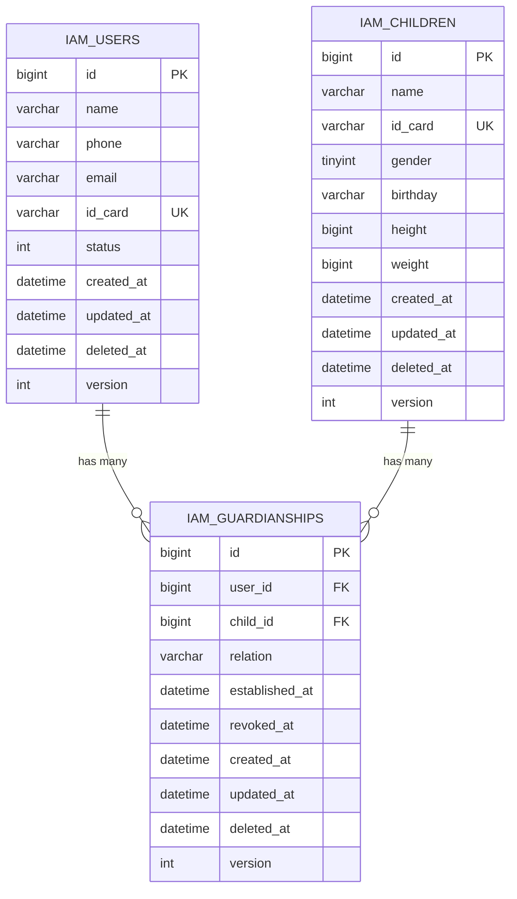

# 用户中心 - 数据模型

> [返回用户中心文档](./README.md)

本文档详细介绍用户中心的数据库设计，包括 ER 图和表结构。

---

## 7. 数据模型

### 7.1 ER 图



### 7.2 数据库表结构

#### 7.2.1 iam_users 表

```sql
CREATE TABLE IF NOT EXISTS `iam_users` (
  `id` BIGINT UNSIGNED NOT NULL PRIMARY KEY COMMENT '用户ID',
  `name` VARCHAR(64) NOT NULL COMMENT '用户名称',
  `phone` VARCHAR(20) NOT NULL COMMENT '手机号',
  `email` VARCHAR(100) NOT NULL COMMENT '邮箱',
  `id_card` VARCHAR(20) NOT NULL COMMENT '身份证号',
  `status` INT NOT NULL DEFAULT 1 COMMENT '用户状态: 1-正常, 2-禁用',
  `created_at` DATETIME NOT NULL DEFAULT CURRENT_TIMESTAMP COMMENT '创建时间',
  `updated_at` DATETIME NOT NULL DEFAULT CURRENT_TIMESTAMP ON UPDATE CURRENT_TIMESTAMP COMMENT '更新时间',
  `deleted_at` DATETIME DEFAULT NULL COMMENT '删除时间',
  `created_by` BIGINT UNSIGNED NOT NULL DEFAULT 0 COMMENT '创建人 ID',
  `updated_by` BIGINT UNSIGNED NOT NULL DEFAULT 0 COMMENT '更新人 ID',
  `deleted_by` BIGINT UNSIGNED NOT NULL DEFAULT 0 COMMENT '删除人 ID',
  `version` INT UNSIGNED NOT NULL DEFAULT 1 COMMENT '乐观锁版本号',
  UNIQUE KEY `uk_id_card` (`id_card`),
  KEY `idx_phone` (`phone`),
  KEY `idx_deleted_at` (`deleted_at`)
) ENGINE=InnoDB DEFAULT CHARSET=utf8mb4 COLLATE=utf8mb4_unicode_ci COMMENT='用户表';
```

#### 7.2.2 iam_children 表

```sql
CREATE TABLE IF NOT EXISTS `iam_children` (
  `id` BIGINT UNSIGNED NOT NULL PRIMARY KEY COMMENT '儿童 ID',
  `name` VARCHAR(64) NOT NULL COMMENT '儿童姓名',
  `id_card` VARCHAR(20) DEFAULT NULL COMMENT '身份证号码',
  `gender` TINYINT NOT NULL DEFAULT 0 COMMENT '性别: 0-未知, 1-男, 2-女',
  `birthday` VARCHAR(10) DEFAULT NULL COMMENT '出生日期 (YYYY-MM-DD)',
  `height` BIGINT DEFAULT NULL COMMENT '身高 (以 0.1cm 为单位)',
  `weight` BIGINT DEFAULT NULL COMMENT '体重 (以 0.1kg 为单位)',
  `created_at` DATETIME NOT NULL DEFAULT CURRENT_TIMESTAMP COMMENT '创建时间',
  `updated_at` DATETIME NOT NULL DEFAULT CURRENT_TIMESTAMP ON UPDATE CURRENT_TIMESTAMP COMMENT '更新时间',
  `deleted_at` DATETIME DEFAULT NULL COMMENT '删除时间',
  `created_by` BIGINT UNSIGNED NOT NULL DEFAULT 0 COMMENT '创建人 ID',
  `updated_by` BIGINT UNSIGNED NOT NULL DEFAULT 0 COMMENT '更新人 ID',
  `deleted_by` BIGINT UNSIGNED NOT NULL DEFAULT 0 COMMENT '删除人 ID',
  `version` INT UNSIGNED NOT NULL DEFAULT 1 COMMENT '乐观锁版本号',
  UNIQUE KEY `uk_id_card` (`id_card`),
  KEY `idx_deleted_at` (`deleted_at`),
  KEY `idx_name_gender_birthday` (`name`, `gender`, `birthday`)
) ENGINE=InnoDB DEFAULT CHARSET=utf8mb4 COLLATE=utf8mb4_unicode_ci COMMENT='儿童档案表';
```

#### 7.2.3 iam_guardianships 表

```sql
CREATE TABLE IF NOT EXISTS `iam_guardianships` (
  `id` BIGINT UNSIGNED NOT NULL PRIMARY KEY COMMENT '监护关系 ID',
  `user_id` BIGINT UNSIGNED NOT NULL COMMENT '监护人 ID (用户 ID)',
  `child_id` BIGINT UNSIGNED NOT NULL COMMENT '儿童 ID',
  `relation` VARCHAR(16) NOT NULL COMMENT '监护关系: parent-父母, guardian-监护人',
  `established_at` DATETIME NOT NULL COMMENT '建立时间',
  `revoked_at` DATETIME DEFAULT NULL COMMENT '撤销时间',
  `created_at` DATETIME NOT NULL DEFAULT CURRENT_TIMESTAMP COMMENT '创建时间',
  `updated_at` DATETIME NOT NULL DEFAULT CURRENT_TIMESTAMP ON UPDATE CURRENT_TIMESTAMP COMMENT '更新时间',
  `deleted_at` DATETIME DEFAULT NULL COMMENT '删除时间',
  `created_by` BIGINT UNSIGNED NOT NULL DEFAULT 0 COMMENT '创建人 ID',
  `updated_by` BIGINT UNSIGNED NOT NULL DEFAULT 0 COMMENT '更新人 ID',
  `deleted_by` BIGINT UNSIGNED NOT NULL DEFAULT 0 COMMENT '删除人 ID',
  `version` INT UNSIGNED NOT NULL DEFAULT 1 COMMENT '乐观锁版本号',
  KEY `idx_user_child_ref` (`user_id`, `child_id`),
  KEY `idx_deleted_at` (`deleted_at`)
) ENGINE=InnoDB DEFAULT CHARSET=utf8mb4 COLLATE=utf8mb4_unicode_ci COMMENT='监护关系表';
  UNIQUE KEY `uk_user_child` (`user_id`, `child_id`),
  KEY `idx_user_id` (`user_id`),
  KEY `idx_child_id` (`child_id`),
  CONSTRAINT `fk_guardianships_user` FOREIGN KEY (`user_id`) REFERENCES `users` (`id`) ON DELETE CASCADE,
  CONSTRAINT `fk_guardianships_child` FOREIGN KEY (`child_id`) REFERENCES `children` (`id`) ON DELETE CASCADE
) ENGINE=InnoDB DEFAULT CHARSET=utf8mb4 COMMENT='监护关系表';
```

---
