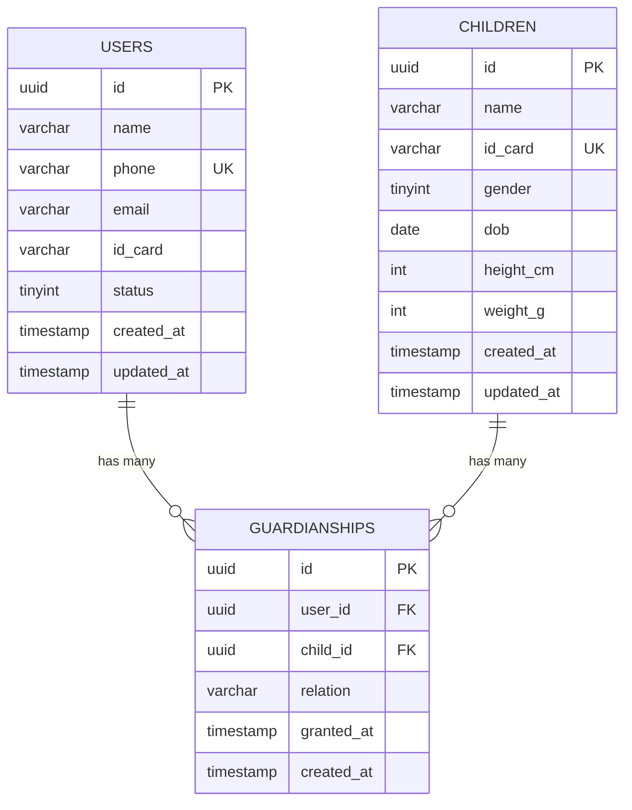

# 用户中心 - 数据模型

> [返回用户中心文档](./README.md)

本文档详细介绍用户中心的数据库设计，包括 ER 图和表结构。

---

## 7. 数据模型

### 7.1 ER 图



### 7.2 数据库表结构

#### 7.2.1 users 表

```sql
CREATE TABLE `users` (
  `id` varchar(36) NOT NULL COMMENT '用户ID (UUID)',
  `name` varchar(100) NOT NULL COMMENT '用户名',
  `phone` varchar(20) NOT NULL COMMENT '手机号',
  `email` varchar(100) DEFAULT '' COMMENT '邮箱',
  `id_card` varchar(100) DEFAULT '' COMMENT '身份证号（加密）',
  `status` tinyint NOT NULL DEFAULT '1' COMMENT '状态：1-激活，2-停用，3-封禁',
  `created_at` timestamp NOT NULL DEFAULT CURRENT_TIMESTAMP,
  `updated_at` timestamp NOT NULL DEFAULT CURRENT_TIMESTAMP ON UPDATE CURRENT_TIMESTAMP,
  PRIMARY KEY (`id`),
  UNIQUE KEY `uk_phone` (`phone`),
  KEY `idx_status` (`status`)
) ENGINE=InnoDB DEFAULT CHARSET=utf8mb4 COMMENT='用户表';
```

#### 7.2.2 children 表

```sql
CREATE TABLE `children` (
  `id` varchar(36) NOT NULL COMMENT '儿童ID (UUID)',
  `name` varchar(100) NOT NULL COMMENT '姓名',
  `id_card` varchar(100) DEFAULT '' COMMENT '身份证号（加密）',
  `gender` tinyint DEFAULT '0' COMMENT '性别：0-未知，1-男，2-女',
  `dob` date DEFAULT NULL COMMENT '出生日期',
  `height_cm` int DEFAULT '0' COMMENT '身高（厘米）',
  `weight_g` int DEFAULT '0' COMMENT '体重（克）',
  `created_at` timestamp NOT NULL DEFAULT CURRENT_TIMESTAMP,
  `updated_at` timestamp NOT NULL DEFAULT CURRENT_TIMESTAMP ON UPDATE CURRENT_TIMESTAMP,
  PRIMARY KEY (`id`),
  UNIQUE KEY `uk_id_card` (`id_card`),
  KEY `idx_name_dob` (`name`, `dob`)
) ENGINE=InnoDB DEFAULT CHARSET=utf8mb4 COMMENT='儿童档案表';
```

#### 7.2.3 guardianships 表

```sql
CREATE TABLE `guardianships` (
  `id` varchar(36) NOT NULL COMMENT '监护关系ID (UUID)',
  `user_id` varchar(36) NOT NULL COMMENT '用户ID',
  `child_id` varchar(36) NOT NULL COMMENT '儿童ID',
  `relation` varchar(20) NOT NULL DEFAULT 'parent' COMMENT '关系类型：parent-父母，guardian-监护人',
  `granted_at` timestamp NOT NULL DEFAULT CURRENT_TIMESTAMP COMMENT '授予时间',
  `created_at` timestamp NOT NULL DEFAULT CURRENT_TIMESTAMP,
  PRIMARY KEY (`id`),
  UNIQUE KEY `uk_user_child` (`user_id`, `child_id`),
  KEY `idx_user_id` (`user_id`),
  KEY `idx_child_id` (`child_id`),
  CONSTRAINT `fk_guardianships_user` FOREIGN KEY (`user_id`) REFERENCES `users` (`id`) ON DELETE CASCADE,
  CONSTRAINT `fk_guardianships_child` FOREIGN KEY (`child_id`) REFERENCES `children` (`id`) ON DELETE CASCADE
) ENGINE=InnoDB DEFAULT CHARSET=utf8mb4 COMMENT='监护关系表';
```

---
