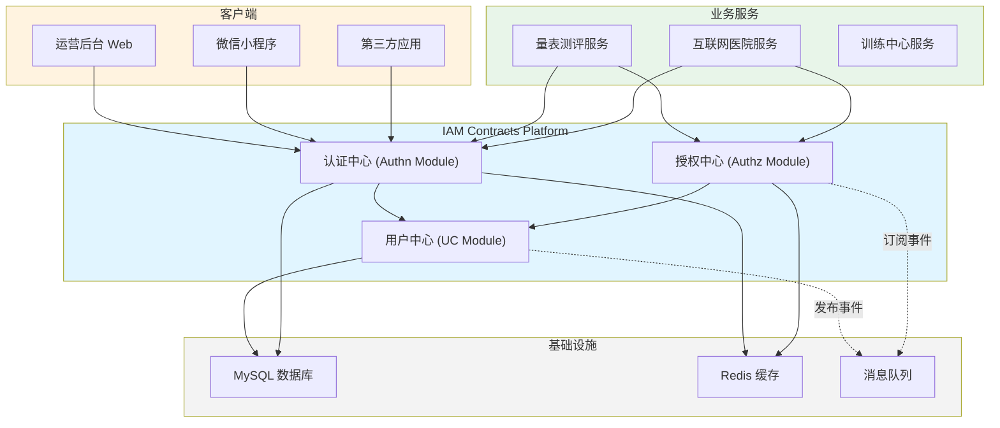
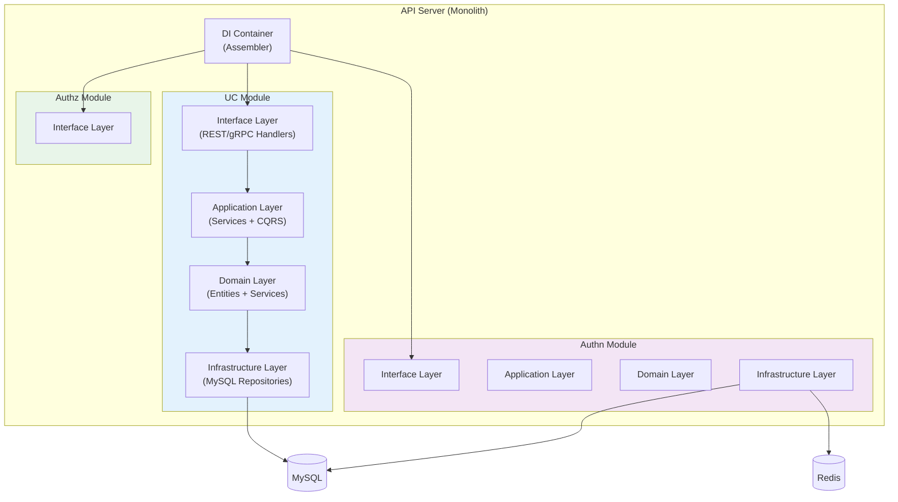
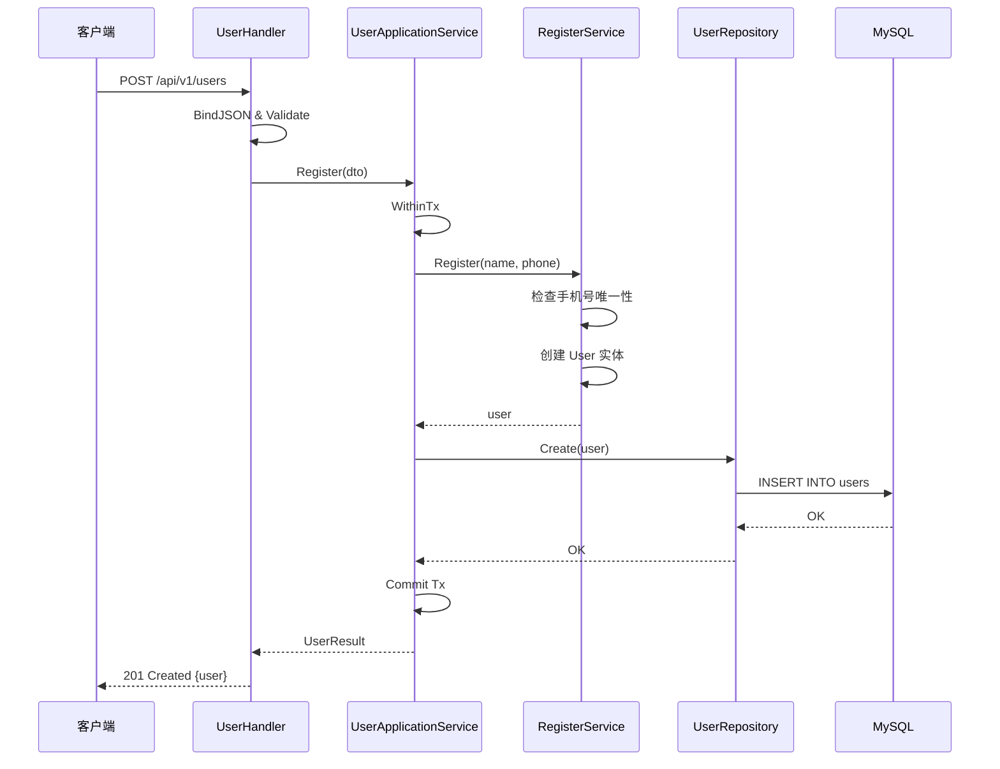
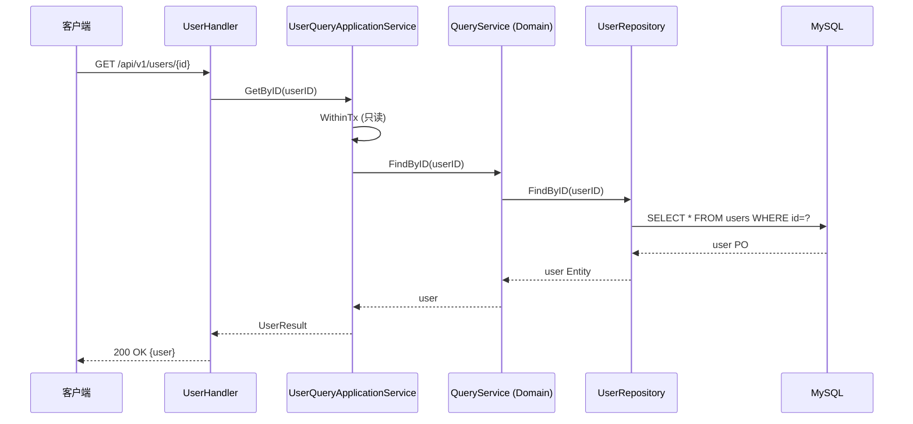
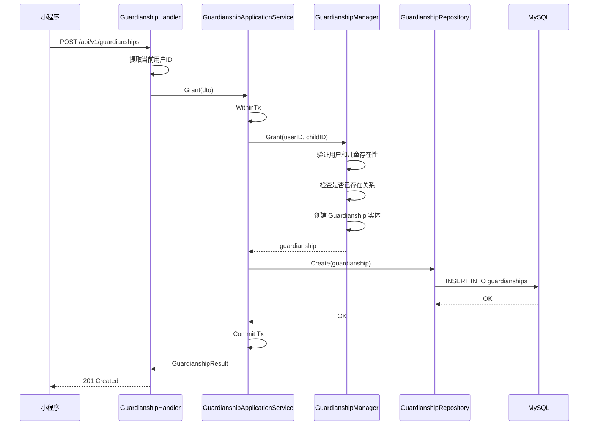

# IAM Contracts 项目架构说明

## 📋 目录

- [1. 项目概述](#1-项目概述)
- [2. 架构设计原则](#2-架构设计原则)
- [3. 技术栈](#3-技术栈)
- [4. 整体架构](#4-整体架构)
- [5. 目录结构](#5-目录结构)
- [6. 模块划分](#6-模块划分)
- [7. 数据流转](#7-数据流转)
- [8. 部署架构](#8-部署架构)

---

## 1. 项目概述

**IAM Contracts** 是一个基于 Go 语言开发的身份与访问管理（Identity & Access Management）平台，提供用户管理、认证、授权等核心能力。

### 1.1 核心功能

- **用户中心（UC）**: 用户、儿童档案、监护关系管理
- **认证中心（Authn）**: 多渠道登录、JWT 签发与验证
- **授权中心（Authz）**: RBAC 权限模型、关系授权

### 1.2 设计目标

- ✅ **清晰分层**: 六边形架构（Hexagonal Architecture）+ DDD（领域驱动设计）
- ✅ **职责分离**: CQRS（命令查询职责分离）模式
- ✅ **高内聚低耦合**: 端口适配器模式，依赖倒置
- ✅ **可测试性**: 业务逻辑与基础设施解耦
- ✅ **可扩展性**: 模块化设计，易于添加新功能

---

## 2. 架构设计原则

### 2.1 六边形架构（Ports & Adapters）

```text
┌─────────────────────────────────────────────────────────────┐
│                    External World                            │
│  ┌──────────┐  ┌──────────┐  ┌──────────┐  ┌──────────┐   │
│  │  REST    │  │  gRPC    │  │  Event   │  │  CLI     │   │
│  │  API     │  │  API     │  │  Bus     │  │          │   │
│  └────┬─────┘  └────┬─────┘  └────┬─────┘  └────┬─────┘   │
│       │             │              │             │          │
│       │    Primary Adapters (Driving)            │          │
│       └─────────────┴──────────────┴─────────────┘          │
│                         ▼                                    │
│       ┌──────────────────────────────────────────┐          │
│       │         Application Layer                │          │
│       │  ┌────────────────────────────────────┐ │          │
│       │  │     Domain Layer (核心业务)        │ │          │
│       │  │  - Entities (实体)                 │ │          │
│       │  │  - Value Objects (值对象)          │ │          │
│       │  │  - Domain Services (领域服务)      │ │          │
│       │  │  - Domain Ports (领域端口)         │ │          │
│       │  └────────────────────────────────────┘ │          │
│       └──────────────────────────────────────────┘          │
│                         ▼                                    │
│       ┌─────────────────┴──────────────────┐                │
│       │    Secondary Adapters (Driven)     │                │
│       └─────────────────┬──────────────────┘                │
│  ┌────────┴──────┬──────────┴──────┬──────────┴──────┐     │
│  │   MySQL       │    Redis        │    External     │     │
│  │   Repository  │    Cache        │    Services     │     │
│  └───────────────┴─────────────────┴─────────────────┘     │
└─────────────────────────────────────────────────────────────┘
```

### 2.2 CQRS 模式

**命令（Command）** 与 **查询（Query）** 职责分离：

```text
┌─────────────────────────────────────────┐
│            Handler Layer                 │
├─────────────────────────────────────────┤
│  UserHandler / ChildHandler             │
│    ↓ (写)              ↓ (读)           │
│  ApplicationService    QueryService     │
├─────────────────────────────────────────┤
│         Application Layer (CQRS)        │
├─────────────────────────────────────────┤
│  UserApplicationService                 │
│  - Register()  (命令 - 写操作)          │
│                                         │
│  UserQueryApplicationService            │
│  - GetByID()   (查询 - 读操作)          │
│  - GetByPhone()                         │
├─────────────────────────────────────────┤
│           Domain Layer                   │
├─────────────────────────────────────────┤
│  RegisterService         QueryService   │
│  ProfileService          (只读)         │
├─────────────────────────────────────────┤
│        Infrastructure Layer              │
├─────────────────────────────────────────┤
│              Repository                  │
└─────────────────────────────────────────┘
```

**优势**:

- ✅ 读写分离，可独立优化
- ✅ 查询可添加缓存而不影响命令
- ✅ 命令操作事务边界清晰
- ✅ 符合单一职责原则

### 2.3 DDD 战术设计

- **聚合根（Aggregate Root）**: User, Child, Guardianship
- **实体（Entity）**: 具有唯一标识的领域对象
- **值对象（Value Object）**: Phone, Email, IDCard, Birthday, Gender 等
- **领域服务（Domain Service）**: 跨实体的业务逻辑
- **仓储（Repository）**: 聚合的持久化接口

---

## 3. 技术栈

### 3.1 核心框架

| 技术 | 版本 | 用途 |
|------|------|------|
| Go | 1.21+ | 编程语言 |
| Gin | v1.9+ | HTTP 框架 |
| GORM | v2.0+ | ORM 框架 |
| gRPC | v1.58+ | RPC 框架 |
| MySQL | 8.0+ | 关系数据库 |
| Redis | 7.0+ | 缓存/会话 |

### 3.2 基础设施

- **日志**: Zap
- **配置**: Viper
- **验证**: go-playground/validator
- **错误处理**: pkg/errors
- **构建工具**: Make, Docker

---

## 4. 整体架构

### 4.1 系统上下文（C4 - Context）



### 4.2 容器视图（C4 - Container）



---

## 5. 目录结构

```text
iam-contracts/
├── cmd/                          # 可执行程序入口
│   └── apiserver/
│       └── apiserver.go          # main 入口
├── internal/                     # 内部实现（不可外部导入）
│   └── apiserver/
│       ├── app.go                # 应用启动逻辑
│       ├── run.go                # 服务运行主流程
│       ├── server.go             # HTTP/gRPC 服务器初始化
│       ├── routers.go            # 路由注册
│       ├── config/               # 配置结构
│       ├── options/              # 命令行参数
│       ├── container/            # DI 容器
│       │   └── assembler/        # 模块组装器
│       │       └── user.go       # 用户模块装配
│       └── modules/              # 业务模块
│           ├── uc/               # 用户中心模块 ⭐
│           │   ├── application/  # 应用层
│           │   │   ├── user/
│           │   │   │   ├── services.go      # 服务接口定义
│           │   │   │   ├── services_impl.go # 服务实现
│           │   │   │   └── query_service.go # CQRS 查询服务
│           │   │   ├── child/
│           │   │   ├── guardianship/
│           │   │   └── uow/      # Unit of Work (事务边界)
│           │   ├── domain/       # 领域层
│           │   │   ├── user/
│           │   │   │   ├── user.go         # 聚合根
│           │   │   │   ├── user_id.go      # 标识符
│           │   │   │   ├── user_status.go  # 枚举值对象
│           │   │   │   ├── port/           # 领域端口
│           │   │   │   │   ├── driving.go  # 主动端口
│           │   │   │   │   └── driven.go   # 被动端口
│           │   │   │   └── service/        # 领域服务
│           │   │   ├── child/
│           │   │   └── guardianship/
│           │   ├── infrastructure/  # 基础设施层
│           │   │   └── mysql/
│           │   │       ├── user/
│           │   │       │   ├── repo.go     # 仓储实现
│           │   │       │   └── user.go     # PO (持久化对象)
│           │   │       ├── child/
│           │   │       └── guardianship/
│           │   └── interface/    # 接口适配器层
│           │       ├── restful/
│           │       │   ├── handler/        # REST 处理器
│           │       │   ├── request/        # 请求 DTO
│           │       │   └── response/       # 响应 DTO
│           │       └── grpc/
│           │           └── identity/       # gRPC 服务
│           ├── authn/            # 认证中心模块 ⭐
│           └── authz/            # 授权中心模块 ⭐
├── pkg/                          # 可复用公共库
│   ├── app/                      # 应用框架
│   ├── auth/                     # 认证工具
│   ├── core/                     # 核心类型
│   ├── database/                 # 数据库注册器
│   ├── errors/                   # 错误处理
│   ├── flag/                     # 命令行标志
│   ├── json/                     # JSON 工具
│   ├── log/                      # 日志库
│   ├── meta/                     # 元数据类型
│   ├── shutdown/                 # 优雅关闭
│   ├── util/                     # 工具函数
│   └── version/                  # 版本信息
├── configs/                      # 配置文件
│   ├── apiserver.yaml            # API Server 配置
│   ├── cert/                     # TLS 证书
│   └── env/                      # 环境变量
├── build/                        # 构建相关
│   └── docker/
│       └── infra/                # 基础设施 Docker
├── docs/                         # 文档
├── scripts/                      # 脚本
├── Makefile                      # 构建脚本
├── go.mod
└── README.md
```

---

## 6. 模块划分

### 6.1 用户中心（UC Module）

**职责**: 用户生命周期管理、儿童档案、监护关系

**聚合根**:

- `User`: 基础用户（身份锚点）
- `Child`: 儿童档案
- `Guardianship`: 监护关系

**核心能力**:

- 用户注册、资料更新、状态管理
- 儿童档案创建、信息维护
- 监护关系授予、撤销、查询

详见: [用户中心架构设计](./uc-architecture.md)

### 6.2 认证中心（Authn Module）

**职责**: 多渠道登录、JWT 签发、会话管理

**核心能力**:

- 微信小程序登录
- 企业微信登录
- 本地密码登录
- JWT 签发与刷新
- JWKS 公钥发布

详见: [认证中心架构设计](./authn-architecture.md)

### 6.3 授权中心（Authz Module）

**职责**: RBAC 权限判定、关系授权

**核心能力**:

- 角色权限管理
- 动作鉴权（Allow）
- 关系鉴权（AllowOnActor）
- 权限缓存

---

## 7. 数据流转

### 7.1 用户注册流程



### 7.2 CQRS 查询流程



### 7.3 监护关系授权流程



---

## 8. 部署架构

### 8.1 开发环境

```text
┌─────────────────────────────────────────┐
│         Developer Machine                │
│  ┌────────────────────────────────────┐ │
│  │  iam-contracts                     │ │
│  │  - go run cmd/apiserver/           │ │
│  │  - air (热重载)                    │ │
│  └────────────────────────────────────┘ │
│                                          │
│  ┌────────────────────────────────────┐ │
│  │  Docker Compose                    │ │
│  │  - MySQL 8.0                       │ │
│  │  - Redis 7.0                       │ │
│  └────────────────────────────────────┘ │
└─────────────────────────────────────────┘
```

启动命令：

```bash
# 启动基础设施
cd build/docker/infra
docker-compose up -d

# 运行 API Server
make run
# 或使用热重载
air
```

### 8.2 生产环境

```text
┌──────────────────────────────────────────────────────────┐
│                     Kubernetes Cluster                    │
│                                                           │
│  ┌─────────────────────────────────────────────────────┐ │
│  │  Ingress Controller (Nginx)                         │ │
│  │  - TLS Termination                                  │ │
│  │  - Rate Limiting                                    │ │
│  └──────────────────┬──────────────────────────────────┘ │
│                     │                                     │
│  ┌─────────────────▼──────────────────────────────────┐ │
│  │  iam-apiserver Service                             │ │
│  │  - Deployment (3 replicas)                         │ │
│  │  - HPA (CPU/Memory based)                          │ │
│  │  - Liveness/Readiness Probes                       │ │
│  └──────────────────┬──────────────────────────────────┘ │
│                     │                                     │
│                     ▼                                     │
│  ┌──────────────────────────────────┐                    │
│  │  StatefulSet: MySQL (Primary)    │                    │
│  │  - PV/PVC for persistence        │                    │
│  │  - Daily Backup CronJob          │                    │
│  └──────────────────────────────────┘                    │
│                                                           │
│  ┌──────────────────────────────────┐                    │
│  │  StatefulSet: Redis Cluster      │                    │
│  │  - 3 Masters + 3 Replicas        │                    │
│  └──────────────────────────────────┘                    │
│                                                           │
│  ┌──────────────────────────────────┐                    │
│  │  Observability Stack              │                    │
│  │  - Prometheus (Metrics)          │                    │
│  │  - Loki (Logs)                   │                    │
│  │  - Tempo (Traces)                │                    │
│  │  - Grafana (Visualization)       │                    │
│  └──────────────────────────────────┘                    │
└──────────────────────────────────────────────────────────┘
```

### 8.3 高可用方案

| 组件 | 方案 | 说明 |
|------|------|------|
| **API Server** | 多副本 + HPA | 3 个副本，根据 CPU 自动扩缩容 |
| **MySQL** | 主从复制 | 1 主 2 从，读写分离 |
| **Redis** | Cluster 模式 | 3 主 3 从，自动故障转移 |
| **负载均衡** | K8s Service | ClusterIP + Ingress |
| **配置管理** | ConfigMap + Secret | 敏感信息加密存储 |
| **监控告警** | Prometheus + Alertmanager | 多维度指标监控 |

---

## 9. 核心概念

### 9.1 Unit of Work (UoW)

**定义**: 工作单元模式，管理事务边界

```go
// internal/apiserver/modules/uc/application/uow/uow.go
type UnitOfWork interface {
    WithinTx(ctx context.Context, fn func(tx TxRepositories) error) error
}

type TxRepositories struct {
    Users         port.UserRepository
    Children      port.ChildRepository
    Guardianships port.GuardianshipRepository
}
```

**优势**:

- ✅ 统一事务管理
- ✅ 自动回滚/提交
- ✅ 避免手动管理数据库连接

### 9.2 值对象（Value Objects）

**定义**: 不可变的领域概念，通过值相等而非引用相等判断

```go
// internal/pkg/meta/phone.go
type Phone struct {
    CountryCode string
    Number      string
}

// internal/pkg/meta/birthday.go
type Birthday struct {
    Year  int
    Month int
    Day   int
}
```

**特性**:

- ✅ 不可变（Immutable）
- ✅ 自包含验证逻辑
- ✅ 值相等性
- ✅ 无副作用

### 9.3 依赖注入容器

**实现**: `internal/apiserver/container/assembler/user.go`

```go
type UserModule struct {
    UserHandler         *handler.UserHandler
    ChildHandler        *handler.ChildHandler
    GuardianshipHandler *handler.GuardianshipHandler
}

func (m *UserModule) Initialize(params ...interface{}) error {
    db := params[0].(*gorm.DB)
    
    // 创建 UoW
    uow := appuow.NewUnitOfWork(db)
    
    // 创建应用服务
    userAppSrv := appuser.NewUserApplicationService(uow)
    userQuerySrv := appuser.NewUserQueryApplicationService(uow)
    
    // 组装 Handler
    m.UserHandler = handler.NewUserHandler(userAppSrv, userQuerySrv)
    
    return nil
}
```

---

## 10. 最佳实践

### 10.1 错误处理

```go
import "github.com/FangcunMount/component-base/pkg/errors"
import "github.com/FangcunMount/iam-contracts/internal/pkg/code"

// 业务错误
if user == nil {
    return nil, errors.WithCode(code.ErrUserNotFound, "user not found")
}

// 参数验证错误
if name == "" {
    return nil, errors.WithCode(code.ErrInvalidArgument, "name cannot be empty")
}
```

### 10.2 日志记录

```go
import "github.com/FangcunMount/component-base/pkg/log"

log.Info("User registered successfully", 
    log.String("user_id", user.ID.String()),
    log.String("phone", user.Phone.Number))

log.Errorw("Failed to create user", 
    "error", err,
    "name", dto.Name)
```

### 10.3 配置管理

```yaml
# configs/apiserver.yaml
server:
  mode: debug
  host: 0.0.0.0
  port: 8080
  healthz: true

mysql:
  host: localhost
  port: 3306
  database: iam_contracts
  username: root
  password: ${MYSQL_PASSWORD}  # 从环境变量读取
```

---

## 11. 开发指南

### 11.1 添加新功能

1. **定义领域模型**: `internal/apiserver/modules/{module}/domain/`
2. **定义领域端口**: `domain/{entity}/port/driving.go`
3. **实现领域服务**: `domain/{entity}/service/`
4. **实现应用服务**: `application/{entity}/services.go`
5. **实现基础设施**: `infrastructure/mysql/{entity}/repo.go`
6. **实现接口适配器**: `interface/restful/handler/`
7. **注册路由**: `internal/apiserver/routers.go`
8. **更新 DI 容器**: `container/assembler/`

### 11.2 运行测试

```bash
# 单元测试
go test ./...

# 集成测试
go test -tags=integration ./...

# 测试覆盖率
go test -cover ./...
```

### 11.3 代码风格

- 遵循 [Uber Go Style Guide](https://github.com/uber-go/guide/blob/master/style.md)
- 使用 `golangci-lint` 进行代码检查
- 函数名使用驼峰命名
- 包名使用小写单数形式

---

## 12. 扩展阅读

- [用户中心架构设计](./uc-architecture.md)
- [认证中心架构设计](./authn-architecture.md)
- [六边形架构详解](https://alistair.cockburn.us/hexagonal-architecture/)
- [领域驱动设计](https://domainlanguage.com/ddd/)
- [CQRS 模式](https://martinfowler.com/bliki/CQRS.html)

---

## 13. 更新日志

| 日期 | 版本 | 变更内容 |
|------|------|---------|
| 2025-10-17 | v1.0.0 | 初始版本，包含完整架构说明 |

---

**维护者**: IAM Team  
**最后更新**: 2025-10-17
