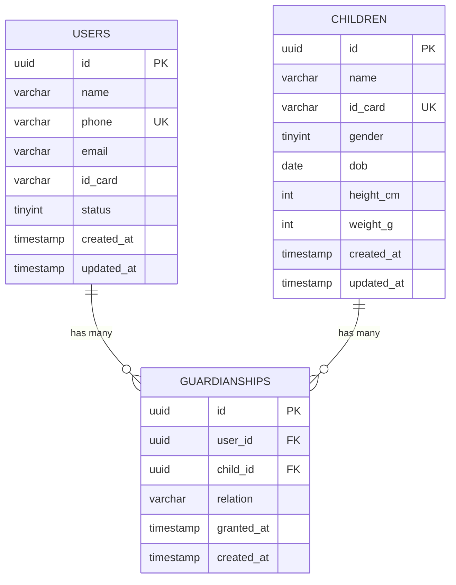
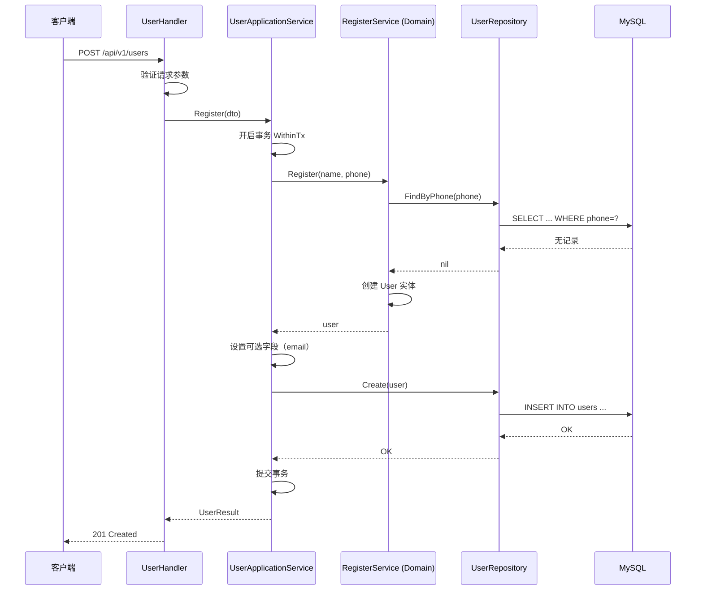
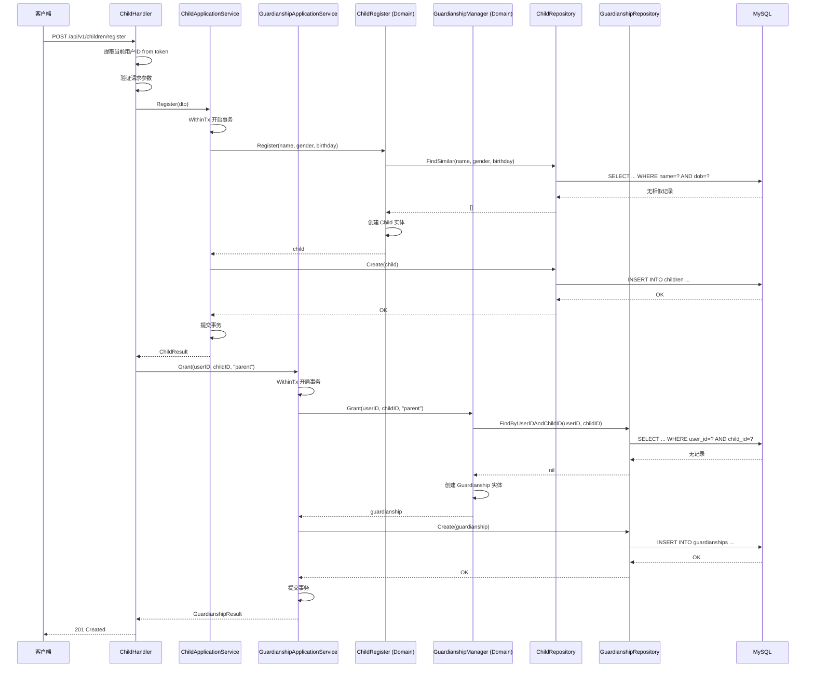
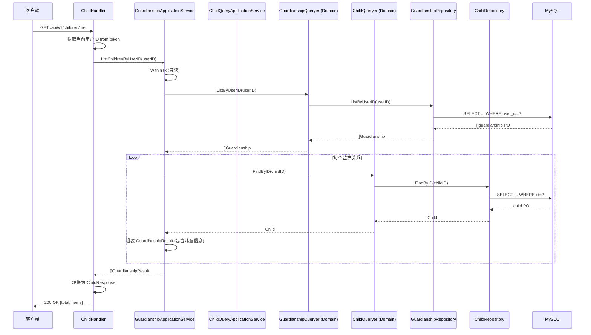

# 用户中心（UC Module）架构设计

## 📋 目录

- [1. 模块概述](#1-模块概述)
- [2. 核心职责](#2-核心职责)
- [3. 领域模型](#3-领域模型)
- [4. 分层架构](#4-分层架构)
- [5. CQRS 实现](#5-cqrs-实现)
- [6. API 设计](#6-api-设计)
- [7. 数据模型](#7-数据模型)
- [8. 业务流程](#8-业务流程)

---

## 1. 模块概述

用户中心（User Center, UC）是 IAM 平台的核心模块之一，负责管理用户生命周期、儿童档案以及监护关系。

### 1.1 设计目标

- ✅ **领域驱动**: 基于 DDD 战术设计，清晰的领域边界
- ✅ **六边形架构**: 业务逻辑与基础设施完全解耦
- ✅ **CQRS 模式**: 命令与查询职责分离
- ✅ **高内聚低耦合**: 通过端口适配器实现依赖倒置

### 1.2 技术特性

| 特性 | 实现方式 |
|------|---------|
| **事务管理** | Unit of Work (UoW) 模式 |
| **并发控制** | 乐观锁（GORM 版本字段） |
| **数据验证** | 值对象自包含验证 |
| **错误处理** | 统一错误码 + 错误包装 |
| **日志追踪** | 结构化日志 + 请求 ID |

---

## 2. 核心职责

### 2.1 用户管理

- **注册**: 创建新用户账号
- **资料维护**: 更新姓名、联系方式、身份证
- **状态管理**: 激活、停用、封禁

### 2.2 儿童档案管理

- **档案创建**: 注册儿童基本信息
- **信息维护**: 更新姓名、性别、生日、身高体重
- **查重检测**: 基于姓名+生日查找相似儿童

### 2.3 监护关系管理

- **关系授予**: 建立用户与儿童的监护关系
- **关系撤销**: 解除监护权限
- **关系查询**: 查询监护人的所有儿童、儿童的所有监护人

---

## 3. 领域模型

### 3.1 聚合根设计

```text
┌─────────────────────────────────────────────────────────────┐
│                     UC Domain Model                          │
├─────────────────────────────────────────────────────────────┤
│                                                              │
│  ┌─────────────────┐         ┌─────────────────┐           │
│  │  User (聚合根)  │         │ Child (聚合根)  │           │
│  ├─────────────────┤         ├─────────────────┤           │
│  │ + ID            │         │ + ID            │           │
│  │ + Name          │         │ + Name          │           │
│  │ + Phone  (VO)   │◄───────►│ + Gender  (VO)  │           │
│  │ + Email  (VO)   │         │ + Birthday (VO) │           │
│  │ + IDCard (VO)   │   监护   │ + IDCard  (VO)  │           │
│  │ + Status (Enum) │   关系   │ + Height  (VO)  │           │
│  └─────────────────┘         │ + Weight  (VO)  │           │
│                               └─────────────────┘           │
│          │                            │                     │
│          │                            │                     │
│          │    ┌──────────────────┐    │                     │
│          └───►│  Guardianship    │◄───┘                     │
│               │   (聚合根)        │                          │
│               ├──────────────────┤                          │
│               │ + ID             │                          │
│               │ + UserID         │                          │
│               │ + ChildID        │                          │
│               │ + Relation (VO)  │                          │
│               │ + GrantedAt      │                          │
│               └──────────────────┘                          │
│                                                              │
└─────────────────────────────────────────────────────────────┘
```

### 3.2 实体（Entities）

#### 3.2.1 User 聚合

```go
// internal/apiserver/modules/uc/domain/user/user.go
package user

type User struct {
    ID     UserID          // 唯一标识
    Name   string          // 用户名
    Phone  meta.Phone      // 手机号（值对象）
    Email  meta.Email      // 邮箱（值对象）
    IDCard meta.IDCard     // 身份证（值对象）
    Status UserStatus      // 状态（枚举）
}

// 工厂方法
func NewUser(name string, phone meta.Phone, opts ...UserOption) (*User, error)

// 领域方法
func (u *User) Activate()                     // 激活
func (u *User) Deactivate()                   // 停用
func (u *User) Block()                        // 封禁
func (u *User) UpdatePhone(p meta.Phone)      // 更新手机
func (u *User) UpdateEmail(e meta.Email)      // 更新邮箱
func (u *User) UpdateIDCard(idc meta.IDCard)  // 更新身份证
```

**业务规则**:

- ✅ 用户名不能为空
- ✅ 手机号必填且唯一
- ✅ 只有激活状态的用户才能登录
- ✅ 封禁用户无法进行任何操作

#### 3.2.2 Child 聚合

```go
// internal/apiserver/modules/uc/domain/child/child.go
package child

type Child struct {
    ID       ChildID
    Name     string
    IDCard   meta.IDCard
    Gender   meta.Gender
    Birthday meta.Birthday
    Height   meta.Height
    Weight   meta.Weight
}

// 工厂方法
func NewChild(name string, opts ...ChildOption) (*Child, error)

// 领域方法
func (c *Child) Rename(name string)
func (c *Child) UpdateIDCard(idc meta.IDCard)
func (c *Child) UpdateProfile(g meta.Gender, d meta.Birthday)
func (c *Child) UpdateHeightWeight(h meta.Height, w meta.Weight)
```

**业务规则**:

- ✅ 儿童姓名不能为空
- ✅ 性别、生日可选但一旦设置不建议修改
- ✅ 身份证号唯一（如果提供）
- ✅ 身高体重为监测数据，可多次更新

#### 3.2.3 Guardianship 聚合

```go
// internal/apiserver/modules/uc/domain/guardianship/guardianship.go
package guardianship

type Guardianship struct {
    ID        GuardianshipID
    UserID    user.UserID
    ChildID   child.ChildID
    Relation  Relation      // 监护关系类型
    GrantedAt time.Time
}

// 工厂方法
func NewGuardianship(
    userID user.UserID, 
    childID child.ChildID, 
    relation Relation,
) (*Guardianship, error)

// 领域方法
func (g *Guardianship) IsActive() bool
```

**业务规则**:

- ✅ 同一用户和儿童只能有一条监护关系
- ✅ 监护关系一旦建立不可修改，只能撤销后重新授予
- ✅ 必须同时提供有效的用户 ID 和儿童 ID

### 3.3 值对象（Value Objects）

```go
// internal/pkg/meta/phone.go
type Phone struct {
    CountryCode string  // 国家代码，如 +86
    Number      string  // 号码
}

// internal/pkg/meta/birthday.go
type Birthday struct {
    Year  int
    Month int
    Day   int
}

// internal/pkg/meta/gender.go
type Gender int
const (
    GenderUnknown Gender = 0
    GenderMale    Gender = 1
    GenderFemale  Gender = 2
)

// internal/pkg/meta/idcard.go
type IDCard struct {
    Name   string  // 姓名
    Number string  // 身份证号
}

// internal/pkg/meta/height.go
type Height struct {
    Centimeters float64
}

// internal/pkg/meta/weight.go
type Weight struct {
    Kilograms float64
}
```

**特性**:

- ✅ 不可变（Immutable）
- ✅ 值相等性
- ✅ 自包含验证逻辑
- ✅ 无副作用方法

---

## 4. 分层架构

### 4.1 完整分层图

```text
┌──────────────────────────────────────────────────────────────────┐
│                       Interface Layer (接口层)                    │
├──────────────────────────────────────────────────────────────────┤
│                                                                   │
│  RESTful API                        gRPC API                     │
│  ┌────────────────────┐            ┌────────────────────┐       │
│  │  UserHandler       │            │  IdentityService   │       │
│  │  - CreateUser()    │            │  - GetUser()       │       │
│  │  - GetUser()       │            │  - GetChild()      │       │
│  │  - PatchUser()     │            │  - IsGuardian()    │       │
│  │  - GetProfile()    │            │  - ListChildren()  │       │
│  └────────────────────┘            └────────────────────┘       │
│                                                                   │
│  ┌────────────────────┐            ┌────────────────────┐       │
│  │  ChildHandler      │            │  Request/Response  │       │
│  │  - RegisterChild() │            │  DTOs              │       │
│  │  - GetChild()      │            └────────────────────┘       │
│  │  - PatchChild()    │                                         │
│  │  - ListMyChildren()│                                         │
│  │  - SearchChildren()│                                         │
│  └────────────────────┘                                         │
│                                                                   │
│  ┌────────────────────┐                                         │
│  │ GuardianshipHandler│                                         │
│  │  - Grant()         │                                         │
│  │  - Revoke()        │                                         │
│  │  - List()          │                                         │
│  └────────────────────┘                                         │
│                                                                   │
└───────────────────────┬──────────────────────────────────────────┘
                        │
                        ▼
┌──────────────────────────────────────────────────────────────────┐
│                   Application Layer (应用层)                      │
├──────────────────────────────────────────────────────────────────┤
│                                                                   │
│  命令服务 (Command Services)                                      │
│  ┌────────────────────────────────────────────────────────────┐ │
│  │  UserApplicationService                                     │ │
│  │  - Register(dto) -> UserResult                             │ │
│  │                                                             │ │
│  │  UserProfileApplicationService                              │ │
│  │  - Rename(userID, name) -> error                           │ │
│  │  - UpdateContact(dto) -> error                             │ │
│  │  - UpdateIDCard(userID, idCard) -> error                   │ │
│  │                                                             │ │
│  │  UserStatusApplicationService                               │ │
│  │  - Activate(userID) -> error                               │ │
│  │  - Deactivate(userID) -> error                             │ │
│  │  - Block(userID) -> error                                  │ │
│  └────────────────────────────────────────────────────────────┘ │
│                                                                   │
│  查询服务 (Query Services - CQRS)                                 │
│  ┌────────────────────────────────────────────────────────────┐ │
│  │  UserQueryApplicationService                                │ │
│  │  - GetByID(userID) -> UserResult                           │ │
│  │  - GetByPhone(phone) -> UserResult                         │ │
│  │                                                             │ │
│  │  ChildQueryApplicationService                               │ │
│  │  - GetByID(childID) -> ChildResult                         │ │
│  │  - GetByIDCard(idCard) -> ChildResult                      │ │
│  │  - FindSimilar(name, gender, birthday) -> []ChildResult    │ │
│  │                                                             │ │
│  │  GuardianshipQueryApplicationService                        │ │
│  │  - IsGuardian(userID, childID) -> bool                     │ │
│  │  - ListChildrenByUserID(userID) -> []GuardianshipResult    │ │
│  │  - ListGuardiansByChildID(childID) -> []GuardianshipResult │ │
│  └────────────────────────────────────────────────────────────┘ │
│                                                                   │
│  事务边界 (Unit of Work)                                          │
│  ┌────────────────────────────────────────────────────────────┐ │
│  │  UnitOfWork                                                 │ │
│  │  - WithinTx(ctx, fn) -> error                              │ │
│  │  - TxRepositories {Users, Children, Guardianships}         │ │
│  └────────────────────────────────────────────────────────────┘ │
│                                                                   │
└───────────────────────┬──────────────────────────────────────────┘
                        │
                        ▼
┌──────────────────────────────────────────────────────────────────┐
│                     Domain Layer (领域层)                         │
├──────────────────────────────────────────────────────────────────┤
│                                                                   │
│  聚合根 (Aggregates)                                              │
│  ┌─────────────┐  ┌─────────────┐  ┌──────────────────┐        │
│  │    User     │  │   Child     │  │  Guardianship    │        │
│  │  (实体+方法) │  │  (实体+方法) │  │   (实体+方法)     │        │
│  └─────────────┘  └─────────────┘  └──────────────────┘        │
│                                                                   │
│  值对象 (Value Objects)                                           │
│  ┌────────────────────────────────────────────────────────────┐ │
│  │  Phone, Email, IDCard, Gender, Birthday, Height, Weight    │ │
│  └────────────────────────────────────────────────────────────┘ │
│                                                                   │
│  领域服务 (Domain Services)                                       │
│  ┌────────────────────────────────────────────────────────────┐ │
│  │  UserRegister              ChildRegister                    │ │
│  │  - Register()              - Register()                     │ │
│  │  - RegisterWithIDCard()    - RegisterWithIDCard()           │ │
│  │                                                             │ │
│  │  UserProfileEditor         ChildProfileEditor               │ │
│  │  - Rename()                - Rename()                       │ │
│  │  - UpdateContact()         - UpdateProfile()                │ │
│  │  - UpdateIDCard()          - UpdateHeightWeight()           │ │
│  │                                                             │ │
│  │  UserStatusChanger         GuardianshipManager              │ │
│  │  - Activate()              - Grant()                        │ │
│  │  - Deactivate()            - Revoke()                       │ │
│  │  - Block()                                                  │ │
│  │                                                             │ │
│  │  UserQueryer               ChildQueryer                     │ │
│  │  - FindByID()              - FindByID()                     │ │
│  │  - FindByPhone()           - FindByIDCard()                 │ │
│  │                            - FindSimilar()                  │ │
│  │                                                             │ │
│  │                            GuardianshipQueryer              │ │
│  │                            - IsGuardian()                   │ │
│  │                            - ListByUserID()                 │ │
│  │                            - ListByChildID()                │ │
│  └────────────────────────────────────────────────────────────┘ │
│                                                                   │
│  领域端口 (Ports)                                                 │
│  ┌────────────────────────────────────────────────────────────┐ │
│  │  Driving Ports (主动端口 - 领域服务对外提供)                  │ │
│  │  - UserRegister, UserProfileEditor, UserStatusChanger      │ │
│  │  - ChildRegister, ChildProfileEditor                        │ │
│  │  - GuardianshipManager, GuardianshipRegister               │ │
│  │                                                             │ │
│  │  Driven Ports (被动端口 - 领域依赖的外部能力)                  │ │
│  │  - UserRepository, ChildRepository, GuardianshipRepository │ │
│  └────────────────────────────────────────────────────────────┘ │
│                                                                   │
└───────────────────────┬──────────────────────────────────────────┘
                        │
                        ▼
┌──────────────────────────────────────────────────────────────────┐
│                 Infrastructure Layer (基础设施层)                  │
├──────────────────────────────────────────────────────────────────┤
│                                                                   │
│  MySQL 仓储实现 (Repository Implementations)                      │
│  ┌────────────────────────────────────────────────────────────┐ │
│  │  UserRepository (实现 port.UserRepository)                  │ │
│  │  - Create(user) -> error                                    │ │
│  │  - Update(user) -> error                                    │ │
│  │  - FindByID(id) -> User                                     │ │
│  │  - FindByPhone(phone) -> User                               │ │
│  │                                                             │ │
│  │  ChildRepository (实现 port.ChildRepository)                │ │
│  │  - Create(child) -> error                                   │ │
│  │  - Update(child) -> error                                   │ │
│  │  - FindByID(id) -> Child                                    │ │
│  │  - FindByIDCard(idCard) -> Child                            │ │
│  │  - FindSimilar(name, gender, birthday) -> []Child           │ │
│  │                                                             │ │
│  │  GuardianshipRepository (实现 port.GuardianshipRepository)  │ │
│  │  - Create(guardianship) -> error                            │ │
│  │  - Delete(id) -> error                                      │ │
│  │  - FindByUserIDAndChildID(userID, childID) -> Guardianship │ │
│  │  - ListByUserID(userID) -> []Guardianship                   │ │
│  │  - ListByChildID(childID) -> []Guardianship                 │ │
│  └────────────────────────────────────────────────────────────┘ │
│                                                                   │
│  持久化对象 (PO - Persistence Objects)                            │
│  ┌────────────────────────────────────────────────────────────┐ │
│  │  UserPO, ChildPO, GuardianshipPO (GORM Models)             │ │
│  └────────────────────────────────────────────────────────────┘ │
│                                                                   │
│  数据库 (Database)                                                │
│  ┌────────────────────────────────────────────────────────────┐ │
│  │  MySQL 8.0                                                  │ │
│  │  - users 表                                                 │ │
│  │  - children 表                                              │ │
│  │  - guardianships 表                                         │ │
│  └────────────────────────────────────────────────────────────┘ │
│                                                                   │
└──────────────────────────────────────────────────────────────────┘
```

### 4.2 依赖方向

```text
Interface Layer (依赖↓)
    ↓
Application Layer (依赖↓)
    ↓
Domain Layer (核心，不依赖任何层)
    ↑ (实现)
Infrastructure Layer (实现领域端口)
```

**关键点**:

- ✅ 依赖倒置：基础设施层实现领域层定义的端口
- ✅ 领域独立：领域层不依赖任何外部框架
- ✅ 测试友好：可以轻松 Mock 端口进行单元测试

---

## 5. CQRS 实现

### 5.1 命令与查询分离

```text
┌─────────────────────────────────────────────────────────┐
│                   Handler Layer                          │
├─────────────────────────────────────────────────────────┤
│  UserHandler                                            │
│  - userApp: UserApplicationService         (命令 - 写)  │
│  - profileApp: UserProfileApplicationService (命令)     │
│  - userQuery: UserQueryApplicationService   (查询 - 读)  │
└──────────────┬────────────────────────┬─────────────────┘
               │                        │
               ▼                        ▼
    ┌──────────────────┐    ┌──────────────────┐
    │  Command Service │    │  Query Service   │
    ├──────────────────┤    ├──────────────────┤
    │ Register()       │    │ GetByID()        │
    │ Rename()         │    │ GetByPhone()     │
    │ UpdateContact()  │    │                  │
    │ Activate()       │    │                  │
    └──────────────────┘    └──────────────────┘
          │                        │
          ▼                        ▼
    ┌──────────────────┐    ┌──────────────────┐
    │  Domain Service  │    │  Domain Query    │
    │  (写操作+验证)    │    │  Service (只读)   │
    └──────────────────┘    └──────────────────┘
          │                        │
          └────────┬───────────────┘
                   ▼
          ┌──────────────────┐
          │   Repository     │
          └──────────────────┘
```

### 5.2 命令服务示例

```go
// internal/apiserver/modules/uc/application/user/services_impl.go
type userApplicationService struct {
    uow uow.UnitOfWork
}

func (s *userApplicationService) Register(
    ctx context.Context, 
    dto RegisterUserDTO,
) (*UserResult, error) {
    var result *UserResult
    
    err := s.uow.WithinTx(ctx, func(tx uow.TxRepositories) error {
        // 1. 创建领域服务
        registerService := domainservice.NewRegisterService(tx.Users)
        
        // 2. 转换 DTO 为值对象
        phone := meta.NewPhone(dto.Phone)
        
        // 3. 调用领域服务创建实体
        user, err := registerService.Register(ctx, dto.Name, phone)
        if err != nil {
            return err
        }
        
        // 4. 设置可选字段
        if dto.Email != "" {
            email := meta.NewEmail(dto.Email)
            user.UpdateEmail(email)
        }
        
        // 5. 持久化
        if err := tx.Users.Create(ctx, user); err != nil {
            return err
        }
        
        // 6. 转换为结果 DTO
        result = toUserResult(user)
        return nil
    })
    
    return result, err
}
```

### 5.3 查询服务示例

```go
// internal/apiserver/modules/uc/application/user/query_service.go
type userQueryApplicationService struct {
    uow uow.UnitOfWork
}

func (s *userQueryApplicationService) GetByID(
    ctx context.Context, 
    userID string,
) (*UserResult, error) {
    var result *UserResult
    
    err := s.uow.WithinTx(ctx, func(tx uow.TxRepositories) error {
        // 1. 创建查询服务
        queryService := domainservice.NewQueryService(tx.Users)
        
        // 2. 转换 ID
        id, err := parseUserID(userID)
        if err != nil {
            return err
        }
        
        // 3. 调用查询
        user, err := queryService.FindByID(ctx, id)
        if err != nil {
            return err
        }
        
        // 4. 转换为结果
        result = toUserResult(user)
        return nil
    })
    
    return result, err
}
```

### 5.4 优势分析

| 维度 | 命令（写） | 查询（读） |
|------|-----------|-----------|
| **事务** | 必须在事务中 | 可选只读事务 |
| **验证** | 完整的业务规则验证 | 最小验证 |
| **缓存** | 不缓存 | 可添加缓存 |
| **返回值** | 操作结果 DTO | 查询结果 DTO |
| **副作用** | 修改数据库状态 | 无副作用 |
| **优化** | 关注一致性 | 关注性能 |

---

## 6. API 设计

### 6.1 RESTful API

#### 6.1.1 用户管理 API

```http
# 创建用户
POST /api/v1/users
Content-Type: application/json

{
  "nickname": "张三",
  "contacts": [
    {"type": "phone", "value": "13800138000"},
    {"type": "email", "value": "zhangsan@example.com"}
  ]
}

Response: 201 Created
{
  "id": "usr_1234567890",
  "name": "张三",
  "phone": "13800138000",
  "email": "zhangsan@example.com",
  "status": 1
}

# 查询用户
GET /api/v1/users/{userId}

Response: 200 OK
{
  "id": "usr_1234567890",
  "name": "张三",
  "phone": "13800138000",
  "email": "zhangsan@example.com",
  "id_card": "110***********1234",
  "status": 1
}

# 更新用户资料
PATCH /api/v1/users/{userId}
Content-Type: application/json

{
  "nickname": "张三丰",
  "contacts": [
    {"type": "phone", "value": "13900139000"}
  ]
}

Response: 200 OK
{
  "id": "usr_1234567890",
  "name": "张三丰",
  "phone": "13900139000",
  ...
}

# 获取当前用户资料
GET /api/v1/profile
Authorization: Bearer {token}

Response: 200 OK
{
  "id": "usr_1234567890",
  "name": "张三",
  ...
}
```

#### 6.1.2 儿童档案 API

```http
# 注册儿童（带监护关系）
POST /api/v1/children/register
Authorization: Bearer {token}
Content-Type: application/json

{
  "name": "小明",
  "gender": 1,
  "dob": "2020-05-15",
  "id_card": "110***********5678",
  "height_cm": 105,
  "weight_kg": 18.5
}

Response: 201 Created
{
  "id": "chd_9876543210",
  "name": "小明",
  "gender": "male",
  "dob": "2020-05-15",
  "height_cm": 105,
  "weight_kg": 18.5
}

# 创建儿童档案（不建立监护关系）
POST /api/v1/children
Content-Type: application/json

{
  "name": "小红",
  "gender": 2,
  "dob": "2021-03-20"
}

Response: 201 Created
{...}

# 查询儿童档案
GET /api/v1/children/{childId}

Response: 200 OK
{
  "id": "chd_9876543210",
  "name": "小明",
  "gender": "male",
  "dob": "2020-05-15",
  "id_card": "110***********5678",
  "height_cm": 105,
  "weight_kg": 18.5
}

# 更新儿童档案
PATCH /api/v1/children/{childId}
Content-Type: application/json

{
  "gender": 1,
  "dob": "2020-05-15",
  "height_cm": 110,
  "weight_kg": 20
}

Response: 200 OK
{...}

# 获取我的儿童列表
GET /api/v1/children/me?offset=0&limit=20
Authorization: Bearer {token}

Response: 200 OK
{
  "total": 2,
  "limit": 20,
  "offset": 0,
  "items": [
    {"id": "chd_001", "name": "小明", ...},
    {"id": "chd_002", "name": "小红", ...}
  ]
}

# 搜索相似儿童（查重）
GET /api/v1/children/search?name=小明&dob=2020-05-15

Response: 200 OK
{
  "total": 1,
  "items": [
    {"id": "chd_9876543210", "name": "小明", ...}
  ]
}
```

#### 6.1.3 监护关系 API

```http
# 授予监护权
POST /api/v1/guardianships
Authorization: Bearer {token}
Content-Type: application/json

{
  "child_id": "chd_9876543210",
  "relation": "parent"
}

Response: 201 Created
{
  "id": "gua_111222333",
  "user_id": "usr_1234567890",
  "child_id": "chd_9876543210",
  "relation": "parent",
  "granted_at": "2025-10-17T10:30:00Z"
}

# 撤销监护权
DELETE /api/v1/guardianships/{guardianshipId}
Authorization: Bearer {token}

Response: 204 No Content

# 查询监护关系
GET /api/v1/guardianships?user_id={userId}&child_id={childId}

Response: 200 OK
{
  "total": 1,
  "items": [
    {
      "id": "gua_111222333",
      "user": {"id": "usr_1234567890", "name": "张三"},
      "child": {"id": "chd_9876543210", "name": "小明"},
      "relation": "parent",
      "granted_at": "2025-10-17T10:30:00Z"
    }
  ]
}
```

### 6.2 gRPC API

```protobuf
// api/grpc/identity.proto
syntax = "proto3";

package identity;

service IdentityRead {
  // 查询用户
  rpc GetUser(GetUserRequest) returns (User);
  
  // 查询儿童
  rpc GetChild(GetChildRequest) returns (Child);
}

service GuardianshipQuery {
  // 判断是否有监护关系
  rpc IsGuardian(IsGuardianRequest) returns (IsGuardianResponse);
  
  // 列出用户的所有儿童
  rpc ListChildren(ListChildrenRequest) returns (ListChildrenResponse);
}

message GetUserRequest {
  string user_id = 1;
}

message User {
  string id = 1;
  string name = 2;
  string phone = 3;
  string email = 4;
  int32 status = 5;
}

message IsGuardianRequest {
  string user_id = 1;
  string child_id = 2;
}

message IsGuardianResponse {
  bool is_guardian = 1;
  string relation = 2;
}
```

---

## 7. 数据模型

### 7.1 ER 图



### 7.2 数据库表结构

#### 7.2.1 users 表

```sql
CREATE TABLE `users` (
  `id` varchar(36) NOT NULL COMMENT '用户ID (UUID)',
  `name` varchar(100) NOT NULL COMMENT '用户名',
  `phone` varchar(20) NOT NULL COMMENT '手机号',
  `email` varchar(100) DEFAULT '' COMMENT '邮箱',
  `id_card` varchar(100) DEFAULT '' COMMENT '身份证号（加密）',
  `status` tinyint NOT NULL DEFAULT '1' COMMENT '状态：1-激活，2-停用，3-封禁',
  `created_at` timestamp NOT NULL DEFAULT CURRENT_TIMESTAMP,
  `updated_at` timestamp NOT NULL DEFAULT CURRENT_TIMESTAMP ON UPDATE CURRENT_TIMESTAMP,
  PRIMARY KEY (`id`),
  UNIQUE KEY `uk_phone` (`phone`),
  KEY `idx_status` (`status`)
) ENGINE=InnoDB DEFAULT CHARSET=utf8mb4 COMMENT='用户表';
```

#### 7.2.2 children 表

```sql
CREATE TABLE `children` (
  `id` varchar(36) NOT NULL COMMENT '儿童ID (UUID)',
  `name` varchar(100) NOT NULL COMMENT '姓名',
  `id_card` varchar(100) DEFAULT '' COMMENT '身份证号（加密）',
  `gender` tinyint DEFAULT '0' COMMENT '性别：0-未知，1-男，2-女',
  `dob` date DEFAULT NULL COMMENT '出生日期',
  `height_cm` int DEFAULT '0' COMMENT '身高（厘米）',
  `weight_g` int DEFAULT '0' COMMENT '体重（克）',
  `created_at` timestamp NOT NULL DEFAULT CURRENT_TIMESTAMP,
  `updated_at` timestamp NOT NULL DEFAULT CURRENT_TIMESTAMP ON UPDATE CURRENT_TIMESTAMP,
  PRIMARY KEY (`id`),
  UNIQUE KEY `uk_id_card` (`id_card`),
  KEY `idx_name_dob` (`name`, `dob`)
) ENGINE=InnoDB DEFAULT CHARSET=utf8mb4 COMMENT='儿童档案表';
```

#### 7.2.3 guardianships 表

```sql
CREATE TABLE `guardianships` (
  `id` varchar(36) NOT NULL COMMENT '监护关系ID (UUID)',
  `user_id` varchar(36) NOT NULL COMMENT '用户ID',
  `child_id` varchar(36) NOT NULL COMMENT '儿童ID',
  `relation` varchar(20) NOT NULL DEFAULT 'parent' COMMENT '关系类型：parent-父母，guardian-监护人',
  `granted_at` timestamp NOT NULL DEFAULT CURRENT_TIMESTAMP COMMENT '授予时间',
  `created_at` timestamp NOT NULL DEFAULT CURRENT_TIMESTAMP,
  PRIMARY KEY (`id`),
  UNIQUE KEY `uk_user_child` (`user_id`, `child_id`),
  KEY `idx_user_id` (`user_id`),
  KEY `idx_child_id` (`child_id`),
  CONSTRAINT `fk_guardianships_user` FOREIGN KEY (`user_id`) REFERENCES `users` (`id`) ON DELETE CASCADE,
  CONSTRAINT `fk_guardianships_child` FOREIGN KEY (`child_id`) REFERENCES `children` (`id`) ON DELETE CASCADE
) ENGINE=InnoDB DEFAULT CHARSET=utf8mb4 COMMENT='监护关系表';
```

---

## 8. 业务流程

### 8.1 用户注册流程



### 8.2 注册儿童并授予监护权流程



### 8.3 查询用户的所有儿童流程



---

## 9. 扩展性设计

### 9.1 新增用户类型

当需要支持新的用户类型（如医生、教师）时：

1. **扩展 User 聚合**: 添加 `user_type` 字段
2. **创建子类型服务**: `DoctorProfileService`, `TeacherProfileService`
3. **不改变核心**: 现有的 User 聚合和服务保持不变

### 9.2 新增监护关系类型

当需要支持更多关系类型时：

1. **扩展 Relation 枚举**: 添加新的关系类型值
2. **更新业务规则**: 在 GuardianshipManager 中添加新的验证逻辑
3. **向后兼容**: 已有数据不受影响

### 9.3 性能优化

- **读写分离**: 利用 CQRS，查询服务可连接只读副本
- **缓存策略**: 在 QueryApplicationService 层添加 Redis 缓存
- **分页优化**: 使用游标分页替代 offset/limit

---

## 10. 测试策略

### 10.1 单元测试

```go
// domain/user/service/register_test.go
func TestUserRegister_Register(t *testing.T) {
    // 1. Mock Repository
    mockRepo := &MockUserRepository{}
    mockRepo.On("FindByPhone", mock.Anything, phone).Return(nil, errors.ErrNotFound)
    
    // 2. 创建领域服务
    svc := service.NewRegisterService(mockRepo)
    
    // 3. 执行测试
    user, err := svc.Register(ctx, "张三", phone)
    
    // 4. 断言
    assert.NoError(t, err)
    assert.Equal(t, "张三", user.Name)
}
```

### 10.2 集成测试

```go
// application/user/services_test.go
func TestUserApplicationService_Register(t *testing.T) {
    // 1. 准备测试数据库
    db := setupTestDB(t)
    uow := uow.NewUnitOfWork(db)
    
    // 2. 创建应用服务
    appSvc := NewUserApplicationService(uow)
    
    // 3. 执行测试
    result, err := appSvc.Register(ctx, RegisterUserDTO{
        Name:  "张三",
        Phone: "13800138000",
    })
    
    // 4. 断言
    assert.NoError(t, err)
    assert.NotEmpty(t, result.ID)
    
    // 5. 验证数据库
    var user UserPO
    db.First(&user, "phone = ?", "13800138000")
    assert.Equal(t, "张三", user.Name)
}
```

### 10.3 API 测试

```go
// interface/restful/handler/user_test.go
func TestUserHandler_CreateUser(t *testing.T) {
    // 1. 启动测试服务器
    router := setupTestRouter(t)
    
    // 2. 发送请求
    w := httptest.NewRecorder()
    body := `{"nickname":"张三","contacts":[{"type":"phone","value":"13800138000"}]}`
    req, _ := http.NewRequest("POST", "/api/v1/users", strings.NewReader(body))
    req.Header.Set("Content-Type", "application/json")
    router.ServeHTTP(w, req)
    
    // 3. 断言响应
    assert.Equal(t, 201, w.Code)
    
    var resp map[string]interface{}
    json.Unmarshal(w.Body.Bytes(), &resp)
    assert.Equal(t, "张三", resp["name"])
}
```

---

## 11. 总结

### 11.1 核心优势

- ✅ **清晰的领域边界**: User、Child、Guardianship 三个聚合职责明确
- ✅ **CQRS 分离**: 命令和查询独立演进，易于优化
- ✅ **高度可测试**: 领域逻辑与基础设施完全解耦
- ✅ **易于扩展**: 新增功能只需实现新的领域服务和应用服务

### 11.2 最佳实践

1. **值对象优先**: 使用值对象封装验证逻辑
2. **事务边界清晰**: 通过 UoW 统一管理事务
3. **端口适配器**: 依赖倒置，业务逻辑不依赖技术实现
4. **DTO 转换**: 接口层负责 DTO 与领域对象的转换

---

**维护者**: UC Team  
**最后更新**: 2025-10-17
