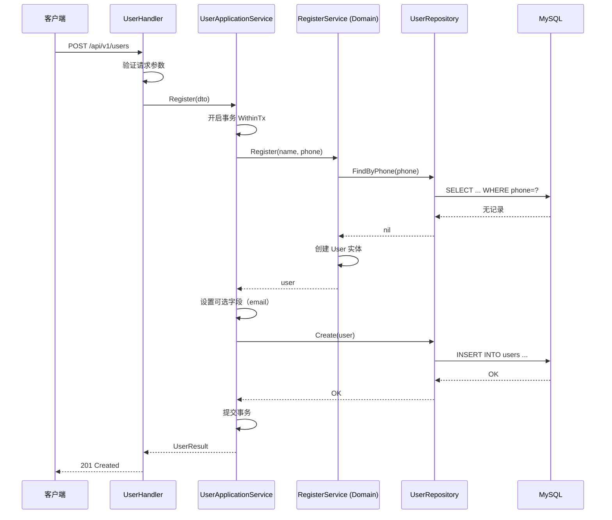
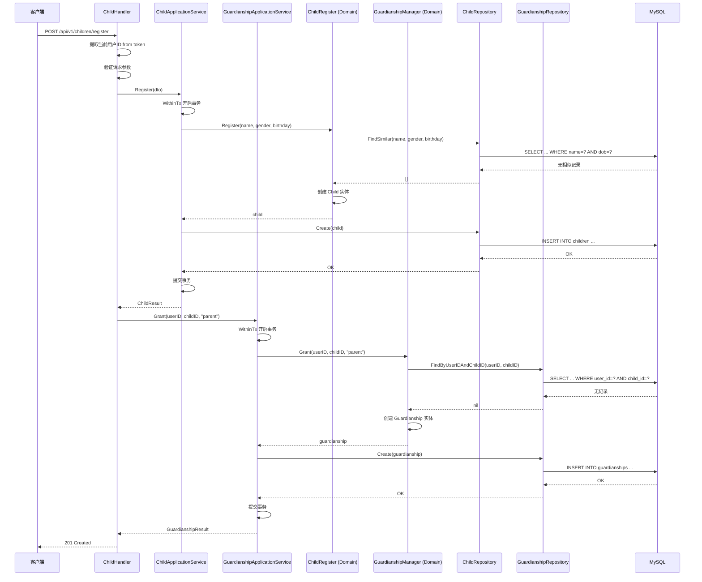
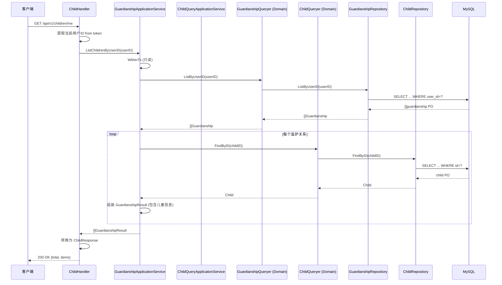

# 用户中心 - 业务流程

> [返回用户中心文档](./README.md)

本文档详细介绍用户中心的核心业务流程，包括用户注册、儿童注册和监护关系授予等。

---

## 8. 业务流程

### 8.1 用户注册流程

```mermaid
sequenceDiagram
    participant C as 客户端
    participant H as UserHandler
    participant A as UserApplicationService
    participant D as RegisterService (Domain)
    participant R as UserRepository
    participant DB as MySQL
    
    C->>H: POST /api/v1/users
    H->>H: 验证请求参数
    H->>A: Register(dto)
    
    A->>A: 开启事务 WithinTx
    A->>D: Register(name, phone)
    
    D->>R: FindByPhone(phone)
    R->>DB: SELECT ... WHERE phone=?
    DB-->>R: 无记录
    R-->>D: nil
    
    D->>D: 创建 User 实体
    D-->>A: user
    
    A->>A: 设置可选字段（email）
    A->>R: Create(user)
    R->>DB: INSERT INTO users ...
    DB-->>R: OK
    R-->>A: OK
    
    A->>A: 提交事务
    A-->>H: UserResult
    
    H-->>C: 201 Created
```

### 8.2 注册儿童并授予监护权流程

```mermaid
sequenceDiagram
    participant C as 客户端
    participant H as ChildHandler
    participant CA as ChildApplicationService
    participant GA as GuardianshipApplicationService
    participant CR as ChildRegister (Domain)
    participant GM as GuardianshipManager (Domain)
    participant ChildRepo as ChildRepository
    participant GuardRepo as GuardianshipRepository
    participant DB as MySQL
    
    C->>H: POST /api/v1/children/register
    H->>H: 提取当前用户ID from token
    H->>H: 验证请求参数
    
    H->>CA: Register(dto)
    CA->>CA: WithinTx 开启事务
    CA->>CR: Register(name, gender, birthday)
    
    CR->>ChildRepo: FindSimilar(name, gender, birthday)
    ChildRepo->>DB: SELECT ... WHERE name=? AND dob=?
    DB-->>ChildRepo: 无相似记录
    ChildRepo-->>CR: []
    
    CR->>CR: 创建 Child 实体
    CR-->>CA: child
    
    CA->>ChildRepo: Create(child)
    ChildRepo->>DB: INSERT INTO children ...
    DB-->>ChildRepo: OK
    ChildRepo-->>CA: OK
    CA->>CA: 提交事务
    CA-->>H: ChildResult
    
    H->>GA: Grant(userID, childID, "parent")
    GA->>GA: WithinTx 开启事务
    GA->>GM: Grant(userID, childID, "parent")
    
    GM->>GuardRepo: FindByUserIDAndChildID(userID, childID)
    GuardRepo->>DB: SELECT ... WHERE user_id=? AND child_id=?
    DB-->>GuardRepo: 无记录
    GuardRepo-->>GM: nil
    
    GM->>GM: 创建 Guardianship 实体
    GM-->>GA: guardianship
    
    GA->>GuardRepo: Create(guardianship)
    GuardRepo->>DB: INSERT INTO guardianships ...
    DB-->>GuardRepo: OK
    GuardRepo-->>GA: OK
    GA->>GA: 提交事务
    GA-->>H: GuardianshipResult
    
    H-->>C: 201 Created
```

### 8.3 查询用户的所有儿童流程

```mermaid
sequenceDiagram
    participant C as 客户端
    participant H as ChildHandler
    participant GA as GuardianshipApplicationService
    participant CA as ChildQueryApplicationService
    participant GQ as GuardianshipQueryer (Domain)
    participant CQ as ChildQueryer (Domain)
    participant GuardRepo as GuardianshipRepository
    participant ChildRepo as ChildRepository
    participant DB as MySQL
    
    C->>H: GET /api/v1/children/me
    H->>H: 提取当前用户ID from token
    
    H->>GA: ListChildrenByUserID(userID)
    GA->>GA: WithinTx (只读)
    GA->>GQ: ListByUserID(userID)
    
    GQ->>GuardRepo: ListByUserID(userID)
    GuardRepo->>DB: SELECT ... WHERE user_id=?
    DB-->>GuardRepo: []guardianship PO
    GuardRepo-->>GQ: []Guardianship
    GQ-->>GA: []Guardianship
    
    loop 每个监护关系
        GA->>CQ: FindByID(childID)
        CQ->>ChildRepo: FindByID(childID)
        ChildRepo->>DB: SELECT ... WHERE id=?
        DB-->>ChildRepo: child PO
        ChildRepo-->>CQ: Child
        CQ-->>GA: Child
        GA->>GA: 组装 GuardianshipResult (包含儿童信息)
    end
    
    GA-->>H: []GuardianshipResult
    
    H->>H: 转换为 ChildResponse
    H-->>C: 200 OK {total, items}
```

---
